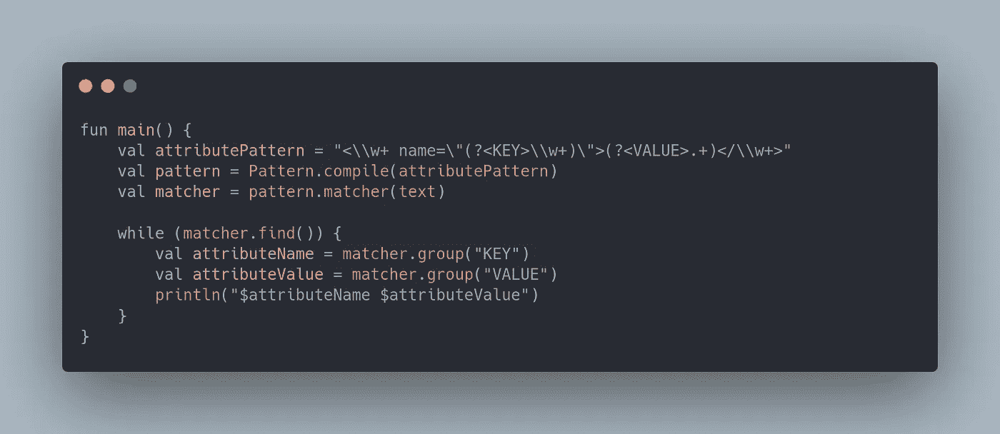

# 正则表达式命名组和反向引用

> 原文：<https://itnext.io/android-regex-named-groups-and-backreferences-940cb7f545b1?source=collection_archive---------1----------------------->



大家好，我是 Amr Hesham，一名软件工程师，我对 Android 开发和编译器设计感兴趣，在这篇文章中，我将谈论 Regex 命名的 group 和 Backreferences 这一非常好且有用的功能，并附有示例。

在 Python re 模块中首次引入了正则表达式命名的组和反向引用，然后微软开发人员在中支持它。NET 的不同语法，Java 从 JDK 7 开始支持它，现在它支持大多数现代编程语言，如 Ruby、PHP、R…等，

这个特性可以帮助你在正则表达式中用名字和对这些组的引用来分组你的正则表达式，要了解更多关于这个特性的历史和更多细节，我推荐你查看 Jan Goyvaerts 写的教程。

让我们从如何定义一个命名组和通过名称和索引获取组的例子开始，我将使用 Kotlin 编程语言，概念是相同的，正如我之前所说的错误，但是一些非 JVM 语言对于相同的特性有不同的语法。

假设我们想要解析 Android 项目 color.xml 文件中的颜色属性，并打印每种颜色的名称和值，例如这里我们有 3 种颜色。

```
<color name="black">#000000</color>
<color name="white">#ffffff</color>
<color name="grey">#cccccc</color>
```

我们想打印

```
black #000000
white #ffffff
grey #cccccc
```

我们可以使用许多不同的技术来完成这项任务，但是我将向您展示如何使用正则表达式命名的组轻松地完成这项任务。

首先，我们需要创建一个正则表达式来匹配每个属性，每个属性包含类型、名称和值，如下所示

<type name="”attribute_name”">值</type>

所以正常的正则表达式应该是

```
<\\w+ name=**\"**\\w+**\"**>.+</\\w+>
```

你可以使用 Regex101.com 的[来测试你的正则表达式并理解它，但是要确保你使用的是精选的 Java 8 版本。](https://regex101.com/)

现在，在我们创建了正则表达式之后，我们需要对获取它们所需的信息进行分组，

我们需要的是属性名和值，所以只需将它们的正则表达式放入( )中，如下所示

```
<\\w+ name=**\"**(\\w+)**\"**>(.+)</\\w+>
```

现在，属性名称将位于组号 1 中，因为组号 0 包含与组号 2 上的完整正则表达式和属性值相匹配的完整文本，

为了首先获得信息，我们将编译这个模式

```
val pattern = Pattern.compile(attributePattern)
```

然后我们将得到匹配我们模式的每个子串，并得到 2 个组 1 和 2

```
val matcher = pattern.matcher(text) 
while (matcher.find()) {
    val attributeName = matcher.group(1)
    val attributeValue = matcher.group(2)
    println("$attributeName $attributeValue")
}
```

就是这样！！而输出正是我们想要的。

要使用按名称分组，您只需为每个组添加一个名称，只需添加？<name>比如在你的团队内部。</name>

```
<\\w+ name=**\"**(?<KEY>\\w+)**\"**>(?<VALUE>.+)</\\w+>
```

组名必须是以字母开头的字母数字序列，并且不能用相同的名称命名两个组。

现在，我们将使用键和值，而不是像 1，2 那样按索引分组，

```
while (matcher.find()) {
    val attributeName = matcher.group("KEY")
    val attributeValue = matcher.group("VALUE")
    println("$attributeName $attributeValue")
}
```

你会得到相同的输出。

现在，在我们了解了什么是命名组以及如何使用它之后，是时候进行反向引用了。

基本上，反向引用用于匹配先前由一个组匹配的相同文本，例如，假设我们想检查一个数字是否只包含一个重复的数字，如 1，22，333，444，那么我们如何使用 Regex，

要使用反向引用，首先我们需要定义一个组，在这种情况下，我们的组是一个数字(？ <digit>\\d)，因此这将正确匹配第一个数字，然后我们将使用反向引用来检查所有其他数字是否与第一个数字的匹配文本相同，为此，您可以使用' \k <digit>'或通过类似' \\1 '的索引。</digit></digit>

我们的完整正则表达式将是“(？ <digit>\d)\\k <digit>* "或“(\\d)\\1*”这意味着我们期望一个数字与一个组数字和零个或多个与该组匹配的相同数字，完整的代码将是这样的</digit></digit>

```
fun main() {     
    val repeatedDigitRegex = "(?<DIGIT>\\d)\\k<DIGIT>*"
    val pattern = Pattern.compile(repeatedDigitRegex) println(pattern.matcher("1").matches())
    println(pattern.matcher("22").matches())
    println(pattern.matcher("333").matches())
    println(pattern.matcher("4444").matches()) println(pattern.matcher("10").matches())
    println(pattern.matcher("21").matches())
    println(pattern.matcher("101").matches())
}
```

输出将是

```
true true true true false false false
```

使用这个特性可以产生很多想法，例如检查 HTML 是否由相同的标签开始和结束，检查是否有重复的内容等等

matcher 类中有另一个有用的方法叫做 replaceAll，它可以使用引用将当前匹配的子字符串替换为任何字符串或组匹配的文本，例如在最后一个示例中，如果我们想用其中一个数字替换所有重复的数字，那么我们需要用它的第一个组替换 regex。

因此，我们将使用 replaceAll 并通过一个值$1 传递组引用，而不是使用 matches，代码如下所示。

```
println(pattern.matcher("2222").replaceAll("$1"))
```

打印输出将是 2

我希望你喜欢这篇文章，如果你想更多地了解这个话题，这里有一些有用的资源。

*   [regular-expressions.info](https://www.regular-expressions.info) 网站上有很多不错的教程和信息
*   来自 Jan Goyvaerts 的 regular-expressions.info/books regex 图书评论
*   [正则表达式](https://www.youtube.com/watch?v=c9HbsUSWilw):从编码列车通道捕获分组

你可以在: [**GitHub**](https://github.com/amrdeveloper) ， [**LinkedIn**](https://www.linkedin.com/in/amrdeveloper/) ， [**Twitter**](https://twitter.com/amrdeveloper) 上找到我。

享受编程😋。