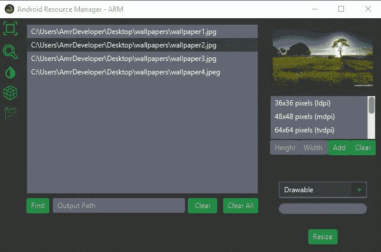
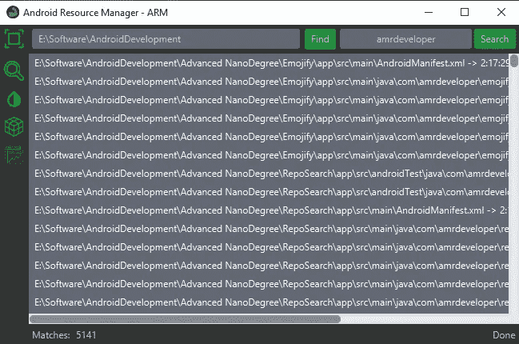
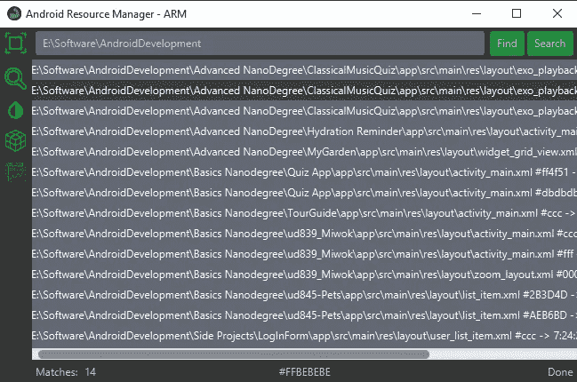
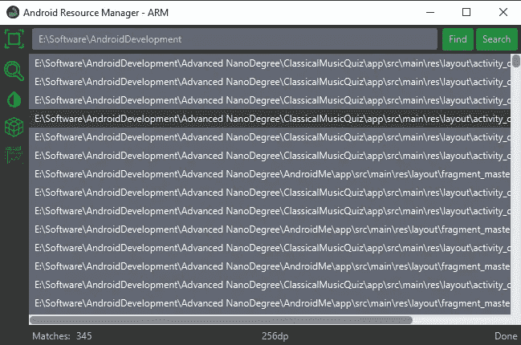
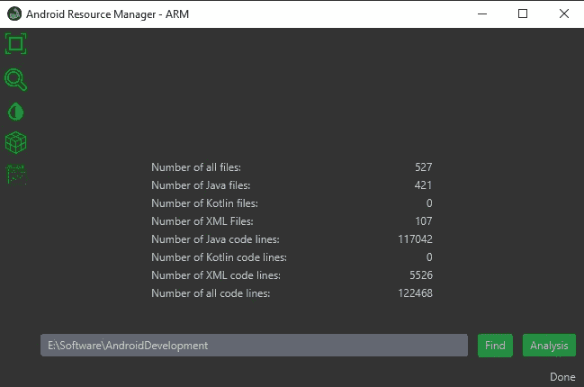

# Android 资源管理器工具 1.0.0 版

> 原文：<https://itnext.io/android-resource-manager-44feae1bc9b3?source=collection_archive---------2----------------------->

大家好，我是 Amr Hesham，我想分享我新的小型跨平台工具**AndroidResourceManager**(ARM)1 . 0 . 0 版，用 JavaFX framework 编写
这些工具的想法最初是作为 drawable 的图像大小调整程序和 Android 应用程序开发的 mipmap，然后我又添加了四个想法
，所以结果是五个服务。

*   第一个也是最主要的服务是支持拖放功能的图像大小调整器
    这个服务的想法是方便地拖放你的图像，并为每个人添加大小列表，大小列表的默认配置是 android drawable 和 mipmap 的七个主要大小，分别是 LDPI，MDPI，TVDPI，HDPI，XHDPI，XXHDPI 和 XXXHDPI，你可以添加或删除大小，没有大小限制，你可以选择输出类型为 drawable，Mipmaps 或其他普通文件夹，然后单击 resize 快速调整所有图像的大小。

图像大小调整服务

*   第二个服务是关键字搜索
    这个服务的想法是在你的项目文件中快速搜索，例如你可以搜索一些字符串并得到每个结果的位置，只需点击一下你就可以打开文件并检查你的结果。

关键词搜索服务

*   第三项服务是色彩资源分析
    这项服务的目的是快速获得所有色彩资源在项目布局中的位置，并且您可以在一个步骤中为许多项目完成这项工作，
    这项服务的目的是了解是否有任何色彩资源需要添加到 color.xml 文件中

颜色分析服务

*   第四个服务是 dimensions resources analysis
    它与上一个服务的想法相同，但针对的是尺寸，而不是颜色，因此它可以帮助您保持布局代码的整洁，此服务将被改进为
    可以选择将结果自动添加到 dimens.xml 中

维度分析服务

*   第五个也是最后一个服务是源文件分析
    ,这个服务的想法是计算你的项目或普通目录中的代码行数和文件数，并显示每种语言的输出

源文件分析服务

现在，这个工具很小，但它可以改进，为当前服务提供新的服务或选项，例如在第一个服务(图像调整大小)中，我们可以在调整大小之前支持许多选项，例如添加填充、应用图像过滤或图像压缩等

因此，请随意建议、提交问题或提出请求，以改进该工具，使其对每个人都非常有用，并满足每个人的需求。

你可以从[**Sourceforge**](https://sourceforge.net/projects/androidresourcemanager)**或者**[**Github**](https://github.com/AmrDeveloper/androidresourcemanager)**下载这个工具。******

****你可以在: [**Github**](https://github.com/amrdeveloper) ， [**Linkedin**](https://www.linkedin.com/in/amrdeveloper/) ， [**Twitter**](https://twitter.com/amrdeveloper) 上找到我。****

****享受编程😎。****