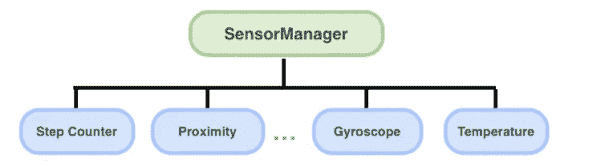
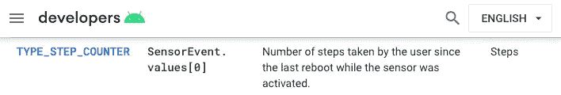

# 如何在 Android 中获取步数？

> 原文：<https://itnext.io/android-step-counter-sensor-all-in-one-77564e5b6c2a?source=collection_archive---------0----------------------->

## 计步传感器在健身应用中用于监控用户的运动

一个 ndroid 支持很多有趣的传感器，如计步器、接近度、陀螺仪和温度传感器等。开发人员可以使用这些传感器为最终用户提供美妙的用户体验。Android 提供 [SensorManager](https://developer.android.com/reference/android/hardware/SensorManager) 服务来处理监测传感器信号的繁琐工作。

根据我的经验，在开发跑步应用程序的过程中，使用传感器之一——计步器有一些有趣的技巧。我将简单介绍一下背景知识和使用它的实用技巧。希望你觉得这有用！

# 背景资料

[SensorManager](https://developer.android.com/reference/android/hardware/SensorManager) 是 Android 系统服务之一。它用于 app 和所有设备传感器之间的通信。每个 Android 设备中都有很多传感器。我们可以通过 [getSensorList()](https://developer.android.com/reference/android/hardware/SensorManager#getSensorList(int)) 检索可用传感器的列表(参见下面的第 2 行):

上面显示的传感器列表是从一个 [Pixel 3a](https://store.google.com/uk/product/pixel_3a_specs) 设备中获取的，所有的传感器可以分为两个主要组——**唤醒传感器**和**非唤醒传感器**。当有事件触发时，唤醒传感器会唤醒应用处理器(AP ),但非唤醒传感器不会。

# 计步游戏攻略

步数计数器是非唤醒传感器，显示自上次重启以来记录的步数。然而，事件感测和事件触发之间的等待时间很长，可能长达 [10 秒](https://developer.android.com/guide/topics/sensors/sensors_motion#sensors-motion-stepcounter)！

此外，连续观察来自步计数器的事件会导致功耗问题。建议 [JobScheduler](https://developer.android.com/reference/android/app/job/JobScheduler) 以可接受的间隔检索最新的步数。

# 活动许可 _ 认可

根据官方文档，在 app 可以检索计步数据之前，必须请求`[ACTIVITY_RECOGNITION](https://developer.android.com/reference/android/Manifest.permission#ACTIVITY_RECOGNITION)`。

1.  将`[ACTIVITY_RECOGNITION](https://developer.android.com/reference/android/Manifest.permission#ACTIVITY_RECOGNITION)`添加到 AndroidManifest.xml 中

2.添加`RxPermission`库，简化了权限请求程序

3.运行时请求`[ACTIVITY_RECOGNITION](https://developer.android.com/reference/android/Manifest.permission#ACTIVITY_RECOGNITION)`许可

# 设置步骤计数器监听器

## 1.注册监听器

我们可以简单地通过`[registerListener()](https://developer.android.com/reference/android/hardware/SensorManager#registerListener(android.hardware.SensorEventListener,%20android.hardware.Sensor,%20int))`函数向计步传感器注册一个事件监听器。然而，由于步数计数器只是 Android 设备上的一个可选组件，最好有一个空值检查(见第 3 行)。

`[registerListener()](https://developer.android.com/reference/android/hardware/SensorManager#registerListener(android.hardware.SensorEventListener,%20android.hardware.Sensor,%20int))`的第三个参数是采样间隔，单位为微秒(0.000001s)。这个值只是对 Android OS 的一个参考，最终会在内部确定最佳区间。开发人员应改用 SensorManager 常量:

1.  `[SENSOR_DELAY_FASTEST](https://developer.android.com/reference/android/hardware/SensorManager#SENSOR_DELAY_FASTEST)` : 0us
2.  `[SENSOR_DELAY_UI](https://developer.android.com/reference/android/hardware/SensorManager#SENSOR_DELAY_UI)` : 1us
3.  `[SENSOR_DELAY_GAME](https://developer.android.com/reference/android/hardware/SensorManager#SENSOR_DELAY_GAME)` : 2us
4.  `[SENSOR_DELAY_NORMAL](https://developer.android.com/reference/android/hardware/SensorManager#SENSOR_DELAY_NORMAL)` : 3us

> 请确保为 API 29+设备授予`[ACTIVITY_RECOGNITION](https://developer.android.com/reference/android/Manifest.permission#ACTIVITY_RECOGNITION)`，否则将显示以下运行时错误:
> `*com.fooApplicationid Tried enabling a sensor (Step Counter) without holding android.permission.ACTIVITY_RECOGNITION*`

## 2.实现 SensorEventListener

然后我们可以将`[SensorEvenListener](https://developer.android.com/reference/android/hardware/SensorEventListener)`实现到`Activity`。在`[onSensorChanged()](https://developer.android.com/reference/android/hardware/SensorEventListener#onSensorChanged(android.hardware.SensorEvent))`回调时，可从`[SensorEvent](https://developer.android.com/reference/android/hardware/SensorEvent)`中检索步数。根据官方文件，自上次启动以来的步数可以从返回的`[SensorEvent](https://developer.android.com/reference/android/hardware/SensorEvent)`的第**1**值中检索(见第 10–12 行)

而且，`[SensorEvent](https://developer.android.com/reference/android/hardware/SensorEvent)`对象上也有时间戳。然而，这并不完全是事件被感知的时间！`[timestamp](https://developer.android.com/reference/android/hardware/SensorEvent#timestamp)`指的是从上一次设备启动开始经过的纳秒数。因此，我们必须将相对事件时间与上次启动时间相加(见第 15 行)，以获得实际检测到的事件时间(见第 19 行)！

# 为了节省电池消耗

连续观察计步器数据可能会消耗能量。正式建议使用 [JobScheduler](https://developer.android.com/reference/android/app/job/JobScheduler) 调度周期性作业，以在合适的时间间隔内检索总步数。

请记住，所有的作业服务必须受到 [BIND_JOB_SERVICE](https://developer.android.com/reference/android/app/job/JobService#PERMISSION_BIND) 权限的保护，否则将显示运行时错误。

根据 [JobInfo 源代码](https://github.com/Doist/JobSchedulerCompat/blob/9c55743999ebc8abb6328ea991e8159ebac915e1/library/src/main/java/com/doist/jobschedulercompat/JobInfo.java#L79)，周期性作业的最小间隔为 **15 分钟**。然而，Android 只是保证作业在每个周期内不会被执行超过一次。换句话说，作业可以在第 9 分钟或第 14 分钟执行。如果你想对确切的事件时间有更多的控制，你可以使用 [AlarmManager](https://developer.android.com/reference/android/app/AlarmManager) 来代替。

 [## Android AlarmManager 尽可能深入

### AlarmManager 是应用程序和 Android 系统报警服务之间的桥梁。有很多限制和…

proandroiddev.com](https://proandroiddev.com/android-alarmmanager-as-deep-as-possible-909bd5b64792) 

# 你可能会感兴趣

 [## Android 接近传感器尽可能清晰

### 近程传感器可以检测短距离(约 5 厘米)。检索和观察邻近数据非常简单。3 个步骤…

myrickchow.medium.com](https://myrickchow.medium.com/android-proximity-sensor-as-clear-as-possible-593774d90dd2) 

# 摘要

1.  [SensorManager](https://developer.android.com/reference/android/hardware/SensorManager) 是一款功能强大的应用工具，用于与设备传感器进行通信，包括计步器、陀螺仪和加速度计。
2.  步进计数器报告一个延迟不超过 10 秒的感应事件。
3.  连续观察步数可能会消耗能量，官方建议使用[作业调度器](https://developer.android.com/reference/android/app/job/JobScheduler)来检索可接受间隔内的最新步数。但是，定期作业的最小间隔必须至少为 15 分钟。[报警管理器](https://developer.android.com/reference/android/app/AlarmManager)可以作为一种替代。
4.  可以从`[SensorEvenListener](https://developer.android.com/reference/android/hardware/SensorEventListener)`的`[onSensorChanged()](https://developer.android.com/reference/android/hardware/SensorEventListener#onSensorChanged(android.hardware.SensorEvent))`回调中检索步数。然而，`[SensorEvent](https://developer.android.com/reference/android/hardware/SensorEvent)`的时间戳并不是所感测事件的准确时间，而是自上次设备启动以来的相对时间。我们必须借助`[SystemClock.elapsedRealtime()](https://developer.android.com/reference/android/os/SystemClock#elapsedRealtime())`进行转换。

# 参考

1.  [安卓运动传感器文档](https://developer.android.com/guide/topics/sensors/sensors_motion)

2. [Android SensorManager 文档](https://developer.android.com/reference/android/hardware/SensorManager)

3.作业调度教程

 [## 使用 Android JobScheduler 调度任务-教程

### 编辑描述

www.vogella.com](https://www.vogella.com/tutorials/AndroidTaskScheduling/article.html) 

4.StackOverflow 关于获取系统启动时间的回答

 [## 如何获取安卓系统开机时间

### 感谢贡献一个堆栈溢出的答案！请务必回答问题。提供详细信息并分享…

stackoverflow.com](https://stackoverflow.com/a/16278668) 

欢迎您在[Twitter @ my rik _ chow](https://twitter.com/myrick_chow)关注我，了解更多信息和文章。感谢您阅读这篇文章。祝您愉快！😄