# 一体化—Android tablayut 和 TabItem

> 原文：<https://itnext.io/android-tablayout-and-tabitem-268ac06ba966?source=collection_archive---------0----------------------->


T `abLayout`是与`ViewPager`和`ViewPager2`配合使用的常用小工具。用户可以点击每一个按钮直接进入`ViewPager`中的特定页面。最常见的例子就是**谷歌 Play 商店 app** 。


谷歌 Play 商店 app 截图

在这篇文章中，我将分享我给每一个`TabItem`造型的经验。我发现[谷歌文档](https://developer.android.com/reference/com/google/android/material/tabs/TabLayout#tablayout_tabindicatorheight)和它的[开放源代码](https://github.com/material-components/material-components-android/blob/master/lib/java/com/google/android/material/tabs/res/values/attrs.xml)不同步。阅读相应的源代码是了解每个属性细节的最佳方式。

如果你对`ViewPager2`的实现和技巧感兴趣，你可以在我的另一篇文章中读到更多。

[](https://medium.com/@myrickchow32/android-viewpager2-tablayout-3099aae2f396) [## Android ViewPager2 和 TabLayout

### ViewPager2 是在今年的 2019 Google I/O 中推出的，它取代了旧的 ViewPager，后者是在…

medium.com](https://medium.com/@myrickchow32/android-viewpager2-tablayout-3099aae2f396) 

# TabItem

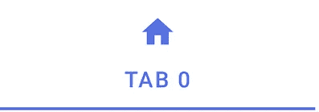

`TabItem`是一个包含图标和文本的`View`。它有两种状态—选中和未选中。它必须“连接”到一个`TabLayout`上。然而，根据[谷歌官方文档](https://developer.android.com/reference/android/support/design/widget/TabItem)(见下面引用)，它是一个虚拟的`View`，实际上并没有“添加”到一个`TabLayout`中。因此，`findViewById()`将总是返回`null`，开发者无法通过直接引用来定制每个标签。

> TabItem 是一种特殊的“视图”,允许您在布局中为`[*TabLayout*](https://developer.android.com/reference/android/support/design/widget/TabLayout.html)`声明选项卡项目。这个视图实际上并没有添加到 TabLayout 中，它只是一个虚拟视图，允许设置选项卡项目的文本、图标和自定义布局。有关如何使用它的更多信息，请参见 TabLayout。
> 
> 参考:[关于 TabItem 的 Google 文档](https://developer.android.com/reference/android/support/design/widget/TabItem)

如果`TabLayout`与一个`ViewPager2`链接，我们可以手动使用[类【TabLayoutMediator】中的回调`TabLayoutMediator.OnConfigureTabCallback`来样式化每个膨胀的`TabItem`。要了解更多的实现和解释，请参考我的另一篇文章:](https://github.com/googlesamples/android-viewpager2/blob/master/app/src/main/java/androidx/viewpager2/integration/testapp/TabLayoutMediator.java)

[](https://medium.com/@myrickchow32/android-viewpager2-tablayout-3099aae2f396) [## Android ViewPager2 和 TabLayout

### ViewPager2 是在今年的 2019 Google I/O 中推出的，它取代了旧的 ViewPager，后者是在…

medium.com](https://medium.com/@myrickchow32/android-viewpager2-tablayout-3099aae2f396) 

# 表格布局

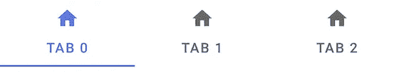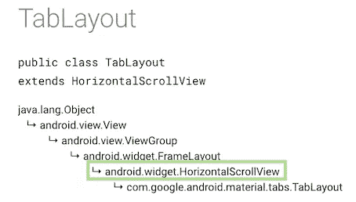

在[谷歌文档](https://developer.android.com/reference/com/google/android/material/tabs/TabLayout#tablayout_tabindicatorheight)的截图

`TabLayout`是一个`HorizontalScrollView`，它包含了一个`TabItem`的列表。它像一个水平的`LinearLayout`一样布置每个`TabItem`。

但是，它被限制为只能将`TabItem`作为其子代。如果不遵循，将会出现运行时错误，请参见下面的错误消息:

```
java.lang.RuntimeException: Unable to start activity ComponentInfo{…}: android.view.InflateException: Binary XML file line #35: Only TabItem instances can be added to TabLayout
```

F 首先，让我们来看看`TabLayout`可用属性的简要总结。

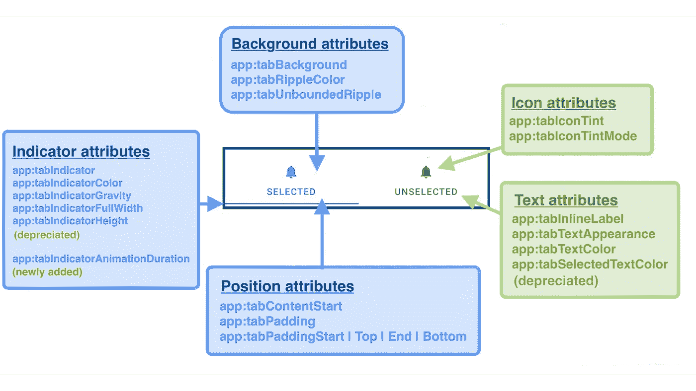

根据 Material Design 公开的源代码，`tabIndicatorHeight`和`tabSelectedTextColor`目前都已弃用，但 [Google 官方文档](https://developer.android.com/reference/com/google/android/material/tabs/TabLayout.html#attr_TabLayout_tabSelectedTextColor)尚未更新。

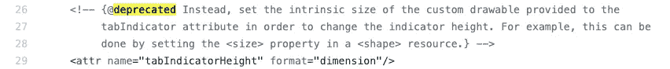

[物料组件源代码](https://github.com/material-components/material-components-android/blob/master/lib/java/com/google/android/material/tabs/res/values/attrs.xml)的 tabIndicatorHeight 属性

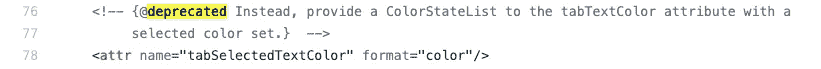

[物料组件源代码](https://github.com/material-components/material-components-android/blob/master/lib/java/com/google/android/material/tabs/res/values/attrs.xml)的 tabSelectedTextColor 属性

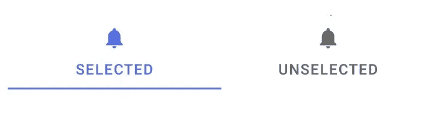

这里有一个属性列表，你可以直接跳到:

1.  标签指示器属性
    [app:tabIndicator](https://medium.com/@myrickchow32/android-tablayout-and-tabitem-268ac06ba966#a378) —替换`*app:tabIndicatorHeight*`
    [app:tabIndicator color](https://medium.com/@myrickchow32/android-tablayout-and-tabitem-268ac06ba966#43de)
    [app:tabIndicator gravity](https://medium.com/@myrickchow32/android-tablayout-and-tabitem-268ac06ba966#8496)
    [app:tabIndicator full width](https://medium.com/@myrickchow32/android-tablayout-and-tabitem-268ac06ba966#8cc9)
    [app:tabIndicator animation duration](https://medium.com/@myrickchow32/android-tablayout-and-tabitem-268ac06ba966#d500)—新添加的未在 [Google 官方文档中显示](https://developer.android.com/reference/com/google/android/material/tabs/TabLayout.html#attr_TabLayout_tabSelectedTextColor)
2.  背景属性
    [app:tab background](https://medium.com/@myrickchow32/android-tablayout-and-tabitem-268ac06ba966#27c2)
    [app:tabRippleColor](https://medium.com/@myrickchow32/android-tablayout-and-tabitem-268ac06ba966#1a52)
    [app:tabUnboundedRipple](https://medium.com/@myrickchow32/android-tablayout-and-tabitem-268ac06ba966#41f2)
3.  图标属性
    [app:tabcont](https://medium.com/@myrickchow32/android-tablayout-and-tabitem-268ac06ba966#32d3)
    [app:tabcont mode](https://medium.com/@myrickchow32/android-tablayout-and-tabitem-268ac06ba966#da9b)
4.  文本属性
    [app:tablinlinelabel](https://medium.com/@myrickchow32/android-tablayout-and-tabitem-268ac06ba966#100d)
    [app:tabTextColor](https://medium.com/@myrickchow32/android-tablayout-and-tabitem-268ac06ba966#9a01)—替换`*app:tabSelectedTextColor*`
    [app:tabtext appearance](https://medium.com/@myrickchow32/android-tablayout-and-tabitem-268ac06ba966#0258)
5.  位置属性
    [app:tabContentStart](https://medium.com/@myrickchow32/android-tablayout-and-tabitem-268ac06ba966#41ae)
    [app:tabbadding，app:tabbaddingstart | Top | End | Bottom](https://medium.com/@myrickchow32/android-tablayout-and-tabitem-268ac06ba966#a9e6)
6.  尺寸属性
    [app:tabMinWidth&app:tabMaxWidth](https://medium.com/@myrickchow32/android-tablayout-and-tabitem-268ac06ba966#e653)
7.  位置属性
    [app:tabGravity](https://medium.com/@myrickchow32/android-tablayout-and-tabitem-268ac06ba966#fd22)
8.  模式属性
    [app:tabMode](https://medium.com/@myrickchow32/android-tablayout-and-tabitem-268ac06ba966#ba6f)

# 选项卡指示器属性

## 1.应用程序:tabIndicator


用于配置标签指示器的高度。默认高度为`2dp`。

不要使用`*app:tabIndicatorHeight*` 来改变指示器的高度，因为现在[已经过时](https://github.com/material-components/material-components-android/blob/master/lib/java/com/google/android/material/tabs/res/values/attrs.xml)。

> `*app:tabIndicatorHeight*`现已弃用。相反，设置提供给 tabIndicator 属性的自定义 drawable 的固有大小，以便更改指示器高度。例如，这可以通过在<形状>资源中设置<大小>属性来实现。
> 
> 参考:[物料组件源代码](https://github.com/material-components/material-components-android/blob/master/lib/java/com/google/android/material/tabs/res/values/attrs.xml)第 26–28 行

设置页签指标维度的代码

申报身高的可提取资源代码

## 2.应用程序:tabIndicatorColor(不言自明)

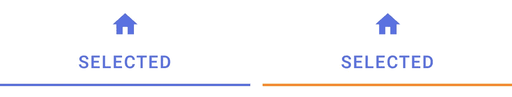

## 3.应用程序:tabIndicatorGravity

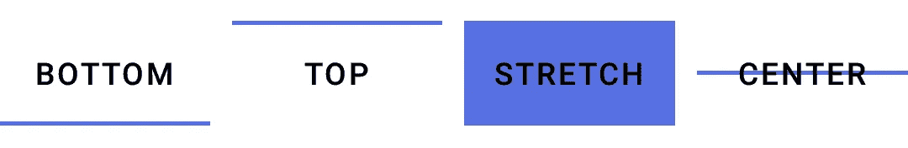

定义标签指示器的位置。

## 4.应用程序:tabIndicatorFullWidth

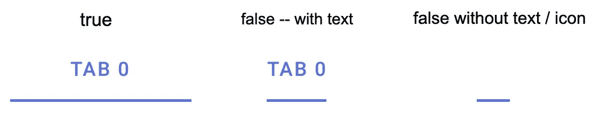

选项 1 — **真**(默认) :指示器的宽度等于`TabItem`的宽度

选项 2 — **假**:指示器的宽度由`TabItem`内的文字宽度决定。指示器的最小宽度设置为`24dp.`

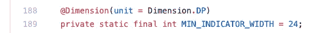

指示器的默认最小宽度；[物料组件源代码](https://github.com/material-components/material-components-android/blob/master/lib/java/com/google/android/material/tabs/TabLayout.java)的第 188–189 行

## 5.app:tabindicatoraniationduration

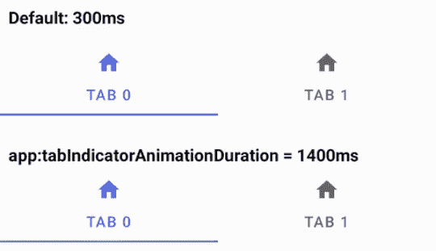

定义标签指示器从当前标签到所选标签所用的时间。默认为[物料组件源代码](https://github.com/material-components/material-components-android/blob/master/lib/java/com/google/android/material/tabs/TabLayout.java)中声明的 300ms。

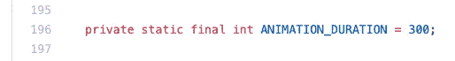

[材料组件源代码](https://github.com/material-components/material-components-android/blob/master/lib/java/com/google/android/material/tabs/TabLayout.java)第 196 行

# 背景属性

## 1.app:tabBackground

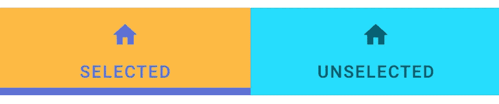

TabItem 有两种状态—选中和默认。背景可以是一个可绘制的状态列表。

## 2.应用程序:tabRippleColor(不言自明)

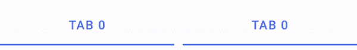

## 3.app:tabunbounddripple

选项 1 — **假**(默认):波纹以其`TabItem`的边界为界

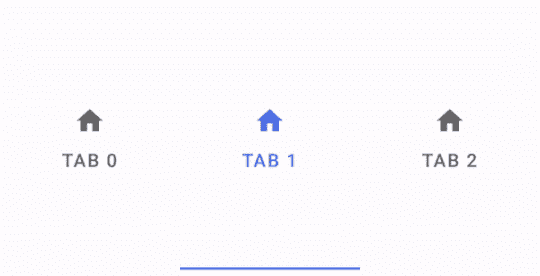

选项 2 — **真**:纹波增长超过其`TabItem`的边界

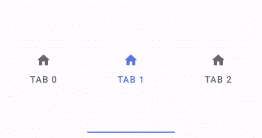

# 图标属性

## 1.应用程序:他比康定

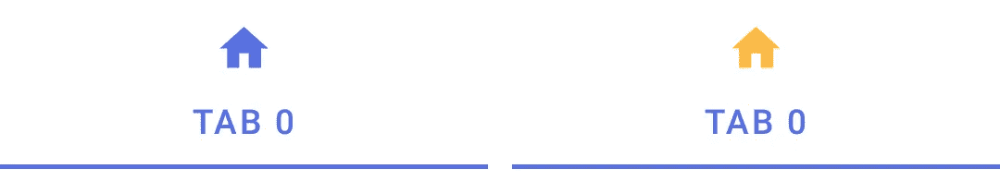

图标色调是涂在图标图像不透明部分的一层颜色。

## 2.应用程序:tabIconTintMode

有 6 种色调模式，每一种都通过不同的方程式来控制透明度和颜色。除非您清楚地了解计算是什么，否则不建议使用该属性。

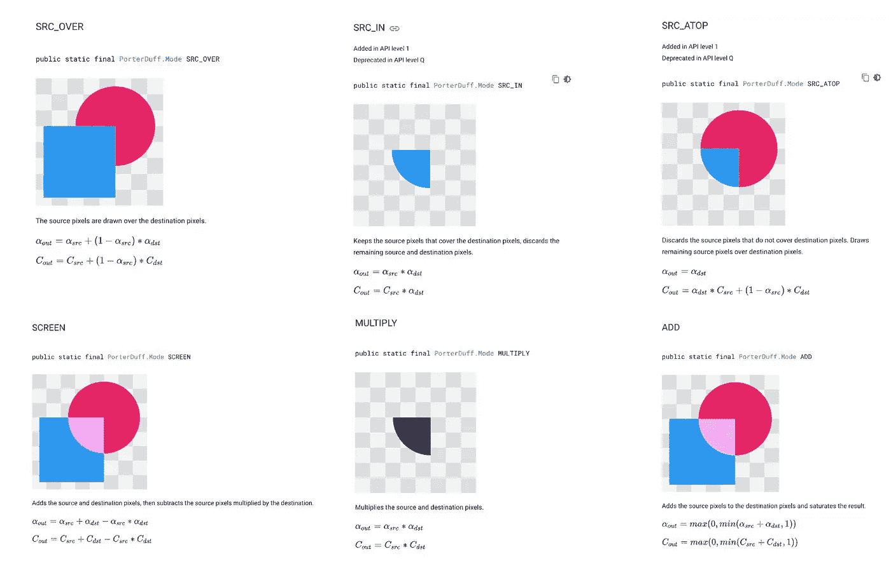

参考: [PorterDuff 模式——谷歌](https://developer.android.com/reference/android/graphics/PorterDuff.Mode.html#SRC_IN)

# 文本属性

## 1.应用程序:tabInlineLabel

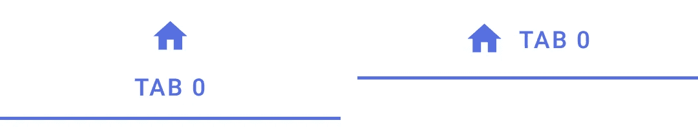

选项 1 — **假**(默认):图标放置在`TabItem`文字上方

选项 2 — **真**:图标放在`TabItem`文本的开头

## 2.应用程序:tabTextColor


可以通过颜色状态列表为选定状态和默认状态设置文本颜色。

> `*app:tabSelectedTextColor*`现在已被取代，请为 app: tabTextColor 属性提供一个 ColorStateList，并设置一个颜色。
> 
> 参考:[物料组件源代码](https://github.com/material-components/material-components-android/blob/master/lib/java/com/google/android/material/tabs/res/values/attrs.xml)第 76–77 行

## 3.app:tabTextAppearance

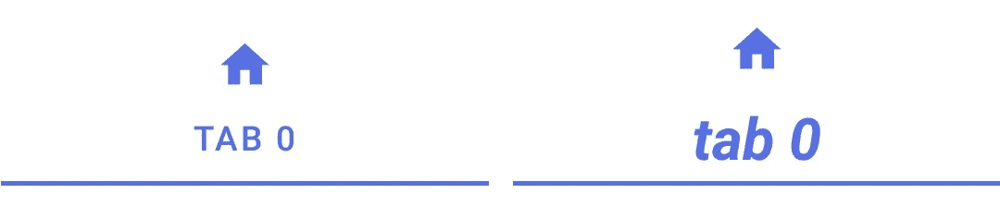

每个`TabItem`中的文本样式不能由类似`android:textSize`或`android:textStyle`的东西直接完成。TextAppearance 是唯一可用的样式化方法。关于通用文本外观的更多信息，你可以参考下面这篇由 [Nick Butcher](https://medium.com/u/22c02a30ae04?source=post_page-----268ac06ba966--------------------------------) @Google 写的文章:

[](https://medium.com/androiddevelopers/whats-your-text-s-appearance-f3a1729192d) [## 你的文本是什么样子的？

### 了解如何在 Android 上以声明方式设计文本。

medium.com](https://medium.com/androiddevelopers/whats-your-text-s-appearance-f3a1729192d) 

# 位置属性

## 1.app:tabContentStart

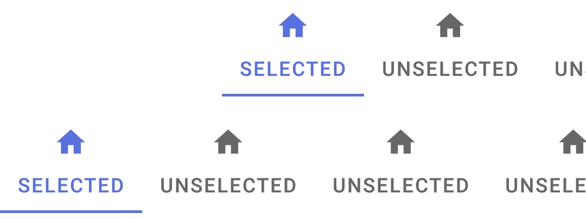

该属性偏移了`TabLayout`的起始位置。

然而，这很棘手，因为在[谷歌官方文档](https://developer.android.com/reference/com/google/android/material/tabs/TabLayout.html#tablayout_tabcontentstart)中没有解释，单独设置这个属性似乎没有任何效果。我能想到的唯一解决办法就是直接读[源代码](https://github.com/material-components/material-components-android/blob/master/lib/java/com/google/android/material/tabs/TabLayout.java)看实现。下面是源代码截图:

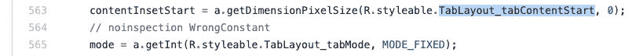

`app:tabContentStart`和 app:tabMode 的默认值

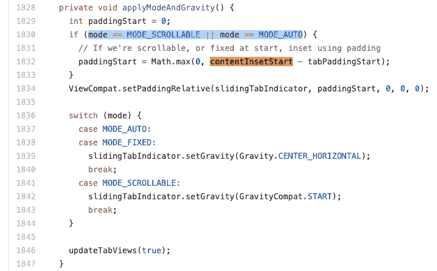

app:tabContentStart 的实现依赖于 app:tabMode

如你所见，tabContentStart 属性仅在`app:tabMode="scrollable | auto"`时适用，但默认情况下 tabMode 设置为`fixed`。这就是大多数开发人员对使用该属性感到沮丧的原因。

## 2.app:tabbadding，app:tabbaddingstart | Top | End | Bottom(不言自明)

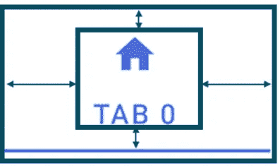

# 大小属性

## 1.app:tabMinWidth & app:tabMaxWidth

应用于每个选项卡的最小和最大宽度。如果所有`TabItem`的总宽度小于`TabLayout`的宽度，这些属性将覆盖`center`中的`fill`标签。

# 位置属性

## 1.app:tabGravity


选项 1 — **填充**(默认):占据`TabLayout`的整个宽度，每个页签宽度相等。

选项 2 — **居中**:所有标签在`TabLayout`内居中，每个标签的宽度与最宽标签的宽度相同。

# 模式属性

## 1.app:tabMode

选项 1 — **固定:**同时显示所有标签页，每个标签页的宽度相等，以最宽的标签页标签为准。

选项 2 — **可滚动**:水平可滚动`TabLayout`，每个标签页都有自己的宽度，宽度是根据其文本和图标的尺寸计算出来的。

选项 3 — **自动**:或者**滚动**或者**重心固定**

有两种情况:

**情况 1** :当`TabLayout`能够将所有`TabItem`放入其范围内时，`TabLayout`同:

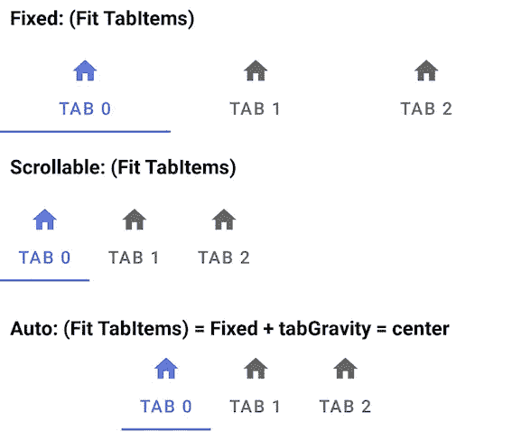

**情况二**:当`TabLayout`不在**的范围内**不能容纳所有的`TabItem`时，`TabLayout`在`MODE_SCROLLABLE`之下。

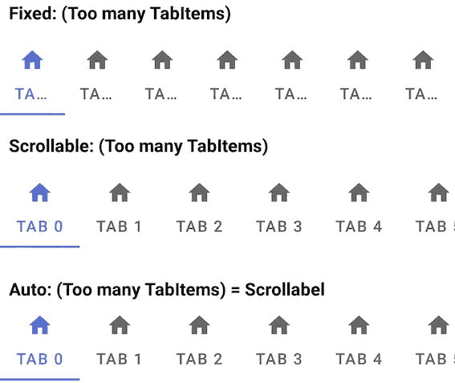

# 结论

`TabLayout`和`TabItem`是增强 a`ViewPager`UX 的重要 UI。然而，`TabItem`的造型有点困难，因为谷歌官方文档中缺乏清晰的解释和描述。

1.  `TabItem`是一个没有添加到`TabLayout`的虚拟`View`，因此开发者不能通过使用`findViewById()`来引用它。
2.  `TabLayout`是一个`HorizontalScrollView`，默认水平布局其子节点。
3.  `app:tabIndicatorHeight`已弃用，替换为`app:tabIndicator`。
4.  `app:tabSelectedTextColor`已弃用，替换为带有 ColorStateList 的`app:tabTextColor`。
5.  `app:tabIndicatorAnimationDuration`是新添加的，但是在 Google 中没有关于它的官方文档。

# 进一步阅读:

1.  [谷歌官方文档—talayout](https://developer.android.com/reference/com/google/android/material/tabs/TabLayout.html#attr_TabLayout_tabSelectedTextColor)
2.  [材料设计—表格布局](https://material.io/develop/android/components/tab-layout/)
3.  [GitHubMaterial 组件 Android TabLayout 源代码](https://github.com/material-components/material-components-android/blob/master/lib/java/com/google/android/material/tabs/TabLayout.java)
4.  [GitHub 材质组件 Android TabLayout 样式](https://github.com/material-components/material-components-android/blob/master/lib/java/com/google/android/material/tabs/res/values/styles.xml)
5.  [GitHub 材质组件 Android TabLayout 属性](https://github.com/material-components/material-components-android/blob/master/lib/java/com/google/android/material/tabs/res/values/attrs.xml)
6.  `TabLayout`和`ViewPager2`之间的设置

[](https://medium.com/swlh/android-viewpager2-tablayout-3099aae2f396) [## Android ViewPager2 和 TabLayout

### ViewPager2 是在今年的 2019 Google I/O 中推出的，它取代了旧的 ViewPager，后者是在…

medium.com](https://medium.com/swlh/android-viewpager2-tablayout-3099aae2f396) 

7.通常将`ViewPager`设置为水平边距，同时保持上一页和下一页对用户可见。但是，`ViewPager2`中缺少该功能，默认情况下禁用缓存机制。让我们看看如何解决这个问题。

[](https://medium.com/@myrickchow32/android-viewpager2-with-pretty-page-margin-bfae8dd397a8) [## Android ViewPager2，页面空白美观

### ViewPager2 无法直接设置页边距，其内部 RecyclerView 对开发人员是私有的。我们如何绕过…

medium.com](https://medium.com/@myrickchow32/android-viewpager2-with-pretty-page-margin-bfae8dd397a8) 

8.点状的`TabItem`没有正式的记载。这个过程总结起来只有 4 个简单的步骤。

[](https://medium.com/swlh/4-steps-to-android-dot-tabitem-dadeeef44f51) [## Android Dot TabItem 的 4 个步骤

### 在许多应用程序中，向 TabLayout 呈现点是很常见的。只有 4 个步骤来配置点！点击阅读更多…

medium.com](https://medium.com/swlh/4-steps-to-android-dot-tabitem-dadeeef44f51) 

请在[Twitter @ myrik _ chow](https://twitter.com/myrick_chow)关注我，了解更多信息。感谢您阅读这篇文章。祝您愉快！😄