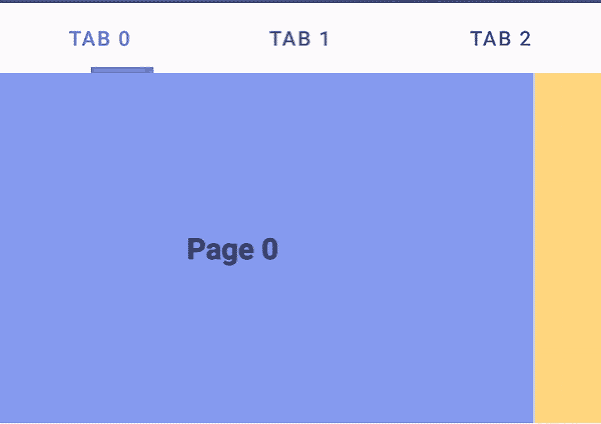
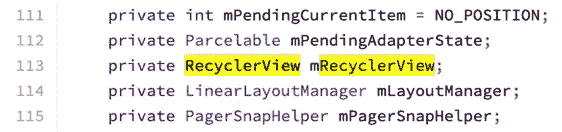
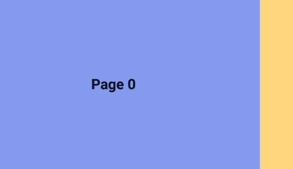
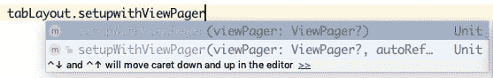
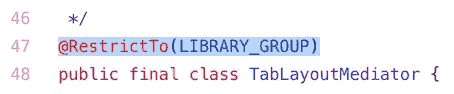
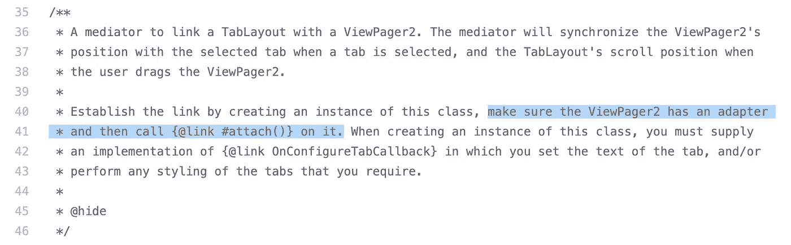
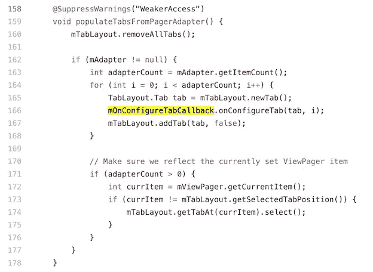
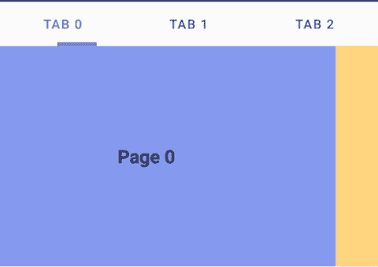
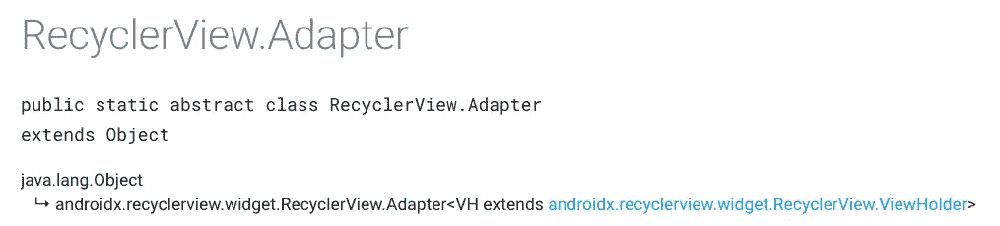
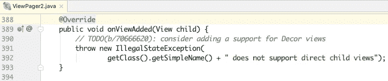

# Android ViewPager2 和 TabLayout

> 原文：<https://itnext.io/android-viewpager2-tablayout-3099aae2f396?source=collection_archive---------0----------------------->



Vview page 2 于今年 [2019 Google I/O](https://android-developers.googleblog.com/2019/05/whats-new-with-android-jetpack.html) 推出，是对旧 [ViewPager](https://developer.android.com/reference/android/support/v4/view/ViewPager) 的替代，该浏览器创建于 [2011](https://android.googlesource.com/platform/frameworks/support/+/jb-dev/v4/java/android/support/v4/view/ViewPager.java) 。它包括一些增强用户界面和编码体验的新特性，包括:

1.  支持从右向左布局
2.  垂直方向(垂直滚动)
3.  可修改的片段集合



来自 [Google](https://android.googlesource.com/platform/frameworks/support/+/androidx-master-dev/viewpager2/src/main/java/androidx/viewpager2/widget/ViewPager2.java) 的 ViewPager2 源代码截图

`ViewPager2`是由`RecyclerView`支持的`ViewGroup`，因此处理方法与`RecyclerView`类似。`ViewPager2`需要一个适配器来显示其内容，适配器可以是`RecyclerView adapter`或`FragmentStateAdapter`。

这篇文章将涵盖对`ViewPager2`的基本处理以及与`TabLayout`的链接。如果您已经熟悉了`ViewPager2`的设置，您可以直接跳转到[“Trick”会话](https://medium.com/@myrickchow_3307/android-viewpager2-tablayout-4df303c7972a#1731)。

# 设置

`ViewPager2`装在最新的`AndroidX library of JetPack`内，而不是`Material Component library`内。因此，我们必须使用以下 gradle 代码单独导入它:

> 切记`*AndroidX library*`不应与`*support library*`放在一起，以防出现任何意外结果。

# XML 布局

只需将`ViewPager2`小部件添加到您的布局中:

# 为 ViewPager2 定义 RecyclerView 适配器和单元布局

layout _ demo _ view page 2 _ cell . XML

# 将 RecyclerView 适配器与 ViewPager2 绑定

将适配器设置为 ViewPager2 的方法是

简单的结果:



# Trick — `TabLayout`不能与`ViewPager2`绑定



截图来自 Android Studio

在当前版本的`Material Component`库(版本:1.1.0-alpha06)中，`TabLayout`小部件还没有准备好与`ViewPager2`小部件进行本地绑定。那么，我们如何解决这个问题呢？根据 [Nikola Despotoski](https://stackoverflow.com/users/557179/nikola-despotoski) 在 [StackOverflow](https://stackoverflow.com/questions/55372259/how-to-use-tablayout-with-viewpager2-in-android) 中的回答，我们可以手动使用[tablayoutdiator](https://github.com/googlesamples/android-viewpager2/blob/master/app/src/main/java/androidx/viewpager2/integration/testapp/TabLayoutMediator.java)类将`TabLayout` widget 与`ViewPager2`绑定。



tablayoutdiator 的[源代码截图](https://github.com/googlesamples/android-viewpager2/blob/master/app/src/main/java/androidx/viewpager2/integration/testapp/TabLayoutMediator.java)

但根据源代码，`TabLayoutMediator`被限制在库级别，不能直接从开发者代码中调用。因此，我们必须将这个文件复制到我们的项目中，并在本地调用它。根据源代码中的注释，`attach()`只有在`TabLayoutMediator`初始化后才能被调用。



[TabLayoutMediator 源代码截图](https://github.com/googlesamples/android-viewpager2/blob/master/app/src/main/java/androidx/viewpager2/integration/testapp/TabLayoutMediator.java)

`TabLayoutMediator.OnConfigureTabCallback`是一个用户友好的功能，当每个`TabLayout.Tab`被初始化或数据被更改时调用。它提供了设计所有选项卡样式的机会。



[talayoutmediator 源代码截图](https://github.com/googlesamples/android-viewpager2/blob/master/app/src/main/java/androidx/viewpager2/integration/testapp/TabLayoutMediator.java)

最终结果:



# RecyclerView 适配器与 FragmentStateAdapter



截图来自 [RecyclerView。适配器谷歌文档](https://developer.android.com/reference/androidx/recyclerview/widget/RecyclerView.Adapter.html)


截图来自 [FragmentStateAdapter 谷歌文档](https://developer.android.com/reference/androidx/viewpager2/adapter/FragmentStateAdapter)

正如文章开头提到的，`ViewPager2`同时接受了`RecyclerView.Adapter`和`FragmentStateAdapter`。

`FragmentStateAdapter`是`RecyclerView.Adapter`的直系子孙。两者的主要区别在于`RecyclerView.Adapter`充气`**View**`而`FragmentStateAdapter`充气`**Fragment**`。

因此，当`ViewPager2`中的每个页面仅用于显示静态信息时，可以使用`RecyclerView.Adapter`，当必须考虑每个页面的生命周期时，可以使用`FragmentStateAdapter`。

例如，photo viewer ViewPager 可以使用`RecyclerView.Adapter`显示图像列表，带有`EditText`的应用表单页面可以使用`FragmentStateAdapter`在每个`Fragment`中使用`onSaveInstanceState()`。

# 与 TabLayout 集成

将一个`TabLayout`与旧版本的`ViewPager`集成很简单，只需将它添加为`ViewPager`的子元素，并通过 XML 属性`android:layout_gravity`定位。见此[谷歌文档](https://developer.android.com/reference/android/support/design/widget/TabLayout#viewpager-integration)。

```
<android.support.v4.view.ViewPager
     android:layout_width="match_parent"
     android:layout_height="match_parent"> <android.support.design.widget.TabLayout
         android:layout_width="match_parent"
         android:layout_height="wrap_content"
         android:layout_gravity="top" /> </android.support.v4.view.ViewPager>
```

然而，`ViewPager2`(版本 1.0.0-alpha04)不支持直接子视图，这意味着`TabLayout`不能作为 [ViewPager 添加到 ViewPager2 中。去视图](https://developer.android.com/reference/android/support/v4/view/ViewPager.DecorView.html)。`TabLayout`必须和`ViewPager2`一起放在`FrameLayout`内才能达到同样的效果。



ViewPager2 关于子视图限制的截图

正如上面函数中写的评论，Google 可能会在未来的下一个或稳定版本`ViewPager2`中包含支持直接子视图的功能。

# 结论:

1.  `ViewPager2`包括了从`RecycleView`到原来的`ViewPager`，使得编码比以前简单多了。
2.  `ViewPager2`(版本`1.0.0-alpha04`)不能被`TabLayout`原生绑定。`TabLayoutMediator`是解决这个问题的好办法。
3.  `ViewPager2`需要一个适配器来控制每个页面中的内容。可以是`RecyclerView.Adapter`也可以是`FragmentStateAdapter`。`RecyclerView.Adapter`适用于静态内容情况，`FragmentStateAdapter`适用于需要收听生命周期事件的内容。
4.  `ViewPager2`不允许有任何子视图。`TabLayout`必须与`ViewPager2`一起放入另一个`ViewGroup`中。

# 进一步阅读:

1.通常将`ViewPager`设置为水平页边距，同时保持上一页和下一页对用户可见。但是，`ViewPager2`中缺少该功能，默认情况下缓存机制被禁用。让我们看看如何解决这个问题。

[](https://medium.com/@myrickchow32/android-viewpager2-with-pretty-page-margin-bfae8dd397a8) [## Android ViewPager2，页面空白美观

### ViewPager2 无法直接设置页边距，其内部 RecyclerView 对开发人员是私有的。我们如何绕过…

medium.com](https://medium.com/@myrickchow32/android-viewpager2-with-pretty-page-margin-bfae8dd397a8) 

2.点样式的`TabItem`没有正式的文档。这个过程总结起来只有 4 个简单的步骤。

[](https://medium.com/swlh/4-steps-to-android-dot-tabitem-dadeeef44f51) [## Android Dot TabItem 的 4 个步骤

### 在许多应用程序中，向 TabLayout 呈现点是很常见的。只有 4 个步骤来配置点！点击阅读更多…

medium.com](https://medium.com/swlh/4-steps-to-android-dot-tabitem-dadeeef44f51) 

3.`TabLayout`与`ViewPager`和`ViewPager2`紧密合作。然而，样式`TabLayout`和`TabItem`有时会混淆。需要的话可以看看下面这篇文章。

[](https://medium.com/swlh/android-tablayout-and-tabitem-268ac06ba966) [## 一体化—Android tablayut 和 TabItem

### 设计一个 TabLayout 的样式并不像您想象的那么简单。Google 官方文档与材料组件不同步…

medium.com](https://medium.com/swlh/android-tablayout-and-tabitem-268ac06ba966) 

如需了解更多信息，请在[Twitter @ myrik _ chow](https://twitter.com/myrick_chow)关注我。感谢您阅读这篇文章。祝您愉快！😄