# 安卓谷歌 I/O 2019 ViewPager2(第二部分)

> 原文：<https://itnext.io/android-viewpager2-with-pretty-page-margin-bfae8dd397a8?source=collection_archive---------0----------------------->

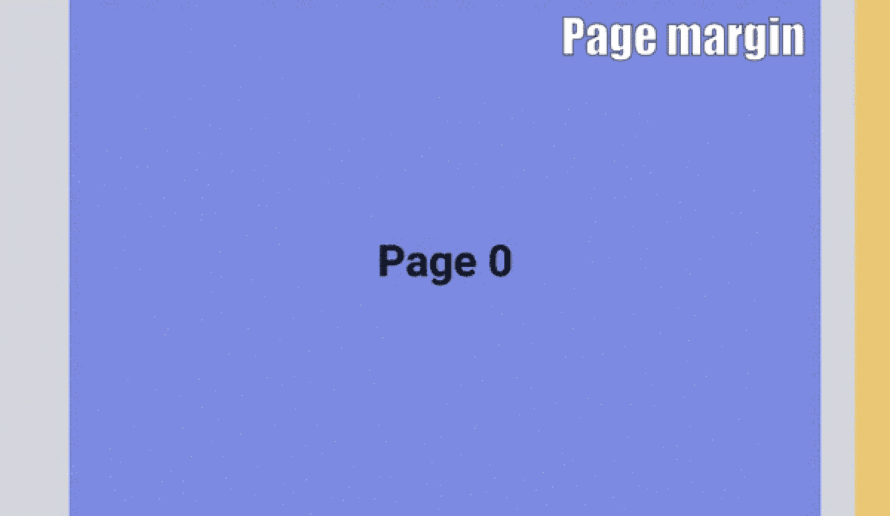

`ViewPager2`自 [2019 Google I/O](https://android-developers.googleblog.com/2019/05/whats-new-with-android-jetpack.html) 起已公布 3 个月，是旧款 [ViewPager](https://developer.android.com/reference/android/support/v4/view/ViewPager) 的替代产品。然而，它仍然处于 [alpha 阶段](https://developer.android.com/jetpack/androidx/releases/viewpager2) ( `1.0.0-alpha06`)，一些流行的功能对于开发者来说仍然是缺失的。设置页面之间的页边空白是其中之一，它是实现上面显示的布局行为的关键设置。

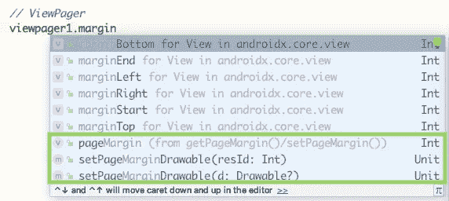

与设置页面边距相关的功能截图

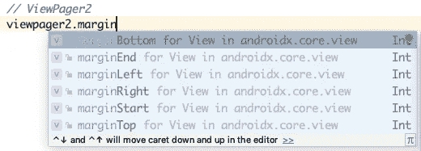

ViewPager2 页边空白设置相关功能截图

本文将简单讨论如何破解`ViewPager2`，实现与`ViewPager`相同的缺页边距功能和上述布局。

# 先决条件

假设你已经对`ViewPager2`的设置有了基本的了解，包括给 gradle 文件添加相应的依赖关系，给`RecyclerView.Adapter`赋值`ViewPager2`。

[](https://medium.com/swlh/android-viewpager2-tablayout-3099aae2f396) [## Android ViewPager2 和 TabLayout

### ViewPager2 是在今年的 2019 Google I/O 中推出的，它取代了旧的 ViewPager，后者是在…

medium.com](https://medium.com/swlh/android-viewpager2-tablayout-3099aae2f396) 

# ViewPager2 剖析

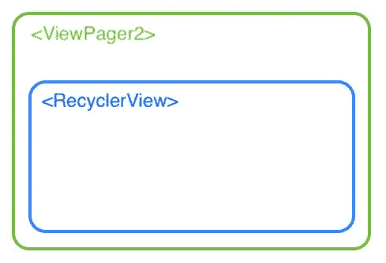

ViewPager2 剖析

`ViewPager2`是`ViewPager`的重新设计，包含一个用于显示其内容的`RecyclerView`。

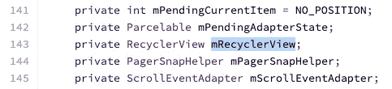

[view page 2 源代码](https://android.googlesource.com/platform/frameworks/support/+/androidx-master-dev/viewpager2/src/main/java/androidx/viewpager2/widget/ViewPager2.java)的第 143 行

但是，`mRecyclerView`是`ViewPager2`的私有成员实例，不能直接用`RecyclerView`直接访问。因此，我们必须找到一个技巧来绕过它。

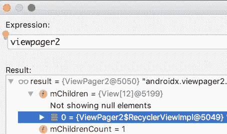

Android Studio 日志显示了 ViewPager2 的属性

根据 Android Studio 日志，每个`ViewGroup`实例都可以访问一个公共字段`children`。因此，可以通过这种方式访问内部`RecyclerView`实例。😉

# 我们开始吧！

## 步骤 1:访问 RecyclerView 实例

我对上述代码做了两个假设:

1.  `ViewPager2`将持续使用`RecyclerView`显示其内容。
2.  `ViewPager2`只会有一个`RecyclerView`的实例。

在我看来，这是目前两个有效的假设。

## 第 2 步:添加 RecyclerView。RecyclerView 实例的 ItemDecoration

[项目装饰](https://developer.android.com/reference/android/support/v7/widget/RecyclerView.ItemDecoration)是`RecyclerView`的一部分，负责在`RecyclerView`显示的项目之间添加分隔线。结果如下所示:

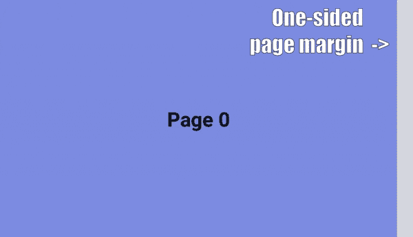

> 请注意，如果设置了起始(左侧)分隔符，它将抛出以下奇怪的异常。它来源于`ScrollEventAdapter`其中 t *将* `*RecyclerView.OnScrollListener*` *事件转换为* `*OnPageChangeCallback*` *事件
> 为* `*ViewPager2*` *。*

```
java.lang.IllegalStateException: Page can only be offset by a positive amount, not by -42
```

*计算* `*RecyclerView*` *中第一项的偏移量时引起。我相信这是* `*ViewPager2*` *的一个 bug，希望在未来能够修复。*

# 实际案例:我们如何用 ViewPager2 实现以下行为？

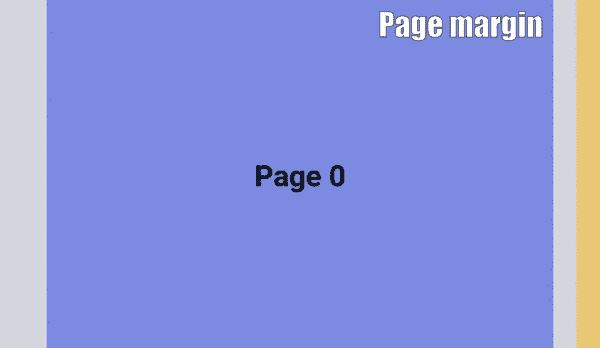

乍一看，相信通过在`RecyclerView`两侧设置水平填充，并在`RecyclerView`级别禁用`clipToPadding`属性，就可以简单地完成上述布局。

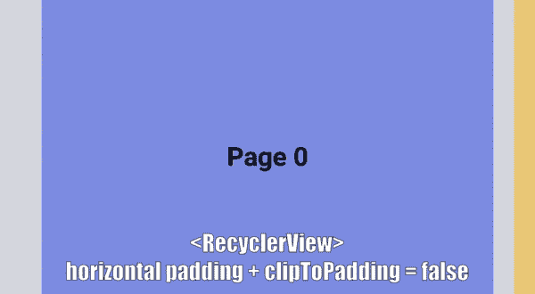

但是，这种方法并不可行，因为`*ScrollEventAdapter*`会抛出一条与设置`RecyclerView`项的起始(左)分隔符相同的错误信息。

```
java.lang.IllegalStateException: Page can only be offset by a positive amount, not by -42
```

# 第二次尝试—使用旧的 ViewPager 设置:

在互联网上有很多材料教导如何用旧的`ViewPager`实现上述行为。其中一个示例如下所示:

[](https://stackoverflow.com/questions/7343487/android-viewpager-padding-margin-between-page-fragments) [## Android ViewPager 页面片段之间的填充/边距

### 感谢贡献一个堆栈溢出的答案！请务必回答问题。提供详细信息并分享…

stackoverflow.com](https://stackoverflow.com/questions/7343487/android-viewpager-padding-margin-between-page-fragments) 

但是，通过设置这些属性并不会让`RecyclerView`在`ViewPager2`水平填充上方显示其内容。发生了什么事？让我们看到下一个会议的进一步讨论。

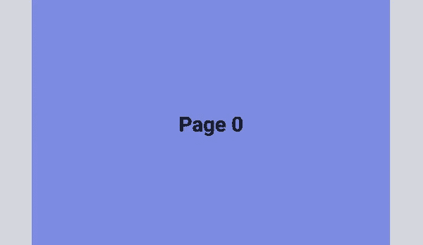

ViewPager2 上旧 ViewPager 设置的图示

# 最后一次尝试—添加 ViewPager2 和 inner RecyclerView 的更多设置

## 步骤 1:添加不平衡的水平填充并禁用`clipToPadding`属性

和那些`ViewPager`的教程一样，水平`padding`必须设置为禁用`clipToPadding`属性。这允许子视图`RecyclerView`被绘制在`ViewPager2`的填充之上。

但是，水平填充不平衡。`PaddingStart`是`32dp`，`paddingEnd`是`16dp`。这是因为只有右(端)分隔符无错误地设置在内部`RecyclerView`处，而分隔符先前设置为`16dp`。因此，`paddingEnd`必须偏移`16dp`。

## 步骤 2:在 ViewPager2 和 RecyclerView 级别禁用 clipChildren 属性

设置为<viewpager2></viewpager2>

设置为内部

> `ClipChildren`属性定义了`ViewGroup`的子视图是否可以超出其自身的界限。
> 
> 参考:[谷歌开发者官方文档](https://developer.android.com/reference/android/view/ViewGroup.html#setClipChildren(boolean))

通过禁用`clipChildren` , `ViewPager2`允许其子`RecyclerView`超出其边界(区域)绘制。

然而，`RecyclerView`默认情况下会将它的子视图限制在自己的范围内。因此，`clipChildren`属性也必须被禁用。

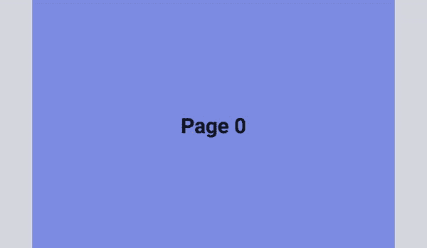

此时，只有在滑动`ViewPager2`时才能绘制多页。这是完全不能接受的。这个问题是由于`ViewPager2`内部的`RecyclerView`缓存机制造成的。

## 步骤 3:更新 offscreenPageLimit


[view page 2 源代码](https://android.googlesource.com/platform/frameworks/support/+/androidx-master-dev/viewpager2/src/main/java/androidx/viewpager2/widget/ViewPager2.java)的第 113–118 行


[ViewPager 源代码](https://android.googlesource.com/platform/frameworks/support/+/jb-dev/v4/java/android/support/v4/view/ViewPager.java)的第 87–91 行

与旧的`ViewPager`不同，`ViewPager2`的`offscreenPageLimit`被设置为`-1`，这意味着`RecyclerView`不缓存任何两边的视图。换句话说，当两边的视图不再是居中的页面时，它们将被移除。

因此，`offscreenPageLimit`必须至少设置为`1`，以告知内部`RecyclerView`在**两侧**缓存 1 视图。

将 offscreenPageLimit 设置为在两端缓存视图

> 旁注:
> 默认`*offscreenPageLimit*`设置为`*-1*`的原因是`*ViewPager2*`现在是为显示与`*ViewPager2*`大小相同的页面而设计的。因此，没有必要缓存任何视图，因为它们在屏幕上都是不可见的。

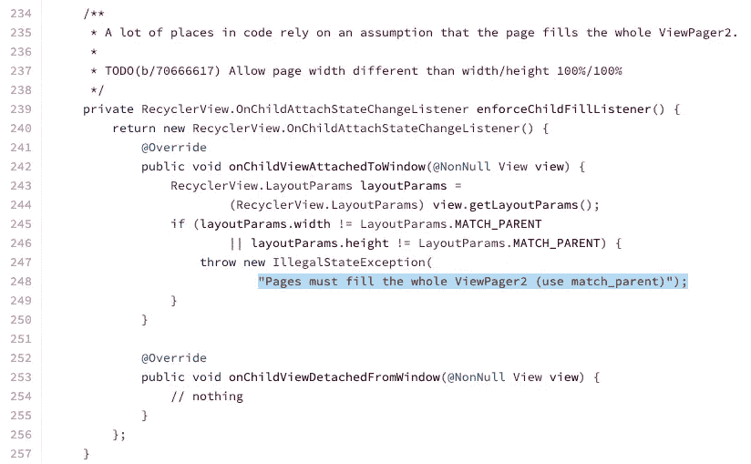

[view page 2 源代码](https://android.googlesource.com/platform/frameworks/support/+/androidx-master-dev/viewpager2/src/main/java/androidx/viewpager2/widget/ViewPager2.java)的第 234–257 行

## 最终结果:


# 结论

1.  `ViewPager2` ( `1.0.0-alpha06`)包含一个用于显示内容的`RecyclerView`。
2.  即使内部`RecyclerView`实例是私有的，但是它仍然可以被`ViewPager2`的公共`children`属性访问，该属性是一个`ViewGroup`。
3.  甚至`ViewPager2`中不包含`setPageMargin()`，但可以通过设置内`RecyclerView`的`ItemDecoration`来替换
4.  在保持上一页和下一页的同时设置水平填充的页面对于`ViewPager2`来说比`ViewPager`更困难，因为在`ViewPager2`视图层次结构中还有一个子层。
5.  除了设置水平`paddings`和禁用`ViewPager2`的`clipToPadding`属性外，还需要禁用`ViewPager2`和内`RecyclerView`的`clipChildren`属性，以进行越界绘制。
6.  默认情况下，内部`RecyclerView`的缓存机制是禁用的，因此必须启用才能同时显示多个视图。
7.  `ViewPager2`目前不允许设置内部`RecyclerView`的`paddingStart`和开始`ItemDecoration`。否则，将导致来自`*ScrollEventAdapter*` 的异常。

```
java.lang.IllegalStateException: Page can only be offset by a positive amount, not by -42
```

# 进一步阅读:

1.  `ViewPager2`和`TabLayout`之间的联动不再容易。为此，它需要 [TabLayoutMediator](https://github.com/googlesamples/android-viewpager2/blob/master/app/src/main/java/androidx/viewpager2/integration/testapp/TabLayoutMediator.java) 。本文涵盖了从基本设置到将`Tab`与`ViewPager2`链接。

[](https://medium.com/swlh/android-viewpager2-tablayout-3099aae2f396) [## Android ViewPager2 和 TabLayout

### ViewPager2 是在今年的 2019 Google I/O 中推出的，它取代了旧的 ViewPager，后者是在…

medium.com](https://medium.com/swlh/android-viewpager2-tablayout-3099aae2f396) 

2.`TabLayout`与`ViewPager`和`ViewPager2`密切配合。然而，样式`TabLayout`和`TabItem`有时会混淆。需要的话可以看看下面这篇文章。

[](https://medium.com/swlh/android-tablayout-and-tabitem-268ac06ba966) [## 一体化—Android tablayut 和 TabItem

### 设计一个 TabLayout 的样式并不像您想象的那么简单。Google 官方文档与材料组件不同步…

medium.com](https://medium.com/swlh/android-tablayout-and-tabitem-268ac06ba966) 

3.点样式的`TabItem`没有正式的文档。这个过程总结起来只有 4 个简单的步骤。

[](https://medium.com/swlh/4-steps-to-android-dot-tabitem-dadeeef44f51) [## Android Dot TabItem 的 4 个步骤

### 在许多应用程序中，向 TabLayout 呈现点是很常见的。只有 4 个步骤来配置点！点击阅读更多…

medium.com](https://medium.com/swlh/4-steps-to-android-dot-tabitem-dadeeef44f51) 

欢迎您关注我，在[Twitter @ my rik _ chow](https://twitter.com/myrick_chow)了解更多信息。感谢您阅读这篇文章。祝您愉快！😄