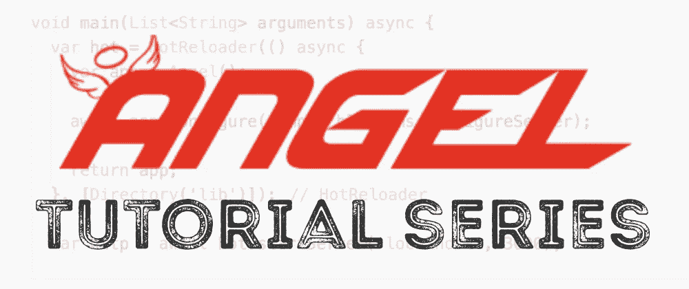

# 天使飞镖框架教程系列

> 原文：<https://itnext.io/angel-dart-framework-tutorial-series-69506888633c?source=collection_archive---------4----------------------->

## 让我们建立一个内容管理系统

在这个视频系列中，我们将看看由 CS 学生 Tobe Osakwe 编写的用于后端 Dart 开发的天使框架。Angel 自带电池——包括几十个插件，支持“即插即用”的方式来开发生产质量的应用程序。我们将建立一个具有验证和搜索功能的管理博客文章的 CMS。

# 第一部分

# 第二部分

在这一部分中，我们将学习服务和模型类，利用代码生成工具来生成为持久层序列化数据的类。我们将创建一个 MongoService，负责促进与我们的 MongoDb 数据库的通信。

# 第三部分

在这个视频中，我们将学习如何预览保存到数据库中的文章，以及通过错误处理来验证我们的输入，以确保我们不会提交无效的数据。

# 第四部分

在本视频中，我们将为文章添加编辑和删除功能。

# 第五部分

在本视频中，我们将了解搜索和导航切换功能。

如果你能在你的社交媒体渠道上分享这个视频，我会很高兴的。这将为 Dart 可用的框架创造更多的曝光机会，目前，像这样的资源相当稀缺。

如果你有任何问题，请在下面的评论中告诉我。

*原载于 2020 年 1 月 26 日*[*【https://creativebracket.com】*](https://creativebracket.com/angel-dart-framework-tutorial-series/)*。*