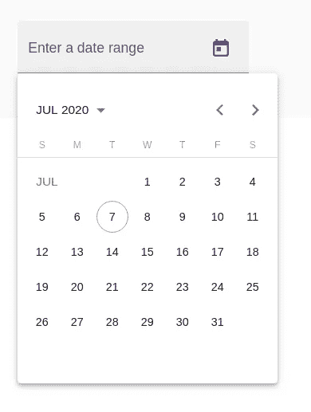

# 带日历和日期范围的角度 10 材料日期选择器

> 原文：<https://itnext.io/angular-10-material-date-picker-with-calendar-and-date-range-dd251ede9a14?source=collection_archive---------3----------------------->



Angular 10 最近已经发布，并像任何新的主要版本一样引入了一些新功能。新功能之一是将**日期范围**功能添加到 Angular Material 的日期选择器组件中。

在整个教程中，我们将学习如何使用`mat-datepicker`指令创建一个基本的材料日期选择器，然后如何使用 Angular 10 材料中新的`mat-date-range-picker`指令创建一个具有日期范围的选择器。

我们还将学习如何使用过滤函数
和`<input>`、`<mat-datepicker-toggle>`和`<mat-datepicker>`元素上可用的`disabled`属性来禁用特定日期，从而使用`input`字段的`matDatepickerFilter`属性来禁用元素。

我们将了解可以从`input`字段触发的材料日期选择器事件，即`dateInput`和`dateChange`事件，然后了解如何使用`input`字段的`min`和`max`属性来设置 Angular 10 应用程序用户可以选择的日期范围。

最后，我们将学习如何使用`<mat-datepicker>`指令的`startView`属性更改日历开始视图，该属性可用于显示一个*月*、*年*或*多年*供用户选择，以及如何使用`startAt`属性设置`<mat-datepicker>`的开始日期。

作为先决条件，您需要安装 Angular 10 CLI，并使用以下命令生成新的 Angular 10 项目:

```
$ ng new AngularMaterialDateRangePicker #? Would you like to add Angular routing? No
#? Which stylesheet format would you like to use? CSS
```

系统会提示您选择路径和样式表格式，您认为合适就回答它们，因为这不会影响已测试的特性。

接下来，您需要在项目中设置角度材质。这可以通过以下命令轻松完成:

```
$ ng add @angular/material
```

接下来，您需要从列表中为项目选择一个材质主题:

```
? Choose a prebuilt theme name, or "custom" for a custom theme: (Use arrow keys)
> Indigo/Pink [ Preview: [https://material.angular.io?theme=indigo-pink](https://material.angular.io?theme=indigo-pink) ]
 Deep Purple/Amber [ Preview: [https://material.angular.io?theme=deeppurple-amber](https://material.angular.io?theme=deeppurple-amber) ]
 Pink/Blue Grey [ Preview: [https://material.angular.io?theme=pink-bluegrey](https://material.angular.io?theme=pink-bluegrey) ]
 Purple/Green [ Preview: [https://material.angular.io?theme=purple-green](https://material.angular.io?theme=purple-green) ]
 Custom
```

接下来，对材料排版样式说“是”或“否”:

```
? Set up global Angular Material typography styles? No
```

接下来，您需要选择启用浏览器动画支持:

```
? Set up browser animations for Angular Material? Yes
```

就是这样，我们为 Angular 10 项目增加了物质支持。

在这一步，您可以使用以下命令在 web 浏览器中运行 Angular 10 应用程序:

```
$ ng serve --open
```

现在，您已经准备好使用材料日期选取器的日期范围功能。

在 Angular 10 项目中使用 Material UI 组件之前，需要在应用程序的模块中导入所需组件的模块。

角度材料日期选择器可与组件模板中的`mat-datepicker`或`mat-date-range-picker`指令一起使用。为了使用物料日期选择器，我们首先需要导入`MatDatePicker`模块。

接下来，您需要在您的主模块中导入`MatDatepickerModule`、`MatNativeDateModule`和`MatInputModule`。打开`src/app/app.module.ts`文件，更新如下:

```
//src/ap/app.module.ts
import { BrowserModule } from '@angular/platform-browser';
import { NgModule } from '@angular/core';

import { AppRoutingModule } from './app-routing.module';
import { AppComponent } from './app.component';

import { BrowserAnimationsModule } from '@angular/platform-browser/animations';

import { 
  MatDatepickerModule,
  MatNativeDateModule,
  MatInputModule
} from '@angular/material';

@NgModule({
  declarations: [
    AppComponent
  ],
  imports: [
    BrowserModule,
    AppRoutingModule,
    BrowserAnimationsModule,

    MatNativeDateModule,
    MatInputModule,
    MatDatepickerModule
  ],
  providers: [],
  bootstrap: [AppComponent]
})
export class AppModule { }
```

让我们从实现一个简单的基本日期选择器开始。打开`src/app/app.component.html`文件并添加以下标记:

如您所见，材料日期选择器是使用一个`input`字段和一个日历弹出菜单实现的。我们使用`input`元素上的`matDatepicker`属性，通过模板引用变量(`#picker`)将其连接到`mat-datepicker`指令。

您也可以使用`startAt`属性设置`<mat-datepicker>`的开始日期，如下所示:

确保在组件中定义了一个`startDate`变量，如下所示:

```
startDate = new Date(1990, 0, 1);
```

您也可以使用`<mat-datepicker>`的`startView`属性更改日历开始视图，该属性可用于显示*月*、*年或多年供选择，默认为*月:

```
startView="year";
startView="multi-year";
```

您可以使用`input`字段的`min`和`max`属性设置可选择的日期范围，如下所示:

`minDate`和`maxDate`变量需要在相关组件的类中用期望的日期值定义:

```
minDate = new Date(1989, 2, 1);
maxDate = new Date(1999, 3, 3);
```

物料日期选择器提供了两个可以从`input`字段触发的事件，分别是`(dateInput)`和`(dateChange)`:

*   当通过在输入字段中键入日期或从日历中选择一个日期来更改值时，触发`dateInput`
*   `dateChange`在用户更改输入字段中的值或日历中的日期被更改后模糊触发。

这是一个例子:

您需要在相应组件的类中定义`inputEvent`和`changeEvent`方法，如下所示:

```
inputEvent(event){
 console.log(event.value);
}
changeEvent(event){
 console.log(event.value);
}
```

您可以使用`input`字段的`matDatepickerFilter`属性来禁用特定的日期，使用过滤函数在日历弹出窗口中为日期返回 true 或 false。如果该函数对某个日期返回 false，则该函数将被禁用，用户不能选择该函数:

您需要在相应组件的类中定义过滤函数。例如:

```
fn = (aDate: Date): boolean => {
 const date = aDate.getDate(); 
 // Odd dates are disabled.
 return date % 2 == 1;
 }
```

您可以使用`<input>`、`<mat-datepicker-toggle>`和`<mat-datepicker>`元素上可用的`disabled`属性来禁用元素并使其为只读:

现在让我们看看如何将日期选择器组件与范围特性结合使用。首先，运行以下命令生成一个新的角度分量:

```
$ ng g c date-range-picker-example
```

接下来，打开`src/app/date-range-picker-example/date-range-picker-example.html`文件，并按如下方式更新它:

接下来，打开`src/app/app.component.html`文件并包含组件，如下所示:

在本教程中，我们已经了解了如何使用 Angular 10 中新的日期范围特性中的材质日期选择器。

我们已经看到了如何使用`mat-datepicker`指令创建一个基本的材料日期选择器，然后如何使用 Angular 10 材料中新的`mat-date-range-picker`指令创建一个带有日期范围的选择器。

我们学习了如何使用过滤函数
和`<input>`、`<mat-datepicker-toggle>`和`<mat-datepicker>`元素上可用的`disabled`属性，使用`input`字段的`matDatepickerFilter`属性来禁用特定日期，以使元素被禁用并且是只读的。

我们了解了可以从`input`字段触发的材料日期选择器事件，即`(dateInput)`和`(dateChange)`，以及如何使用`input`字段的`min`和`max`属性来设置 Angular 10 应用程序用户可以选择的日期范围。

最后，我们还学习了如何使用< mat-datepicker >的`startView`属性更改日历开始视图，该属性可用于显示月份、年份或多年供选择，以及如何使用 **startAt** 属性在`<mat-datepicker>`设置开始日期。

这篇文章最初发表在[科技杂志](https://www.techiediaries.com/angular-10-material-date-picker-calendar-range/)。