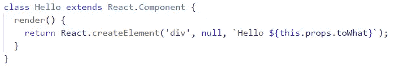
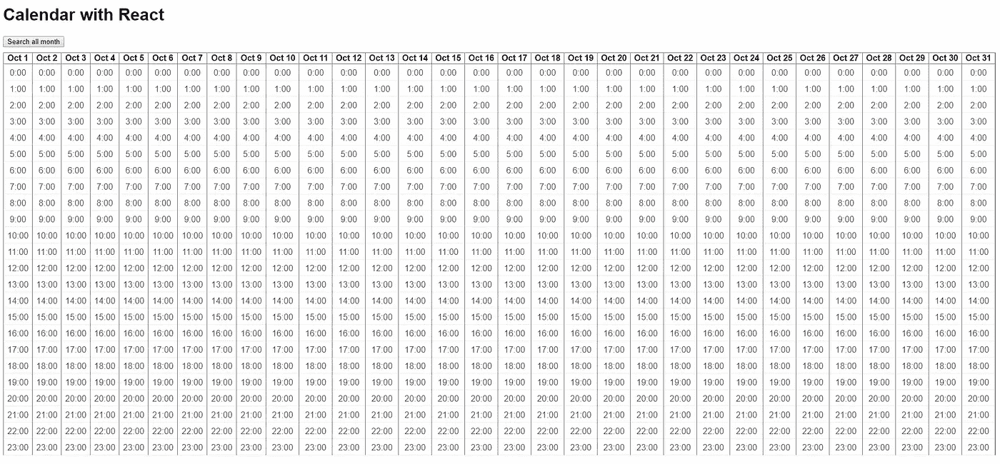
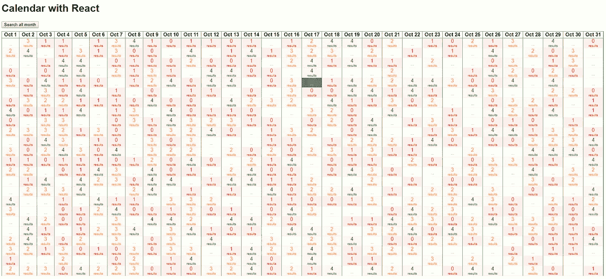
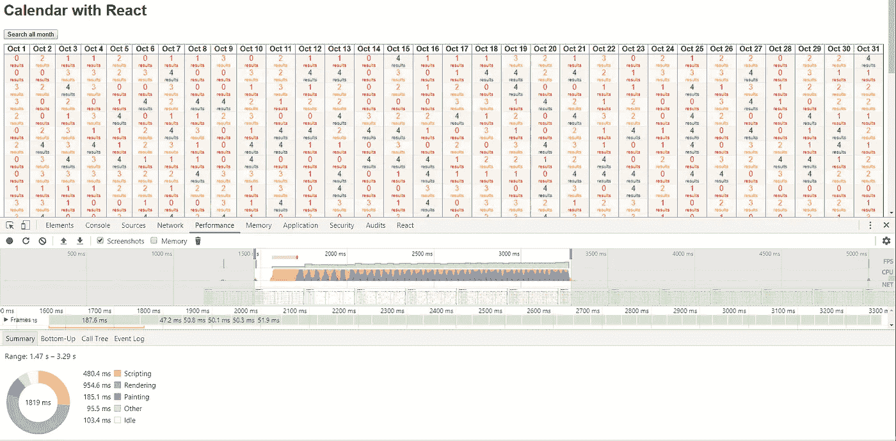
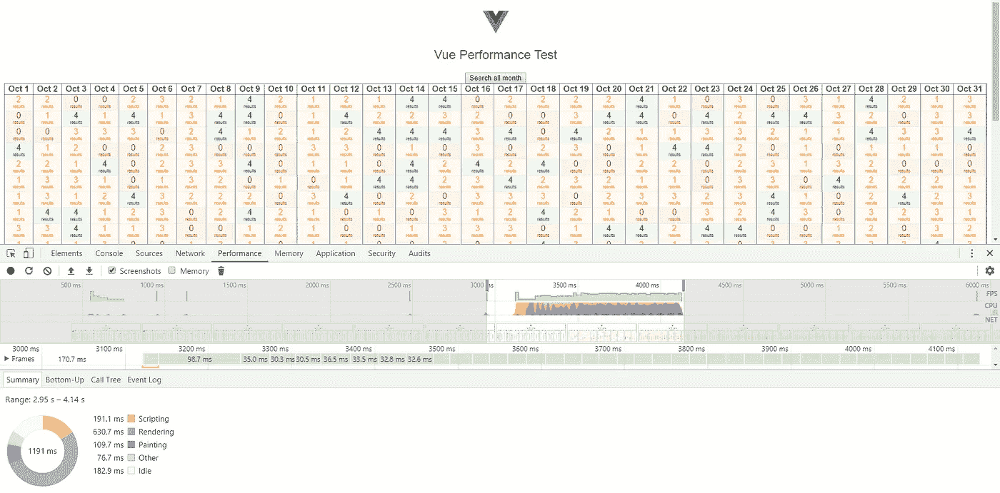
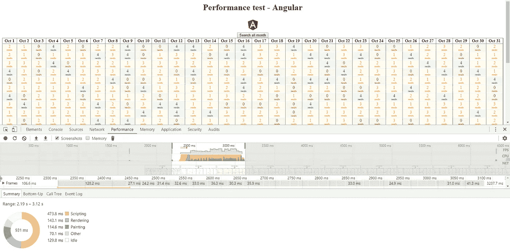

# 角度 5 与反应和 Vue

> 原文：<https://itnext.io/angular-5-vs-react-vs-vue-6b976a3f9172?source=collection_archive---------0----------------------->

如今，技术发展非常快。每天、每周、每月都有越来越多的工具出现来解决不同的问题。

在本文中，我想比较一下前端开发最流行的三种技术: **Angular 5** 、 **React** 和 **Vue** 。我将从项目架构师或者仅仅是为新项目选择框架的开发人员的角度来比较它们。

[*点击这里在 LinkedIn 上分享这篇文章*](https://www.linkedin.com/cws/share?url=https%3A%2F%2Fitnext.io%2Fangular-5-vs-react-vs-vue-6b976a3f9172)

好，我们从 React 开始。很多人把它命名为框架。嗯，实际上不是。React 只是一个面向视图的库。这是 MVC 中的一个视图。Angular 和 Vue 是框架。

所以，选择一个，要从这一点出发:我们需要一个库还是框架？让我们更深入地看看每一个。

实际上，库只是为完成一些特定的任务而设计的，它们并不复杂。如果你正在构建你的应用程序表单库，你需要为每个任务选择一个库，你需要设置任务运行器，等等。

它的好处是你可以完全控制应用程序。但是建立这个项目需要更多的时间。

正如我前面提到的，我们从项目架构师的角度进行比较，所以我们也必须考虑其他开发人员。还有一个问题。由于 React 应用程序是由不同的库构建的，所以库的堆栈会随着项目的不同而变化。这意味着，对于其他开发商来说，加入将更加困难。此外，开发过程将需要更多的时间，因为你是与低层次的 API 的工作。

现在让我们来看看框架。

框架是为做更复杂的事情而设计的，所以，如果你正在使用框架，已经有很多问题为你解决了。框架有预定义的设计，已经设置了任务运行器和许多库。您已经可以创建功能齐全的项目，而无需其他设置。因此，我们可以非常容易地建立一个新项目，开发过程更快，因为我们已经在使用高级 API，并且用该框架开发的每个应用程序都使用相同的库，所以其他开发人员将更容易加入。但是框架有更严格的设计。

现在让我们更深入地看一看每一个。

我想从 React 开始，因为它是我们列表中最小的。

React 是一个用于构建用户界面和使用组件的库。
如果您不知道，那么组件是应用程序的独立部分，它们被封装，可以在应用程序的不同部分使用。它们是封装的，因此不会影响应用程序的其他高级部分。

React 使用单向数据流，它与 [redux](https://redux.js.org/) 非常相似，在实际应用中 redux 使用得非常好。

接下来是 JSX。JSX 是 ECMAScript 的类似 XML 的语法扩展，没有任何定义的语义。它旨在被各种预处理程序(transpilers)用来将这些标记转换成标准的 ECMAScript。

下面是一个简单的 JSX 语法示例:

等效的 ES6 代码将是:

基本上我不喜欢 JSX 的想法，因为它不再是一个 HTML。你需要使用特殊的属性，这带来了一些限制。

React 中的下一件大事是应用程序的状态。State 是一个对象，包含应用程序的所有公共属性。它允许你复制状态并发送到另一个设备，打开应用程序，你会得到完全相同的屏幕，这是在第一个设备上。

状态管理经历了调度器和还原器。例如，如果我们想要处理按钮点击，我们为该动作设置一个 dispatcher，当动作继续时，dispatcher 调用且状态改变。

现在让我们转到 Vue。

通过比较 Vue 和 React，我们有相同的组件和单向数据流。但是还有很多补充..

我们有相同的组件，但默认情况下，他们的工作与模板，而不是与 JSX。模板的主要优点是你写的是纯 HTML。但是如果你愿意，你可以用 JSX。这取决于你。

另一个非常有用的东西是指导。指令主要用于附加功能和 DOM 操作。这对保持业务逻辑清晰很有帮助。想象一下，你有一些

，里面有一些内容。本身，那个只是一个阻挡元素，站在他的位置上。您添加了一个属性“draggable ”,它变成了一个可拖动的元素。你可以移动它。你看不到拖动的逻辑，这是内部指令。你只是看到它是一个可以拖动的 div 元素。

接下来是混音。如果你熟悉 LESS 或 SASS，你可能对这个术语很熟悉。它类似于对象的继承，但在我们的情况下，对象包含属性和方法，可以从组件继承。

接下来我们有过滤器。它们允许解析输入数据。例如，您有一个日期列表，您需要显示自该日期以来的天数(例如 3 d 前)。因此，不用编写一个助手服务来解析日期到天数，您只需定义一个过滤器并像这样使用它

另一件大事是依赖注入。如果你熟悉一些面向对象的语言，你可能知道依赖注入。通过在每个模块中注入依赖项，你就拥有了那个模块所需要的那些模块。这是封装的核心规则之一。在大型应用中，这一点非常重要。

现在让我们来看看角度。

在 Angular 中，我们有相同的组件，单向数据流、HTML、模板、过滤器(命名管道)、指令、依赖注入。此外，我们还有模块和服务。

模块由组件、服务、指令等组成。它们更通用，主要用于提供某些功能。

服务是为做一些特定的事情而设计的。这里是必须编写主要业务逻辑的地方。

好吧。我想写的下一部分是 DOM 呈现。这里我们有两个 DOM 渲染模块。React 和 Vue 用的是虚拟 DOM，Angular 用的是直接 DOM 渲染系统。和 Angular 用 1.x 版本做的一样，只是优化了，有惊喜给你:)。

先从虚拟 DOM 说起。假设您有一个包含 5 个项目的列表。

现在第一排发生了变化。大多数框架所做的是重建和重新呈现整个列表。这比必要工作量多了 5 倍。我们只需要更新第一行。

让我们看看在这种情况下虚拟 DOM 会做什么。

在任何操作之前，它创建 DOM 的副本并使用这个副本。使用 JavaScript 对象比使用 DOM 要快得多，因为屏幕上什么也看不到。

当虚拟 DOM 更新后，它会与更新前捕获的旧版本进行比较，并找到必须更新的元素。这个过程叫做“区分”。在检查差异之后，实际上 DOM 只更新那些被改变的部分。

这就是如何管理 DOM 渲染反应和 Vue。

现在让我们来看看棱角。

Angular 的渲染有一点很有意思。Angular 同时使用浏览器线程(UI 区域)和服务工作线程(工作区域)。工作区负责构建和编译指令、服务、过滤器和引导代码。UI 区域负责 DOM 渲染。你可以拿它和电脑的处理器和显卡做比较。工作区是处理器，UI 区是显卡。

另一个令人惊叹的部分是，渲染器可以根据应用程序运行的环境而有所不同。例如，如果你想在画布上绘制你的应用程序，你可以很容易地做到这一点。你只需要实现渲染器类。

为了理解这种方法的意义，让我们比较一些基准。

下面是我的基准测试的截图

我做了一个有 31 天 24 小时的日历。

当你点击一个项目，它会加载一些随机数。我没有提出真正的请求，而是做了 0-500 毫秒的延迟。也是随机的。现在想象一下，当我们一次点击所有项目时会发生什么。

理论上，整个表必须在 500 毫秒内加载。但现实是不同的。

我使用谷歌浏览器的性能工具来计算时间，从我点击按钮开始，直到渲染过程结束。

对于 React，需要 1819 毫秒

对于 Vue，需要 1191 毫秒

对于角度，需要 931 毫秒

你可以自己测试一下。这里是每一个的链接。

[https://github.com/mikpetr/angular-performance-test](https://github.com/mikpetr/angular-performance-test)
https://github.com/mikpetr/react-performance-testT5[https://github.com/mikpetr/vue-performance-test](https://github.com/mikpetr/vue-performance-test)

接下来，我想说的是服务器端渲染。有角，React 和 Vue 支持一下。这是 Angular 1.x 中真正需要的部分。在我看来，这就是为什么今天存在许多网站，这些网站是由服务器端渲染逻辑编写的。所以现在 SEO 不是问题:)

它是如何工作的？
很简单。每个库/框架都有一些包，可以在浏览器中运行时呈现代码，并返回已经呈现的页面。最酷的是，它可以自动工作。无需重写应用程序。

正如你可能已经知道的那样，移动技术发展非常快，而且又是 Angular，React 和 Vue 可以用来开发移动应用。Angular 有许多直接为 Ionic 编写的组件，React 有 React Native，Vue 有 Framework 7。

从项目架构师的角度来看，对于公司本身来说，学习曲线非常重要，就好像你有一个团队，你的员工可能会离开，其他人可能会加入。

让我们再次从反应开始。这里我们有一个棘手的时刻。反应很简单。您需要了解的唯一事情是如何使用组件、JSX 和状态管理。但是要构建全功能的应用程序，你需要知道或学习许多额外的库，这非常棘手。React 应用程序的主要优点是有许多定制的解决方案，并且从一个项目到另一个项目，它可以而且将会有所不同。所以对新员工来说，这并不太好。

在 Vue 中，你已经有了全功能的框架，你不需要连接很多库。无论如何，如果你需要，他们是不会改变应用程序的架构的。但是 Vue 已经有了更多你需要熟悉或学习的组件，比如指令、混合、依赖注入等等。

在角度学习曲线要长得多。主要的问题和特点是打字稿。是的，你可以使用 Angular 而不使用 TypeScript，但是在我看来，如果你不打算使用 TypeScript，那么你可能不需要 Angular。

因此，从学习曲线的角度来看，我将按照以下顺序排列这些技术:

1.  某视频剪辑软件
2.  反应
3.  有角的

当然，我不能说，一个框架比另一个好，你需要使用它。一切取决于项目和团队技能。

React 适用于逻辑较少的应用程序或需要定制解决方案的特定问题。

如果您的应用程序不是很小，并且您需要快速开发，Vue 是不错的选择。

Angular 很好，如果你的应用足够大，你需要非常严格的源代码。

感谢您的关注和宝贵时间。:)