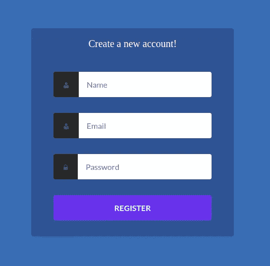
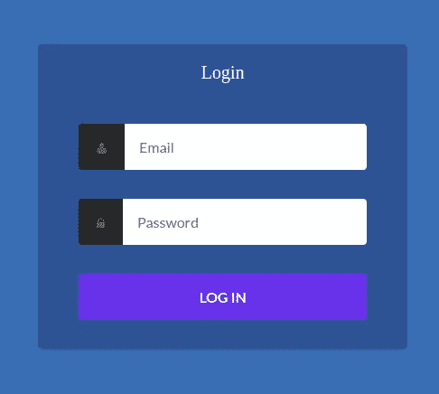

# Angular 7|6 教程:构建和提交表单

> 原文：<https://itnext.io/angular-7-6-tutorial-building-and-submitting-a-form-b17461c5568b?source=collection_archive---------1----------------------->

在本教程中，我们将学习在 Angular 7 中使用模板驱动的方法来处理表单。我们将学习`NgForm`、`ngModel`和`ngSubmit`指令，它们是基于模板的表单中的基本概念，以及如何用 Node 和 Express.js 创建一个认证系统

> ***注*** *:本教程配合 Angular 6 使用。*

表单和身份验证是每个 Angular 应用程序或任何 web 应用程序的常见功能。表单用于收集信息并提交给 web 服务器，这些信息通常保存在数据库中，而身份验证用于在允许用户访问服务器上受保护的资源之前验证用户的身份。

在本教程中，您将创建一个带有两个表单的 Angular 7 应用程序，这两个表单将用户信息发送到 RESTful 服务器并保存在数据库中(注册)，然后允许用户验证自己的身份。您将创建一个登录和注册组件，用两个表单来注册和登录用户。

由于 Angular 只用于前端，我们还需要一个后端服务器。我们将使用 Node 和 Express.js 快速创建一个服务器，它公开了两个端点，用于注册和验证用户。

# 先决条件

对于本教程，您需要满足一些要求:

*   Node.js 和 NPM。去他们的官方网站[下载你系统的二进制文件。](https://www.nodejs.org/)
*   安装最新版本的 Angular CLI V7(`npm install -g @angular/cli`)。

# 创建和设置节点和 Express.js 身份验证服务器

让我们开始我们的第一步。打开终端，为前端和后端应用程序创建一个文件夹:

```
$ mkdir angular-auth-forms-demo
```

接下来，在其中导航并创建一个后端文件夹:

```
$ cd angular-auth-forms-demo 
$ mkdir backend 
$ cd backend
```

接下来，通过运行以下命令创建 Node.js 模块:

```
$ npm init -y
```

这将创建一个带有默认值的`package.json`文件，如果你愿意，你可以在以后修改它。现在，运行以下命令来安装依赖项:

```
$ npm install --save express body-parser sqlite3 bcryptjs jsonwebtoken cors
```

这将安装 express.js 和一系列其他模块，例如用于 SQLite 数据库的`sqlite3`和用于 JSON web 令牌或 jwt 的`jsonwebtoken`。

> ***注意*** *:在撰写本文时，将安装以下页面和版本:cors v2.8.5、body-parser v1.18.3、sqlite3 v4.0.6、bcryptjs v2.4.3 express v4.16.4 和 jsonwebtoken v8.4.0*

接下来，创建一个`index.js`文件并添加:

```
"use strict";
const  express  =  require('express');
const  bodyParser  =  require('body-parser');
const cors = require('cors')

const  sqlite3  =  require('sqlite3').verbose();
const  jwt  =  require('jsonwebtoken');
const  bcrypt  =  require('bcryptjs');

const SECRET_KEY = "secretkey23456";

const  app  =  express();
const  router  =  express.Router();
app.use(cors())
router.use(bodyParser.urlencoded({ extended:  false }));
router.use(bodyParser.json());
const database = new sqlite3.Database("./my.db");

const  createUsersTable  = () => {
    const  sqlQuery  =  `
        CREATE TABLE IF NOT EXISTS users (
        id integer PRIMARY KEY,
        name text,
        email text UNIQUE,
        password text)`;

    return  database.run(sqlQuery);
}

const  findUserByEmail  = (email, cb) => {
    return  database.get(`SELECT * FROM users WHERE email = ?`,[email], (err, row) => {
            cb(err, row)
    });
}

const  createUser  = (user, cb) => {
    return  database.run('INSERT INTO users (name, email, password) VALUES (?,?,?)',user, (err) => {
        cb(err)
    });
}

createUsersTable();

router.get('/', (req, res) => {
    res.status(200).send('This is an authentication server');
});

router.post('/register', (req, res) => {

    const  name  =  req.body.name;
    const  email  =  req.body.email;
    console.log(req.body);
    const  password  =  bcrypt.hashSync(req.body.password);

    createUser([name, email, password], (err)=>{
        if(err) return  res.status(500).send("Server error!");
        findUserByEmail(email, (err, user)=>{
            if (err) return  res.status(500).send('Server error!');  
            const  expiresIn  =  24  *  60  *  60;
            const  accessToken  =  jwt.sign({ id:  user.id }, SECRET_KEY, {
                expiresIn:  expiresIn
            });
            res.status(200).send({ "user":  user, "access_token":  accessToken, "expires_in":  expiresIn          
            });
        });
    });
});

router.post('/login', (req, res) => {
    const  email  =  req.body.email;
    const  password  =  req.body.password;
    findUserByEmail(email, (err, user)=>{
        if (err) return  res.status(500).send('Server error!');
        if (!user) return  res.status(404).send('User not found!');
        const  result  =  bcrypt.compareSync(password, user.password);
        if(!result) return  res.status(401).send('Password not valid!');

        const  expiresIn  =  24  *  60  *  60;
        const  accessToken  =  jwt.sign({ id:  user.id }, SECRET_KEY, {
            expiresIn:  expiresIn
        });
        res.status(200).send({ "user":  user, "access_token":  accessToken, "expires_in":  expiresIn});
    });
});

app.use(router);
const  port  =  process.env.PORT  ||  3000;
const  server  =  app.listen(port, () => {
    console.log('Server listening at [http://localhost](http://localhost/):'  +  port);
});
```

我们不打算在这里解释这段代码，因为它在之前的教程中已经详细介绍过了。如果想了解上面的代码是如何工作的，可以先阅读 [Node Express JWT 认证— jsonwebtoken 和 bcryptjs](https://www.techiediaries.com/node-express-jwt-authentication/) 。

接下来，在`package.json`中添加一个`start`脚本:

```
"scripts": { "start": "node index.js" },
```

该脚本将允许您使用以下命令从终端运行 Express.js 服务器:

```
$ npm start
```

你的服务器将由`http://localhost:3000`提供服务。因为我们的服务器公开了一个 GET route，你可以用你的 web 浏览器访问它。您应该会看到一个空白页，显示**这是一个认证服务器**消息。这意味着您的认证服务器正在工作！

在我们创建 Angular 7 UI 之前，您还可以使用 Postman 或 cURL 之类的 REST API 客户端向在 SQLite 数据库中创建的`/register`和`/login`端点发送 POST 请求，并对用户进行身份验证。

例如，这是使用 cURL 发送 POST 请求的方式:

```
curl -H "Content-Type: application/json" -d '{"email":"user@email.com","name":"user", "password":"password"}' [http://localhost:3000/register](http://localhost:3000/register)
```

然后，您可以发送另一个 POST 请求来验证您刚刚创建的用户:

```
curl -H "Content-Type: application/json" -d '{"email":"user@email.com", "password":"password"}' [http://localhost:3000/login](http://localhost:3000/login)
```

如果 POST 请求成功，您应该得到一个 JSON 对象，其中包含您的用户信息、访问令牌和到期日期，否则您将得到一个带有状态代码的错误。

服务器部分到此为止！您应该让这个终端打开，让您的服务器运行，让我们开始创建 Angular 7 应用程序。

# 创建 Angular 7 应用程序

打开一个新的终端，导航到您的项目文件夹，然后运行以下命令，使用 Angular CLI 7 生成前端项目:

```
$ ng new frontend
```

如果**您想要添加角度路由，系统会提示您？**输入 **y** 。您希望使用哪种样式表格式？选择 **CSS** 。

您可以使用以下命令启动开发服务器:

```
$ ng serve
```

您可以在首选的网络浏览器中通过`http://localhost:4200`访问您的应用程序。

# 创建角度为 7°的模块

我们将把本教程的代码添加到它自己的封装认证的 Angular 模块中。回到您的终端，运行以下命令:

```
$ ng generate module auth --routing
```

这将创建一个带路由的模块`auth`(多亏了`--routing`开关)。将创建两个`src/app/auth/auth-routing.module.ts`(`auth`模块的路由模块)和`src/app/auth/auth.module.ts`文件。

# 生成角度 7 分量

接下来，我们将在`auth`模块中为登录和注册生成两个组件。在您的终端中，运行以下命令:

```
$ ng generate component auth/register 
$ ng generate component auth/login
```

您可以看到，我们在组件名称前添加了路径`auth/`，这告诉 CLI 在`auth`模块中生成它们。

组件将自动导入并在`auth`模块中声明。这是`src/app/auth/auth.module.ts`文件的内容:

```
import { NgModule } from '@angular/core';
import { CommonModule } from '@angular/common';

import { AuthRoutingModule } from './auth-routing.module';
import { RegisterComponent } from './register/register.component';
import { LoginComponent } from './login/login.component';

@NgModule({
  declarations: [RegisterComponent, LoginComponent],
  imports: [
    CommonModule,
    AuthRoutingModule
  ]
})
export class AuthModule { }
```

# 添加角度布线

下一步是在应用程序的不同组件之间添加路由。打开`src/app/auth/auth-routing.module.ts`文件，更新如下:

```
import { NgModule } from '@angular/core';
import { Routes, RouterModule } from '@angular/router';

import { RegisterComponent } from './register/register.component';
import { LoginComponent } from './login/login.component';

const routes: Routes = [
  {path: 'register', component: RegisterComponent},
  {path: 'login', component: LoginComponent},

];

@NgModule({
  imports: [RouterModule.forChild(routes)],
  exports: [RouterModule]
})
export class AuthRoutingModule { }
```

我们首先从相应的路径中导入`RegisterComponent`和`LoginComponent`组件，并在`routes`数组中添加两条路由，该数组通过`forChild()`方法传递给 Router。

由于这是一个子模块，我们还需要在应用程序的根路由模块中添加一个路由，因此打开`src/app/app-routing.module.ts`文件，将下面的路由添加到传递给`forRoot()`方法的`routes`数组中:

```
const  routes:  Routes  = [
    {path:  'auth', loadChildren:  './auth/auth.module#AuthModule'}
];
```

我们使用 route 的`loadChildren`属性，该属性采用`auth`模块的路径。

因为我们使用了`auth`路径，所以`auth`模块的所有组件将在`/auth`路径下可用，即`/auth/register`和`/auth/login`路径。

# 设计用户界面

为了设计用户界面，我们将从这个[代码笔](https://codepen.io/tezjnr/pen/wWvVVB)中获得灵感。

现在我们已经添加了路由，让我们构建应用程序的 UI。让我们从路由器出口所在的主要应用程序组件开始，即应用程序的外壳。打开`src/app/app.component.html`，移除除路由器出口之外的所有东西:

```
<router-outlet></router-outlet>
```

打开`src/styles.css`文件，添加:

```
@import url('[https://netdna.bootstrapcdn.com/font-awesome/4.4.0/css/font-awesome.css](https://netdna.bootstrapcdn.com/font-awesome/4.4.0/css/font-awesome.css)');
@import url([https://fonts.googleapis.com/css?family=Lato:400,300,700](https://fonts.googleapis.com/css?family=Lato:400,300,700));

html {
   height: 100%;
}

body {
    display: flex;
    justify-content: center;
    align-items: center;
    min-height: 100%;
    font-family: 'lato', sans-serif;
    color: #fff;
    background: rgb(10, 113, 182); 
}
```

# 设置角度形式

Angular 提供了两种处理表单的方式，基于模板的表单和反应式表单。在这个例子中，我们将使用基于模板的表单，包括`FormsModule`并使用类似`ngModel`的指令进行数据绑定。

打开`src/app/auth/auth.module.ts`文件，导入`FormsModule`，然后添加到模块的`imports`数组中；

```
import { NgModule } from '@angular/core';
import { CommonModule } from '@angular/common';
import { FormsModule } from '@angular/forms';

import { AuthRoutingModule } from './auth-routing.module';
import { RegisterComponent } from './register/register.component';
import { LoginComponent } from './login/login.component';

@NgModule({
  declarations: [RegisterComponent, LoginComponent],
  imports: [
    CommonModule,
    FormsModule,
    AuthRoutingModule
  ]
})
export class AuthModule { }
```

# 创建注册表单:使用带有`ngModel`、`ngForm`和`ngSubmit`指令的基于模板的表单

在本节中，我们将使用诸如`ngModel`、`ngForm`和`ngSubmit`之类的角度指令来创建一个基于模板的表单，用于注册用户。

打开`src/app/auth/register/register.component.html`文件，添加一个 HTML 表单，用于提交用户的姓名、电子邮件和密码:

```
<div class="container">
    <div class="logo">Create a new account!</div>
    <div class="register-item">
      <form #myform="ngForm" (ngSubmit)="register(myform)" class="form form-register">

        <div class="form-field">
              <label class="user" for="register-username"><span class="hidden">Name</span></label>
              <input name="name" id="register-username" type="email" class="form-input" placeholder="Name" ngModel required>
        </div>
        <div class="form-field">
          <label class="user" for="register-email"><span class="hidden">Email</span></label>
          <input name="email" id="register-email" type="email" class="form-input" placeholder="Email" ngModel required>
        </div>

        <div class="form-field">
          <label class="lock" for="register-password"><span class="hidden">Password</span></label>
          <input name="password" id="register-password" type="password" class="form-input" placeholder="Password" ngModel required>
        </div>

        <div class="form-field">
          <input type="submit" value="Register">
        </div>
      </form>
    </div>
</div>
```

*   对于每个`input`控件，我们单独使用`ngModel`指令将控件注册为表单的子控件。
*   对于每个输入，我们向`input`控件添加一个`name`属性。当使用基于模板的表单和`ngModel`指令时，这是必需的。
*   我们使用`#myform="ngForm"`语法为表单声明一个模板变量。变量`myform`成为包含表单所有控件的`NgForm`实例的引用。

Angular docs 是这样描述 [NgModel](https://angular.io/api/forms/NgModel) 的:

> *它从一个域模型中创建一个* `*[FormControl](https://angular.io/api/forms/FormControl)*` *实例，并将其绑定到一个表单控件元素。* `*FormControl*` *实例跟踪控件的值、用户交互和验证状态，并保持视图与模型同步。如果在父窗体中使用，该指令还会将自身注册到窗体中作为子控件。这个指令可以单独使用，也可以作为一个更大的表单的一部分。使用* `*[ngModel](https://angular.io/api/forms/NgModel)*` *选择器将其激活。*

对于[n 表格](https://angular.io/api/forms/NgForm)指令:

> *它创建一个顶级* `*[FormGroup](https://angular.io/api/forms/FormGroup)*` *实例，并将其绑定到一个表单，以跟踪聚合表单值和验证状态。*
> 
> *一旦导入* `*[FormsModule](https://angular.io/api/forms/FormsModule)*` *，该指令在所有* `*<form>*` *标签上默认变为活动状态。不需要添加特殊的选择器。*
> 
> *您可以选择使用* `*[ngForm](https://angular.io/api/forms/NgForm)*` *作为关键字(例如:* `*#myForm="[ngForm](https://angular.io/api/forms/NgForm)"*` *)将指令导出到一个本地模板变量中。*

接下来，您需要定义传递给表单的`ngSubmit`事件的`register(myform)`方法。打开`src/app/auth/register/register.component.ts`文件并添加:

```
register(form) { console.log(form.value); }
```

我们监听表单`ngSubmit`事件，所以当用户提交表单时，我们执行`register(form)`方法，该方法引用提交的`NgForm`实例。

我们使用`NgForm`的`value`属性来读取表单的值。

现在，如果您填写表单并单击 register 按钮，您应该看到表单的值作为 JSON 对象打印在浏览器控制台上。

查看我们如何在本教程中使用`HttpClient` POST 请求向 Express.js 认证服务器提交表单内容:[使用 Angular HttpClient 和节点& Express.js -示例 POST 请求](https://www.techiediaries.com/angular-tutorial-httpclient-post/)。

打开`src/app/auth/register/register.component.css`文件，添加以下样式:

这是我们注册页面的截图:



# 创建登录表单:使用带有`ngModel`、`ngForm`和`ngSubmit`指令的基于模板的表单

与我们创建注册表单的方式相同，我们使用`ngModel`、`ngForm`和`ngSubmit`指令来创建登录表单。

首先，打开`src/app/auth/login/login.component.html`文件，添加一个 HTML 表单，用于提交用户的电子邮件和密码:

```
<div class="container">
    <div class="logo">Create a new account!</div>
    <div class="register-item">
      <form #myform="ngForm" (ngSubmit)="register(myform)" class="form form-register">

        <div class="form-field">
              <label class="user" for="register-username"><span class="hidden">Name</span></label>
              <input name="name" id="register-username" type="email" class="form-input" placeholder="Name" ngModel required>
        </div>
        <div class="form-field">
          <label class="user" for="register-email"><span class="hidden">Email</span></label>
          <input name="email" id="register-email" type="email" class="form-input" placeholder="Email" ngModel required>
        </div>

        <div class="form-field">
          <label class="lock" for="register-password"><span class="hidden">Password</span></label>
          <input name="password" id="register-password" type="password" class="form-input" placeholder="Password" ngModel required>
        </div>

        <div class="form-field">
          <input type="submit" value="Register">
        </div>
      </form>
    </div>
</div>
```

让我们解释一下我们做了什么:

*   当我们导入`FormsModule`时，会自动为我们的表单创建一个`NgForm`实例。我们使用`#myform="ngForm"`创建一个对实例的`myform`引用，我们可以用它来处理表单。例如，在表单提交后获取表单的值。
*   我们向`<input>`标签添加一个`ngModel`指令，将它们添加到与我们的登录表单相对应的`NgForm`实例中。标签应该有一个`name`属性才能正常工作。
*   我们使用`ngSubmit`事件将`login(myform)`方法绑定到表单的提交事件。`login()`方法引用表单的`NgForm`实例。

接下来，打开`src/app/auth/login/login.component.ts`文件并添加`login()`方法:

```
login(form){ console.log(form.value); }
```

在这个方法中，我们简单地使用传递的`NgForm`的 value 属性在控制台中打印我们的登录表单的值。

查看本教程，了解如何将带有`HttpClient`的 POST 请求发送到使用 Node 和 Express.js 创建的认证服务器:使用带有 Node & Express.js 的 Angular http client——POST 请求示例。

接下来，我们来添加一些 CSS 样式。打开`src/app/login/login.component.css`文件并添加:

这是登录页面的屏幕截图:



如果您填写登录表单并单击 login 按钮，您应该会看到控制台上显示的表单值。

# 结论

在本教程中，我们创建了两个 login 和 register 表单，用于向 Node 和 Express.js 认证服务器发送认证细节。

我们已经看到了如何在 Angular 7 中使用模板驱动的方法来处理表单。我们已经看到，当您在项目中导入`FormsModule`时，如何获得对 Angular 自动创建的表单的`NgForm`实例的引用。以及如何使用`ngModel`向 HTML 表单的`NgForm`实例注册单个表单标签，最后我们如何使用`ngSubmit`事件提交表单，以及如何访问绑定方法中的表单值。

*原载于*[*www.techiediaries.com*](https://www.techiediaries.com/angular-tutorial-forms-authentication-expressjs/)*。*