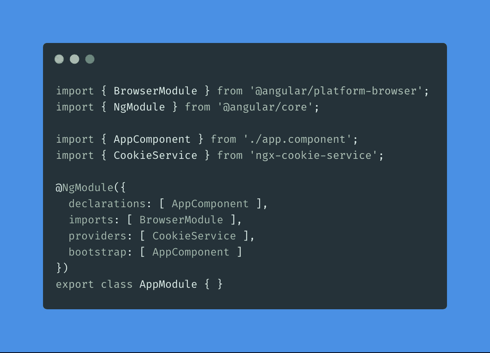
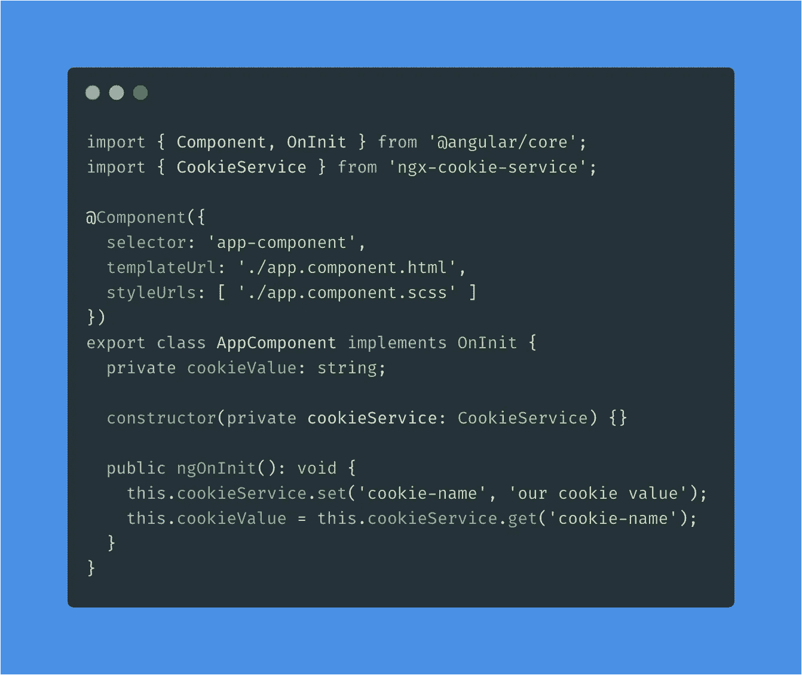
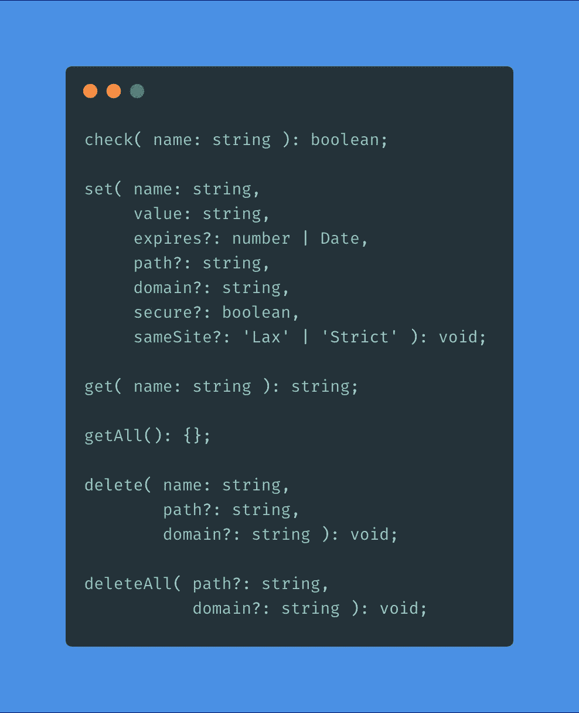

# Angular 9—如何使用 cookies

> 原文：<https://itnext.io/angular-8-how-to-use-cookies-14ab3f2e93fc?source=collection_archive---------0----------------------->


照片由[émile Perron](https://unsplash.com/@emilep?utm_source=medium&utm_medium=referral)在 [Unsplash](https://unsplash.com?utm_source=medium&utm_medium=referral) 上拍摄

Cookies 是一些小的信息包，可以被你的浏览器和使用 cookies 的网站临时存储/保存。每个 cookie 通常不超过几千字节。Cookies 在多个请求和浏览器会话中使用，可以存储您的帐户信息，例如用于身份验证。

# 安装依赖项

对于 Angular，我们已经创建了一个名为'[**ngx-cookie-service**](https://www.npmjs.com/package/ngx-cookie-service)'的 NPM 包，可以用来处理 cookie。让将软件包作为依赖项安装在您的 repo 中；

```
npm install ngx-cookie-service
```

[](/must-have-tool-for-every-developer-71508e73e9aa) [## 每个开发人员的必备工具

### 通过生成文档节省大量时间

itnext.io](/must-have-tool-for-every-developer-71508e73e9aa) 

# 入门指南

安装完依赖项后，我们可以通过在我们的一个模块中导入`CookieService`来使用它。在这个例子中，我们使用了`AppModule`。请将他们添加为提供商；



代码显示由[碳](https://carbon.now.sh)

# 如何使用

在下面的示例代码中，我们将使用我们的`AppComponent`，并使用`CookieService`的`set`和`get`方法。我们在构造函数的参数中注入这个服务。在`ngOnInit`方法中，我们设置了一个新的 cookie 并获得了相同的 cookie。

在第一行中，我们用一些随机值设置了一个名为`cookie-name`的新 cookie。在第二行，您可以看到如何获取 cookie 值；



除了`get`和`set`方法之外，这个包中还有更多可用的方法，如`check`、`getAll`、`delete`和`deleteAll`，如下例所示。`set`方法比我在上面的例子中显示的有更多的可选参数可以填充。建议设置`expires`参数。否则，他们可以永远存在。



# 仅此而已！

感谢您的阅读！我的 [Github](https://github.com/jeroenouw/) 或者 [Twitter](https://twitter.com/jeroenouw) 。我希望你今天学到了一些新东西。如果你觉得这篇文章有用，请点击 50 次👏按钮并关注我了解更多内容。

[](https://jeroenouw.medium.com/concentration-for-software-engineers-8ecafa72be3a) [## 软件工程师专注力

### 如何在更短的时间内更有效

jeroenouw.medium.com](https://jeroenouw.medium.com/concentration-for-software-engineers-8ecafa72be3a) [](https://levelup.gitconnected.com/what-every-developer-should-be-doing-923d6ca67ea) [## 每个成功的开发人员应该做的事情

### 作为开发人员，这四点对我帮助最大

levelup.gitconnected.com](https://levelup.gitconnected.com/what-every-developer-should-be-doing-923d6ca67ea)