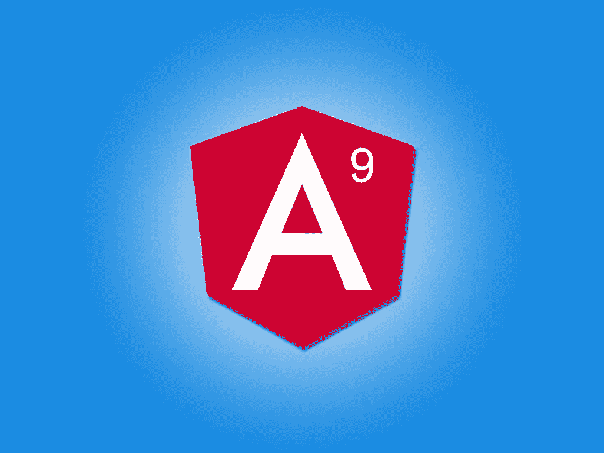
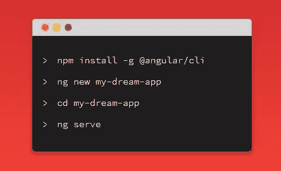
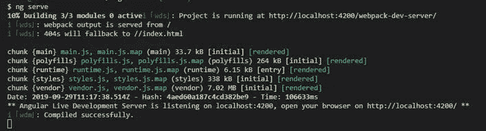
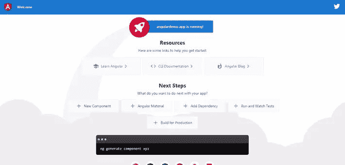

# Angular 9/8 教程:用 HttpClient 和 RxJS 构建 Web App

> 原文：<https://itnext.io/angular-9-8-tutorial-build-a-web-app-with-httpclient-and-rxjs-d76a262297b?source=collection_archive---------0----------------------->



在这篇 Angular 9 教程中，我们将学习构建一个 Angular 9 示例应用程序，经历从创建/模拟 REST API、搭建一个新项目、设置基本 API，到最终构建最终应用程序并将其部署到云的所有必要步骤。

*   我们将通过示例了解如何发送带有 URL 查询字符串和参数的 GET 请求，以及如何在 Angular 9/8 应用程序中使用`Httplient`获取和使用 JSON 数据来处理来自 REST API 服务器的 HTTP 响应，如何使用 RxJS `throwError()`和`catchError()`操作符对 HTTP 错误进行错误处理，如何在较差的网络连接中重试失败的 HTTP 请求，以及如何使用 RxJS `retry()`和`takeUntil()`操作符取消未决的请求，最后如何使用最新的 Angular 8.3+特性将应用程序部署到 Firebase 主机。
*   我们还将了解如何使用 Angular services 和 RxJS Observables，以及如何在我们的项目中设置 Angular Material，并使用材质设计组件设计 UI。
*   我们将了解如何使用 Angular 8.3+中的新特性`ng deploy`来轻松地从命令行将您的 Angular 9 应用程序部署到 Firebase 主机。

Angular 9 目前是 RC 版本，带有各种[新功能](https://www.techiediaries.com/angular-features)和改进，特别是新的 Ivy 渲染器。

本教程现已更新至最新的 Angular 9 版本。

> **注意**:请注意我们使用的是 HttpClient，它是 HTTP 客户端 API 的改进版本，从 Angular 版本 [4.3.0-rc.0](https://github.com/angular/angular/blob/master/CHANGELOG.md#430-rc0-2017-07-08) 开始提供。旧的 HTTP 客户端在 Angular 9 中不可用。

在本教程中，您还可以了解如何将 HttpClient 与 Angular 9 结合使用，以构建一个从第三方 REST API [获取 JSON 数据的新闻应用程序。](https://www.techiediaries.com/angular-tutorial-example-rest-api-httpclient-get-ngfor)

在这个循序渐进的 Angular 9 教程中，我们将会看到一个实际的例子，展示如何使用从`@angular/common/http`包中获得的 HttpClient，使用`get()`方法发出 HTTP GET 请求。

我们将介绍:mid_content 143

*   如何创建一个假的完整的工作 JSON REST API，
*   如何安装 Angular CLI v9，
*   如何使用 Angular CLI 创建 Angular 9 项目，
*   如何设置有角度的材料，并使用材料设计来设计您的应用程序，
*   如何创建角度组件，它们之间的路由和导航，
*   如何创建和注入角度服务，
*   如何使用 HttpClient 向服务器发送 HTTP GET 请求，
*   如何使用 HttpParams 类在您的 HttpRequest 中添加 URL 查询字符串，
*   如何订阅和退订 HttpClient 返回的 RxJS Observables，
*   如何使用`throwError()`和`catchError()`操作符处理 HTTP 错误，
*   如何使用 RxJS `retry()`操作符重试失败的 HTTP 请求，
*   当请求被取消时，如何使用`takeUntil()`操作符取消订阅从 HttpClient 方法返回的 RxJS 观察值，
*   如何使用 Angular 8.3+提供的新的`ng deploy`命令为生产构建应用程序并将其部署到 Firebase 主机

本 Angular 9 教程的步骤如下:

*   步骤 1 —设置 Angular CLI v9
*   步骤 2 —初始化一个新的 Angular 9 示例项目
*   步骤 3——设置一个(假的)JSON REST API
*   步骤 4——在我们的示例项目中设置 Angular HttpClient v9
*   步骤 5-创建角度 9 组件
*   步骤 6-添加角度 9 布线
*   步骤 7——用角度材质 v9 设计用户界面
*   步骤 8——用 Angular HttpClient v9 使用 JSON REST API
*   步骤 9 —使用 RxJS `catchError()` & `HttpClient`添加 HTTP 错误处理
*   步骤 10 —使用 RxJS `retry()` & `HttpClient`重试失败的 HTTP 请求
*   步骤 11 —用 RxJS `takeUntil()`取消订阅 HttpClient Observables
*   步骤 12 —向 HttpClient get()方法添加 URL 查询参数
*   步骤 13 —用 Angular HttpClient v9 获得完整的 HTTP 响应
*   步骤 14 —用 Angular HttpClient v9 请求类型化的 HTTP 响应
*   步骤 15——构建 Angular 9 应用程序并将其部署到 Firebase 主机

让我们从介绍 Angular HttpClient、它的特性以及为什么使用它开始。

# 什么是 Angular HttpClient？

使用像 Angular 这样的框架构建的前端应用程序通过 REST APIs(基于 HTTP 协议)使用`XMLHttpRequest`接口或`fetch()` API 与后端服务器通信。

Angular HttpClient 使用了支持现代和传统浏览器的`XMLHttpRequest`接口。

HttpClient 可以从`@angular/common/http`包中获得，它有一个简化的 API 接口和强大的特性，比如易测试性、类型化的请求和响应对象、请求和响应拦截器、具有 RxJS 可观察性的反应式 API 和简化的错误处理。

# 为什么是 Angular HttpClient？

内置服务为 Angular 开发者提供了许多优势:

*   HttpClient 使得发送和处理 HTTP 请求和响应变得很容易，
*   HttpClient 有许多用于实现测试单元的内置特性，
*   HttpClient 使用 RxJS Observables 来处理异步操作，而不是承诺，这简化了常见的 web 开发任务，例如
*   HTTP 请求的概念，
*   -监听下载和上传操作的进度，
*   -简单的错误处理，
*   -重试失败的 HTTP 请求等。

现在，在介绍完 HttpClient 之后，让我们继续构建我们的示例应用程序，从成功完成 Angular 9 教程所需的先决条件开始。

# 先决条件

在开始之前，您需要一些先决条件:

*   打字稿的基础知识。特别是熟悉面向对象的概念，如类型脚本类和装饰器。
*   安装了**节点 10+** 和 **NPM 6+** 的本地开发机。Angular CLI 像当今大多数前端工具一样需要节点。你可以直接进入[官网](https://nodejs.org/downloads)的下载页面，为你的操作系统下载二进制文件。您还可以参考特定的系统说明，了解如何使用软件包管理器安装节点。不过推荐的方法是使用[NVM](https://github.com/nvm-sh/nvm)——节点版本管理器——一个 POSIX 兼容的 bash 脚本来管理多个活动的 Node.js 版本。

> **注意**:如果你不想为 Angular 开发安装一个本地环境，但是仍然想尝试本教程中的代码，你可以使用 [Stackblitz](https://stackblitz.com/) ，一个用于前端开发的在线 IDE，你可以用它来创建一个与 Angular CLI 兼容的 Angular 项目。

如果您已经具备了前面的先决条件，那么您已经为我们的 Angular 9 教程的下一步做好了准备，该教程将通过示例教您如何使用 Angular HttpClient 发送 HTTP GET 请求来获取 JSON 数据，以及各种 RxJS 操作符，如`catchError()`、`tap()`、`retry()`和`takeUntil()`，以实现高级功能，如错误处理、重试失败的 HTTP 请求和取消挂起的请求。

在我们教程的第一步，我们将看到如何安装 Angular CLI 9 并从头开始创建一个示例项目。

# 步骤 1 —设置 Angular CLI v9

在这一步中，我们将安装最新的 Angular CLI 9 版本(在撰写本教程时)。

> **注**:这些指令对角度 8 也有效。



[Angular CLI](https://cli.angular.io/) 是用于初始化和使用 Angular 项目的官方工具。要安装它，请打开一个新的命令行界面并运行以下命令:

```
$ npm install -g @angular/cli@next
```

在撰写本教程时， **angular/cli v9.0.0-rc.2** 将安装在您的系统上。

请注意，在 Angular 9 正式发布之前，你需要使用`@next`标签来安装最新的预发布版本。

如果您运行`ng version`命令，您应该得到类似的输出:

```
Angular CLI: 9.0.0-rc.2
Node: 10.16.3
OS: win32 ia32
Angular:
...Package                      Version
------------------------------------------------------
@angular-devkit/architect    0.900.0-rc.2
@angular-devkit/core         9.0.0-rc.2
@angular-devkit/schematics   9.0.0-rc.2
@schematics/angular          9.0.0-rc.2
@schematics/update           0.900.0-rc.2
rxjs                         6.5.3
```

下一步，我们将学习如何从命令行初始化一个新的示例项目。

# 步骤 2 —初始化一个新的 Angular 9 示例项目

在这一步中，我们将继续创建我们的示例项目。回到您的命令行界面，运行以下命令:

```
$ cd ~
$ ng new angular-httpclient-example
```

CLI 将询问您几个问题—如果**您想要添加角度路由？**键入 **y** 表示是，键入**表示您希望使用哪种样式表格式？**选择 **CSS** 。

这将指示 CLI 在我们的项目中自动设置路由，因此我们只需要为我们的组件添加路由，以便在我们的应用程序中实现导航。

如果您在项目的文件夹中运行`ng version`命令，您应该会得到类似的输出:

```
Angular CLI: 9.0.0-rc.2
Node: 10.16.3
OS: win32 ia32
Angular: <error>
... animations, cli, common, compiler, compiler-cli, core, forms
... language-service, platform-browser, platform-browser-dynamic
... routerPackage                         Version
---------------------------------------------------------
@angular-devkit/architect       0.900.0-rc.2 (cli-only)
@angular-devkit/build-angular   <error>
@angular-devkit/core            9.0.0-rc.2 (cli-only)
@angular-devkit/schematics      9.0.0-rc.2 (cli-only)
@schematics/angular             9.0.0-rc.2 (cli-only)
@schematics/update              0.900.0-rc.2 (cli-only)
rxjs                            6.5.3 (cli-only)
typescript                      3.6
```

接下来，导航到您的项目文件夹，并使用以下命令运行本地开发服务器:

```
$ cd angular-httpclient-example
$ ng serve
```

本地开发服务器将开始监听`[http://localhost:4200/](http://localhost:4200/)`地址。



打开您的网络浏览器，导航至`[http://localhost:4200/](http://localhost:4200/)`地址，查看您的应用启动并运行。这是此时的截图:



现在，您应该让开发服务器保持运行，并启动一个新的命令行界面来运行后续步骤的 CLI 命令。

下一步，我们将学习如何创建一个假的 JSON REST API，我们将在我们的 Angular 示例应用程序中使用它。

# 步骤 3——设置一个(假的)JSON REST API

在继续开发我们的 Angular 应用程序之前，我们需要准备一个 JSON REST API，我们可以使用`HttpClient`来使用它。

我们还可以从第三方 REST API 服务器上消费或获取 JSON 数据，但是在本例中，我们选择创建一个假的 REST API。查看这个[教程](https://www.techiediaries.com/angular-tutorial-example-rest-api-httpclient-get-ngfor)中真实的 REST API 示例。就 Angular 而言，消费假的或者真的 REST APIs 没有区别。

如前所述，您可以使用外部 API 服务，创建一个真正的 REST API 服务器，或者使用`json-server`创建一个假的 API。在这个例子中，我们将使用最后一种方法。

因此，转向一个新的命令行界面，从在您的项目中安装来自 npm 的`json-server`开始:

```
$ cd ~/angular-httpclient-example
$ npm install --save json-server
```

接下来，在 Angular 项目的根文件夹中创建一个`server`文件夹:

```
$ mkdir server
$ cd server
```

在`server`文件夹中，创建一个`database.json`文件，并添加以下 JSON 对象:

```
{
    "products": []
}
```

这个 JSON 文件将作为 REST API 服务器的数据库。您可以简单地添加一些由 REST API 提供服务的数据，或者使用 [Faker.js](https://github.com/marak/Faker.js/) 自动生成大量真实的假数据。

回到命令行，从`server`文件夹返回，使用以下命令从 npm 安装`Faker.js`:

```
$ cd ..
$ npm install faker --save
```

在创建该示例时，将安装 **faker v4.1.0** 。

现在，创建一个`generate.js`文件并添加以下代码:

```
var faker = require('faker');var database = { products: []};for (var i = 1; i<= 300; i++) {
  database.products.push({
    id: i,
    name: faker.commerce.productName(),
    description: faker.lorem.sentences(),
    price: faker.commerce.price(),
    imageUrl: "[https://source.unsplash.com/1600x900/?product](https://source.unsplash.com/1600x900/?product)",
    quantity: faker.random.number()
  });
}console.log(JSON.stringify(database));
```

我们首先导入 faker，接下来我们用一个空数组为产品定义一个对象。接下来，我们进入循环的*来创建 *300* 假条目，使用类似`faker.commerce.productName()`的 faker 方法来生成产品名称。[检查所有可用的方法](https://github.com/marak/Faker.js/#api-methods)。最后，我们将数据库对象转换为字符串，并将其记录到标准输出中。*

接下来，将`generate`和`server`脚本添加到`package.json`文件中:

```
"scripts": {
    "ng": "ng",
    "start": "ng serve",
    "build": "ng build",
    "test": "ng test",
    "lint": "ng lint",
    "e2e": "ng e2e",
    "generate": "node ./server/generate.js > ./server/database.json",
    "server": "json-server --watch ./server/database.json"
  },
```

接下来，回到您的命令行界面，使用以下命令运行生成脚本:

```
$ npm run generate
```

最后，通过执行以下命令运行 REST API 服务器:

```
$ npm run server
```

现在，您可以像任何典型的 REST API 服务器一样向服务器发送 HTTP 请求。您的服务器将可以从`[http://localhost:3000/](http://localhost:3000/)`地址访问。

这些是我们将能够通过 JSON REST API 服务器使用的 API 端点:

*   `GET /products`为了得到产品，
*   `GET /products/<id>`通过 id 获取单个产品，
*   `POST /products`为了创造一种新产品，
*   `PUT /products/<id>`按 id 更新产品，
*   `PATCH /products/<id>`通过 id 部分更新产品，
*   `DELETE /products/<id>`用于按 id 删除产品。

您可以使用`_page`和`_limit`参数来获取分页数据。在`Link`标题中，您将获得`first`、`prev`、`next`和`last`链接。

例如:

`GET /products?_page=1`用于获取第一页数据，`GET /products?_page=1&_limit=5`用于获取第一页数据的前五个产品。

> **注**:您可以使用其他功能，如过滤、排序和排序。更多信息，请查看[文档](https://github.com/typicode/json-server)。

让 JSON REST API 服务器保持运行，并打开一个新的命令行界面来输入接下来步骤的命令。

作为我们所做工作的总结——我们安装了 Angular CLI 并初始化了一个基于最新 Angular 9 版本的新项目。然后，我们使用`json-server`基于一个 JSON 文件创建了一个 REST API。在 Angular 9 教程的下一步，我们将学习如何在 Angular 9 项目中设置`HttpClient`。

# 步骤 4 —在我们的示例项目中设置 Angular 9 HttpClient

在这一步中，我们将继续设置我们示例中的`HttpClient`模块。

`HttpClient`存在于一个独立的 Angular 模块中，所以我们需要在使用它之前将其导入到我们的主应用模块中。

用代码编辑器或 IDE 打开示例项目。我将使用 Visual Studio 代码。

接下来，打开`src/app/app.module.ts`文件，导入`[HttpClientModule](https://angular.io/api/common/http/HttpClientModule#description)`并添加到模块的`imports`数组中，如下所示:

```
import { BrowserModule } from '@angular/platform-browser';
import { NgModule } from '@angular/core';import { AppRoutingModule } from './app-routing.module';
import { AppComponent } from './app.component';
import { HttpClientModule } from '@angular/common/http';@NgModule({
  declarations: [
    AppComponent,
  ],
  imports: [
    BrowserModule,
    AppRoutingModule,
    HttpClientModule
  ],
  providers: [],
  bootstrap: [AppComponent]
})
export class AppModule { }
```

这就是全部，我们现在准备在我们的项目中使用`HttpClient`服务，但是在此之前，我们需要创建几个组件 home 和 about 组件。这是我们下一步要学的。

# 步骤 5-创建角度 9 组件

在这一步中，我们将继续创建控制应用程序 UI 的角度组件。

回到新的命令行界面，运行以下命令:

```
$ cd ~/angular-httpclient-example
$ ng generate component home
```

以下是该命令的输出:

```
CREATE src/app/home/home.component.html (19 bytes)
CREATE src/app/home/home.component.spec.ts (614 bytes)
CREATE src/app/home/home.component.ts (261 bytes)
CREATE src/app/home/home.component.css (0 bytes)
UPDATE src/app/app.module.ts (467 bytes)
```

CLI 为组件创建了四个文件，并将其添加到`src/app/app.module.ts`文件中的`declarations`数组。

接下来，让我们使用以下命令创建 about 组件:

```
$ ng generate component about
```

接下来，打开`src/app/about/about.component.html`并添加以下代码:

```
<p style="padding: 13px;">
An Angular 9 example application that demonstrates how to use HttpClient to consume REST APIs
</p>
```

我们将在下面的步骤中更新 home 组件。

在 Angular 9 教程的下一步，我们将把这些组件添加到路由器中。

# 步骤 6-添加角度 9 布线

在这一步中，我们将继续向示例中添加路由。

返回到由 Angular CLI 为路由配置自动创建的`src/app/app-routing.module.ts`文件，导入组件，然后添加路由，如下所示:

```
import { NgModule } from '@angular/core';
import { Routes, RouterModule } from '@angular/router';
import { HomeComponent } from './home/home.component';
import { AboutComponent } from './about/about.component'; const routes: Routes = [
  { path: '', redirectTo: 'home', pathMatch: 'full'},
  { path: 'home', component: HomeComponent },
  { path: 'about', component: AboutComponent },
];@NgModule({
  imports: [RouterModule.forRoot(routes)],
  exports: [RouterModule]
})
export class AppRoutingModule { }
```

我们首先导入了 home 和 about 组件，接下来我们添加了三个路由，包括一个用于将空路径重定向到 home 组件的路由，因此当用户访问应用程序时，他们将被重定向到主页。

在示例的下一步，我们将在项目中设置 Angular 材质来设计我们的 UI。

# 步骤 7——用角度材质 v9 设计用户界面

在 Angular 9 教程的这一步，我们将继续把 Angular 材质添加到我们的项目中，并设计我们的应用程序 UI。

[Angular Material](https://material.angular.io/) 提供材质设计组件，允许开发者创建专业的 ui。现在，使用 Angular CLI v7+的新`ng add`命令，在我们的项目中设置角度材质变得更加容易。

回到命令行界面，从项目的根目录运行以下命令:

```
$ ng add @angular/material
```

你将被要求选择一个主题，选择**靛蓝/粉色**。

对于其他选项— **设置 HammerJS 进行手势识别？**和**为有角度的素材设置浏览器动画？**只需在键盘上按**回车**即可选择默认答案。

接下来，打开`src/styles.css`文件并添加一个主题:

```
@import "~@angular/material/prebuilt-themes/indigo-pink.css";
```

每个角材料组件都有一个单独的模块，您需要在使用该组件之前导入该模块。打开`src/app/app.module.ts`文件并添加以下导入:

```
import { MatToolbarModule,
  MatIconModule,
  MatCardModule,
  MatButtonModule,
  MatProgressSpinnerModule } from '@angular/material';
```

我们导入了以下模块:

*   [MatToolbar](https://material.angular.io/components/toolbar/overview) 为标题、标题或动作提供一个容器。
*   [MatCard](https://material.angular.io/components/card/overview) 为单个主题的上下文中的文本、照片和动作提供内容容器。
*   [MatButton](https://material.angular.io/components/button/overview) 提供原生`<button>`或`<a>`元素，增强了材料设计风格和油墨波纹。
*   [MatProgressSpinner](https://material.angular.io/components/progress-spinner/overview) 提供进度和活动的循环指示器。

接下来，您需要将这些模块包含在`imports`数组中:

```
@NgModule({
  declarations: [
    AppComponent,
    HomeComponent,
    AboutComponent
  ],
  imports: [
    BrowserModule,
    AppRoutingModule,
    HttpClientModule,
    BrowserAnimationsModule,
    MatToolbarModule,
    MatIconModule,
    MatButtonModule,
    MatCardModule,
    MatProgressSpinnerModule
  ],
  providers: [],
  bootstrap: [AppComponent]
})
export class AppModule { }
```

接下来，打开`src/app/app.component.html`文件并按如下方式更新它:

```
<mat-toolbar color="primary">
  <h1>
    ngStore 
  </h1>
  <button mat-button routerLink="/">Home</button>
  <button mat-button routerLink="/about">About</button></mat-toolbar><router-outlet></router-outlet>
```

我们创建了应用程序的外壳，其中包含一个顶栏，顶栏上有两个导航按钮，分别指向 home 和 about 组件。

总结一下我们到目前为止所做的工作——我们已经在项目中设置了 HttpClient 和 Angular Material v9，创建了 home 和 about 组件并配置了路由，最后添加了应用程序的外壳，其中包含一个带有导航的顶栏。

在教程的下一步，我们将学习如何使用`HttpClient` v9 从 REST API 服务器获取 JSON 数据。

# 步骤 8——使用 Angular HttpClient 9 使用 JSON REST API

在这一步中，我们将继续在示例应用程序中使用来自 REST API 服务器的 JSON 数据。

我们需要创建一个 Angular 服务来封装处理来自 REST API 服务器的数据的代码。

服务是一个单体，可以由其他服务和组件使用角度依赖注入来注入。

> 在软件工程中，依赖注入是一种由一个对象提供另一个对象的依赖的技术。[来源](https://en.wikipedia.org/wiki/Dependency_injection)

现在，让我们生成一个与 JSON REST API 接口的 Angular 服务。回到您的命令行界面，运行以下命令:

```
$ ng generate service data
```

接下来，打开`src/app/data.service.ts`文件，导入并注入`HttpClient`，如下:

```
import { Injectable } from '@angular/core';
import { HttpClient } from '@angular/common/http';@Injectable({
  providedIn: 'root'
})
export class DataService { private REST_API_SERVER = "[http://localhost:3000](http://localhost:3000/)"; constructor(private httpClient: HttpClient) { }
}
```

我们将`HttpClient`服务作为私有`httpClient`实例导入和注入。我们还定义了保存 REST API 服务器地址的`REST_API_SERVER`变量。

接下来，添加一个向 REST API 端点发送 GET 请求以检索 JSON 数据的`sendGetRequest()`方法:

```
import { Injectable } from '@angular/core';
import { HttpClient } from '@angular/common/http';@Injectable({
  providedIn: 'root'
})
export class DataService { private REST_API_SERVER = "[http://localhost:3000](http://localhost:3000/)"; constructor(private httpClient: HttpClient) { } public sendGetRequest(){
    return this.httpClient.get(this.REST_API_SERVER);
  }
}
```

该方法简单地调用`HttpClient`的`get()`方法向 REST API 服务器发送 GET 请求。

接下来，我们现在需要在我们的 home 组件中使用这个服务。打开`src/app/home/home.component.ts`文件，导入并注入数据服务，如下所示:

```
import { Component, OnInit } from '@angular/core';
import { DataService } from '../data.service';@Component({
  selector: 'app-home',
  templateUrl: './home.component.html',
  styleUrls: ['./home.component.css']
})
export class HomeComponent implements OnInit { products = []; constructor(private dataService: DataService) { } ngOnInit() { this.dataService.sendGetRequest().subscribe((data: any[])=>{
      console.log(data);
      this.products = data;
    })  
  }}
```

我们通过组件构造函数将`DataService`作为私有`dataService`实例导入并注入。

接下来，我们定义了一个`products`变量，并调用服务的`sendGetRequest()`方法从 JSON REST API 服务器获取数据。

由于`sendGetRequest()`方法返回了`HttpClient.get()`方法的返回值，这是一个 RxJS 可观察对象，我们订阅了返回的可观察对象来实际发送 HTTP GET 请求并处理 HTTP 响应。

当接收到数据时，我们将其添加到`products`数组中。

接下来，打开`src/app/home/home.component.html`文件并更新如下:

```
<div style="padding: 13px;">
    <mat-spinner *ngIf="products.length === 0"></mat-spinner> <mat-card *ngFor="let product of products" style="margin-top:10px;">
        <mat-card-header>
            <mat-card-title>{{product.name}}</mat-card-title>
            <mat-card-subtitle>{{product.price}} $/ {{product.quantity}}
            </mat-card-subtitle>
        </mat-card-header>
        <mat-card-content>
            <p>
                {{product.description}}
            </p>
            
        </mat-card-content>
        <mat-card-actions>
      <button mat-button> Buy product</button>
    </mat-card-actions>
    </mat-card>
</div>
```

当`products`数组的长度等于零时，即在没有从 REST API 服务器接收到数据之前，我们使用了`<mat-spinner>`组件来显示加载微调器。

接下来，我们对`products`数组进行迭代，并使用一个物料卡片来显示每个产品的`name`、`price`、`quantity`、`description`和`image`。

这是获取 JSON 数据后的主页截图:

接下来，我们将了解如何向我们的服务添加错误处理。

# 步骤 9 —使用 RxJS `catchError()` & `HttpClient`添加 HTTP 错误处理

在这一步中，我们将继续在示例应用程序中添加错误处理。

Angular 的 HttpClient 方法可以很容易地与 RxJS 的`catchError()`操作符一起使用，因为它们通过用于捕捉和处理错误的`pipe()`方法返回可观测量。我们只需要定义一个方法来处理服务中的错误。

前端应用程序中有两种错误:

*   客户端错误，如网络问题和 JavaScript 语法和类型错误。这些错误返回`ErrorEvent`对象。
*   服务器端错误，如服务器中的代码错误和数据库访问错误。这些错误返回 HTTP 错误响应。

因此，我们只需要检查错误是否是`ErrorEvent`的实例，以获取错误的类型，这样我们就可以适当地处理它。

现在，让我们看看这个例子。打开`src/app/data.service.ts`文件并相应地更新它:

```
import { Injectable } from '@angular/core';
import { HttpClient, HttpErrorResponse } from "@angular/common/http";import {  throwError } from 'rxjs';
import { retry, catchError } from 'rxjs/operators'; @Injectable({
  providedIn: 'root'
})
export class DataService { private REST_API_SERVER = "[http://localhost:3000/products](http://localhost:3000/products)"; constructor(private httpClient: HttpClient) { } handleError(error: HttpErrorResponse) {
    let errorMessage = 'Unknown error!';
    if (error.error instanceof ErrorEvent) {
      // Client-side errors
      errorMessage = `Error: ${error.error.message}`;
    } else {
      // Server-side errors
      errorMessage = `Error Code: ${error.status}\nMessage: ${error.message}`;
    }
    window.alert(errorMessage);
    return throwError(errorMessage);
  } public sendGetRequest(){
    return this.httpClient.get(this.REST_API_SERVER).pipe(catchError(this.handleError));
  }
}
```

正如你所看到的，这需要为你的应用程序中的每个服务完成，这对于我们的例子来说很好，因为它只包含一个服务，但是一旦你的应用程序开始增加许多服务，这些服务都可能抛出错误，你需要使用更好的解决方案，而不是对每个服务使用容易出错的`handleError`方法。一种解决方案是使用 [HttpClient 拦截器](https://angular.io/guide/http#http-interceptors)在 Angular 应用程序中全局处理错误。

这是服务器不可访问时控制台上出现错误的屏幕截图:

在下一步中，我们将看到如何通过自动重试发送失败的 HTTP 请求来改进我们的数据服务。

# 步骤 10 —使用 RxJS `retry()` & `HttpClient`重试失败的 HTTP 请求

在 Angular 9 教程的这一步中，我们将看到如何使用 RxJS 的`retry()`操作符和 HttpClient 来自动重新订阅返回的可观察对象，这将导致重新发送失败的 HTTP 请求。

在许多情况下，错误是暂时的，是由于糟糕的网络条件造成的，所以只要再试一次，错误就会自动消失。例如，在移动设备中，网络中断是频繁的，因此如果用户再次尝试，他们可能会得到成功的响应。让我们看看如何在我们的示例应用程序中自动重试，而不是让用户手动重试。

RxJS 库提供了几个重试操作符。其中一个是`retry()`操作符，它允许你自动重新订阅一个 RxJS 可观察值指定的次数。重新订阅从 HttpClient 方法返回的 Observable 具有将 HTTP 请求重新发送到服务器的效果，因此用户不需要重复操作或重新加载应用程序。

您可以使用 RxJS `retry()`操作符，方法是在错误处理程序之前将它(使用`pipe()`方法)管道化到从 HttpClient 方法返回的可观察对象上。

转到`src/app/data.service.ts`文件并导入`retry()`操作符:

```
import { retry, catchError } from 'rxjs/operators';
```

接下来更新`sendGetRequest()`方法，如下所示:

```
public sendGetRequest(){
    return this.httpClient.get(this.REST_API_SERVER).pipe(retry(3), catchError(this.handleError));
  }
```

这将重试发送失败的 HTTP 请求三次。

下一步，我们将在示例 home 组件中看到如何取消订阅 RxJS Observables。

# 第 11 步—使用 RxJS `takeUntil()`取消订阅 HttpClient Observables

在 Angular 9 教程的这一步中，我们将了解为什么我们需要以及如何使用`takeUntil()`操作符来取消订阅代码中的可观测量。

首先，您需要取消订阅由`HttpClient`方法返回的可观测量吗？

通常，您需要手动取消订阅 Angular 组件中任何订阅的 RxJS Observables，以避免内存泄漏，但是在 HttpClient 的情况下，这是由 Angular 在收到 HTTP 响应时通过取消订阅自动处理的。但是，在某些情况下，您需要手动取消订阅，例如，当用户即将离开组件时，取消待定的请求。

我们可以简单地从组件的`ngOnDestroy()`生命周期方法中的`subscribe()`方法返回的`Subscription`对象中调用`unsubscribe()`方法来取消订阅可观察对象。

使用`takeUntil()`操作符还有一个更好的方法来取消订阅或完成 Observables。

[takeUntil()](https://rxjs.dev/api/operators/takeUntil) 操作符发出由源可观察对象发出的值，直到通知者可观察对象发出一个值。

让我们看看当组件被销毁时，如何使用这个操作符来完成可观测量。

查看[如何取消/取消订阅所有待定 HTTP 请求 angular 4+](https://stackoverflow.com/questions/46068908/how-to-cancel-unsubscribe-all-pending-http-requests-angular-4) 。

打开`src/app/home/home.component.ts`文件，并按如下方式更新:

```
import { Component, OnInit, OnDestroy } from '@angular/core';
import { DataService } from '../data.service';
import {  takeUntil } from 'rxjs/operators';
import { Subject } from 'rxjs';@Component({
  selector: 'app-home',
  templateUrl: './home.component.html',
  styleUrls: ['./home.component.css']
})
export class HomeComponent implements OnInit, OnDestroy { products = [];
  destroy$: Subject<boolean> = new Subject<boolean>(); constructor(private dataService: DataService) { } ngOnInit() { this.dataService.sendGetRequest().pipe(takeUntil(this.destroy$)).subscribe((data: any[])=>{
      console.log(data);
      this.products = data;
    })  
  }
  ngOnDestroy() {
    this.destroy$.next(true);
    // Unsubscribe from the subject
    this.destroy$.unsubscribe();
  }}
```

我们首先导入了`OnDestroy`接口、`Subject`和`takeUntil()`操作符。接下来，我们实现了`OnDestroy`接口，并向组件添加了`ngOnDestroy()`生命周期挂钩。

接下来，我们创建了一个`Subject`的实例，它可以发出布尔值(在这个例子中，值的类型并不重要)，这些值将被用作`takeUntil()`操作符的通知符。

接下来，在`ngOnInit()`生命周期挂钩中，我们调用了数据服务的`sendGetRequest()`并调用了返回的可观察对象的`pipe()`方法来传输`takeUnitl()`操作符，并最终订阅了组合的可观察对象。在`subscribe()`方法的主体中，我们添加了将获取的 HTTP 响应数据放入`products`数组的逻辑。

`takeUntil()`操作符允许被通知的可观察对象发出值，直到一个值从通知者可观察对象发出。

当 Angular 销毁一个组件时，它调用`ngOnDestroy()`生命周期方法，在我们的例子中，它调用`next()`方法来发出一个值，这样 RxJS 就完成了所有订阅的可观测量。

就是这样。在这一步中，我们添加了取消任何未决 HTTP 请求的逻辑，方法是取消订阅返回的 Observable，以防用户在收到 HTTP 响应之前决定离开组件。

在我们 Angular 9 教程的下一步，我们将看到如何通过`HttpClient`的`get()`方法使用 URL 查询参数。

# 步骤 12 —向 HttpClient get()方法添加 URL 查询参数

在这一步中，我们将开始在示例应用程序中添加实现分页的逻辑。我们将看到如何通过`[fromString](https://angular.io/guide/http#use-fromstring-to-create-httpparams)` [和](https://angular.io/guide/http#use-fromstring-to-create-httpparams) `[HttpParams](https://angular.io/guide/http#use-fromstring-to-create-httpparams)`使用 URL 查询参数，为 JSON REST API 服务器的`/products`端点的`_page`和`_limit`参数提供适当的值，以获取分页数据。

打开`src/app/data.service.ts`文件，开始为`HttpParams`添加以下导入:

```
import { HttpClient, HttpErrorResponse, HttpParams } from "@angular/common/http";
```

接下来，更新`sendGetRequest()`方法，如下所示:

```
public sendGetRequest(){
    // Add safe, URL encoded_page parameter 
    const options = { params: new HttpParams({fromString: "_page=1&_limit=20"}) };
    return this.httpClient.get(this.REST_API_SERVER, options).pipe(retry(3), catchError(this.handleError));
  }
```

我们使用`HttpParams`和`fromString`从`_page=1&_limit=20`字符串创建 HTTP 查询参数。这告诉 to 返回 20 个产品的第一页。

现在将使用`sendGetRequest()`来检索第一页数据。收到的 HTTP 响应将包含一个链接头，其中包含有关数据页面的第一个、上一个、下一个和最后一个链接的信息。

在链接头你会得到第一个，上一个，下一个和最后一个链接。在下一步中，我们将看到如何通过解析完整的 HTTP 响应来提取这些分页链接。

# 步骤 13 —用 Angular HttpClient 9 获得完整的 HTTP 响应

在这个步骤中，我们将实现从 JSON REST API 服务器接收的 HTTP 响应中包含的链接头中检索分页信息的逻辑。

默认情况下，HttpClient 只提供响应体，但是在我们的例子中，我们需要解析分页链接的链接头，所以我们需要使用`observe`选项告诉`HttpClient`我们想要完整的`[HttpResponse](https://angular.io/api/common/http/HttpResponse)`。

> HTTP 中的链接头允许服务器将感兴趣的客户机指向另一个资源，该资源包含关于所请求资源的元数据。[维基百科](https://www.w3.org/wiki/LinkHeader)

转到 src/app/data.service.ts 文件，导入 RxJS `tap()`操作符:

```
import { retry, catchError, tap } from 'rxjs/operators';
```

接下来，定义以下字符串变量:

```
public first: string = "";
  public prev: string = "";
  public next: string = "";
  public last: string = "";
```

接下来，定义解析链接头的`parseLinkHeader()`方法，并相应地填充前面的变量:

```
parseLinkHeader(header) {
    if (header.length == 0) {
      return ;
    } let parts = header.split(',');
    var links = {};
    parts.forEach( p => {
      let section = p.split(';');
      var url = section[0].replace(/<(.*)>/, '$1').trim();
      var name = section[1].replace(/rel="(.*)"/, '$1').trim();
      links[name] = url; }); this.first  = links["first"];
    this.last   = links["last"];
    this.prev   = links["prev"];
    this.next   = links["next"]; 
  }
```

接下来，更新`sendGetRequest()`如下:

```
public sendGetRequest(){
    // Add safe, URL encoded _page and _limit parameters     return this.httpClient.get(this.REST_API_SERVER, {  params: new HttpParams({fromString: "_page=1&_limit=20"}), observe: "response"}).pipe(retry(3), catchError(this.handleError), tap(res => {
      console.log(res.headers.get('Link'));
      this.parseLinkHeader(res.headers.get('Link'));
    }));
  }
```

我们在`get()`方法的 options 参数中添加了带有`response`值的`observe`选项，这样我们就可以得到带有报头的完整 HTTP 响应。接下来，我们使用 RxJS `tap()`操作符解析链接头，然后返回最终的可观察值。

由于`sendGetRequest()`现在返回一个带有完整 HTTP 响应的可观察对象，我们需要更新 home 组件，因此打开`src/app/home/home.component.ts`文件并导入`HttpResponse`,如下所示:

```
import { HttpResponse } from '@angular/common/http';
```

接下来，更新`subscribe()`方法，如下所示:

```
ngOnInit() { this.dataService.sendGetRequest().pipe(takeUntil(this.destroy$)).subscribe((res: HttpResponse<any>)=>{
      console.log(res);
      this.products = res.body;
    })  
  }
```

我们现在可以从接收到的 HTTP 响应的`body`对象中访问数据。

接下来，返回 src/app/data.service.ts 文件并添加以下方法:

```
public sendGetRequestToUrl(url: string){
    return this.httpClient.get(url, { observe: "response"}).pipe(retry(3), catchError(this.handleError), tap(res => {
      console.log(res.headers.get('Link'));
      this.parseLinkHeader(res.headers.get('Link')); }));
  }
```

这个方法类似于`sendGetRequest()`，除了它接受我们需要发送 HTTP GET 请求的 URL。

返回到`src/app/home/home.component.ts`文件并添加定义以下方法:

```
public firstPage() {
    this.products = [];
    this.dataService.sendGetRequestToUrl(this.dataService.first).pipe(takeUntil(this.destroy$)).subscribe((res: HttpResponse<any>) => {
      console.log(res);
      this.products = res.body;
    })
  }
  public previousPage() { if (this.dataService.prev !== undefined && this.dataService.prev !== '') {
      this.products = [];
      this.dataService.sendGetRequestToUrl(this.dataService.prev).pipe(takeUntil(this.destroy$)).subscribe((res: HttpResponse<any>) => {
        console.log(res);
        this.products = res.body;
      })
    } }
  public nextPage() {
    if (this.dataService.next !== undefined && this.dataService.next !== '') {
      this.products = [];
      this.dataService.sendGetRequestToUrl(this.dataService.next).pipe(takeUntil(this.destroy$)).subscribe((res: HttpResponse<any>) => {
        console.log(res);
        this.products = res.body;
      })
    }
  }
  public lastPage() {
    this.products = [];
    this.dataService.sendGetRequestToUrl(this.dataService.last).pipe(takeUntil(this.destroy$)).subscribe((res: HttpResponse<any>) => {
      console.log(res);
      this.products = res.body;
    })
  }
```

最后，添加打开`src/app/home/home.component.html`文件并更新模板，如下所示:

```
<div style="padding: 13px;">
    <mat-spinner *ngIf="products.length === 0"></mat-spinner> <mat-card *ngFor="let product of products" style="margin-top:10px;">
        <mat-card-header>
            <mat-card-title>#{{product.id}} {{product.name}}</mat-card-title>
            <mat-card-subtitle>{{product.price}} $/ {{product.quantity}}
            </mat-card-subtitle>
        </mat-card-header>
        <mat-card-content>
            <p>
                {{product.description}}
            </p>
            
        </mat-card-content>
        <mat-card-actions>
      <button mat-button> Buy product</button>
    </mat-card-actions>
    </mat-card></div>
<div>
    <button (click) ="firstPage()" mat-button> First</button>
    <button (click) ="previousPage()" mat-button> Previous</button>
    <button (click) ="nextPage()" mat-button> Next</button>
    <button (click) ="lastPage()" mat-button> Last</button>
</div>
```

这是我们应用程序的屏幕截图:

# 步骤 14 —用 Angular HttpClient 9 请求类型化的 HTTP 响应

在这一步中，我们将看到如何在我们的示例应用程序中使用类型化的 HTTP 响应。

Angular HttpClient 允许您在请求对象中指定响应对象的类型，这使得使用响应更加容易和直接。这也支持编译时的类型断言。

让我们从使用具有所需属性的 TypeScript 接口定义一个自定义类型开始。

回到命令行界面，从项目的根目录运行以下命令:

```
$ ng generate interface  product
```

接下来，打开`src/app/product.ts`文件，更新如下:

```
export interface Product {
    id: number;
    name: string;
    description: string;
    price: number;
    quantity: number;
    imageUrl: string;
}
```

接下来，将`Product`接口指定为数据服务中`HttpClient.get()`调用的类型参数。回到`src/app/data.service.ts`文件，导入`Product`接口:

```
import { Product } from './product';
```

接下来:

```
public sendGetRequest(){ return this.httpClient.get<Product[]>(this.REST_API_SERVER, {  params: new HttpParams({fromString: "_page=1&_limit=20"}), observe: "response"}).pipe(retry(3), catchError(this.handleError), tap(res => {
      console.log(res.headers.get('Link'));
      this.parseLinkHeader(res.headers.get('Link')); }));
  } public sendGetRequestToUrl(url: string){
    return this.httpClient.get<Product[]>(url, { observe: "response"}).pipe(retry(3), catchError(this.handleError), tap(res => {
      console.log(res.headers.get('Link'));
      this.parseLinkHeader(res.headers.get('Link')); }));
  }
```

接下来，打开`src/app/home/home.component.ts`文件，导入`Product`接口:

```
import { Product } from '../product';
```

接下来，按如下方式更改`products`数组的类型:

```
export class HomeComponent implements OnInit, OnDestroy { products: Product[] = [];
```

接下来更改`sendGetRequest()`调用中 HTTP 响应的类型:

```
ngOnInit() { this.dataService.sendGetRequest().pipe(takeUntil(this.destroy$)).subscribe((res: HttpResponse<Product[]>) => {
      console.log(res);
      this.products = res.body;
    })
  }
```

您还需要对其他`firstPage()`、`previousPage()`、`nextPage()`和`lastPage()`方法进行同样的操作。

# 步骤 15——构建 Angular 9 应用程序并将其部署到 Firebase 主机

在这一步中，我们将了解如何使用 Angular 8.3+中可用的 ng deploy 命令构建示例应用程序并将其部署到 Firebase 主机。

我们将只看到如何在没有假 JSON 服务器的情况下部署前端应用程序。

Angular CLI 8.3+引入了一个新的`ng deploy`命令，使得使用与您的项目相关联的部署 CLI 构建器来部署您的 Angular 应用程序比以前更加容易。有许多第三方构建者为不同的平台实现部署功能。您可以通过运行`ng add`命令将它们添加到您的项目中。

添加一个部署包后，它将自动更新您的工作空间配置(即`angular.json`文件),为所选项目添加一个部署部分。然后您可以使用`ng deploy`命令来部署这个项目。

现在让我们通过将我们的项目部署到 Firebase hosting 来看看这个例子。

回到您的命令行界面，确保您位于 Angular 项目的根文件夹中，并运行以下命令:

```
$ ng add @angular/fire
```

这将为您的项目添加 Firebase 部署功能。

该命令还将通过添加以下部分来更新我们项目的`package.json`:

```
"deploy": {
          "builder": "@angular/fire:deploy",
          "options": {}
        }
```

CLI 将提示您**在此粘贴授权代码:**并将打开您的默认 web 浏览器，要求您授予 Firebase CLI 权限以管理您的 Firebase 帐户:

在您使用与您的 Firebase 帐户关联的 Google 帐户登录后，您将获得授权代码:

接下来会提示:**请选择一个项目:(使用箭头键或键入进行搜索)**。您之前应该已经创建了一个 Firebase 项目。

CLI 将创建`firebase.json`和`.firebaserc`文件并相应地更新`angular.json`文件。

接下来，使用以下命令将您的应用程序部署到 Firebase:

```
$ ng deploy
```

该命令将生成应用程序的优化版本(相当于`ng deploy --prod`命令)，它将生产资产上传到 Firebase 主机。

# 结论

在这篇 Angular 9 教程中，我们使用最新版本构建了一个完整的 Angular 应用程序示例。

作为一个总结，我们已经通过示例特别了解了如何使用`HttpClient.get()`方法设置`HttpClient`并发送带有参数的 HTTP GET 请求，如何使用 RxJS `throwError()`和`catchError()`操作符处理 HTTP 错误，使用`takeUntil()`操作符取消订阅 RxJS 观察到的已取消的 HTTP 请求，并使用`retry()`操作符重试失败的请求，以及最后如何使用 Angular 8.3+中最新的`ng deploy`特性将我们的应用程序部署到 Firebase 主机。

# 关于作者

[Ahmed Bouchefra](https://www.techiediaries.com/author/ahmed/) 是一名拥有 5 年以上经验的 web 开发人员和技术作者，拥有软件开发工程学位。你可以点击上面的链接雇佣他，或者通过他的 [LinkedIn 账户](https://www.linkedin.com/in/mr-ahmed/)联系他。他为行业领先的网站撰写技术内容，如 SitePoint、Smashing、DigitalOcean、RealPython、freeCodeCamp、JScrambler、Pusher 和 Auth0。他还合著了多本关于现代网络开发的书籍，你可以从[亚马逊](https://www.amazon.com/Ahmed-Bouchefra/e/B07J1XYKT4?ref=dbs_a_def_rwt_hsch_vu00_taft_p1_i0)或 [Leanpub](https://leanpub.com/u/ahmedbouchefra) 找到

*   [网站](https://www.ahmedbouchefra.com/)
*   [推特](https://twitter.com/ahmedbouchefra)
*   [领英](https://www.linkedin.com/in/mr-ahmed/)
*   [GitHub](https://github.com/techiediaries)

*原载于 2019 年 12 月 5 日*[*https://www.techiediaries.com*](https://www.techiediaries.com/angular-tutorial)T22。