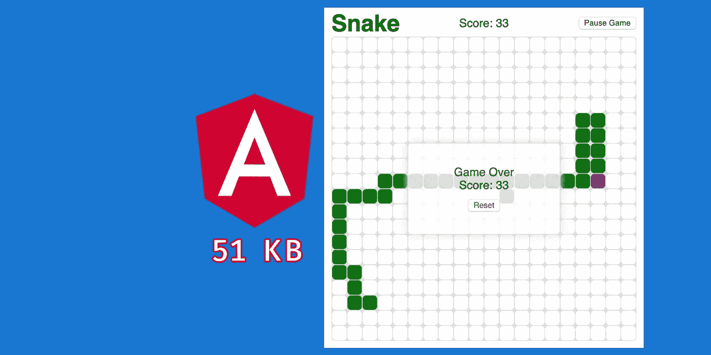
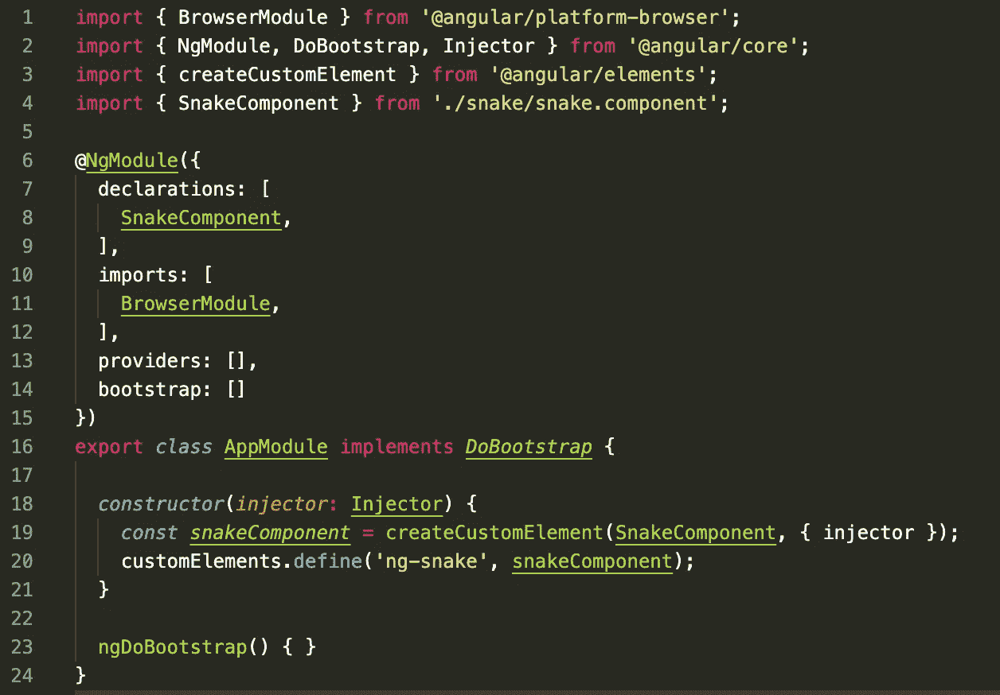
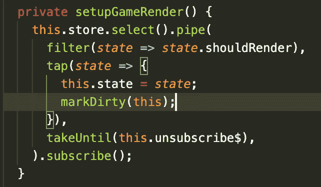
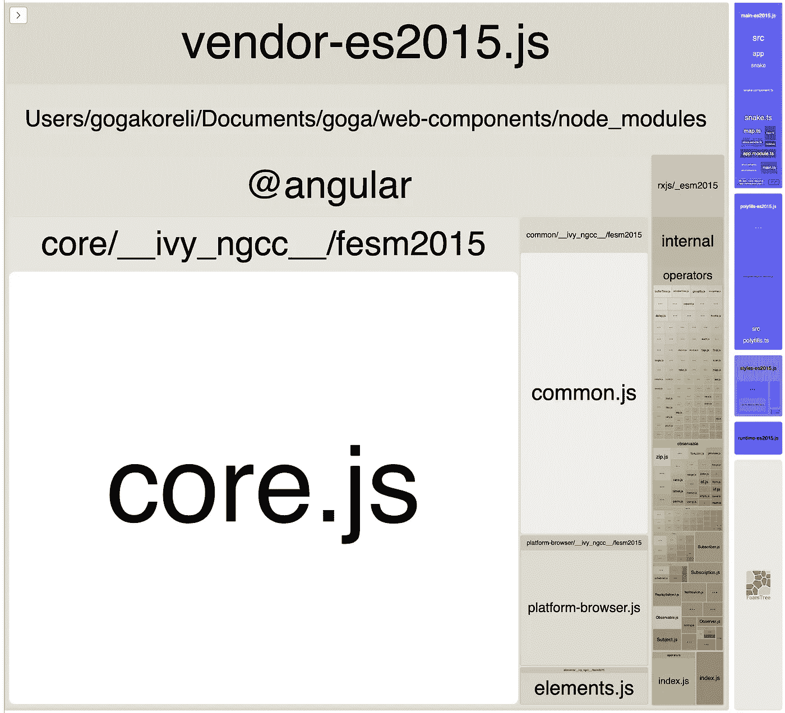
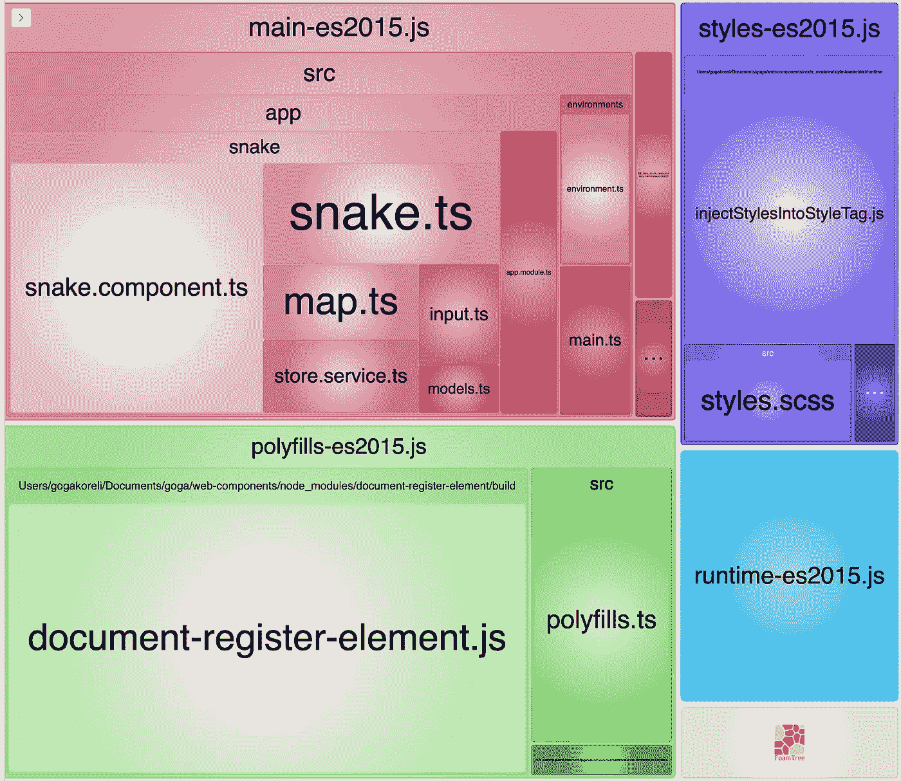
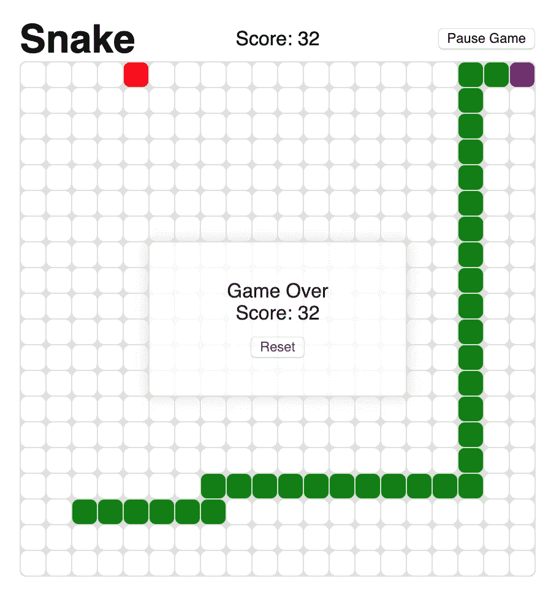

# 角形 9 蛇蹼组件— 51KB

> 原文：<https://itnext.io/angular-9-snake-web-component-96f61e63b158?source=collection_archive---------7----------------------->

随着 Angular 9 和 Ivy 的发布，我决定尝试 web 组件并分享我的观点。



> 我使用 Snake Drive Development，SDD，这实际上意味着在实现我最喜欢的项目时学习新的堆栈。我已经用多种语言和不同的模式实现了贪吃蛇游戏。(C++，C#，Angular，Angular via RxJS，React，Angular Web 组件)。我真诚地建议以这种方式学习新技术，通过实施喜爱的项目，在过程中获得乐趣并学习新东西。

这个实现是我之前实现的 Angular via RxJS 贪吃蛇游戏的略微修改版本，只有很少的重要变化。变化有:
* **使用 Flux 模式管理 UI 状态**
* **禁用 NgZone 并使用 OnPush 减少 bundle 大小**
* **使用纯函数和不可变状态
***将一切导出为 Web 组件
*使用 RxJS 管理事件并触发变更检测****

还有其他关于创建 Angular Web 组件的教程，它们更具技术性。本文的不同之处在于，除了技术细节之外，我还构建了一个相当重的 web 组件，它使用了核心的角度特性，您可以自己看看最终运行的应用程序的性能。

**查看 GitHub repo 和 Readme 了解更多信息**

> 👨‍💻[角蛇 Web 组件 GitHub 库](https://github.com/gogakoreli/angular-snake-web-component)🎮[在这里看成品](https://gogakoreli.github.io/angular-snake-web-component)

# **如何创建 Web 组件 TL；博士**

## 1.通过 CLI 添加元素和聚合填充

这将自动安装@angular/elements 包并添加 document-register-element poly fill

```
**ng add** @angular/elements
```

## 2.将角度组件注册为 Web 组件

我创建了 SnakeComponent，它导入游戏逻辑并呈现游戏状态。要将其注册为 Web 组件，请查看 AppModule:



请注意，我不需要 AppComponent 或 Routing，因为我计划只使用 ng-snake web 组件，因此我从模块声明中删除了其他不必要的内容，以减小包的大小。

## **3。禁用 NgZone(可选)**

这是可选的，但为了试验 Angular 的新功能，我禁用了 NgZone 来检测变化。我使用了 V9 中 Ivy 引入的新的 markDirty pure 函数。它还减少了束的大小。要禁用 NgZone，请在 main.ts 中使用以下命令:

```
platformBrowserDynamic().bootstrapModule(AppModule, { ngZone: ‘noop’ }).catch(err => console.error(err));
```

请看下面的 markDirty 用法示例图像。本质上，当游戏状态得到更新时，这是可观察到的，我请求 markDirty(this)并且 UI 将相应地更新。



## 4.构建和部署

在 cli 的`ng build --prod`的帮助下，js 文件在项目的 dist 文件夹中生成。文件有两个版本，es5 和 es2015。在本文中，我将使用 es2015 版本的文件 main、polyfills 和 runtime。我将这三个文件组合成一个`snake-web-component.js`，其中包含 Angular runtime、polyfills 和游戏逻辑作为一个 Web 组件。*(注意我没有使用 global styles.scss，所有必要的样式都在 component.scss 中，因此它包含在最终的 js 文件中)*

构建打包后，我在 ngh(包的 repo [angular-cli-ghpages](https://github.com/angular-schule/angular-cli-ghpages) )的帮助下，在 GitHub repo 对应的 GitHub 页面上发布简单的 index.html 和 snake-web-component.js。GitHub 页面服务静态文件 gzip，这就是我自己没有 gzip final js 的原因。你可以在[Angular Snake Web Component GitHub 页面](https://gogakoreli.github.io/angular-snake-web-component/)看一下最终运行的应用。

```
**“build**”: “ng build --prod --output-hashing=none”,
“**package**”: “cat dist/snake-web-component/{runtime-es2015,polyfills-es2015,main-es2015}.js > web/snake-web-component.js”,
*"****deploy****"*: "ngh --dir web",
```

## **5。让我们看看捆绑包的大小**

当我开始尝试 Web 组件时，这些是我感兴趣的细节，以评估它们在现实世界中有多大用处。

让我们看看`ng build --prod`之后生成的 3 个重要文件

1.  main-es2015.js: ~144 KB，~45 KB (Gzipped)
2.  运行时-es2015.js: ~1 KB，737 B (Gzipped)
3.  polyfills-es2015.js: ~14 KB，~6 KB (Gzipped)
4.  **总大小:159 KB，51.3 KB (Gzipped)**

因此，我们得到了一个 51.3KB 的 js 文件，它在一个 Web 组件中包含了 Angular 运行时和游戏逻辑。对于真实世界的场景来说，这些都是相当好的结果。

## 6.Webpack 捆绑包分析器

让我们通过 Webpack Bundle Analyzer 来看看一些统计数据。我们需要在没有 prod 标志的情况下构建项目，以查看在构建输出中使用了哪些包。这是一个粗略的估计，因为 prod build 会因为树抖动而丢弃大部分代码，但是获得更多的信息仍然很有趣。

我们需要运行 build-stats 然后分析。内部浏览器分析器应用程序将出现，你可以看看捆绑信息。

```
***“build-stats”***: “ng build --stats-json”,
***“analyze”***: “webpack-bundle-analyzer dist/snake-web-component/stats-es2015.json”,
```

这是 analyzer 的截图。你可以看到

*   Angular 的厂商 es2015 占用了大部分空间，然而大部分代码会树摇，会大大减少。
*   在供应商内部，你可以看到 rxjs 占用了一些空间，在树摇动后，这些空间也会大大减少。



当仔细观察其他包时，有趣的部分出现了，所以让我们禁用供应商来扩展其他文件。

*   **main-es 2015 . js:8.37 KB(Gzipped)**包含我写的游戏逻辑和代码。你可以粗略估计一下，在最终的 snake-web-component.js 中，这是我写的实际代码。



## 7.自己尝试有棱角的蛇形 Web 组件

创建如 gist 所示的 index.html，你会看到 Angular Snake Web 组件完美地运行在浏览器中。您可以在任何地方使用 <ng-snake></ng-snake> ，只需导入指定的 js 文件。

看看游戏截图:



## 8.最后的想法

总结一下 Angular Web 组件，我认为这些结果很有希望。由于只拥有需要的东西，这个包变得越来越小。我们可以开始创建图书馆，让每个人都可以使用。
我认为有几种新的可能性:

*   创建组件库并将组件捆绑在单独的文件中。脚本的消费者将为 Angular 运行时导入一个 js 文件，并根据组件需求导入其他单独的 js 文件。一个 Angular 运行时将被重用，其他组件可以独立导入。所以 Angular 组件库不仅对 Angular 开发人员有用，对其他人也有用。
*   创建完整的组件或部件，有独立的逻辑和角度运行时间(像我的蛇游戏 Web 组件)。例如，在使用 Angular 生态系统的同时，可以将一些小部件或小组件嵌入到用户想要的任何地方，这是非常有益的。正如你所看到的，包的大小已经很小了。

我认为这对许多公司来说是个好消息。他们可以构建组件而不是应用程序，并使它们成为 Web 组件。然后将这些 Web 组件嵌入到不同的应用程序中，这样无论在哪里嵌入 Angular Web 组件，它们都具有一致性和可重用的代码。我对这个想法相当肯定，并希望看到它在许多地方得到应用。

**查看 GitHub repo 和 Readme 了解更多信息**

> 👨‍💻[角蛇 Web 组件 GitHub 库](https://github.com/gogakoreli/angular-snake-web-component)🎮[在这里看一下成品](https://gogakoreli.github.io/angular-snake-web-component)

你认为这篇文章有趣吗？

**单击👏按钮**传播文章
[**在 Twitter 上关注我@gogakoreli**](https://twitter.com/GogaKoreli)