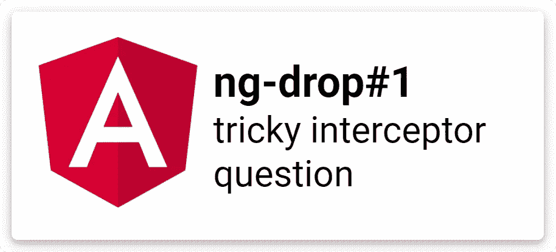

# 棱角——拦截器面试中一个棘手的问题

> 原文：<https://itnext.io/angular-an-interceptor-interview-question-with-a-tricky-aspect-5a0d1616c74b?source=collection_archive---------1----------------------->

假设有一个角度应用，我们有以下要求:

> API 的主要版本发生了变化，现在每个对我们的 API 的 HTTP 调用都应该有一个特定的头，比如 X-APP。我们需要一种快速可靠的方法来尽快进行必要的更改。有什么想法吗？

常见的答案和一个好方法是在应用程序或核心模块中使用拦截器，并在传出的请求中添加必要的头。这种实现快速且易于理解。它使用框架特性，被认为是最佳实践。

*拦截器是 HttpClient 的可选依赖项。我们必须在提供 HttpClient 的同一个注射器中提供它。否则，将创建没有拦截器依赖关系的实例，拦截器将被忽略。*

拦截器将在请求中添加丢失的头。

我们将拦截器添加到应用程序或核心模块的提供者数组中。

后续问题来了:

> 这是一个很好的方法，而且确实很快。好，我们假设你在 app 模块中添加了拦截器，现在一切都好了吗？有没有可能出现解决方案受损的边缘情况？

拦截器要和 HttpClientModule *(多数情况下是 app 或者核心模块)*放在同一个模块里。 ***因此，*** ***我们必须确保我们的整个应用程序使用 HttpClientModule 的这个确切实例，它是用我们的拦截器创建的。***

然而，如果有另一个 HttpClient 的提供者(例如，一个惰性加载的模块)，我们将面临前面提到的问题(缺少拦截器)，所以我们应该在提供 HttpClient 的所有模块的`providers: []`中添加拦截器。

现在我们有了一个快速可靠的解决方案。

享受🚀🚀🚀