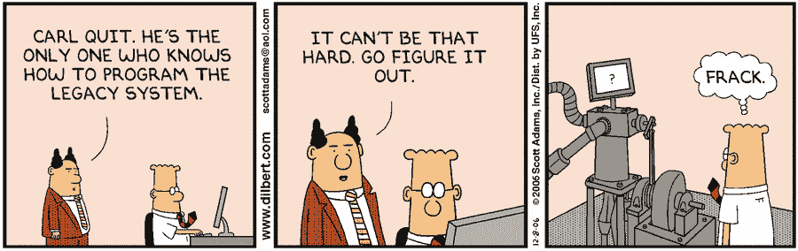

# Angular 和遗留 JavaScript 集成

> 原文：<https://itnext.io/angular-and-legacy-javascript-integrations-f0e9d47a58fc?source=collection_archive---------0----------------------->

## 如何让你的 Angular SPAs 与传统图书馆“好好”交流



呆伯特([https://dilbert.com/strip/2006-12-08](https://dilbert.com/strip/2006-12-08))

大多数提供某些常用功能的系统也提供某种集成。让我们说图形和图表库，记录在老平原遗留 JavaScript ( < ES5), with old styled HTML &

大多数时候，这种集成是为非开发人员设计的，*“包含这些代码，它就会工作”*，神奇。

但是，如果你必须让这种整合与你的 Angular SPA 一起工作呢？

我最近与 iFrame resizer 库作斗争，不得不添加一些第三方代码块，包括一个 iFrame、一个 js 文件和一个 CSS 文件到 Angular 组件。"*为了改进 UX，把这个脚本添加到你的 HTML 的头部…* "然后就有了 iframe resizer。顺便说一句，iframes 绝对不可能改进 UX，iframes 只是看起来像一个张贴在屏幕上的帖子。
简而言之，我阅读了相关文件，但没有一条建议对我有效。

所以我是这样做的:

## 动态加载所有外部所需文件

这将向 DOM 添加所需的脚本和 css，但不是通过将代码粘贴到组件的模板上。我们将为此使用一个服务:

[https://gist . github . com/jsanta/9 c 845 b 6 be 5b c 2118 d0a 1415 F2 C3 c 569 f](https://gist.github.com/jsanta/9c845b6be5bc2118d0a1415f2c3c569f)

该服务获取脚本或 CSS 文件的 URL，并将其附加到 HTML DOM 中。将它作为提供者包含在 app.module.ts 文件中，这样您就可以拥有服务的单个实例，并且避免在已经加载文件的情况下加载它们。

## 声明一个全局变量来包装脚本

在您的组件上，您需要为您试图包含的第三方脚本声明一个包装器。希望您了解这个脚本的内部，这样您就可以定义一个允许自动完成代码的接口。正如我们通常不做的那样，我们将只使用 *any* 类型。

[https://gist . github . com/jsanta/231 bb 5c 65 a1 faf 7571 c 846 DFC 49 a 3263](https://gist.github.com/jsanta/231bb5c65a1faf7571c846dfc49a3263)

为什么是全球？在我工作的公司，我们有一些动态表单验证是这样加载的。我们在 Safari 上遇到了一些问题，将脚本对象变量声明为*全局*解决了这个问题。

最后…

## 按照建议使用第三方脚本

现在，您可以使用文档中显示的脚本了(在确保加载了脚本之后，必须包含代码，这在第 34 行和第 36 行之间。例如:

```
// ... Promise.all(scriptArray).then(_ => {
      console.log('All scripts loaded'); // These are not real methods, just placed them 
      // for illustrative purposes
      externalLibrary.loadData(this.data);
      externalLibrary.renderChart('barchart', 'chart-container');
      otherExternalLibrary.validateRoles(); )};// ...
```

顺便说一句，不要只是在 GISTs 上复制粘贴代码，我想我遗漏了几个右括号:)

## jQuery 呢？

是的，仍然有人在使用 *jQuery* 。 *jQuery* 是另一个故事，曾经尝试过这样加载，但失败了。所以最终发现 jQuery 工作的唯一方式是将其添加到 *polyfills.ts* 文件的最后几行，如下所示:

```
import * as jQuery from 'jquery';
window['$'] = jQuery;
```

你应该可以像往常一样使用$了。

希望有帮助。