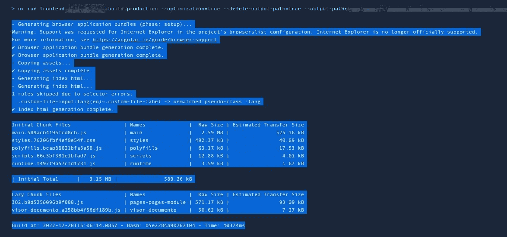
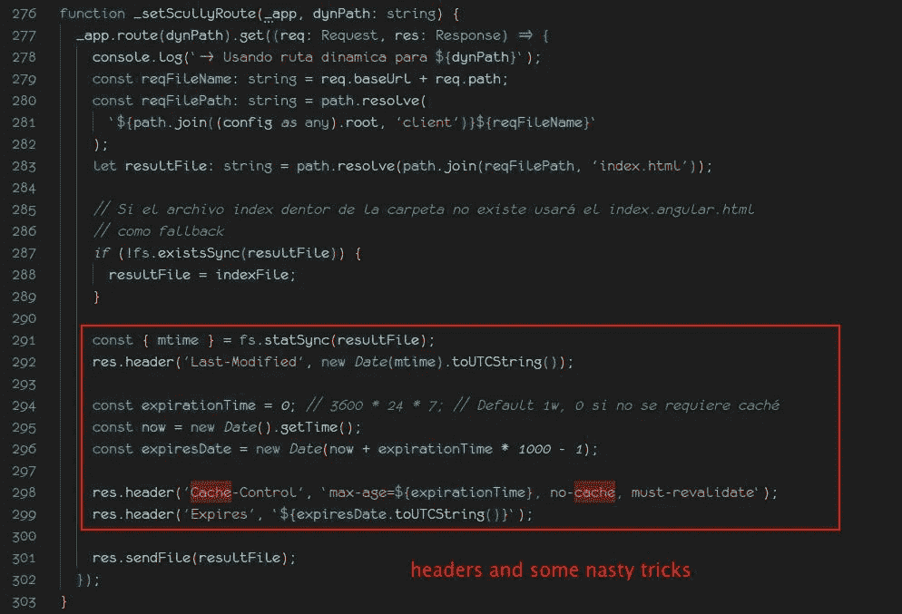

# 角度缓存和 SPAs 缓存是为了真正的速度需求吗？

> 原文：<https://itnext.io/angular-and-spas-caching-for-the-real-need-for-speed-d2ca1b1227f8?source=collection_archive---------1----------------------->

# 绩效需要理解绩效


👍耶！更快…

**警告**:这篇文章非常固执己见。你可能不同意我的许多欣赏，这绝对没关系。

大多数前端框架教程会教你如何使用它们，通常会跳过一些面对现实世界挑战时不得不考虑的事情。性能是其中的一个话题，通常我们都知道 web 应用程序的运行速度有多快。
当现实世界的应用程序达到重要的规模和复杂性时，性能是必须的**，客户**必须**在浏览我们的 web 应用程序时拥有良好的性能体验。**

**在本文中，我将写一些可能影响您的 web 应用程序性能/速度的事情，其中大部分都与 Angular SPA 高度相关，但是您可以对本文进行推断，并尝试将这些概念应用到您喜欢的 SPA 框架中。**

# **是什么造就了水疗表演？**

**首先，我们来思考一下与 app 无关的事情:**

*   **快速用户计算机(大量内存和处理器)**
*   **快速服务器(大量内存和处理器)**
*   **高网络速度**
*   ***“我在 localhost 上的测试:4200 跑得超快”* 🤌 c 'mmon…**

**好了，，看到这里的问题了吗？如果你的绩效评估只考虑这些因素，你就错过了一些要点。**

**再补充一些 app 相关的东西:**

1.  **[惰性加载模块](https://angular.io/guide/lazy-loading-ngmodules)**
2.  **任何 UX 技巧，如无限分页，或图像或不可见内容的交集观察者**
3.  **小型 CSS 包(例如使用[顺风 CSS](https://tailwindcss.com/)**
4.  **小型 API 操作(在后端)**
5.  **[缓存 SPA 上的可缓存 API 请求](https://dev.to/this-is-angular/how-caching-data-in-angular-with-rxjs-27mj)**

**以及如何破坏您的应用速度和性能提升:**

1.  **你的模块太大(或者内部不好，比如`import * from library;`)。不管你有多懒，它们还是很大，或者发育得很糟糕。**
2.  **超过 5MB 图像的交叉点观察器(已经看到…)，或者超过 40 个并发 API 请求是不好的。**
3.  **你可能认为顺风会导致很小的 CSS 包。如果您在所有 SCSS 文件中使用`@apply`，将无法正常工作。(在你的 HTML 模板中，顺风会变得非常冗长，但是相信我，一旦编译完成，最终的`styles.css`文件会非常小)**
4.  **API 操作可以很小，但也应该快速响应。**
5.  **缓存所有的东西！**

****

**没那么快，快**

**我有意跳过一些通常有助于性能追求的其他好的开发实践。**

# **简要了解棱角造型**

**大多数典型的角度构建会导致:**

*   **单个`index.html`文件**
*   **单个散列的`styles.css`文件(类似于`styles.1234abcdrandomhash.css`)**
*   **许多“*散列的*”。 *js* 文件**
*   **一个*资产*文件夹**

****

**真实管线的角度构建示例**

**文件名中的*散列*意味着*缓存破坏*，这意味着一个特定的文件可以被另一个具有另一个散列的文件替换。也许该文件将被缓存在浏览器中，或者从服务器获得 *cache-control* 头，但是它可能被另一个文件替换，具有另一个散列。例如:**

*   ****第一次编译** : `user.modules.ts` - >编译到- > `105.123bcdsomeuglyhash.js`**
*   ****第二次编译** : `user.modules.ts` - >编译到->-`207.345qweanotheruglyhash.js`**
*   **…**
*   ****第 n 次编译** : `user.modules.ts` - >编译到->-`654.978poisomeotheruglyhash.js`**

**还有一些其他的选项允许 Angular 编译时不需要散列或者保持一个用户友好的名字。为此，你将不得不阅读一些[角度文档](https://angular.io/guide/workspace-config)并多次拧紧你的`angular.json`文件(我通常几乎每天都这样做😥).**

# **缓存还是不缓存，这是个问题…**

**`index.html`没有哈希，这是在服务器上部署 Angular 应用时的关键知识。索引文件保留它的文件名，所以如果这个文件以任何方式被缓存，它将检索缓存的内容。**

*   ***:从任何缓存中检索文件都非常快***
*   ******真正不好的事情*** :文件内容可能已经过时，所以很多 app 脚本不会存在，而且肯定会因为编译 app 时产生的哈希不同而加载失败。***

***你所有的速度提升都可能以一个无法运行的网络应用程序告终。不太好。***

***通常的建议是`index.html`文件不需要以任何方式从服务器缓存。这意味着从服务器提供带有这些头的`index.html`文件:***

```
*Cache-Control: no-cache, no-store, must-revalidate
Expires: 0
Pragma: no-cache*
```

******

***关于如何在 Express 应用程序上设置标题的示例***

***缓存`index.html`文件只会导致头痛、脚本加载错误(HTTP 状态 *404* 文件未找到)和可怕的 UX。***

> ***但是 index.html 文件是一个静态资源，静态资源必须被缓存。不是吗？***

***静态资源，如图像或其他一些第三方脚本，可能会包括在网站上(并没有在编译散列)，是的，同意。静态 HTML 文件的内容是不变的(如联系表格页面)，同意。
但是在这种情况下(或者任何带有某种文件哈希逻辑的编译 SPA)，我们可以争论它是好是坏。***

## ***我们如何解决`index.html`缓存问题？(我仍然希望将其缓存为静态资源)***

***唯一的方法是物理存储每一个旧的散列文件(包括 *javascript* 和 *css* )，以确保即使是从某处加载的旧的和过时的`index.html`文件，也会加载它需要的每一个旧的和过时的 *javascript* 和 *css* 文件。***

## ***大问题***

***每次部署应用程序时，它的编译都会添加一堆新文件，因为**编译之间的哈希永远不会相同**。当然，`index.html`文件和任何其他静态非散列文件将被替换，但你的应用程序肯定会重复一些模块，文件名不同，但仍然是同一个模块。
几个部署之后，你会拖着大量的*宇宙垃圾*，如果你没有一个重置策略，为了删除不用的和/或过时的文件，你会很快填满你的硬盘。***

***好吧，硬盘不是问题，因为“*存储很便宜*”。我们来抛几个数字:***

*   ***20 MB 左右大小的应用程序(真实世界的应用程序，还记得吗？)***
*   ***每天 1 次部署(每月- 20 次部署，仅考虑工作日)***

******

***错过了 80 年代的 Peavey T-40 低音***

***为你的后端考虑 *node_modules* (真实世界的应用，记得吗？)，几个月后，您的应用程序就可以吃掉一个*起始层部署实例*中的所有空间。宇宙垃圾是一个问题。***

***所以…，缓存是好的，但是你必须知道缓存什么，以及如何缓存。***

***曾经有一段时间，所有的开发人员都在网上跑来跑去，只是为了展示谁跑得最快。有一个不受欢迎的库叫做***basket . js***([https://github.com/addyosmani/basket.js](https://github.com/addyosmani/basket.js))，在对性能的永恒追求中，旨在改进它将所有脚本存储在 *localstorage* 中。好主意，直到你试图在隐姓埋名模式导航。***

## ***服务人员呢？***

***和缓存我们的`index.html`文件一样的问题。你可以做一个很好的配置来定义一个性能标准。但是如果你的网络应用不是以前的 ***PWA*** ，你将会试图加载旧的脚本，最糟糕的是，由于你的应用不能自我更新，这将是一个真正的 *PITA* 试图保持你的应用没有错误，由于脚本没有找到错误。对你的用户体验来说很糟糕。去过那里，做过那件事，遭受过…***

# ***这个特定的应用程序是否需要缓存以提高速度？***

***在回答这个问题之前，我们先回答另一个问题:***

***我们正在开发什么类型的应用程序？***

*   ***是**网站**吗？***
*   ***是**公共** web 应用吗？(公共的意思是不需要用户注册)***
*   ***是**私有**应用吗？(需要用户注册，或者主应用入口是一个*登录屏幕*)***

******边问*** :这是一款在 SEO 上占点便宜还是高[网页速度](https://www.webpagetest.org/) / [GT Metrix](https://gtmetrix.com/) / [灯塔](https://pagespeed.web.dev/)排名的 app？***

***几个事实:***

*   ***用户输入(打字、滚动、点击)平均需要大约 300 毫秒(100 毫秒被理解为瞬时[)](https://www.nngroup.com/articles/response-times-3-important-limits/)***
*   ***普通用户每分钟阅读 230 个单词***
*   ***Angular(和大多数 SPA 框架)使用*空闲时间*来下载任何延迟的脚本***
*   ***只有 QA 用户(或者你自己开发团队中的人)倾向于在页面完全加载之前进行极快的导航、滚动或点击。所以这种行为*当然可以发生*，但不是以你预期的频率。***

***混合两个列表:***

*   ******网站*** ？耶！，绝对，全部缓存，或者大部分缓存。搜索引擎优化，性能，用户界面 UX，速度排名，一切都意味着改善。***
*   ******公共网络应用*** ？耶！主要是因为它像一个网站，但有“*类似应用程序的功能*”。***
*   ******私人应用*** ？这一点我们可以争论。我会说缓存没关系，因为没有搜索引擎优化或页面速度的损失。**这里真正重要的是最终用户获得最新、更新版本的已部署应用。*****

******

***20%必须更快，永远…***

***那么…，**由于缓存，加载时间增加了 200 毫秒，这真的是性能提升吗？我的意思是除了你自己说“T2”之外。站点加载快 200ms】”？这取决于应用程序，以及你的受众； **80%不会注意到，20%会一直要求更快的速度**。*****

# ***私有应用的最佳无缓存用户体验***

***感谢阅读到目前为止。不知道这是否符合你的要求，但也许你应该缓存应用程序(我知道，不是无缓存…)，至少是你的脚本。事情是这样的，作为一个私人应用程序，没有灯塔(或类似的)压力，你可以跳过懒惰加载，预加载所有模块。通过这种方式，用户在浏览应用程序时几乎感觉不到过渡，所有的模块都已经加载好了。***

## ***如何做到这一点？***

```
*import { RouterModule, Routes, PreloadAllModules } from ‘@angular/router’; 
@NgModule({ 
 imports: [ 
 RouterModule.forRoot(routes, { preloadingStrategy: PreloadAllModules }) 
 ], 
 exports: [RouterModule] 
}) 
export class AppRoutingModule {}*
```

***事实是，这最后一条并不是宝贵的建议，但它可能会缓解你的灵魂之火。***

***缓存本身并不能让你的 web 应用程序快到 Lighthouse 分，而且有这么多的考虑因素，你可能最终会问自己是否值得用头撞键盘或所有的努力。***