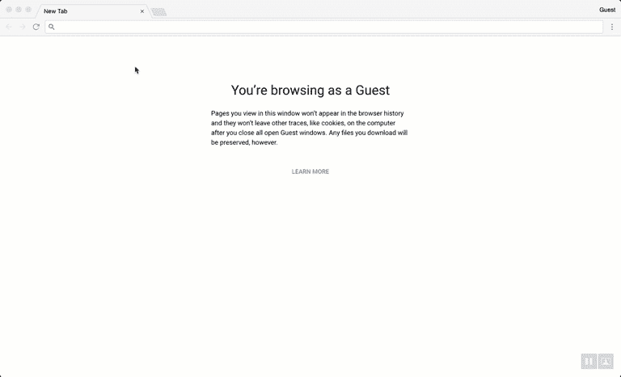

# 开始使用 Angular CLI 构建组件库

> 原文：<https://itnext.io/angular-cli-libraries-79b0a32a1443?source=collection_archive---------2----------------------->

照片由[塞缪尔·泽勒](https://unsplash.com/photos/JuFcQxgCXwA?utm_source=unsplash&utm_medium=referral&utm_content=creditCopyText)在 [Unsplash](https://unsplash.com/search/photos/package?utm_source=unsplash&utm_medium=referral&utm_content=creditCopyText) 拍摄

在 Angular 生态系统中，进入门槛一直较高的事情之一是创建其他 Angular 应用程序可以使用的组件库。Angular 团队发布了类似于 [Angular Package Format](https://docs.google.com/document/d/1CZC2rcpxffTDfRDs6p1cfbmKNLA6x5O-NtkJglDaBVs/edit) 的指南，并由此社区创建了一些奇妙的工具，如[generator-Angular 2-library](https://github.com/jvandemo/generator-angular2-library)，使之变得更容易。然而，从来没有一种工具可以像在正常项目工作流程中使用 Angular CLI 的开发人员所习惯的那样，生成 Angular 包格式的自以为是的实现。

随着 Angular CLI 版本 6 的最新发布，我们现在可以访问一些工具来帮助我们构建库，同时还可以利用 CLI 的其他强大功能，例如 schematics，而无需离开我们习惯的工作流！我将向您展示如何通过 CLI 开始构建您自己的组件库。

我们将涵盖:

*   使用 Angular CLI 生成库项目
*   为您的库构建组件
*   在其他应用程序中使用您的库
*   发布您的库供他人使用

# 使用 Angular CLI 生成库项目

最重要的是。我们需要建立我们的项目。如果您没有最新版本的 CLI，请从 npm 获取。

现在用 CLI 创建一个新项目。这里没什么新鲜的。

如果您习惯于使用 Angular CLI，您可能会注意到您所熟悉和喜爱的项目结构发生了一些变化。其中最引人注目的是旧的`angular-cli.json`文件不见了，取而代之的是新的`angular.json`文件。

这个文件是版本 6 中最大的新特性之一的关键。现在，Angular CLI 可以创建和使用包含一个或多个多角度项目的工作空间。这个`angular.json`文件让您可以控制每个项目的配置。这最终使得在 CLI 中构建库成为可能，因为我们需要以不同于普通 Angular 应用程序的方式处理库的构建。

好了——现在我们对 CLI 对象中的库是如何工作的有了更多的了解；让我们在项目中生成库结构。我们用`generate`命令来做这件事，就像我们创建一个组件、服务、模块等一样...

这将为您的库和一些示例文件创建一个新的`/projects`目录和一个新文件夹。

这里真正需要注意的文件是`/src/public_api.ts`、`ng-package.json`和`ng-package.prod.json`。这些文件控制着[ng-packar](https://github.com/dherges/ng-packagr)的配置，ng-packar 是驱动库打包的库。我鼓励你去看看这个项目，熟悉一下它是如何工作的，但这里有一个快速而粗略的概述:

*   `public_api.ts`是您图书馆的新入口。如果你有任何你想让库的用户访问的文件(模块，组件，等等...)除了从库中的任何模块导出它们之外，您还需要在这里导出它们。

*   `ng-package.json`和`ng-package.prod.json`控制 ng-packar 执行的包装过程的配置。您可以使用它们来更改目标构建目录或为您的应用程序定义不同的入口点。`ng-package.json`在您执行`ng build`命令时使用，`ng-package.prod.json`在您运行`ng build --prod`时使用。现在这两个文件之间唯一的区别是`ng-package.json`包含一个`deleteDestPath`标志，它将在运行构建之前删除您的目标目录。这将有助于您在开发过程中不断进行更改。

> ***Protip*** *:如果你的库需要捆绑一个整体的 Sass 文件，你需要在你的工作流中包含类似*[*scss-bundle*](https://github.com/SimplrJS/scss-bundle)*的东西。* [*更多信息请看这里*](https://github.com/dherges/ng-packagr/issues/273#issuecomment-345059670)

# 为您的库构建组件

现在我们有了库设置的总体结构。是时候开始建设了！

首先将[角形材料](https://material.angular.io/)添加到我们的项目中。

"等等，为什么我们把材料添加到我的应用程序，而不是我的新图书馆？"好问题。这个问题的简单答案是，在这种情况下，材料是我们库的对等依赖。我们不希望每次在某个地方安装我们的库时都要下载它——这会导致在构建应用程序时出现巨大的最终包。相反，我们希望规定无论哪个项目使用我们的库，都需要安装材料。对于将由第三方(提示，提示:我们的)安装和使用的库，您需要向对等依赖关系中添加材料之类的东西。在这里有一个关于什么时候使用对等和普通依赖[的很好的讨论。](https://stackoverflow.com/questions/26737819/why-use-peer-dependencies-in-npm-for-plugins)

另外，材料的`ng add`命令仅适用于标准项目配置，即由`ng new`命令生成的项目配置。如果你运行`ng add @angular/material --project my-new-lib`，你会得到一个这样说的错误。正在后台运行以添加材料的原理图假设您正在将其添加到现有的 Angular 应用程序，而不是库，因此它不会理解，因为`angular.json`内部的结构是为您的库设置的。

现在继续添加到我们的对等依赖项中。

让我们为我们的图书馆设置模块。首先，删除在`src/lib`和`public_api.ts`中由 CLI 生成的示例文件。然后生成模块。

因为我们希望其他人使用这个模块，所以我们需要将它添加到`public_api.ts`。

对于这个例子，库将有一个由按钮和徽章组成的组件。每次点击按钮时，徽章都会更新并显示总点击次数。为了增加复杂性，组件还应该发出一个事件，让任何父组件知道计数已经改变以及当前计数是多少。

首先生成组件。

从我们的库中导出刚刚创建的组件。当你在这里的时候也导入`MatBadgeModule`和`MatButtonModule`。

也将组件添加到`public_api.ts`

现在，向组件添加逻辑，以处理每当单击按钮时显示的计数递增。

接下来，我们将组件连接到模板。

现在我们有了一个希望其他应用程序使用的组件！但是我们如何确保它有效呢？我们接下来会处理这个问题。

# 在其他应用程序中使用您的库

好吧，我们有一个很棒的库可以使用——但是我们实际上如何使用它呢？有几种不同的方法。

首先是在我们刚开始工作时由 CLI 生成的应用程序中使用它。请记住，Angular CLI 不再只是生成一个应用程序；相反，它会生成 CLI 团队所称的工作区。这意味着您可以在同一目录中构建多个应用程序和库，并利用您在同一工作区的其他项目中构建的内容。

打开工作区根目录下的`tsconfig.json`。您将看到一个指向`dist/my-new-library`目录的`paths`选项。

这样做的目的是让您在构建完库后，在同一工作区的其他应用程序中自动使用库。这类似于使用 npm 安装的库，因为您可以导入组件并在库中使用。这当然意味着在构建应用之前，你*必须*构建你的应用所依赖的任何库**，并且每次你对库进行更改时都需要重新构建库，这些更改才会得到反映。**

一个示例工作流可以这样工作:

现在继续构建我们的库，然后我们将构建一个示例，展示如何使用我们工作区中生成的原始应用程序来使用它。

这将生成前面提到的`dist/`目录。如果您打开该目录，您会看到 ng-packar 已经生成了 FESM2015、FESM5 和 UMD 的库包以供使用，并生成了一个类型文件。

现在我们可以在应用程序中使用这个库了！

在`src/app/app.module.ts`中导入`MyLibModule`

我们想证明应用程序正在从库组件接收`countChanged`事件，所以在`src/app/app.component.ts`中实现`handleCountChanged()`。

现在将`CounterButtonComponent`添加到`src/app/app.component.html`中。还要添加一个 div，显示从组件发出的值。

让我们看看我们的示例应用程序的运行情况！记得在服务应用程序之前建立您的库。

打开浏览器，您将看到您的组件在运行！

像这样使用库是在同一个工作空间中的多个 Angular 应用程序之间共享代码的一种很好的方式。此外，如果您正在构建类似组件库的东西，您可以使用最初生成的 Angular 应用程序为您的库构建出色的工作示例。

# 发布您的库供他人使用

因此，您已经构建了一个非常棒的组件库，并且正在您自己的应用程序中使用它，但是如果您想要共享它以便其他人可以在他们的应用程序中使用它，该怎么办呢？

首先，如果你之前没有在 npm 上发表过任何东西，那就去注册吧。

登录 npm 帐户后，再次构建库。这次使用`--prod`标志，这样 Angular CLI 将执行一些额外的优化步骤。

现在进入`dist/my-new-library`。如果你想测试你的包是否能在其他应用中运行，你可以把它链接到你的本地 npm 注册表。

现在创建一个新的角度工作空间，并将库链接到项目。

在新的工作空间中，将`projects/test-lib-app/architect/build`下`options`对象中的`preserveSymLinks`添加到`angular.json`。这允许当应用被提供时，你的库的链接继续工作。

像我们之前一样使用这个库，你会发现它在这里也可以工作！要删除链接库，您可以在测试项目中使用一个`npm remove my-new-library`命令，在您构建的库的目录中使用`npm unlink`命令。

如果您准备将您的应用程序发布到 npm 以供他人使用，请在您的`dist/my-new-library`目录中运行下面的命令。

从那里，您可以像使用任何其他使用`npm install`的包一样使用它。

# 后续步骤

恭喜你！您已经用 Angular 构建了自己的组件库，并将其发布给 npm 供其他人使用。向前迈进，建立酷库共享！对于接下来的步骤，我也强烈建议您深入研究[ng-packar](https://github.com/dherges/ng-packagr/issues?q=label%3Adocumentation%20)的文档，以了解更多关于库打包过程的高级主题。

你可以在 Github [这里](https://github.com/bniedermeyer/component-libraries-with-angular-cli)找到例子中使用的代码。