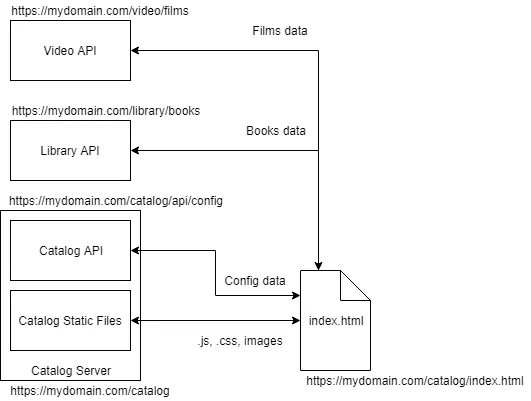
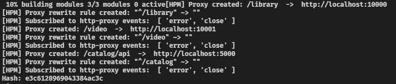
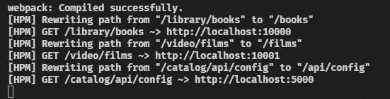

# Angular CLI 代理配置

> 原文：<https://itnext.io/angular-cli-proxy-configuration-4311acec9d6f?source=collection_archive---------0----------------------->

[*点击这里在 LinkedIn 上分享这篇文章*](https://www.linkedin.com/cws/share?url=https%3A%2F%2Fitnext.io%2Fangular-cli-proxy-configuration-4311acec9d6f)

你的 Angular 前端和很多后端服务对话吗？您是否也使用类似 nginx 或 Kubernetes Ingress 这样的反向代理将请求从同一域的不同路径路由到这些服务？如果是这样，那么您应该知道 Angular CLI 提供的代理配置选项，这些选项使本地开发成为一种非常棒的体验。

这些配置选项通过一个示例得到了最好的说明。如果您对所需的更改感兴趣，那么请看 GitHub 上的这个 [commit](https://github.com/rars/demo-angularcli-proxy/commit/6008230a29bab0368810ff0a18c38b62852d4d99) ，它显示了设置代理所需的差异。这篇博文将更详细地讨论这个例子。

让我们以一个在路径`/catalog/`上服务的前端为例。“目录服务器”负责提供静态文件(。js，。css，。html ),还提供了一个 API，前端可以使用它来检索特定于环境的配置。



前端将向另外两个 REST API 服务器发出请求:在同一个域上的路径`/video/`和`/library/`中可用的“视频 API”和“库 API”。这些将产生图书和电影信息，目录页面将显示这些信息。

默认情况下，Angular CLI 假设前端服务于基本路径`/`，即在`index.html`中插入`<base href="/">`。因此，例如当`[https://mydomain.com/catalog/index.html](https://mydomain.com/catalog/index.html)`加载时，浏览器将从`[https://mydomain.com/main.bundle.j](http://mydomain.com/main.bundle.js)s` [请求`main.bundle.js`。](https://mydomain.com/styles.bundle.css.)但是在那个位置找不到这个。浏览器应该从`[https://mydomain.com/catalog/main.bundle.js](https://mydomain.com/catalog/main.bundle.js)`请求它。这可以通过在您的`package.json`文件中指定实际的基本 HREF(在本例中为`/catalog/`)和部署 URL 来解决:

```
"start": "ng serve --base-href /catalog/ --deploy-url /catalog/",
"build": "ng build --prod --base-href /catalog/ --deploy-url /catalog/"
```

如果您运行`npm run start`，您现在应该看到它生成了一个带有`<base href="/catalog/">`的`index.html`文件，并且您应该能够在`[http://localhost:4200/catalog/](http://localhost:4200/catalog/.)`访问页面。我已经掩饰了`deploy-url`场景到底是做什么的。执行重写对 CSS 中的`url(...)`引用有类似的影响(因此，如果您在 CSS 引用字体或图像等资源时遇到问题，请检查该设置是否正确)。

因此，它已经更加类似于我们期望在生产中部署服务和前端的结构。然而，Angular CLI 已经开始为静态文件提供服务的本地服务器不知道如何处理对`GET /video/films`或`GET /library/books`甚至`GET /catalog/config`的请求。

为了处理这些额外的请求，我们必须配置 Angular CLI，以便将这些请求代理给其他能够理解这些请求并做出适当响应的服务器。为此，在 Angular CLI 项目的根目录下创建一个文件`proxy.conf.json`，与`package.json`文件放在一起。在本例中，内容如下所示

```
{
  "/library/*": {
    "target": "http://localhost:10000",
    "secure": false,
    "logLevel": "debug",
    "changeOrigin": true,
    "pathRewrite": {
      "^/library": ""
    }
  },
  "/video/*": {
    "target": "http://localhost:10001",
    "secure": false,
    "logLevel": "debug",
    "changeOrigin": true,
    "pathRewrite": {
      "^/video": ""
    }
  },
  "/catalog/api/*": {
    "target": "http://localhost:5000",
    "secure": false,
    "logLevel": "debug",
    "changeOrigin": true,
    "pathRewrite": {
      "^/catalog": ""
    }
  }
}
```

在本地运行时，您还需要更新您的`package.json`来引用这个文件，如下所示:

```
"start": "ng serve --base-href /catalog/ --deploy-url /catalog/     --proxy-config proxy.conf.json",
```

现在，当我们运行`npm run start`时，您可以在命令行中看到它设置了这些代理设置:



启动时设置代理

现在，当您在浏览器中转至`[http://localhost:4200/catalog/](http://localhost:4200/catalog/)` 时，您可以在命令行中看到该服务器正在向其他服务器发出几个代理请求:



从代理到相关服务器的浏览器接收的请求

对`[http://localhost:4200/library/books](http://localhost:4200/library/books)`的请求导致请求被发送到`[http://localhost:10000/books](http://localhost:10000/books)`，然后响应从 Angular CLI 服务器传回前端。发生这种情况是因为配置要求任何匹配`/library/*`的路径都以`[http://localhost:10000](http://localhost:10000)`服务器为目标。它有一个额外的`pathRewrite`设置，表明如果路径匹配`^/library`(即如果它以`/library`开始)，那么用空字符串重写该部分(即从路径中删除它)，因此在对`[http://localhost:10000](http://localhost:10000.)` [的请求中`/library/books`被重写为`/books`。](http://localhost:10000.)

从与代理设置`"^/catalog/api/*"`匹配的`http://localhost:4200/catalog/api/config`中检索配置。`pathRewrite`设置表示在形成代理请求之前，路径开始处的`/catalog`应替换为空字符串，即`[http://localhost:5000/api/config](http://localhost:5000/api/config.)` [。](http://localhost:5000/api/config.)

显然，这些其他服务器必须在本地运行，请求才能工作。如果您不打算对 REST APIs 进行任何更改，那么您可以将“开发”环境作为目标，而不是本地运行的服务器。

我认为新的 Angular CLI 工具非常棒，它使得本地开发比在 AngularJS 中更容易。在处理复杂的部署场景时尤其如此，这个例子表明它足够灵活，可以适应这种复杂性。感谢您的阅读，我希望您发现以上细节对您自己的设置有用。

# 参考

这个例子的完整代码可以在 https://github.com/rars/demo-angularcli-proxy/找到

如果您只想查看将这个代理添加到一个新的 Angular CLI 项目中的更改，只需查看该存储库中的提交 [6008230](https://github.com/rars/demo-angularcli-proxy/commit/6008230a29bab0368810ff0a18c38b62852d4d99) 。

更多文档可以在[https://github . com/angular/angular-CLI/blob/master/docs/documentation/stories/proxy . MD](https://github.com/angular/angular-cli/blob/master/docs/documentation/stories/proxy.md)找到