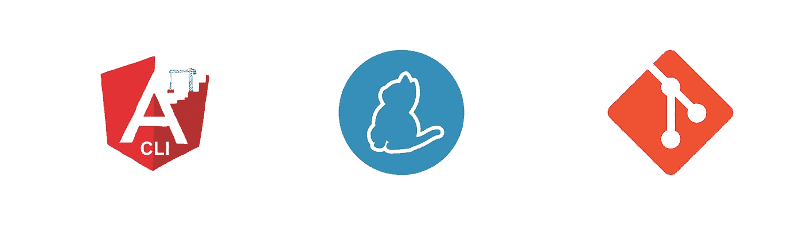

# 角度气候和纱线工作空间

> 原文：<https://itnext.io/angular-cli-yarn-workspaces-76df0063fd5?source=collection_archive---------6----------------------->

## 如何在 Angular CLI 项目中使用 yarn 工作空间和 git 子模块

有角度的 CLI +纱线+ GIT

> [点击这里在 LinkedIn 上分享这篇文章](https://www.linkedin.com/cws/share?url=https%3A%2F%2Fitnext.io%2Fangular-cli-yarn-workspaces-76df0063fd5%3Futm_source%3Dmedium_sharelink%26utm_medium%3Dsocial%26utm_campaign%3Dbuffer)

有时我们想要创建私有模块并在项目间共享它们。最好的方法之一是使用 git 子模块和 yarn 工作空间。

我将展示如何做到这一点，并在 Angular CLI 项目中使用该模块。首先，让我们创建我们的共享模块。

模块最重要的部分之一是 package.json，这里我们至少要声明包的**名**和**版本**。

共享模块的 package.json

模块依赖关系也必须在这里声明。如果你不知道 *peerDependencies、*dependencies、 *devDependencies* 之间的区别，请[点击此处](https://yarnpkg.com/en/docs/dependency-types)查看 yarn 如何处理依赖关系。

之后，让我们在 Angular CLI 项目中创建一个名为 ***packages*** 的文件夹。然后使用 GIT 子模块命令添加共享模块:

> 吉特子模块添加[https://link-for.the/shared-module](https://github.com/shared-module)

现在我们有了共享模块，让我们启用 yarn 工作空间。为此，我们必须在 package.json 中添加下面一行。

> 工作区:["packages/*"]

然后，在 Angular CLI 项目的 package.json 上添加共享模块依赖项。

Angular CLI 项目的 package.json

最后一步是告诉 Typescript 编译器( *tsconfig.json* )我们有 src 之外的代码。为此，我们必须添加“include”参数。

由于我们正在更改 Angular CLI 的默认配置，我们需要在“**include”**数组中添加 *src* 文件夹。

这就是了。希望这能有所帮助。

感谢阅读，关注我的 [Twitter](https://twitter.com/_ttemporin) 和 [Github](https://github.com/tiaguinho) 。