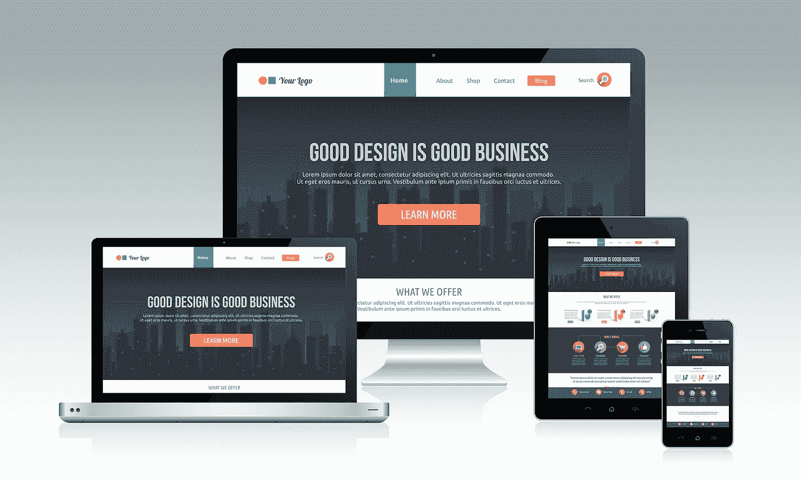
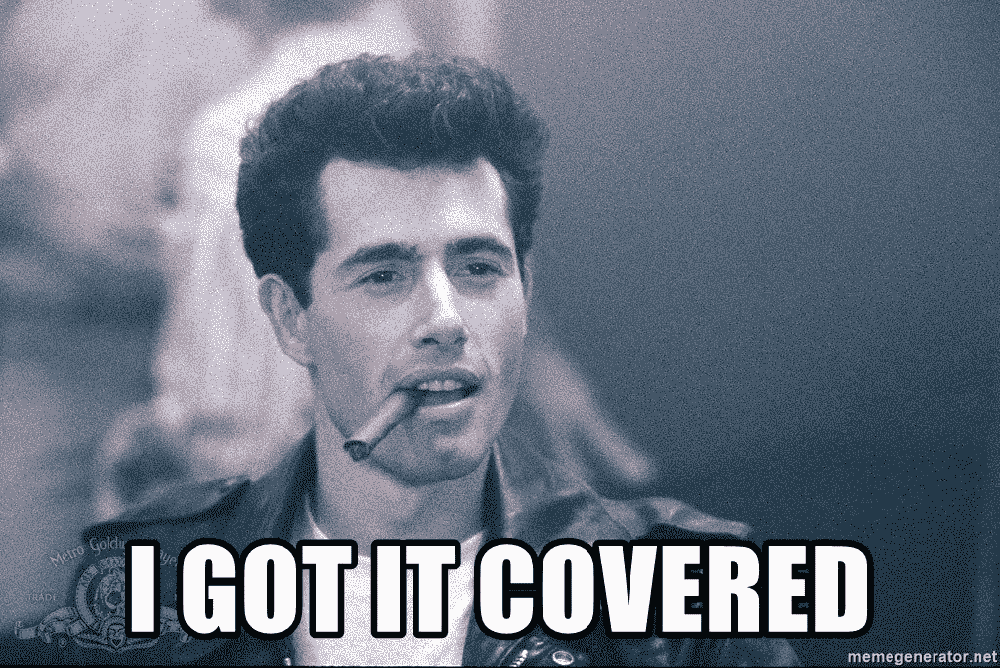

# 角度——响应式网站的代码设计

> 原文：<https://itnext.io/angular-code-design-for-responsive-websites-acd4259a478c?source=collection_archive---------1----------------------->



[*点击这里在 LinkedIn 上分享这篇文章*](https://www.linkedin.com/cws/share?url=https%3A%2F%2Fitnext.io%2Fangular-code-design-for-responsive-websites-acd4259a478c)

当我们承担一个新的前端项目时，设计师为我们提供网站的网络/移动视图。有时它们彼此不同，作为程序员，我们需要确保为这些情况编写可重用且易于维护的代码。

## 问题:

如何创建一个简单的系统，让我们能够在不弄乱代码库的情况下，分别为桌面、平板和移动设备构建组件？

## 解决方案:

他们有很多。我要回顾一下我最喜欢用的一个。


## 满足响应式服务

我通常会创建一个服务，负责确定用户在什么设备或屏幕上浏览网站。至少有几种方法可以做到这一点。

1.  著名的正则表达式:

```
if( /Android|webOS|iPhone|iPad|iPod|BlackBerry|IEMobile|Opera Mini/i.test(navigator.userAgent) ) {
   console.log('mobile device detected'
}
```

2.屏幕的宽度

```
var width = window.innerWidth;
 if (width <= 768) {
  console.log('mobile device detected')
 } else if (width > 768 && width <= 992) {
  console.log('tablet detected')
 } else {
  console.log('desktop detected')
 }
```

## 用哪个？

项目的需求可能会迫使你使用两者或其中之一。决定权在你。
这里的一个经验法则是，如果网站有只在移动设备上提供的功能，比如一些特定的弹出窗口、按钮、电话链接——使用第一种方法。否则，第二种方法总是有效的。



responsive.service.js 示例如下所示:

`checkWidth()`方法根据屏幕的大小设置`screenWidth`属性。如果需要，可以在其他服务和组件中使用该属性。但是，如果用户试图在桌面上调整屏幕大小，或者将移动/平板设备旋转到横向视图，这个属性就没有用了。为此，我们创建了一个名为`isMobile`的 rxjs 主题。该主题可以在任何组件/服务中订阅，以了解我们是否正在查看移动视图。


如果现在事情还不清楚，那也没关系，因为我还没有告诉你如何使用 Angular 的 resize 方法。我们现在来看一些代码。

这是一个 app.component.html 的例子

这里，我们使用 Angular 的 resize 方法`window:resize`。每当带有类`app-body`的 div 被调整大小时，一个叫做`onResize()`的方法就会被触发。
该方法在 app.component.ts 文件中定义:

这里，我们首先订阅 responsive.service.ts 文件中的`getMobileStatus()`方法。记住，如果没有订阅，一个可观察的是没有用的。在您订阅它之后，您调用 `onResize()`方法。这样做是为了当用户最初登陆网站时，你会知道用户的屏幕大小。假设用户在那之后试图调整浏览器窗口的大小。将触发`onResize()`方法，调用响应服务中的`checkWidth()`方法。

如果你向上滚动并检查服务，你会注意到一个方法`onMobileChange()`被调用，它带有一个取决于屏幕大小的参数 true 或 false。这个方法是关键的组成部分，因为它发出一个可以被每个订阅组件捕获的布尔值。因此，基本上，如果用户调整浏览器窗口的大小，屏幕尺寸会被检查，并发出一个布尔值。任何订阅了`responsiveService.getMobileStatus()`方法的组件都会知道用户是在看手机、平板电脑还是桌面视图。


这样，你可以真正减少组件的混乱。以 sample.component 为例，它使用*ngIf 指令根据用户使用的屏幕大小向用户显示不同的 html

希望这是可以理解的，有帮助的。干杯！