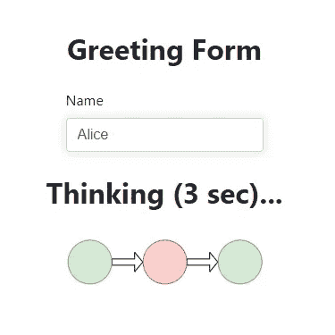
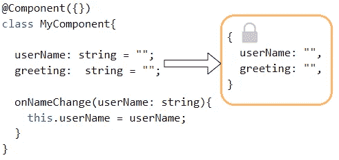
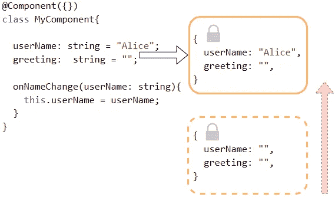
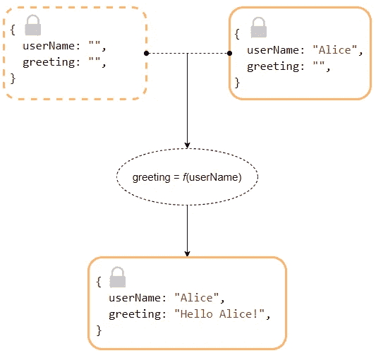
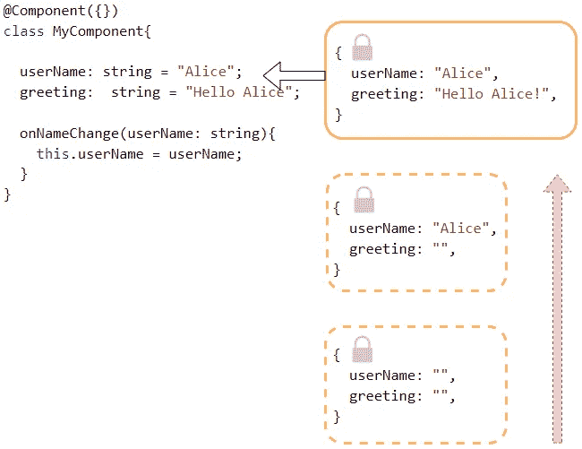
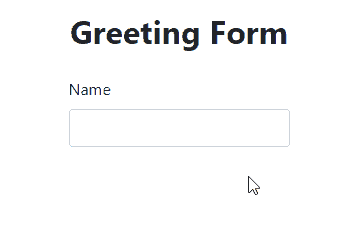
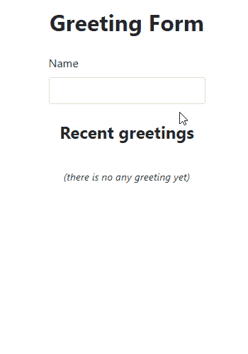

# 基于 ng-set-state 的角分量状态跟踪

> 原文：<https://itnext.io/angular-components-state-tracking-with-ng-set-state-e2b988540407?source=collection_archive---------1----------------------->



在[上一篇文章](/angular-components-with-extracted-immutable-state-86ae1a4c9237?sk=3d9422a57d8ac49a4b1c8de39d6fc0b3)(“[Angular Components with Extracted Immutable State](https://medium.com/p/86ae1a4c9237?source=post_stats_page-------------------------------------)”)中，我解释了为什么在没有任何限制的情况下更改组件字段并不总是好的，并且还介绍了一个允许您简化组件状态更改的库。

从那以后，我稍微修改了它的概念，使它更容易使用。这一次我将关注一个简单的(乍一看)例子，说明如何在通常需要 rxJs 的场景中使用它。

# 概念

有一个不可变的对象表示某个组件的所有字段值:



每当组件的某个字段值(或几个字段值)发生变化时，就会创建一个新的不可变对象。它将包含所有未更改的旧值和新值:



通过比较这两个对象，可以确定哪些确切的字段值已更改，如果这些字段存在逻辑依赖关系，则应执行相应的值评估。评估完成后，将创建第三个对象，这个第三个对象将包含原始值和新评估的值。



现在我们有了新的对象，它也可以与前一个对象进行比较，如果需要的话，可以评估下一个依赖项。这个场景可以重复很多次，直到我们得到一个完全一致的对象。之后，angular 将呈现其数据。利润！



# 简单的问候形式

让我们创建一个简单的问候表单*(s*[*stack blitz*](https://stackblitz.com/edit/set-state-greet?file=src/app/simple-greeting-form/simple-greeting-form.component.ts)*)*:

显然，**问候**字段依赖于**用户名**字段，有几种方式来表达这种依赖性:

1.  用 getter 将 **greeting** 转换成一个属性，但是在这种情况下，它的值将在每次变化检测时计算。
2.  将**用户名**转换为带有 setter 的属性，该属性将更新**问候语**字段的值。
3.  在“(ngModelChange)”上创建事件处理程序，但这将使标记更加复杂；

它们可以工作，但是如果一些其他字段依赖于**问候语**(例如，“问候语计数器”)或者“问候语”依赖于多个字段(例如*问候语=f(用户名，模板)*)，那么这些方法都没有用，因此提出了另一种方法:

首先，组件应该用 **@StateTracking** 装饰器来装饰，或者在构造函数中调用 **initializeStateTracking** 函数(自定义组件装饰器在一些旧版本中不能正常工作):

**@StateTracking** decorator(或 **initializeStateTracking** 函数)找到其他字段可能依赖的所有组件字段，并用带有 getters 和 setters 的属性替换它们，这样库就可以跟踪变化。

接下来，应该定义一些转移函数，例如:

每个转换函数接收一个表示当前组件状态的对象，并且应该返回一个只包含更新字段的对象。它将被合并到当前状态对象的副本中。那么新的更新副本将成为新的组件状态。

或者，您可以添加第二个参数，该参数将接收上一个状态对象。

如果您定义第三个参数，它将接收当前状态和先前状态之间的“差异”对象:

**ComponentState** 和 **ComponentStateDiff** 是过滤掉方法和事件发射器的类型脚本映射类型。此外， **ComponentState** 将所有字段标记为 **readonly** (状态不可变)，并且 **ComponentStateDiff** 将所有字段标记为可选，因为转换函数可以返回原始状态的任何子集。

为简单起见，让我们定义类型别名:

Decorator **@With** 接收一个字段名列表，这些字段名的值的改变将触发修饰的静态(！idspninfopath)属性。)方法。Typescript 将检查该类是否具有声明的字段，以及该方法是否是静态的(转换应该是“纯的”)

# 跟踪日志

现在，当用户键入姓名时，表单会显示相应的问候语。让我们看看组件状态是如何变化的:

**onStateApplied** 是一个钩子函数，每当组件状态变得一致时就调用它——这意味着所有的转换函数都已被调用并且没有检测到更多的变化:

```
Transition:
{} =>
{"userName":"B","greeting":"Hello, B!"}Transition:
{"userName":"B","greeting":"Hello, B!"} =>
{"userName":"Bo","greeting":"Hello, Bo!"}Transition:
{"userName":"Bo","greeting":"Hello, Bo!"} =>
{"userName":"Bob","greeting":"Hello, Bob!"}
```

正如我们所看到的，每当用户键入下一个字符时，组件就会进入一个新的状态，并且问候字段会立即更新。如果需要防止每次名字更改时问候语都更新，那么可以通过使用装饰器为**@添加**去抖**扩展来轻松实现:**

现在，库在最后一次名称更改后等待 3 秒钟，然后才执行转换:

```
Transition:
{} =>
{"userName":"B"}Transition:
{"userName":"B"} =>
{"userName":"Bo"}Transition:
{"userName":"Bo"} =>
{"userName":"Bob"}Transition:
{"userName":"Bob"} =>
{"userName":"Bob","greeting":"Hello, Bob!"}
```

让我们添加一个表单正在等待的指示:

它似乎工作正常，但出现了一个问题——如果用户开始键入，然后决定在给定的 3 秒钟内返回原来的姓名，那么从“greet”转换的角度来看，什么都没有改变，函数将永远不会被调用，表单将永远“思考”您键入的不同姓名。为**用户名**字段添加 **@Emitter()** 装饰器即可解决:

```
@Emitter()
userName: string;
```

它对库说，对这个字段的任何赋值都将被认为是一个改变，不管新值是否与前一个值相同。

然而，还有另一个解决方案——当表单停止思考时，它可以将**用户名**设置为**空值**,用户将不得不开始键入一个新名称:

现在让我们考虑一种情况，当一个用户不耐烦，想立即得到结果。好吧，我们就让他按**回车** ( `(keydown.enter)="onEnter()"`)得到即时结果:

如果用户没有按下 **Enter** 键，知道要等待多长时间就好了——某种倒计时计数器会非常有用:

```
<h1 *ngIf="isThinking">Thinking ({{countdown}} sec)...</h1>
```

它看起来是这样的:



倒计时也应该在每次新的问候准备好的时候重置。它可以防止用户立即按下[Enter]键，此时倒计时仍保持在 **3** 的情况，之后它停止工作，因为它的值不会再改变。为简单起见，让我们重置所有依赖于“正在思考”标志的字段:

# 变化检测

显然，倒计时异步工作，只要组件检测策略为**默认**，这一事实不会导致角度变化检测的任何问题。然而，如果策略是 **OnPush** ，那么在倒计时过程中，没有任何东西可以告诉组件它的状态正在改变。

幸运的是，我们已经定义了一个回调函数，每次组件状态改变时都会调用这个函数，所以唯一需要做的就是在那里添加一个显式的变化检测:

现在，即使使用 **OnPush** 检测策略，它也能按预期工作。

# 输出属性

该库检测所有组件事件发射器，并在绑定的组件字段刚刚改变时调用它们。默认情况下，使用事件发射器的**改变**后缀进行绑定:

```
greeting:  string;@Output()
greetingChange = new EventEmitter<string>();
```

# 共享状态

典型地，当一个组件被销毁时(例如，被* **ngIf** 隐藏)，那么由该组件发起的所有仍然未决的异步操作将一无所获。但是，该库允许将组件状态及其转换提取到一个独立的对象中，该对象可以独立存在于组件上。此外，这样的对象可以同时在几个组件之间共享！

让我们将问候表单组件[转换成服务](https://stackblitz.com/edit/set-state-greet?file=src/app/services/greeting-service.ts):

并将其添加到[模块提供者](https://stackblitz.com/edit/set-state-greet?file=src/app/app.module.ts)。

***includealpredefinedfields****是指所有有一些初始值的字段(哪怕是****null****)都会自动包含到状态对象中。*

要利用组件内部的服务，请按照下列步骤操作:

1.  将服务实例注入到组件中
2.  将状态跟踪器指向服务实例
3.  声明将绑定到相应服务字段的组件字段
4.  订阅服务状态更改——当需要显式更改检测或更改检测策略为“推送”时，这是必要的

采取这些步骤后，组件将看起来像这样:

服务实例被传递到**initializeStateTracking**函数中(使用@StateTracking() decorator 也是可行的，但是需要更多的努力),该函数返回一个状态跟踪处理程序，该处理程序提供一些方法来控制跟踪行为。

订阅需要在服务状态改变时调用 **onStateApplied** 回调函数，或者调用依赖于共享状态的本地转换函数。如果组件使用默认的变更检测策略，并且没有本地转换函数，则不需要订阅。

当组件被销毁时，不要忘记取消订阅它，以避免内存泄漏。或者，您可以调用 **handler.release()** 或**releaseStateTracking(this)**函数来释放组件订阅，但这些方法也会取消挂起的异步操作，这并不总是可取的。

# 复杂共享状态

该库不仅允许在组件中使用共享状态，还允许在其他服务中使用共享状态。

让我们创建一个服务来记录所有的问候，并模拟将它们发送到服务器:

每次**问候**字段值改变时，它将被添加到**日志**数组中。 **logVersion** 将在每次数组更改时增加，以提供更改检测，而不会使 **log** 数组不可变:

该服务不会立即发送新的问候，它将等待一段时间来收集一系列更改:

最后是保存:

这个转换函数不同于其他函数，它是异步的。

1.  它用同步装饰了**，而不仅仅是用**装饰了**。**
2.  装饰器有一个并发启动行为规范(在本例中为 OnConcurrentLaunchPutAfter)
3.  它接收的不是当前状态对象，而是一个函数，该函数在调用时返回当前状态。

同样，我们可以实现问候删除和恢复，但我将跳过这一部分，因为它没有什么新内容。

因此，我们的表单将如下所示:



—

我们刚刚回顾了一个具有相对复杂的异步行为的用户界面的例子。然而，使用一系列不可变状态的概念，实现这种行为并不困难。至少可以考虑作为 RxJs 的替代品。

—

1.  代码链接:【https://stackblitz.com/edit/set-state-greet 

2.链接到上一篇文章:[提取了不可变状态的角度组件](/angular-components-with-extracted-immutable-state-86ae1a4c9237?sk=3d9422a57d8ac49a4b1c8de39d6fc0b3)

3.链接到 ng-set-state 源代码:[https://github.com/0x1000000/ngSetState](https://github.com/0x1000000/ngSetState)