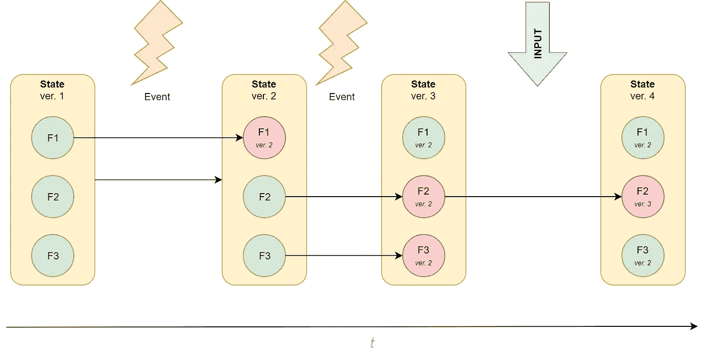
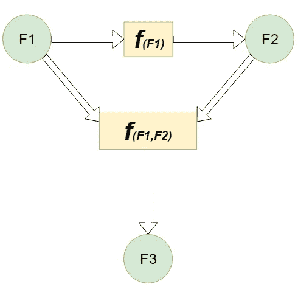
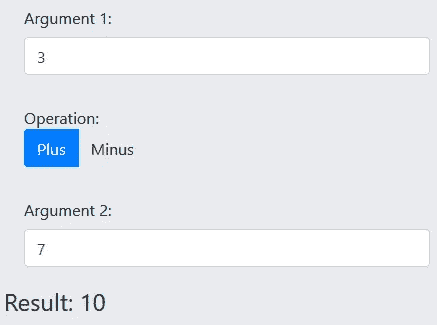
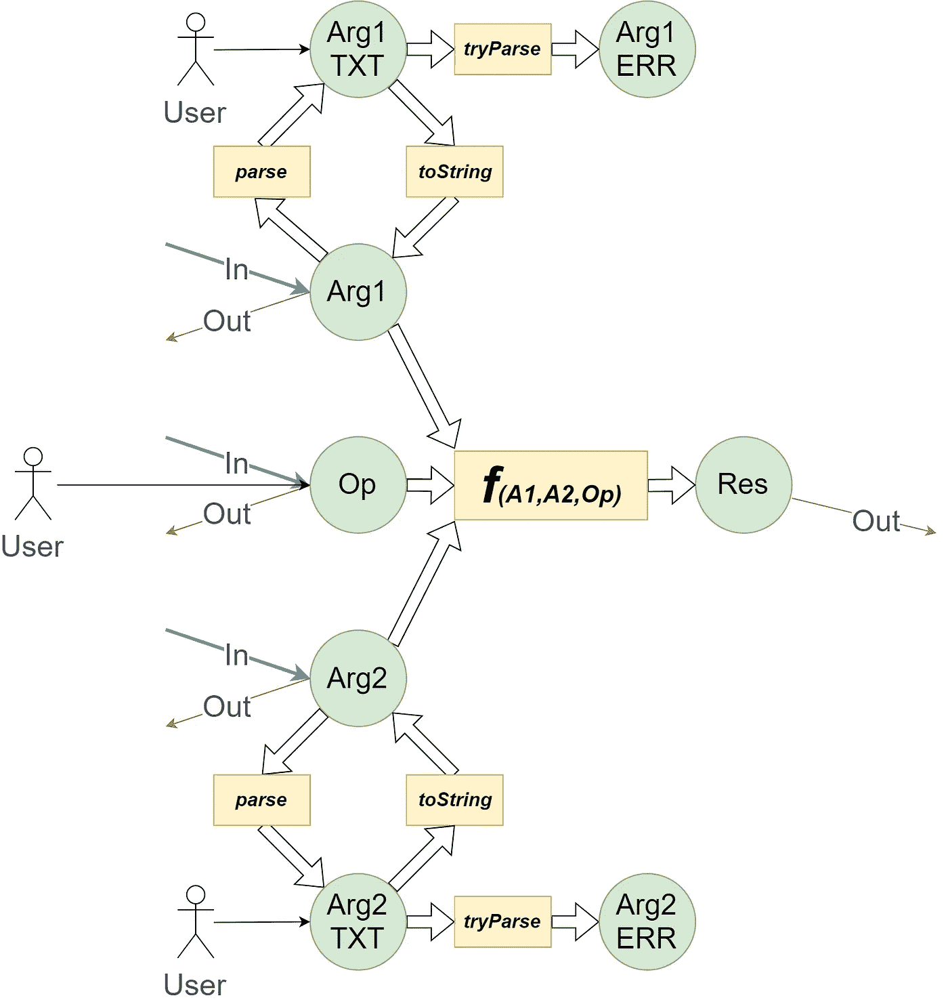
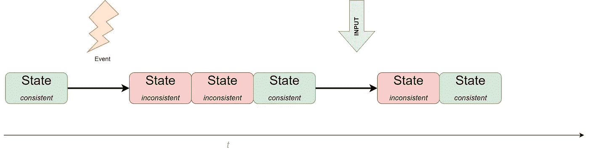
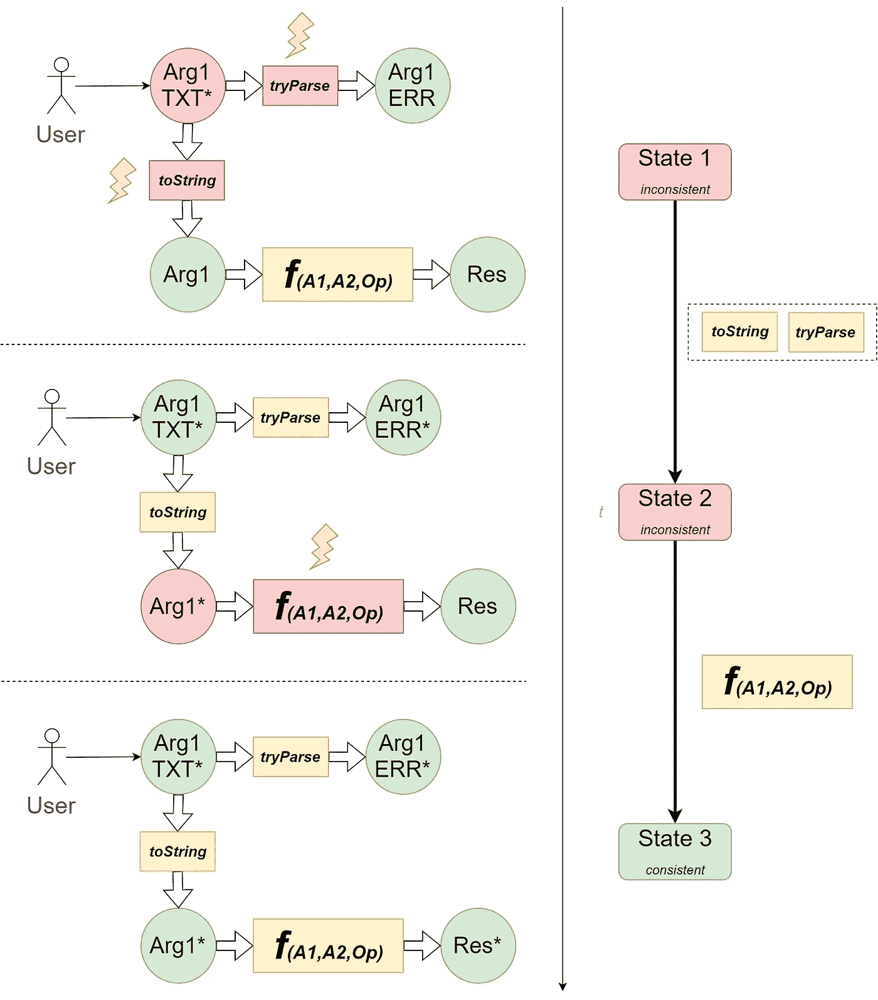

# 提取了不可变状态的角度分量

> 原文：<https://itnext.io/angular-components-with-extracted-immutable-state-86ae1a4c9237?source=collection_archive---------5----------------------->

Angular 的核心概念之一是在框架检测到模板绑定表达式中使用的字段发生变化时更新组件的 DOM。这非常方便，因为它允许只通过更新相应的字段来改变组件的视图，而不需要用 DOM 进行任何直接操作。同时，Angular 为开发人员留下了如何更新组件字段的方法，这在一些简单的场景中工作得很好，因为开发人员可以快速创建满足所有必要需求的组件，而无需引入任何额外的抽象。然而，在更复杂的场景中，很明显，由于副作用的增加，组件行为的不可预测性降低，对组件数据更改的限制的缺乏变成了一个问题。

还有其他因素影响保持自由变化状态的难度:

1.  异步操作

当一个组件正在执行一个或几个异步操作时，这意味着有几个逻辑流在改变共享状态，并且需要一些同步工作。例如，一个组件为一个输入参数加载一些数据，但是当数据被传递时，参数可能已经改变了。数据不再相关，因此应该发起新的请求。

2.组件输入参数

在 Angular 中，输入参数可能随时以任何方式改变(一个接一个或全部同时改变),一个开发良好的组件应该正确地反映这些变化。

毫无疑问，Angular 的创造者们意识到了这些问题，并且从一开始就有人提议使用反应式编程(更准确地说是 RxJs 库)来解决这些问题。然而，在我看来，反应式编程并不总是典型 UI 任务的最佳解决方案。它侧重于随时间分布的事件，但在大多数情况下，需要对正在发生的事件立即做出反应，并且有另一种方法(例如在 React 中使用的)为上述问题提供了更好的解决方案。

这种方法的思想是将组件及其数据分成两种不同的类型。在 Angular 中，它可以实现如下:几乎所有的组件字段都需要移动到一个单独的类中，只有一个字段留在组件中——它是“state ”,其类型将是那个单独的类。所有的类字段都应该被标记为“readonly”，因此改变组件中某些内容的唯一可能的方法是创建一个新的类实例(具有已改变的字段)，然后将该实例设置为组件“state”。

总是会创建一个新的状态实例，作为对需要更改组件状态的事件的反应。它们可以由用户发起(按钮点击、值改变等。)或由系统调用(来自 setTimeout 的回调，“fetch”等。)因此，组件生命周期可以表示为一系列状态实例:



这种方法有以下好处:

1)性能-所有角度模板绑定将能够与已经计算的字段一起工作，因此变化检测将极快地执行。

2)可以完全禁用自动变化检测，因为现在我们知道组件数据何时发生变化，所以不需要在每次鼠标移动时都进行检查。

3)访问以前的状态—有时，当某个字段发生更改时，了解其以前的值很重要(例如，清除与其相关的一些缓存)，现在我们可以轻松跟踪所有更改的历史。

4)最后的组件状态(在被破坏之前)可以被存储在一些永久存储器中，并且当组件被再次创建时，其状态可以被容易地恢复。

5)组件的逻辑可以完全从其表现中分离出来，这将简化单元测试，并且在某种程度上，如果需要的话，将有助于迁移到另一个框架。

理论上，上述所有目标也可以在具有可变状态的普通角组件中实现，但这将明显更加困难。

关于状态字段的另一个重要观察是，在大多数情况下，它们之间存在内部依赖关系。换句话说，有可能确定这样的函数，其参数将是一些状态字段，并且结果将与其他字段的值相对应(假设根据组件的逻辑存在)。



如果不能确定这样的功能，这仅仅意味着当组件仅用于数据表示时，会出现逻辑缺失。

为了解释这个想法，让我们考虑一个简单的组件“计算器”。它有两个输入，用于算术运算的参数和选择器:



参数和运算符可以由用户选择，也可以通过组件输入参数来设置。结果、参数和操作符应该可以作为输出参数:

组件字段之间的依赖关系如下所示:



在大多数情况下，由 8 个字段表示的组件状态是一致的，但当以下 6 个事件之一发生时，这种状态会发生变化:

1)用户已经改变了参数#1 的文本输入

2)用户已经改变了参数#2 的文本输入

3)用户改变了操作选择器

4)参数#1 的组件输入参数已被更改

5)参数#2 的组件输入参数已被更改

6)组件的操作输入参数已被更改

**最后三个事件可以同时发生*

这些事件将导致组件的某些字段的状态发生变化。这也意味着状态不再一致，并且为了使其再次一致，需要调用相应的转移函数，并且需要将它们的结果存储在依赖于最近改变的那些的字段中。然而，这些新的变化也可能导致不一致，进一步的变化将继续发生。但是最终，所有的字段又变得一致(除了无限循环的情况，这种情况应该被认为是 bug ),并且保持一致，直到新的事件发生。

考虑到更改组件状态的唯一方法是创建新的状态实例，对事件的反应可以表示如下:



让我们仔细看看用户更改输入字段时的情况:



如上所示，在前一个状态和下一个状态之间总有一个转换函数(函数可以是复合的)。这些函数的最大优点是它们是纯粹的——它们接收一个不可变的状态并返回一个不可变的状态，并且应该独立于不变量，所以我们可以说我们在 UI 开发中使用了函数式编程。唯一的问题是如何在 Angular 中使用这种方法？它可以“手动”实现，但是如果没有外部库，有几项任务在 Angular 中无法轻松完成:

1)将状态字段映射到角度分量的输入/输出参数

2)检测输入参数的变化

3)选择要运行的过渡函数

为了解决这些问题，我开发了一个微型库“ [ng-set-state](https://github.com/0x1000000/ngSetState) ”，帮助实现上述方法。

让我们看看如何使用库来实现计算器。

([***stackblitz.com 上的全部源代码***](https://stackblitz.com/edit/angular-calc-demo-ngsetstate) )

首先，我们需要创建一个单独的类来表示组件状态:

然后，应使用`**WithStateBase**` 类的继承将状态分配给角度组件:

`**WithStateBase**` 包含“状态”属性和两个修改它的公共方法:

`**modifyState(prop: (keyof TState), newValue)**`**——可以调用它来创建一个新的状态实例，改变一个字段；**

**`**modifyStateDiff(diff: Partial<TState>)**` —当我们需要创建一个新的状态实例，并且几个字段发生了变化时，可以调用这个函数。**

**可以从标记中调用这些方法(AoT 编译将检查它们的签名),以将组件移动到新的状态:**

**对输入变化的反应更加复杂，这就是为什么它被转移到一个单独的方法:**

**你可以注意到这里已经引入了`NewState`类型别名。实际上，它只是`Partial<CalculatorState> | null`的一个快捷方式，这意味着该函数返回状态字段的一个子集，该子集将由库应用于一个新的状态实例。`null`表示不需要改变。**

***注意:Partial < T >是 Typescript 2 中引入的“* [*映射类型*](https://www.typescriptlang.org/docs/handbook/advanced-types.html) *”的一个例子。+.这是一个相当复杂的概念，但是当你掌握了它，你会发现它是多么的伟大和有用！***

**现在，我们准备创建转换函数，当文本字段改变时将调用该函数:**

**它使用`@With`属性来指示当库检测到其名称作为属性参数列出的字段发生变化时，应该调用哪些函数来创建新的状态实例。**

***注意:Typescript 检查这些名称实际上是一些状态字段的名称，否则将会出现编译错误(* [*映射类型*](https://www.typescriptlang.org/docs/handbook/advanced-types.html) *)。***

***注意:示例中没有显示，但是转移函数也可以是异步的。你可以在这里阅读*[](https://github.com/0x1000000/ngSetState/blob/master/README.md#get_satrted_async)*。***

***现在我们可以显示结果:***

```
*<h4>Result: {{state.result}}</h4>*
```

***如果没有任何输入/输出参数，我们的组件看起来不是很有用，所以让我们将一些字段标记为组件输入/输出:***

****注意:引入静态数组 ngInputs 和 ngOutputs 是为了提前编译角度，因为它要求静态解析所有输入和输出参数名。****

***现在，我们可以对组件使用参数:***

***唯一剩下的是—当参数从外部(通过输入参数)更新时，输入字段中的文本也应该更新:***

***计算器现在工作了，但是让我们给它添加一些很酷的东西，例如对用户输入去抖:***

***这非常简单，但现在有问题了——状态变化发生在角度区域之外，它无法再检测到变化。当应用新的一致状态时，可以通过显式更改检测来修复这一问题。为此，我们需要向组件类添加 onAfterStateApplied()的实现:***

***在这里，我们还可以看到，可以完全禁用组件的角度变化检测:***

***现在已经完成了，但是让我们测试一下输入/输出是否正常工作。有一个好方法可以做到这一点——我们只需要添加第二个组件实例，并将它的所有输入/输出属性绑定到原来的组件实例:***

***在这里你可以查看最终版本:[https://stackblitz.com/edit/angular-calc-demo-ngsetstate](https://stackblitz.com/edit/angular-calc-demo-ngsetstate)***

***去年我一直在使用文章中描述的方法，事实证明，当我需要开发一些复杂的组件时，这种方法非常有用。当然，这不是改进开发过程的唯一方法——还有其他像 MobX 或 NgRx 这样优秀的库，它们对于管理日益增长的复杂性也很有用。***