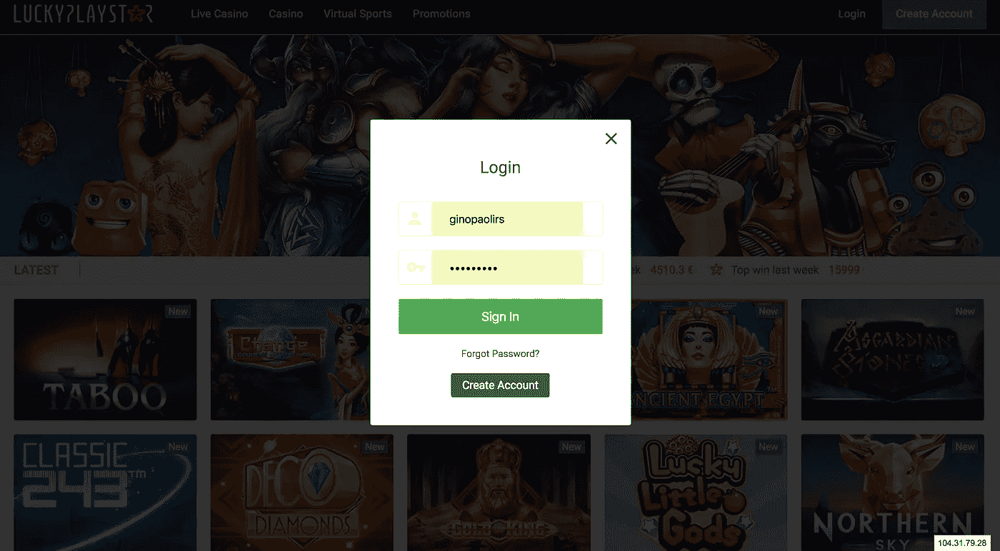

# 角度(angular )-创建自己的模态框

> 原文：<https://itnext.io/angular-create-your-own-modal-boxes-20bb663084a1?source=collection_archive---------0----------------------->


[*点击这里在 LinkedIn 上分享这篇文章*](https://www.linkedin.com/cws/share?url=https%3A%2F%2Fitnext.io%2Fangular-create-your-own-modal-boxes-20bb663084a1)

现代网站有模态，要么向用户显示一些信息，要么从用户那里获取一些信息。如果你不知道什么是模态，下面是它的样子:



登录模式框

有一些库允许你使用引导模式或其他模式类型。然而，您的 web 应用程序不太可能需要第三方库提供的所有特性。没有必要增加几个模态屏幕的包大小，您自己就可以轻松完成。


## **一个模态盒的积木**

1.  将用户的注意力引向模态并隐藏背景的覆盖图。这只是一个简单的`div`在屏幕上延伸，背景颜色是透明的。(不透明度<1)
    
2.  模态容器。这是一个简单的`div`,它将在屏幕上显示模态组件时携带模态组件本身。如果用户决定关闭模态，这个`div`容器将是空的。稍后我们将看到如何将我们的组件添加到这个`div`容器中。
    `**<div id=”modal-container></div>**`
3.  模态本身。由于这是一个有角度的帖子，这将是一个独立的组件，有自己的 html，css 和 javascript。

## 我们将要使用的方法概述

首先，我们将创建必要的服务来创建一个显示模态的系统化方法。我们将创建两个服务，即:

1.  Dom 服务
2.  模态服务

> 记得将服务作为提供者添加到必要的模块中

Dom 服务，顾名思义，将负责从`#modal-container`中创建和移除动态创建的组件(如上所述)。

模态服务将使用 Dom 服务来初始化模态窗口或者销毁它。

我们很快就会详细讨论这两个问题。

但是首先让我们看看我们的`app.component.html`文件

app.component.html

我们应该把注意力集中在这个文件末尾的两个 div 上。第一个 div `#modal-container`是一个容器，我们动态生成的组件将在其中生存，直到它被用户杀死。

> O 一次只能有一个组件存在于`#modal-container`中，因为屏幕上一次只能有一个模态窗口

第二个 div 是`#overlay` div。这是使模态窗口后面的内容变暗的原因。它上面还有一个 click 事件，负责关闭模态。这当然是可选的。

注意这两个 div 都有类`hidden`。这个类隐藏了应用程序开始时的两个 div，因为我们不想在用户登陆页面时显示一个模态窗口。当然，如果这是你想要的，那么你不应该使用`hidden`类。

既然我们已经讨论了隐藏类，现在是时候看看我们将在设置中使用的 css 类了

应用程序.组件. css

这些 css 属性可以根据您的需要进行调整。但是它给了你一个基本的模态窗口和一个覆盖。

接下来我们要看的是组件本身，我们将在`#modal-container` div 中显示它。在本例中，我将其命名为**样本组件**。它只会显示一些文本。但是你可以在模态中显示任何组件，所以可能性是无限的。

样本组件

在这里你可以看到 javascript，HTML 和 CSS。当用户按下关闭按钮时，模态使用我们接下来将创建的`ModalService`调用`destroy()`方法来关闭模态。

让我们先看看`DomService`，因为它将用于`ModalService`

dom.service.ts

这项服务很大，所以让我们一步一步来看。

该服务包含 Angular 提供的三项服务，即:

1.  [组件因子分解器](https://angular.io/api/core/ComponentFactoryResolver)
2.  [应用参考](https://angular.io/api/core/ApplicationRef)
3.  [喷油器](https://angular.io/api/core/Injector)


谈论这些不在本文范围内。然而，你可以通过谷歌来更好地理解它们。如果你有一些角度的经验，理解它们不会是一个问题。记住`DomService`的职责是动态创建组件，并在 DOM 中添加/删除组件。

该服务有两个公共方法，即:

1.  `appendComponentTo()`
2.  `removeComponent()`

让我们看看第一种方法。这个方法接受三个参数。`parentId`，在这种情况下将是`#modal-container`，因为组件的父组件将是我们的模态容器。第二个论点是`child`。这是组件本身。第三个是`childConfig`。这是一个包含输入和输出的对象，将被传递给`child`组件。这部分不用担心，很快就说得通了。代码被注释了，所以理解它应该不成问题。但是，有几行我想看一下。

```
this.childComponentRef = childComponentRef;
```

这条线很重要。`this.childComponentRef`是服务上的私有属性，由`removeComponent()`公共方法访问。正如我们前面所说的，一次只向用户显示一个模态窗口，这意味着在`#modal-container`中只能存在一个组件。该组件在创建时存储在`this.childComponentRef`变量中。在您的应用中，您可以将该变量视为**当前活动模态分量**。

这个方法的最后一行，`document.getElementById(parentId).appendChild(childDomElem)`将组件附加到`#parentId` div 中。

第二个公共方法是`removeComponent()`方法。这种方法破坏了**电流有效模态分量**。它还将它从组件树中删除，这样 angular 就知道在发生变化检测时不检查它。为了理解变更检测，我推荐 Pascal Precht 的这篇文章。

我们要看的下一个服务是`ModalService`。

modal.service.ts

这项服务非常简单。它又有两个公共方法，即:
1。`init()`

2.`destroy()`

`init()`方法采用 3 个输入初始化模态窗口，即:

1.  成分
2.  输入
3.  输出

init 方法使用 DomService 将组件附加到 DOM 和角度组件树中。然后，我们通过使用`.show`类来显示模态和覆盖。

`destroy()`方法破坏组件并隐藏模态和覆盖。

这就完成了设置的主要部分。


## 入口组件

我们不应该忘记的另一件事是在模块的`entryComponents`中添加`SampleComponent`。

应用程序模块

`entryComponents`用于定义最初在 html 中找不到的组件，这些组件是用`ComponentFactoryResolver`动态创建的。为了让 angular 编译，它需要在模块中使用这个提示。由于我们的`SampleComponent`将被动态添加到 DOM 中，我们需要在 NgModule 装饰器中提到它。

## 把这些都用上

在这里，我将向您展示如何使用您创建的新模态服务。您所需要做的就是将 ModalService 导入到您希望从中显示模式的组件中。然后只需调用服务上的 init()方法，并传递想要显示的组件。现在就这么简单。

您可以将输入/输出作为第二个和第三个参数传递给组件。在这个例子中，我在这里传递了一个输入对象。


## 响应性

要使模态具有响应性，可以很容易地通过媒体查询来实现。我可以在另一篇文章中谈论响应性，但这很简单，你可以在网上找到大量的资源来做这件事。

## 结论

请记住，所有这些努力的目的是不要导入一个完全成熟的模态库，它可能会有 bug 或大量额外的开销，而这些在您的应用程序中可能并不需要。这样，随着需求的变化，您可以扩展您的迷你模型库。

我希望这对你们有帮助。干杯！