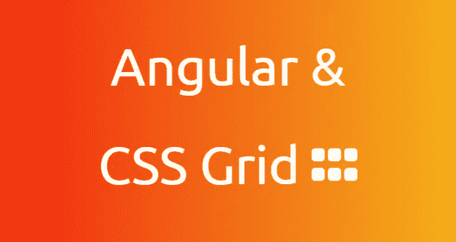
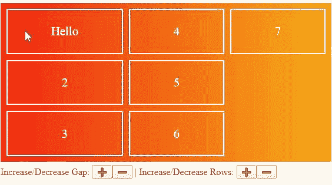
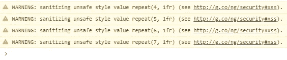
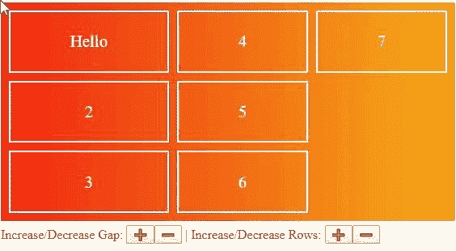

# 角度和 CSS 网格:动态网格属性

> 原文：<https://itnext.io/angular-css-grid-dynamic-grid-properties-1a03634607a1?source=collection_archive---------2----------------------->

## Angular @与 CSS 网格绑定



# 介绍

**源代码/现场演示:** [StackBlitz🚀](https://stackblitz.com/edit/host-binding-and-css-grid)

**文章目标:**研究一种使用 Angular 的`@HostBinding`装饰器动态修改 CSS 网格属性的方法。

**文章主题:**

*   通过杠杆`:host`选择器使用 **CSS-Grid** 和**角度组件**
*   如何用 **TypeScript** 动态调整`column-template-rows`、`gap`等 **CSS 网格属性**。
*   **Angular 的 DOM Sanitizer，**为什么我们必须绕过安全性，以及这样做时我们应该遵循的一些准则。



我们的应用

# CSS 网格(容器和项目)

我们的 [CSS 网格](https://developer.mozilla.org/en-US/docs/Web/CSS/grid)将由两个角组件组成。父容器和子项目。CSS Grid 是一个相对较新的编写 CSS 的惯例，它允许我们构建反应式网格来放置和对齐元素。

[app.component.html](https://stackblitz.com/edit/host-binding-and-css-grid?file=src%2Fapp%2Fapp.component.html)

使用`:host`选择器，角度组件可以自己选择。我们可以使用这个概念将组件视为网格容器或网格项目，避免使用包装器`divs`。🎁

[container . component . CSS](https://stackblitz.com/edit/host-binding-and-css-grid?file=src%2Fapp%2Fcontainer%2Fcontainer.component.css)

*   `display: grid`:将元素定义为网格容器
*   `grid-template-rows`:定义最大行数和行大小
*   `grid-auto-flow: column`:告诉网格在垂直方向**用尽空间**时创建一个**新列**(而不是新行)。
*   `gap`:定义各项之间的间距。

在我们的例子中，每一行将占用 1 部分空间。因为我们在案例`repeat(3, 1fr)`中指定了 3 行，每一行将占 div 高度的 1/3。我们的列将根据上下文大小占用空间。

## CSS 网格提示💎

想要将网格项目中的内容居中吗？使网格项成为自己的网格容器，并利用`justify-items`和`align-items`。

```
.grid-item-class-name {
  display: grid;
  justify-items: center;
  align-items: center;
}
```

# 主机绑定

现在我们对网格有了基本的了解，我们可以访问 Angular Component 类中的 CSS 属性了。

[container.component.ts](https://stackblitz.com/edit/host-binding-and-css-grid?file=src%2Fapp%2Fcontainer%2Fcontainer.component.ts)

[主机绑定](https://angular.io/api/core/HostBinding)允许我们在组件上访问和应用 CSS 样式和类。—我喜欢把这看作是通过 TypeScript 更新`:host`选择器的属性。

[container.component.ts](https://stackblitz.com/edit/host-binding-and-css-grid?file=src%2Fapp%2Fcontainer%2Fcontainer.component.ts)

更新我们的 HostBinding 变量将改变组件的 CSS 属性值。我们可以将它与一个事件联系起来，允许用户更新我们的网格。

## 角形尖端💎

我们还可以使用`@HostBinding`添加和删除**类**

```
export class MyComponent {
  @HostBinding('class.is-valid') 
  get validValue() { return this.value.valid; }
}
```

# **处理事件**

现在 Angular 和 CSS Grid 已经通过 HostBinding 结合在一起了。我们将允许用户(有限制地)更新`grid-template-columns`和`gap`。

使用角度指令是允许同级组件相互通信的一种简单方法。点击按钮时，我们将向容器发送一个事件来更新**主机绑定。**

[container.component.ts](https://stackblitz.com/edit/host-binding-and-css-grid?file=src%2Fapp%2Fcontainer%2Fcontainer.component.ts)

上面的代码片段完成了以下任务

*   订阅间隙更新，通过事件上的`5px`更新间隙，这将增加或减少网格项目之间的间距
*   订阅行更新，将`repeat()`中的第一个参数更新 1，这将增加或减少网格中的行数。
*   验证间隙和行数，以确保我们不会低于 1 行或 0 间隙。
*   使用 DOM Sanitizer 允许我们将样式作为字符串传递。

在 StackBlitz 上可以找到[按钮](https://stackblitz.com/edit/host-binding-and-css-grid?file=src%2Fapp%2Fincrement-decrement%2Fincrement-decrement.component.ts)和[指令](https://stackblitz.com/edit/host-binding-and-css-grid?file=src%2Fapp%2Fcontainer%2Fconnector.directive.ts)的源代码；它们是直截了当的，而且很小。—集装箱承担所有的起重工作。🏋️‍♀️

## 角形尖端💎

如果父级有一个指令，则该父级的所有子级都可以在其 Typescript 类中注入该指令实例。

```
<!-- HTML -->
<app-container appConnector>
  <app-item id="Hello"></app-item>
  <app-item id="2"></app-item>
  <app-item id="3"></app-item>
</app-container>/* TypeScript */
export class ItemComponent {
  constructor(public appConnector: ConnectorDirective) {
   this.appConnector.eventEmitter.subscribe(...)
  }
}
```

# DOM 消毒剂

有很多关于学习 [Angular 的 DOM Sanitizer](https://angular.io/api/platform-browser/DomSanitizer) 的文章和资源。



不使用`bypassSecurityTrustStyle`

这是我对它的简短看法。如果我们锁定用户可以在哪里发送输入以及用户可以发送什么输入，那么可以认为绕过 Angular 的 DOM 杀毒器是“安全的”。🧼

[container.component.ts](https://stackblitz.com/edit/host-binding-and-css-grid?file=src%2Fapp%2Fcontainer%2Fcontainer.component.ts)

我们**允许用户更新 CSS `repeat()`函数中的第一个参数**(where)。我们**将用户的输入**限制为按钮点击；我们控制点击产生的价值(什么)。🔐



[最终申请](https://host-binding-and-css-grid.stackblitz.io)

# 结论

*   角度`:host`选择器使我们能够将组件视为 css 网格或 css 网格项目
*   Angular `@HostBinding` Decorator 允许我们访问和更新 CSS 类和样式
*   Angular 清理对 DOM 的潜在危险更新。我们应该考虑当绕过这个功能时，我们允许用户更新的地方和 T21。
*   感谢阅读！🎉

> ☁️[flotes](https://flotes.app)——尝试演示，不需要登录。或者免费报名。Flotes 是我记笔记和高效学习的方式，即使在我很忙的时候。


[漂浮物](https://flotes.app)

# 资源

*   [DOM 消毒剂](https://angular.io/api/platform-browser/DomSanitizer)
*   [CSS 网格](https://developer.mozilla.org/en-US/docs/Web/CSS/grid)
*   [主机绑定](https://angular.io/api/core/HostBinding)
*   [你的网络浏览器能使用 CSS-Grid 吗？](https://caniuse.com/#feat=css-grid)