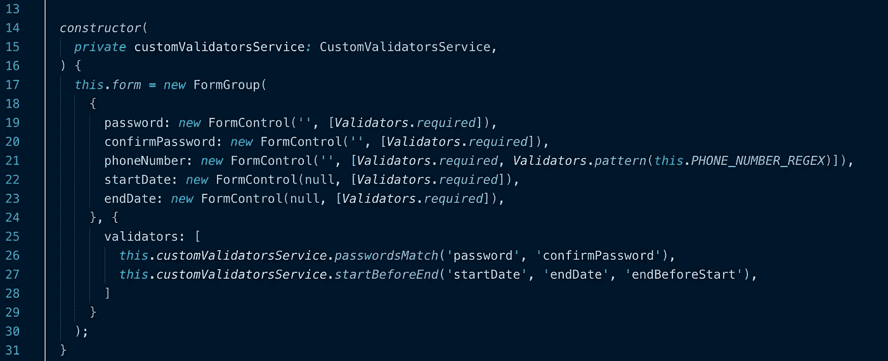

# 角度-自定义表单验证

> 原文：<https://itnext.io/angular-custom-form-validation-bc513b45ccfa?source=collection_archive---------3----------------------->

与 React 和 Vue.js 等其他框架相比，Angular 的一个突出特点是它的内置表单。相对于模板驱动的表单，我个人更喜欢反应式表单，所以本教程将集中于用反应式的方式实现验证器。



# 创建反应式表单

我不会花太多时间解释如何创建表单，因为本教程更侧重于验证器本身，但是我会给那些还不熟悉的人一个快速概述。

```
form: FormGroup;
...*this*.*form* *=* *new* FormGroup({
  password: *new* FormControl('', [*Validators*.*required*]),
  confirmPassword: *new* FormControl('', [*Validators*.*required*]),
  phoneNumber: *new* FormControl('', [*Validators*.*required*, *Validators*.*pattern*(*this*.*PHONE_NUMBER_REGEX*)]),
  startDate: *new* FormControl(null, [*Validators*.*required*]),
  endDate: *new* FormControl(null, [*Validators*.*required*]),
}, {
  validators: [
    *this*.*customValidatorsService*.*passwordsMatch*('password', 'confirmPassword'),
    *this*.*customValidatorsService*.*startBeforeEnd*('startDate', 'endDate', 'endBeforeStart'),
  ]
});
```

表单组是表单控件的集合。它本质上收集了所有的验证和表单状态，并将它们组合成一个实体。例如，如果表单控件无效，则整个表单组也无效。这同样适用于原始的/脏的、接触过的/未接触过的等..你可以在这里找到关于表单组[的更深入的解释。](https://angular.io/guide/reactive-forms#step-1-creating-a-formgroup-instance)

# 基本验证器

从`Validators`开始提供了一定数量的验证器，例如`required`、`email`和`min(#)`。可以将它们添加到第二个参数(类型为 array)内的表单控件中，并且可以根据需要添加任意多个参数。如果验证器的检查失败，表单控件和组上的`errors`对象将获得一个与该错误相关的新键/值(值=真)。默认的基本验证器有默认的键，比如`'required'`。

# 自定义验证程序

自定义验证器可能非常棘手，但是非常有用。一个相当常见的需求是密码匹配。

```
*passwordsMatch*(passwordKey*:* string, confirmPasswordKey*:* string)*:* ValidatorFn {
  *return* (control*:* AbstractControl)*:* { [key*:* string]*:* boolean } *|* null *=>* {
    *if* (*!control*) { *return* null; }
    *const password = control.get(passwordKey)*;
    *const confirmPassword = control.get(confirmPasswordKey)*;
    *if* (*!password*.*value* *||* *!confirmPassword*.*value*) {
      *return* null;
    }

    *if* (*password*.*value* *!==* *confirmPassword*.*value*) {
      *return* { passwordMismatch: true };
    }
    *return* null;
  };
}
```

前几行是简单的空检查，确保控件(也称为表单组)和控件(由键指定)存在。检查每个表单控件是否有值。如果用户还没有在两个字段中输入，我们不想验证。

```
*if* (*!control*) { *return* null; }
*const password = control.get(passwordKey)*;
*const confirmPassword = control.get(confirmPasswordKey)*;
*if* (*!password*.*value* *||* *!confirmPassword*.*value*) {
  *return* null;
}
```

从函数返回`null`相当于说没有错误。然后检查两个表单控件值是否相等。

```
*if* (*password*.*value* *!==* *confirmPassword*.*value*) {
  *return* { passwordMismatch: true };
}
*return* null;
```

最后，要简单地使用验证器，您需要做如下工作:

```
*this*.*form* *=* *new* FormGroup({
  ...
}, {
  validators: [
    *this*.*customValidatorsService*.*passwordsMatch*('password', 'c confirmPassword'),
     ...
  ]
});
```

…其中`'password'`和`'confirmPassword'`是我们想要匹配的表单控件的名称。

您还可以在同一个服务文件(*custom-validators . service . ts*)中看到日期检查的另一个例子，但是我不会对此进行详细描述。我写这段代码的时候感觉很好，所以对两个验证器函数都有单元测试，你可以用`jest`或`npm run test`来运行。

# 摘要

习惯自定义表单验证有点乏味，但是它为您希望完成的任何表单验证提供了无限的支持。永远记住从服务中导出您的定制验证器，这样您就可以在应用程序中的任何地方重用这些验证器。

看看我在 Github 上的例子:[https://github.com/orange-bees/angular-concepts-tutorials](https://github.com/orange-bees/angular-concepts-tutorials)。

# 关于我

我在南卡罗来纳州格林维尔的软件工程咨询公司 [Orange Bees](https://orangebees.com/) 担任首席工程师。我写得棱角分明。NET 应用，在 Azure 架构项目(Azure Developer Associate 认证)，涉猎 ElasticSearch 和 node . js
你可以在 [LinkedIn](https://www.linkedin.com/in/james-l-gross/) 上找我。