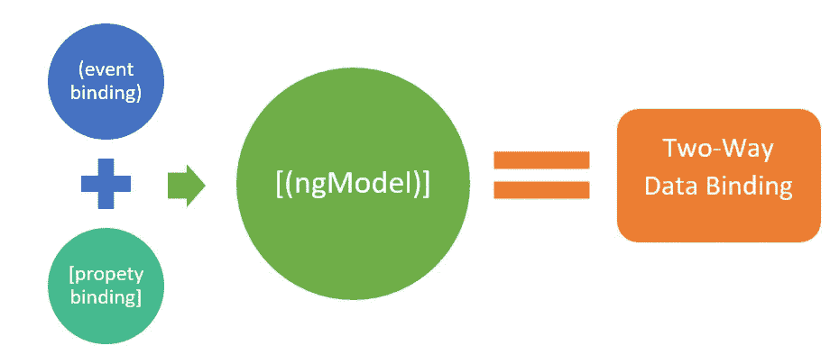

# Angular 自定义双向数据绑定——一个复杂的故事？

> 原文：<https://itnext.io/angular-custom-two-way-data-binding-a-complicated-story-5b74291a138?source=collection_archive---------4----------------------->

你好，
正如你可能已经推断出的，我使用 Angular 已经有一段时间了，我总是对我们如何定制双向数据绑定感到恼火。

让我们从一些基础开始:

现在，要将一个组件的属性设置为输入或输出，你已经有了一个清晰的修饰器，一行代码，很好的实现(向开发人员致敬)。

但是当我们尝试使用 **[()] (** 香蕉盒语法)进行双向数据绑定时，我们遇到了另一个完全不同的故事:

要声明双向数据绑定属性，我们需要:

*   1 个额外的属性
*   1 个额外的输出装饰器
*   命名约定(属性名+'更改')
*   每次你想改变属性的时候，记得调用 **emit**

虽然我很欣赏这给了我们大量的控制，但它可能会用随机错误填充代码库，仅仅因为我们有时忘记调用 **emit** 函数。
甚至可能会阻止开发者使用该功能。

但是，如果您必须对 3-4 个属性执行此操作，所有这些对错误的担心都会成倍增加，因此，如果您真的想使用该特性，这是不可持续的。

救世主来了，当然是我自己。我创建了一个双向绑定装饰器的小实现。40 行代码彻底解决了这个烦人的问题。

使用[双向装饰器](https://www.npmjs.com/package/two-way-decorator),您可以获得两个世界的优势:

当您希望总是同步组件树中的两个组件时，您可以获得双向绑定的装饰器，如果出于性能或业务考虑需要，您仍然可以使用旧方法。

装饰器是用 TypeScript 编写的，它在 JS 对象上使用 get/set 模式，所以它的性能会很好。

现在我们都可以像正常人一样写代码了。谢谢你来参加我的 TED 演讲。