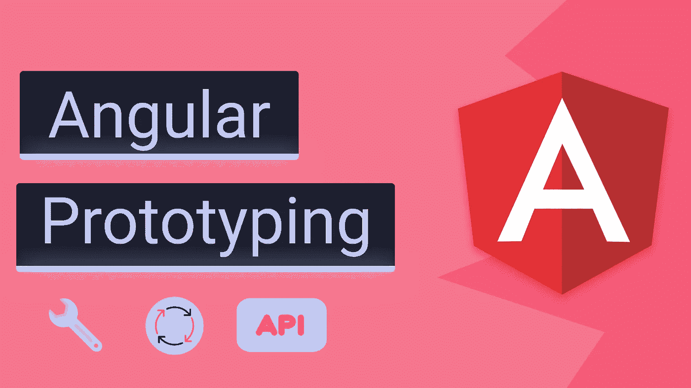
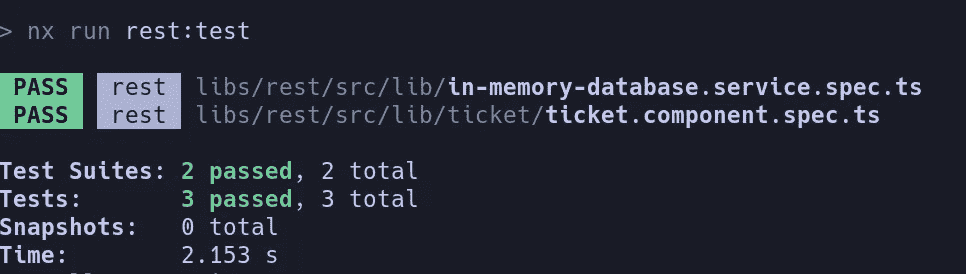

# 角度:使用原型开发更快

> 原文：<https://itnext.io/angular-develop-faster-with-prototyping-aafdf3376e6e?source=collection_archive---------1----------------------->

## 快速开发和测试原型



# 关于我👋

我目前是一名软件工程师，**和一些业内最好的 Angular 开发人员一起在**财富 100 强公司思科**工作。我在业余时间积极从事一些辅助项目，这些项目由 Angular & Firebase 提供动力。**

> 🔥 [**源代码**](https://github.com/Everduin94/poc)——或者，每个要点都有一个到其对应文件的链接

# 目标🗺️

*   🦠维持一套通用模拟数据
*   🧬在 e2e (cypress)和单元(jest)测试之间共享模拟数据
*   🧙‍♂️高效地为原型开发和测试创建模拟数据
*   🧪编辑和删除不会影响实时数据
*   🔭方便地存根 HTTP 请求

原型是指我们利用一些样本或模拟数据来快速测试一个想法。每当我开始一个新项目，我做的第一件事就是有效地建立架构原型。 —不要与 [JavaScript 原型](https://developer.mozilla.org/en-US/docs/Learn/JavaScript/Objects/Object_prototypes)混淆🙂

这在以下情况下很有用

*   🐇快速证明一个想法的概念，而不影响实时数据
*   🖥️:相应的 API 还没有安装在后端
*   🧪利用真实数据进行单元和 e2e 测试

额外的好处是，这个设置将使我们能够使用一组模拟数据进行所有的手工、单元和 e2e 测试。—这意味着**我们不必为 e2e 测试创建 JSON fixture**，并且**可以利用来自我们手动测试**的相同数据。

# 装置🔧

以下仅在利用 **HttpClient** 时有效。如果你正在使用 *Angular & Firebase* 参见[Angular Prototyping:Firebase Emulator&Cypress](https://erxk.medium.com/angular-prototyping-firebase-emulator-with-cypress-9ff6f5b3bf8a)。

在内存中安装*角度 API:*

```
**npm i angular-in-memory-web-api**
```

## 内存 API 中的 Angular 是什么？

它本质上是一个运行在您的机器上的伪后端，知道如何模仿 HttpClient 从 Angular 服务返回数据。

本文将关注如何使用它来原型化测试，而不是深入库本身。

# 配置⚙️

创建一个角度服务来管理原型数据。

[来源](https://github.com/Everduin94/poc/blob/main/libs/rest/src/lib/in-memory-database.service.ts)

上述配置使我们能够:

*   通过`httpClient.get('api/tickets')`获取所有门票
*   通过`httpClient.get('api/tickets/ID')`买票
*   通过`httpClient.delete('api/tickets/ID')`删除车票
*   通过`httpClient.put('api/tickets/ID', DATA)`更新车票

要设置服务，我们需要将它导入到我们的`app.module`中，并添加一个标志来确定它是打开还是关闭。—建议在您的*环境*文件中添加一个标志，以确定内存 API 应该打开还是关闭。

[来源](https://github.com/Everduin94/poc/blob/main/apps/demo/src/app/app.module.ts#L33-L38)

为了使这篇文章简短扼要，我已经创建了一篇简短的单独的配套文章，以防您不确定[**如何设置自定义环境**](https://erxk.medium.com/nx-setup-a-custom-environment-116342b7815b) 。—这允许我们拥有独立的开发、生产和原型环境

# 使用

在内存 API **打开的情况下运行您的项目。(**💡*原型*是我定制环境的名字。这将是你给它起的名字)

```
// Nx Project
**nx run APP:serve:prototype**
// Without Nx
**ng serve configuration=prototype**
```

下面的代码是一个简单的例子来看看我们的模拟器工作。

*   🧙 **在 init 上调用** `**http.get(‘api/tickets’)**`(这将调用内存 API)
*   🔋**将** `**tickets**` **设置为来自内存 API 的响应**
*   🌈在模板中的票上循环，**显示票值**。

[组件源](https://github.com/Everduin94/poc/blob/main/libs/rest/src/lib/ticket/ticket.component.ts) | [服务源](https://github.com/Everduin94/poc/blob/main/libs/rest/src/lib/ticket/ticket.service.ts)

接下来的部分将着眼于使用我们刚刚在我们的单元和 e2e 测试中使用的**、**相同的数据集。

# 在笑话中使用(单元测试)🃏

我们将通过向我们的*测试床*添加`HttpClientInMemoryWebApiModule`来设置我们的测试，类似于我们在`app.module`中设置它的方式。注意，**我们不必在测试文件中向 HttpClient** 添加 mocks 或存根请求。

在我们的*inmemorydataservice*中，我定义了 5 张票。我们将**使用上一节**中的相同组件。回想一下，组件在 *ngOnInit 中调用了`http.get(‘tickets’)`。*我们**期望组件在 init 上返回所有 5 张票**。

[来源](https://github.com/Everduin94/poc/blob/main/libs/rest/src/lib/ticket/ticket.component.spec.ts)

```
// NX **nx run YOUR_APP:test** // Without NX **npm run test**
```



5 张票全部退回

这在测试时提供了一些好处。

*   🧼自动处理**设置和拆除**数据
*   🧙直接调用我们的组件**，而没有显式创建模拟**
*   🦠简单地通过使用另一种服务来传送数据集

在大型团队中工作时，我看到了组织模拟数据的混合策略:JSON fixtures、大型 Javascript 文件、spec 文件中的内嵌模拟数据——这个工作流清楚地表明了模拟数据应该存在于何处，为团队提供了**组织优势**。

这个例子非常简单，但是作为一个证明，**几年前我在一个专业项目中广泛使用了这个策略**，在那里我有能力做出这样的架构决策。—在我看来，它甚至在复杂的应用程序中也能工作，因为内存 API 有如此大的灵活性。

# 在柏树中使用(E2E 试验*)🌳

要在上用内存 API **运行 Cypress，我们需要在运行 Cypress 时指向原型配置/环境。**

对于非 Nx 项目，我一般先运行`ng serve --configuration="YOUR_ENV"`，然后单独运行`cypress open`。

对于 Nx 项目，在你的**APP-e2e***project . JSON*中设置`devServerTarget`为你的原型环境名[【源】](https://github.com/Everduin94/poc/blob/main/apps/demo-e2e/project.json#L6-L11)[如何设置自定义环境](https://erxk.medium.com/nx-setup-a-custom-environment-116342b7815b)

```
**"devServerTarget": "APP:serve:prototype"**
```

现在 Cypress 应该使用内存 API 运行了:

```
**nx run APP-e2e:e2e --watch**
```

我在我所有的附带项目 E2E 测试中使用了这个策略。下面的例子使用了 0 json fixtures 和 0 cypress 截距。这在我的项目中极大地帮助了我构建新想法的原型，测试特性，并维护有用的模拟数据。


E2E 的例子

# 结论

作为一名开发人员，一个好的原型工作流对我来说是必不可少的。这里列出的内容没有硬性规定。以适合您工作流程的方式使用这些工具。

我离开写文章有很长一段时间了，一直在做大量的工作:Angular、Firebase、Neovim、Linux 和 Lua。如果你有什么想听我解释的，或者是列表中的某个特定话题，请在评论中告诉我！

# 参考

> *注意，E2E 在这里被广泛使用。从技术上来说，我称之为“功能性”测试，因为它没有触及一个活动的后端。

*   [缩略图中的图标](https://lordicon.com/icons/wired/flat)
*   [在内存 API 文档中](https://github.com/angular/in-memory-web-api)
*   [如何用 Nx 设置自定义环境](https://erxk.medium.com/nx-setup-a-custom-environment-116342b7815b)

> ☁️[flotes](https://flotes.app)——尝试演示，不需要登录。或者免费报名。Flotes 是我记笔记和高效学习的方式，即使在我很忙的时候。


[Flotes](https://flotes.app)

*   [源代码](https://github.com/Everduin94/poc)