# 带有开发容器的 Docker 中的角度开发

> 原文：<https://itnext.io/angular-development-in-docker-with-dev-containers-49d2cabad445?source=collection_archive---------0----------------------->


在 [Unsplash](https://unsplash.com?utm_source=medium&utm_medium=referral) 上 [Pawel Czerwinski](https://unsplash.com/@pawel_czerwinski?utm_source=medium&utm_medium=referral) 拍摄的照片

接下来，在我的关于用 Visual Studio 代码和开发容器做有趣的事情的系列文章中，我将设置一个有角度的前端，当然，使用 Docker 和 Visual Studio 代码构建一个开发环境。

您可以在我的 [GitHub](https://github.com/AndyWatt83/angular-docker-dev-env) 上找到本文附带的代码。

在我们开始之前，让我们先回顾一下这样做的一些原因:

*   所有开发人员环境的一致性，这意味着“它在我的机器上工作正常”的终结。
*   接纳新的开发人员非常容易——他们只需拉出回购，所有的开发依赖都已经存在了。
*   更新每台开发机器也非常容易。
*   在开发机器上构建和运行项目的需求被表达为代码，并随着回购而移动。(扩展“基础设施即代码”的概念，以包括开发环境)
*   您不需要为您正在处理的每个项目的依赖关系“污染”您的机器。
*   这不是强制性的。如果团队中的任何一个开发人员因为某种原因厌恶 Docker，他们可以选择退出，不使用 Docker 功能。
*   您正在工作的环境是为您正在工作的项目量身定制的。

# 先决条件

根据前几篇文章，我假设您知道如何使用 Docker、VSCode 和 Linux / WSL。您正在使用的机器需要安装以下设备:

*   [Docker](https://docs.docker.com/get-docker/)
*   [Visual Studio 代码](https://code.visualstudio.com/download)
*   VSCode 的'[远程容器](https://marketplace.visualstudio.com/items?itemName=ms-vscode-remote.remote-containers)'扩展
*   如果你用的是 Windows，[我推荐 WSL](https://docs.microsoft.com/en-us/windows/wsl/install-win10) ，尽管这不是必须的。

# 入门指南

打开一个 WSL 终端，创建一个新文件夹，用`code .`打开 VSCode

当 VSCode 打开时，点击 F1 并搜索`Add Development Container Configuration Files`

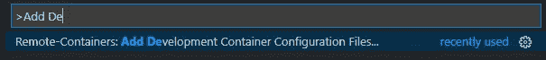

现在搜索`Node.js & TypeScript`

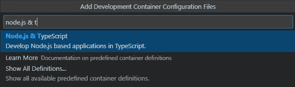

选择您的版本— **使用 V14 很重要，因为目前 v16** 存在兼容性问题。[确认这仍然有效]

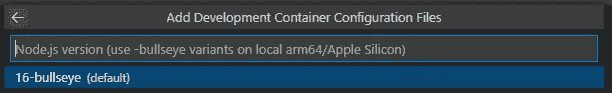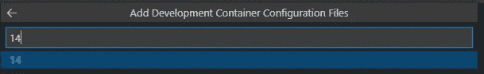

无需添加任何附加功能，只需点击“确定”

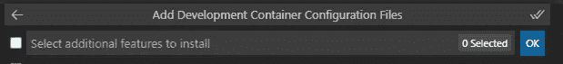

VSCode 将弹出以下内容


(提示:如果没有弹出，按 F1 并搜索`Rebuild and Reopen in Container`)

单击在容器中重新打开。第一次这样做可能需要一段时间，但以后会快得多。完成后，VSCode 的左下角应该看起来像这样:

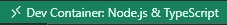

现在我们知道我们在一个容器中运行。并不完全清楚有什么变化，但是如果你打开一个终端，你会发现它既不是 windows，也不是你的 WSL 设置

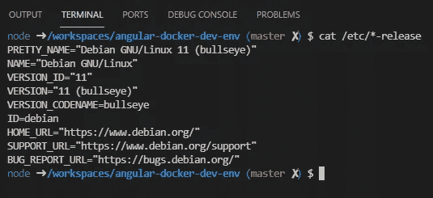

你可以在这个阶段尝试创建一个新的 Angular 项目，但是，Docker 环境不知道 Angular 是什么，所以我们有一些工作要做…


# 安装角度

打开 Dockerfile(在`.devcontainer`文件夹中找到)，取消对该行的注释以安装全局节点包，并添加 angular cli。它应该是这样的:

```
# [Optional] Uncomment if you want to install more global node packagesRUN su node -c "npm install -g @angular/cli@13.0.3"
```

在这一点上，指定版本号绝对是值得的。如果您没有指定版本，那么您只能在构建容器时获得最新的版本，并且您不能保证在每个环境中的一致性。

**在您看到终端中反映的更改之前，您需要退出并重新进入远程容器环境(按** `**F1**` **)。**

回到容器环境后，打开一个终端并键入`ng --version`以确认安装了 cli。

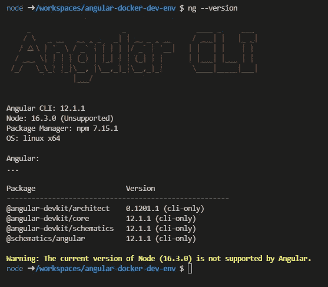

可以走了！

用`ng new test-app`创建一个新的应用程序(不要担心选项，只需选择默认值)。

cd 放入文件夹`cd test-app`并构建应用程序`ng build`以查看以下输出。

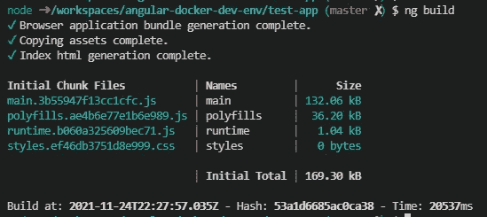

现在运行应用程序`ng serve`，然后转到 [http://127.0.0.1:4200/](http://127.0.0.1:4200/) 查看应用程序的运行情况！

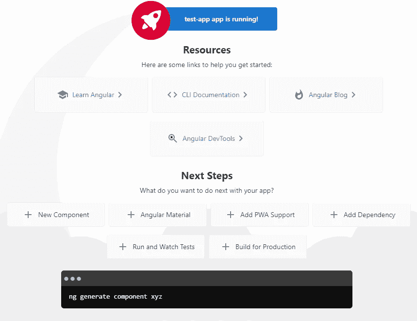

# 扩展ˌ扩张

使用 dev 容器的最大好处之一是，您可以专门为项目类型配置 VSCode。为此，请设置角度特定延伸的列表。

进入 devcontainer.json 文件并添加以下扩展名:

```
"lucono.karma-test-explorer",
"angular.ng-template",
"johnpapa.angular2",
"alexiv.vscode-angular2-files",
"esbenp.prettier-vscode",
"dbaeumer.vscode-eslint",
"shardulm94.trailing-spaces"
```

在这一点上，您可以随意添加任何您可能已经习惯的内容。以上是有角发展的良好开端，但绝非面面俱到。

# 测试

在这被归类为“开发环境”之前，我们需要确保单元测试可以运行。

您可以通过键入`ng test` …来运行测试，您将会看到以下错误。

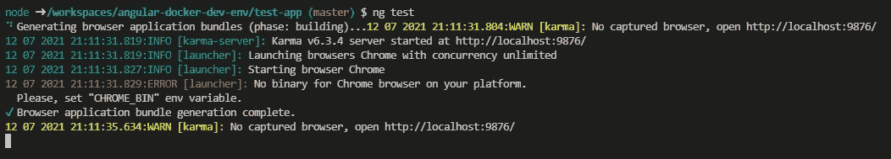

这些错误是由于 docker 图像没有浏览器造成的。通过将以下内容添加到 Dockerfile 文件来安装 Chrome:

```
RUN wget -q -O - https://dl-ssl.google.com/linux/linux_signing_key.pub | apt-key add -RUN sh -c 'echo "deb [arch=amd64] http://dl.google.com/linux/chrome/deb/ stable main" >> /etc/apt/sources.list.d/google.list'RUN apt-get update && apt-get install -y google-chrome-stable
```

**同样，您需要退出并重新进入 Docker 环境才能看到这些变化。**按 F1，重新打开 WSL 中的文件夹，然后再次按相同的方式返回 Docker 环境。

我们还需要设置 Karma 在无头模式下运行 Chrome。进入 Karma 配置文件，将`browsers:['Chrome']`替换为

```
browsers: ['ChromeHeadlessNoSandbox'],
customLaunchers: {
  ChromeHeadlessNoSandbox: {
    base: "ChromeHeadless",
    flags: [
      "--no-sandbox",
      "--disable-setuid-sandbox"
    ]
  }
},
```

现在运行`ng test`应该会导致测试通过！

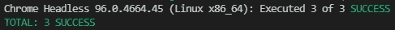

## 测试浏览器

我们已经添加了 karma Test Explorer 扩展，所以让我们为它添加配置，并使它工作！

在项目根目录下创建一个名为`.vscode`的文件夹，在该文件夹中添加一个名为`settings.json`的文件，并粘贴如下内容:

```
{
"karmaTestExplorer.projectRootPath": "test-app",
}
```

现在点击 test explorer 应该会显示自动添加的虚拟测试，您应该能够点击运行它们，并看到它们通过。

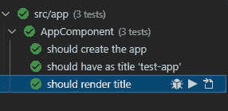

*(如果这里出现错误，您需要关闭并重启 VSCode，并重新进入 Docker 环境。)*

# 结论

我认为这是一个暂停的好地方，尽管显然还有很多可以添加的内容。此时，我们有:

*   一个基于 Debian 的角度开发环境。
*   访问角度命令行工具。
*   定制的 Visual Studio 代码，带有专门针对角度开发的扩展。
*   可以根据需要构建的基本/默认项目。
*   通过命令行和测试资源管理器运行的单元测试

接下来的步骤可能是

*   使用 Cypress 添加端到端测试(观看此空间！)
*   添加 git 凭证——目前我正在主机上与 git 交互。

请在评论中告诉我你的想法。我很想知道是否有人已经在现实世界的项目中使用它了。我认为这是一项非常强大的技术，随着技术的成熟，我们将会看到越来越多的这种技术！


照片由 [Junseong Lee](https://unsplash.com/@bearsnap?utm_source=medium&utm_medium=referral) 在 [Unsplash](https://unsplash.com?utm_source=medium&utm_medium=referral) 上拍摄