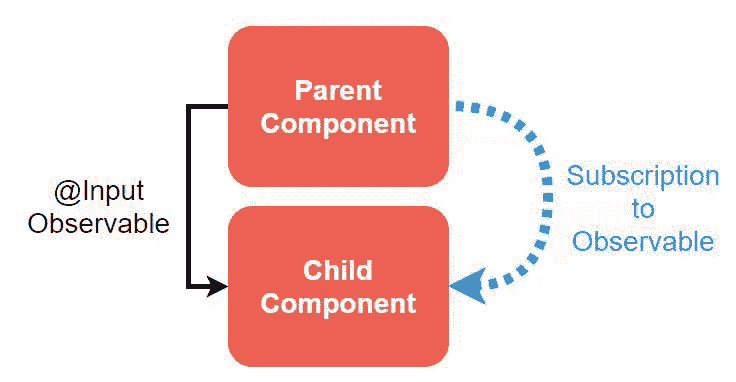
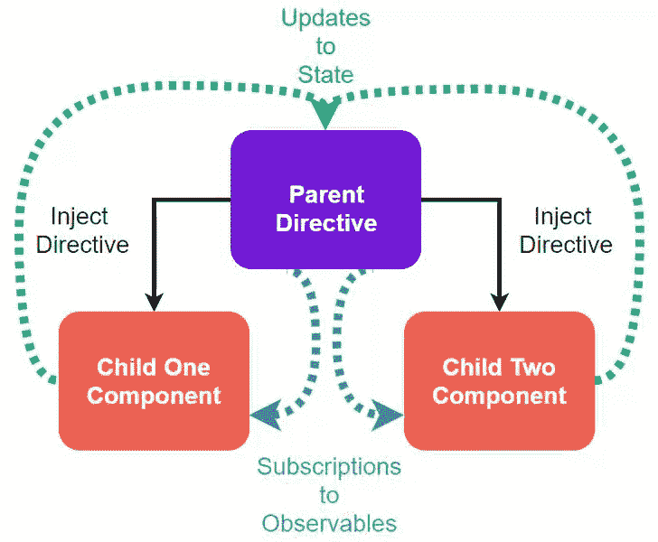
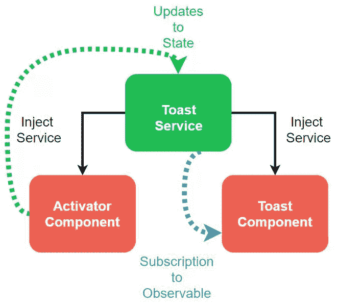
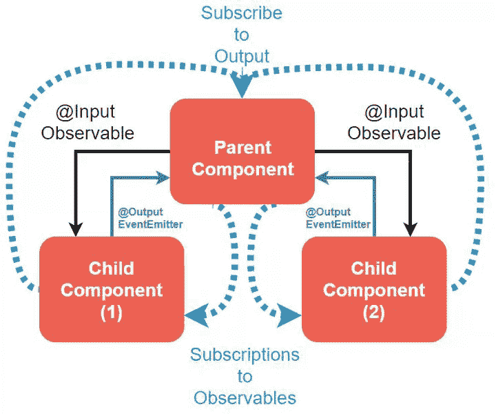

# 角度:有效组件模式

> 原文：<https://itnext.io/angular-effective-component-patterns-f5f7f08e2072?source=collection_archive---------0----------------------->

## 在组件之间共享数据

我构建了一个示例 Angular 应用程序，显示了四种组件模式。这些模式对于在组件之间共享数据既简单又有效。我们将使用这些模式的具体例子来说明如何使用它们。

[在 Github 上下载源代码🚀](https://github.com/Everduin94/component-communication-patterns)

[在 Stackblitz 现场测试🚀](https://stackblitz.com/edit/erxk-component-communication)

我们将涵盖:

*   将数据从父组件传递到子组件
*   在同级组件之间传递数据
*   将数据从一个组件传递到一个不相关的组件。
*   父组件和子组件之间的多向数据传递

# 父子模式

我们可以根据组件在 DOM 中的位置实现不同的模式。每当我们需要促进两个组件之间的通信时，我们可以根据它们之间的关系来实现其中一个模式。

当一个元素(子元素)位于另一个元素(父元素)内部时，就存在父子关系。我们的父到子示例将是一个“服务条款”复选框，它将在悬停时显示工具提示。选中该框后，工具提示的消息将会改变。

## 主体和可观察的——维护和发出状态变化

我们所有的模式都将利用从 BehaviorSubject 创建的一个`BehaviorSubject/state`和一个`Observable/eventStream$`。这允许我们在行为主体中保持状态，并通过可观察对象发出对该状态的改变。[【1.1】](http://reactivex.io/rxjs/manual/overview.html#observable)[【1.2】](http://reactivex.io/rxjs/manual/overview.html#behaviorsubject)

提示:利用一个**私有行为主体**和一个**公共可观察对象**允许我们**锁定对我们状态的访问并防止过度修改**。

parent.component.ts | ToS 复选框☑

现在我们可以**利用与 RxJS 的角度事件绑定来触发对我们的状态/数据的更新**。每当父节点的输入被改变或与鼠标交互时，父节点状态将被更新。[【2】](https://angular.io/guide/user-input)

我们所有的模式都将利用角度事件绑定和类似的 RxJS。关键的区别在于组件如何接收可观察值，或者它们如何相互传递状态变化。

parent.component.html | tos 复选框☑

## @Input —接收子组件中的更改

在初始化时，我们的父节点将使用`@Input`把它的可观察值传递给我们的子节点。一旦输入被初始化，**子进程将通过我们的异步管道订阅接收父进程状态的任何变化。**[【3】](https://angular.io/api/core/Input)

利用这种模式，我们的组件现在完全是反应式的。这简化了在调试或将来进行修改时使用组件的工作。

child.component.html |工具提示

## 可观察值和@Input 的交替使用

我们可以使用一个异步管道将值从父对象传递给子对象，而不是传递整个可观察对象。使用——基于偏好，或者一个比另一个更适合特定需求。**

parent.component.html

child.component.html

# 兄弟模式

当多个元素共享一个公共父元素时，就存在兄弟关系。我们的兄弟组件示例将是一个改变显示颜色的颜色选择器。在这个例子中，只有我们的颜色选择器会更新状态。然而，利用这种模式，任何数量的兄弟都可以更新状态。

## 容器和指令——促进沟通

在兄弟组件之间传递数据；我们将把它们包装在一个容器中，比如 div 或 ng-container，并对容器应用角度指令。**该指令将作为兄弟之间的父指令或中介**,用于相互传递状态/数据。

类似于我们的亲子模式，我们仍然使用私有行为主体。但是，我们将向兄弟节点公开更新状态的方法。这允许兄弟姐妹向我们的行为主体发送新数据，而无需直接访问它。

parent.directive.ts

## 注入指令—访问状态

我们的兄弟组件注入父指令[【4】](https://angular.io/guide/dependency-injection)。这给了他们引用我们指令的可观察值`color$`的能力。为了访问从`color$`发出的值，我们将利用异步管道。理想情况下，只要适用，我们都希望使用异步管道。[【5】(我的文章:异步管道深潜)](https://medium.com/better-programming/angular-rxjs-async-pipe-deep-dive-2510b56f793a)

儿童-两个.组件. ts | child-two.component.html |颜色选择器

我们可以添加任意多的兄弟姐妹。我们只需将兄弟元素添加到容器中，它将能够发送和接收来自其他组件的数据。

app.component.html

# 无关模式

没有共同父元素的元素被认为是不相关的。我们的例子是一个按钮和一个 toast 消息，它们不共享一个公共的父类或包装器。我们将利用角度服务来促进两个组件之间的数据共享。

## 注入服务访问状态

这种模式类似于兄弟模式。关键的区别在于，我们使用了角度服务，而不是角度指令。该服务的优势在于我们不再需要在同一个容器中包含两个组件。

与指令相比，如果我们需要服务的多个实例，服务的一个潜在缺点是增加了复杂性。在这个场景中，我们只需要服务的一个实例。

toast.service.ts

每当`ActivatorComponent`对`ToastService`进行更新时，`ToastComponent`将通过服务接收更新。在这个场景中不需要@Input，因为一切都是通过服务实现的。

activator.component.ts | Button

toast.component.ts | Toast

# 多方向数据

我们的最后一个模式将以一个带有多个子元素的父元素为特色。父节点将能够将状态/数据向下传递给子节点，子节点将能够将状态/数据向上传递回父节点。

## 主体和可观察的——维护和发出状态变化

类似于父-子模式，我们将利用一个私有行为主体和一个公共可观察对象来维护状态并将变化发送给子对象。

多父组件

## @Output —接收父组件中的更改

这是使我们的模式具有多向性的关键区别。

**我们利用@Output 来允许我们的子组件向我们的父组件发出事件/状态。**[【6】](https://angular.io/api/core/Output)

在这个场景中，我们将用一个`EventEmitter`来代替我们的可观察对象。将 EventEmitter 与@Output 一起使用是一种常见的做法，并得到文档的支持。

multi-parent.component.html | multi-child.component.html

当我们的 EventEmitter 发出一个值时，就会调用`done($event)`方法。`$event`将包含从 EventEmitter 发出的任何状态/数据。

为了维护状态并在子对象和父对象中使用该值，我们向 BehaviorSubject 发出关于更改的事件。如果我们不需要维护状态，我们可以省略 BehaviorSubject，只使用 EventEmitter。**

多子组件

# 摘要

*   **父到子模式:**利用父中的 Subject 和 Observable 以及子中的@Input 来促进从父向子发送数据
*   **兄弟模式:**主体和可观察对象存在于一个指令中，该指令充当兄弟之间发送和接收数据的中介
*   **不相关模式:**主体和可观察对象生活在服务中，组件不必共享父组件或容器
*   **多向父子模式:**与父子模式相同。将@Output 添加到子组件，以便将状态/事件发送回父组件。

> ☁️[flotes](https://flotes.app)——尝试演示，不需要登录。或者免费报名。Flotes 是我记笔记和高效学习的方式，即使在我很忙的时候。

[Flotes](https://flotes.app)

# 资源/参考资料

[1.1][http://reactivex.io/rxjs/manual/overview.html#observable](http://reactivex.io/rxjs/manual/overview.html#observable)

【1.2】[http://react vex . io/rxjs/manual/overview . html # behavior subject](http://reactivex.io/rxjs/manual/overview.html#behaviorsubject)

[https://angular.io/guide/user-input](https://angular.io/guide/user-input)

[3][https://angular.io/api/core/Input](https://angular.io/api/core/Input)

[https://angular.io/guide/dependency-injection](https://angular.io/guide/dependency-injection)

[5]我的文章:[https://medium . com/better-programming/angular-rxjs-async-pipe-deep-dive-2510 b 56 f 793 a](https://medium.com/better-programming/angular-rxjs-async-pipe-deep-dive-2510b56f793a)

[https://angular.io/api/core/Output](https://angular.io/api/core/Output)

* —组件/元素可互换使用。当引用 DOM: element 中的关系或位置时。当提到数据使用或代码时:组件
** —感谢那些提供反馈的人