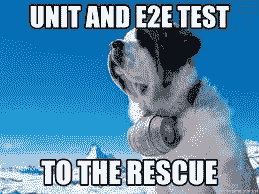
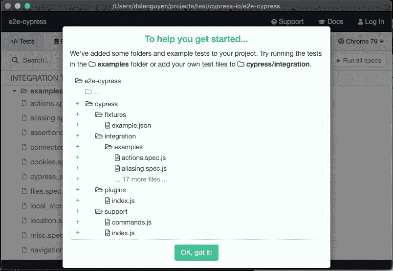
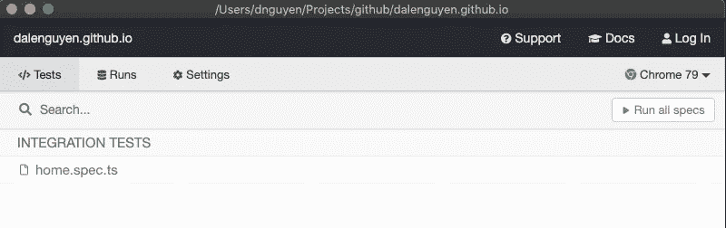
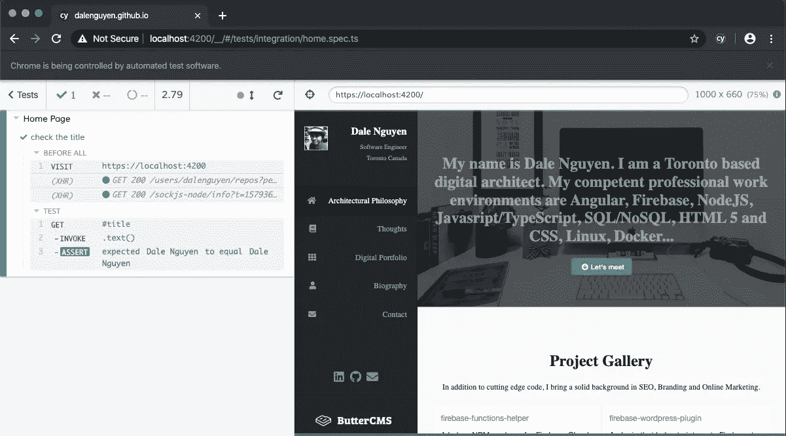

# 使用 Cypress.io 进行角度端到端(e2e)测试

> 原文：<https://itnext.io/angular-end-to-end-e2e-testing-with-cypress-io-75333125de4d?source=collection_archive---------3----------------------->



端到端测试是一种从用户角度测试应用程序的方法。它确保应用程序从头到尾都按照预期运行。

我通常在修复一个错误或添加新功能后运行它，以确保没有任何问题。在我以前的公司，我们甚至每天运行端到端测试，并生成一份报告，显示一切是否正常，这样我们就可以在海关遇到错误之前修复它们。

如果您正在使用一个角度应用程序，[量角器](https://www.protractortest.org/)是默认的端到端测试框架。今天我将使用 Cypress 作为端到端测试的替代工具。在[克里斯蒂安·吕德曼的博客](https://christianlydemann.com/why-i-moved-from-protractor-to-cypress/)上有一个关于量角器问题的有趣帖子。

现在，我将向你展示如何将柏树添加到你当前的 Angular 项目中。

**第一步:安装柏树**

```
yarn add -D cypress @cypress/webpack-preprocessor @types/cypress ts-loader
```

然后编辑 package.json 脚本

```
// package.json “script”: {
  ...
  "cypress": "cypress open”
}
```

**第二步:打开样本测试用例**

```
yarn cypress
```



这些是供参考的样本测试文件。

**步骤 3:创建您的第一个测试**

测试脚本是 JavaScript，您可以通过编辑 tsconfig.json 来更改为 TypeScript

```
// cypress/tsconfig.json{
  "include": ["integration/*.ts", "../node_modules/cypress"],
  "compilerOptions": {
    "emitDecoratorMetadata": true,
    "experimentalDecorators": true,
    "skipLibCheck": true
  }
}
```

之后，您可以删除示例文件夹，并在 **cypress/integration** 文件夹下创建我们的第一个测试。会出现这样的。



然而，还没有测试用例。为了让 cypress 正常工作，我们需要添加一些测试用例。

```
// cypress/integration/home.spec.tsdescribe('Home Page', () => {
  before(() => {
    cy.visit('https://localhost:4200') }) it('check the title', () => {
    cy.get('#title')
      .invoke('text')
      .should('equal', 'Dale Nguyen')
  })
})
```

这是运行第一个测试后的结果。



现在您知道了如何用 Cypress 为 Angular 项目编写一个简单的测试脚本。你可以从 GitHub 查看我的[提交。](https://github.com/dalenguyen/dalenguyen.github.io/commit/d944ea11b03cd8e4c654c8e7c2cb3d9f8e0695bf#diff-01b2c16fa8dbd554bf70d9c179609c03)

希望这有所帮助🙂