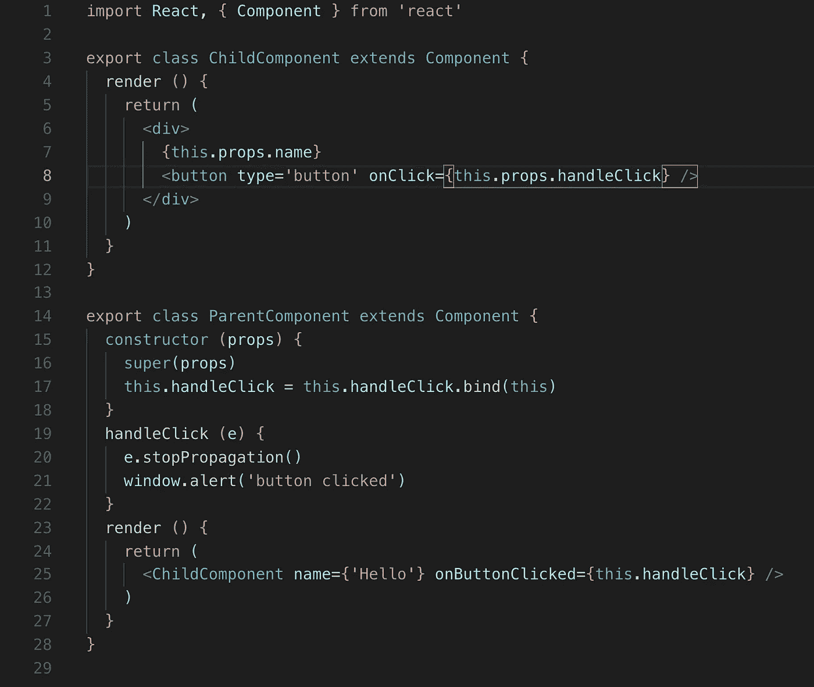
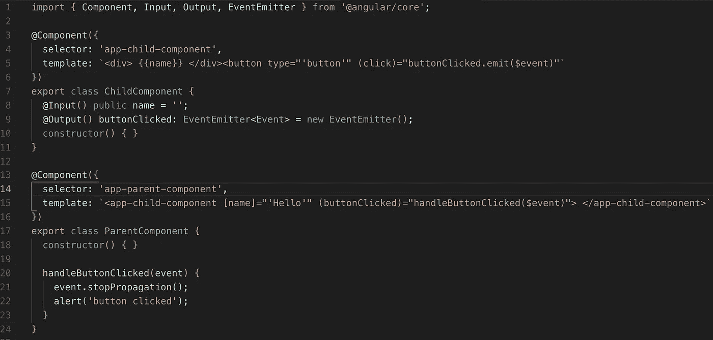

# React 开发人员的角度:差异和组件 API 比较

> 原文：<https://itnext.io/angular-for-react-developers-63239f278158?source=collection_archive---------2----------------------->

这不是另一篇 Angular vs React 文章。我为对 Angular 感兴趣的 React 开发人员写了这篇文章，反之亦然。我将主要探索两个框架中的组件 API，它们如何相互比较，以及它们如何解决相同的问题。

## 组件:

让我们比较一下两个框架中的组件 API。React 中一个非常简单的类组件如下所示

```
import React, { Component } from 'react'
import './App.css'export class App extends Component { render () { return <div> Hello world </div> }}
```

这将是角度的等效实现

```
import { Component } from '@angular/core'@Component({ selector: 'app-component', template: `<div> Hello world </div>`, styleUrls: ['./app.component.css']})export class AppComponent {}
```

## 将输入传递给组件并处理事件:

在 React 中，您可以通过`props`将输入绑定传递给组件，并以同样的方式将回调函数传递给子组件，以处理子组件中发生的事件。



在 Angular 中，您依靠`@Input()`装饰器将属性绑定传递给子组件，依靠`@Output()`装饰器将定制事件发送给父组件进行处理。让我们看看这是如何看起来有角度的



子组件有一个 EventEmitter，当按钮被单击时，它向父组件发出事件。父组件通过`(buttonClicked)`监听 DOM/output 事件，并处理实现。

另一件你可能已经注意到的事情是，这里没有`props`或`state`，所有的东西都连接到`this`上。相反，通常在模板中使用公共变量，所以这是 Angular 中你能得到的最接近状态的变量。您可能还注意到了模板中方括号和圆括号的奇怪语法。这就给我们带来了两个框架中的模板差异。

## 模板:

React 依靠 JSX 进行模板化，这基本上只是一种语法糖，它以封装了`document.createElement()`的`React.createElement()`形式转换成 JavaScript。

Angular 有自己的领域特定语言(DSL ),允许我们在普通 html 之上编写 Angular 特定的类似 html 的语法。它也有自己的编译器，将这种语法编译成浏览器可以理解的 html。在 Angular 的 DSL 语言中，主要有 3 种主要语法。`*`、`()`和`[]`。

`()`用于输出和 DOM 事件

`[]`用于输入特定的 DOM 元素属性

`*`表示这是一个结构指令。会影响/改变 DOM 结构的东西。如`*ngFor`或`*ngIf.`

## 生命周期挂钩

两个框架都有生命周期挂钩，代表组件的呈现/更新状态。下面你可以找到每一个 React 生命周期钩子和它在 Angular 中的等价物。

`componentWillMount`(已废弃)→ `ngOnInit`

`componentDidMount` → `ngAfterViewInit`

`componentWillUnmount` → `ngOnDestroy`

`componentWillReceiveProps`(已弃用)`getDerivedStateFromProps``componentWillUpdate``componentDidUpdate`在 Angular 中均可替换为`ngOnChanges`。

与`componentWillReceiveProps`不同的是，`ngOnChanges`实际上只在组件的属性/输入绑定改变时才触发，它在参数中有一个 changes 对象，告诉您哪些特定的属性以及它们当前/以前的值发生了改变。所以你不必担心它在每次渲染前被触发，不像`componentWillReceiveProps`。

## 变化检测

React 依赖于单向数据流，它使用一种叫做虚拟 DOM 的东西来处理变化检测，虚拟 DOM 基本上是 DOM 的 JavaScript 对象表示。在重构虚拟 dom 之后，它只对与实际 DOM 不同的部分进行区分和应用更改。

Angular 内置了自己的变更检测策略，每当 Angular 认为某些代码可能会导致变更检测时，就会运行该策略。即 DOM 事件、异步调用如`setTimeout` / `setInterval` / `Promises`和输入变量的改变。这既允许单向数据流，也允许开发人员首选的双向数据绑定。

Angular 通过围绕一个名为`zone.js` 的库实现他们自己的包装器来实现这一点，这允许他们在执行后猴子修补像`setTimeout`这样的异步 JavaScript APIs 来运行角度变化检测，所以每次运行`setTimeout`时，你都执行 angular 的 change detection，如果你有一些不应该触发变化检测的异步调用，你可以通过使用`ngZone.runOutsideAngular(fn)`来选择退出。

## 性能优化

Angular 和 React 都有类似的方法来优化它们的变化检测。在 react 中，你可以使用`PureComponent` `React.memo`或`shouldComponentUpdate`，这实际上是告诉 React 跳过渲染，除非组件的一个道具发生变化(仅参考发生变化)。允许它通过引用来比较对象/数组，而不是深入检查它们。

在角度上与此相当的是`ChangeDetectionStrategy.OnPush`角度也有可能完全脱离`ChangeDetector`并手动触发变化。OnPush 变化检测可以通过`@Component`装饰器进行如下设置:

```
import { Component, ChangeDetectionStrategy } from '@angular/core';@Component({ selector: 'app-root', templateUrl: './app.component.html', styleUrls: ['./app.component.css'], changeDetection: ChangeDetectionStrategy.OnPush})export class AppComponent { title = 'angular-performance-demo';}
```

另一个常见的优化是在呈现列表时使用 React 中的键来告诉框架只呈现数组中新的/删除的项目，而不是在数组改变时替换所有的 DOM 元素。这在角度上的等价物是`trackBy`。

## 风格封装

一个好的可重用组件是你可以插入到应用程序的其他地方使用的，而不必担心副作用或自定义配置。

在 React 中，如果你想确保你的 css 不会渗透到其他组件，你必须使用像`css modules`或`css in javascript`这样的解决方案。

Angular 在其组件 API 中有一个选项，允许 css 按组件封装或者根本不封装。该属性的值可以通过浏览器的`ShadowDOM` API 或`Emulated`模式获得，在这种模式下 angular 生成随机 id 并将它们附加到每个 dom 元素的类中。

默认情况下，Angular 中的样式封装是启用的，要更改封装策略，您可以使用`@Component`装饰器中的封装属性，如下所示:

```
import { Component, ViewEncapsulation } from '@angular/core';@Component({ selector: 'app-root', templateUrl: './app.component.html', styleUrls: ['./app.component.css'], encapsulation: ViewEncapsulation.ShadowDom})export class AppComponent { title = 'my-app';}
```

## 碎片

有时你需要在你的 DOM 元素周围有一个包装元素，但是你不想在你的树中引入另一个 DOM 元素，出于性能和可读性的原因，在你的应用中最小化 DOM 元素是一个很好的惯例。在 React 中，你可以用`<React.Fragment>`包装你的元素。

Angular 也有类似的成分，你可以用`<ng-container>`来实现。

## 道具。儿童、老虎机和跨界车

重用 React 组件中的一些逻辑。React 已经提供了多种方法来做到这一点，从*混音，高阶组件，renderProps，props.children* 。这些都是解决同一个问题的不同方法，这个问题就是用相同的功能呈现不同的内容。通常建议使用 *renderProps* 而不是 *HOCs* ，这已经非常类似于`props.children`。

在 Angular 中，你可以把你的 javaScript 逻辑放到服务中，并依赖于 Transclusion/slots，这相当于 React 中的 props.children。以下示例将呈现从父组件的模板传递到子组件的模板的内容，您也可以在模板的特定部分呈现多个 ng 内容:

```
//child.component.html<div>Children render here:
  <ng-content></ng-content>
</div>//parent.component.html
<app-child-component>I render in child component</app-child-component>
```

这相当于 React 中的

```
//child.component.js
export function Child(props) { return (
    <div> Children render here:
    {this.props.children}
    </div>
  )
}
```

## Web 组件兼容性

Angular 的组件实现有些类似，并且与自定义元素 v1 规范的本机浏览器实现兼容，因为它们支持 ShadowDOM、插槽、自定义事件、css 变量以及等效的生命周期挂钩。

事实上，你可以将你的 Angular 组件编译成本地 web 组件，你可以使用任何其他框架或者根本不用框架，就像 [stencilJS](https://stenciljs.com) 所做的那样。

然而，React 似乎更关注拥有一个易于使用的声明式 API 来实现业务逻辑和 UI 组件。有关自定义元素与 React 兼容性的更多信息，请参见[https://reactjs.org/docs/web-components.html](https://reactjs.org/docs/web-components.html)

## 结论

我们查看了 Angular 和 React 中的组件。希望这激发了您学习和/或尝试其他框架的好奇心。两个框架对相同的问题都有自己的解决方案，这就是为什么学习和理解实际的问题及其解决方案比框架特定的语法和解决方案更重要。

如果你喜欢我的内容并想表示支持，你可以[请我喝啤酒](https://www.buymeacoffee.com/khaledosman)