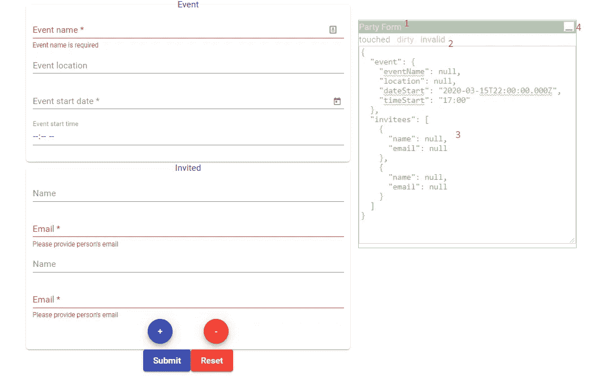
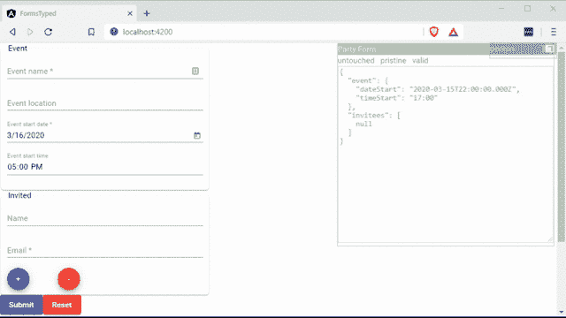

# 角形故事:一个开发工具

> 原文：<https://itnext.io/angular-forms-story-a-dev-tool-f4a27e28c28e?source=collection_archive---------5----------------------->

感谢 Angular.io 和[https://icons8.com/icons/set/form](https://icons8.com/icons/set/form)提供图片

## 让开发人员的生活变得简单的工具:)

这是*角形故事*系列的一部分:

*   *Angular Forms Story:一个开发工具(这一个)*
*   *棱角分明的形态故事:强烈的类型(* [*)链接*](https://indepth.dev/angular-forms-story-strong-types/) *)*
*   *角形故事:另类(* [*链接*](https://medium.com/@gparlakov/angular-forms-story-alternatives-f5899bb301f7) *)*

不止一次，当我在 Angular 应用程序中开发表单时，我不得不在编辑时用模板黑掉`{{form.value | json}}`和`{{form.valid}}`和`form.pending`，以检查我的表单控件是否真的在做我想要它做的事情。
我想:

> 如果有一个组件向我显示表单的所有信息，那不是很好吗？

所以我创造了它:

 [## ngx-显示-表单-控件

### 这是一个可视化抽象控件实例的组件。可视化…

www.npmjs.com](https://www.npmjs.com/package/ngx-show-form-control) 

1.  **命名为**和**可拖动**窗口！
2.  **状态** —脏/原始、已触摸/未触摸、有效/无效/待定/禁用
3.  **值** JSON.stringify-ed。**可编辑** —编辑后的值出现在表单中！
4.  **缩小**和**最大化**和更多…
    * **可调整大小**(见右下角)
    *多个**实例**支持
    * **仅**在**开发**构建中可见！**没有**在**生产中出现的危险**！

参见**动作**:

或者住在[https://angular-forms-story-dev-tool . stack blitz . io](https://angular-forms-story-dev-tool.stackblitz.io)

使其成为指令并支持旧的 Angular 版本已经在路线图上了。由于使用元数据版本 4，现在至少需要 Angular v5

去 https://github.com/gparlakov/forms-typed/issues[查看并提交问题](https://github.com/gparlakov/forms-typed/issues)。

我正在从事一些开源的 Angular Dev 工具项目。请查看:
[SCuri —单元测试样板文件自动化](https://github.com/gparlakov/scuri/blob/master/README.md) ( [*带有企业支持选项 too*](https://tidelift.com/subscription/pkg/npm-scuri?utm_source=npm-scuri&utm_medium=referral&utm_campaign=enterprise))
[ngx—forms—typed—Angular form，仅强类型！](https://github.com/gparlakov/forms-typed/blob/master/projects/forms/README.md)
[ngx-显示-表单-控件-可视化/编辑任何表单控件/组](https://github.com/gparlakov/forms-typed/blob/master/projects/show-form-control/README.md)