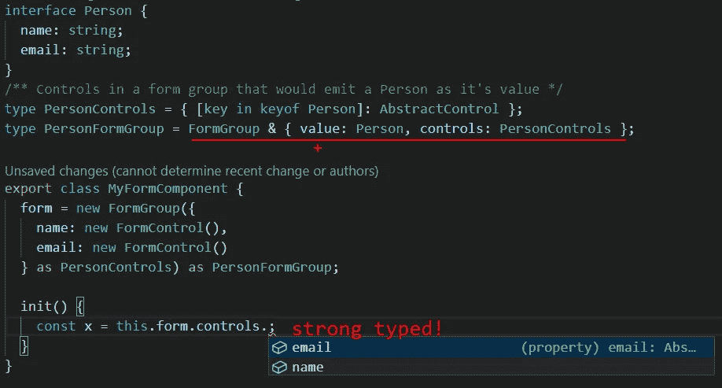
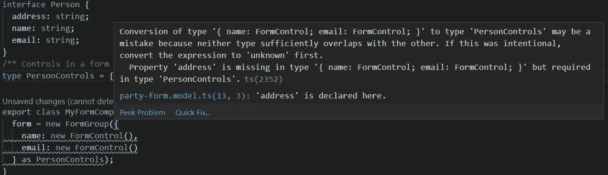
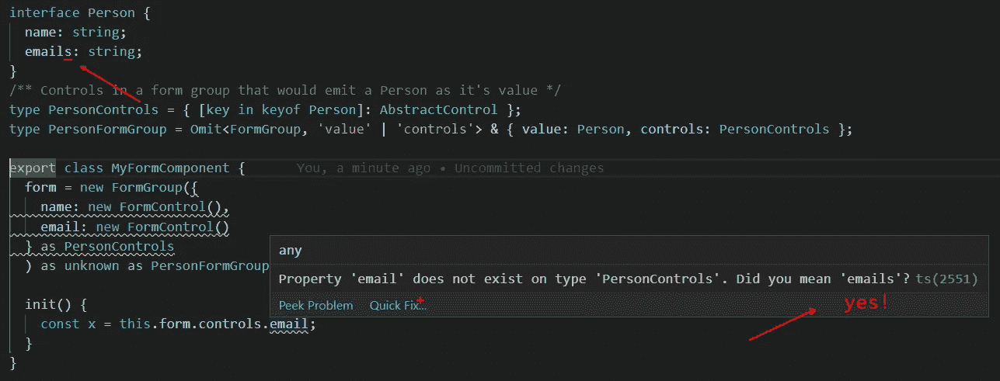
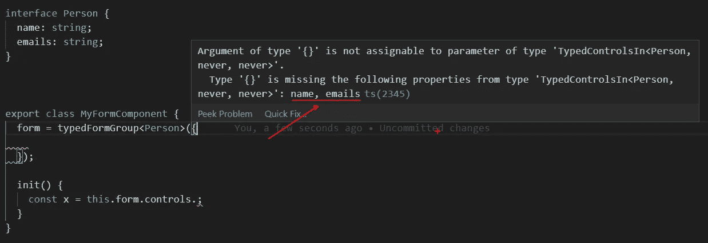
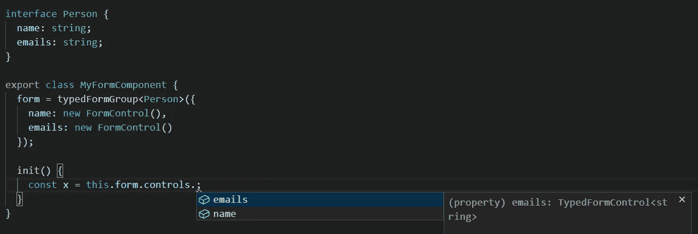
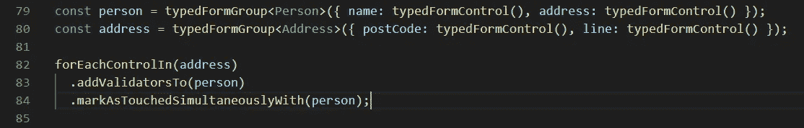
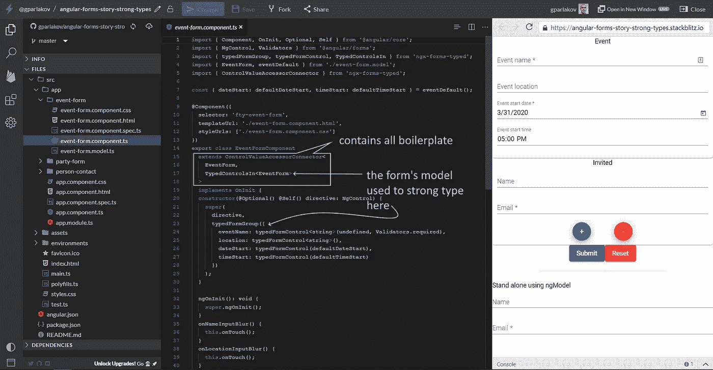

# 角形故事:强类型

> 原文：<https://itnext.io/angular-forms-story-strong-types-ce995239abf2?source=collection_archive---------4----------------------->

我如何强烈地打出我的棱角分明的形体。你也可以！

*原文发表于* [*此处*](https://indepth.dev/angular-forms-story-strong-types/) *。*

这是*角形故事*系列的一部分:

*   *棱角形态故事:Dev Tooling (* [*链接*](/angular-forms-story-a-dev-tool-f4a27e28c28e) *)*
*   *棱角分明的形态故事:强壮的类型*(这一个)
*   *棱角形态故事:整个故事*(即将上演)

角反应形式**不是强类型**！`AbstractControl`及其实现`FormControl` `FormGroup`和`FormArray`不支持强类型化它们的`value`或`changes`或任何其他属性/方法。在很长一段时间里，我接受并解决了这个问题，认为这只是生活的一部分——事情就是这样…

在这篇文章中，我想分享我在逐渐将强类型添加到表单中的过程。如果你只想看到最终结果，请参见 [ngx-forms-typed](https://www.npmjs.com/package/ngx-forms-typed) 。是**强类型，向后兼容** ( *配合 Angular 2.4.0 工作！*)和**减少样板文件。**

*这部作品从* [*【在企业环境中使用有角度的表单】*](https://timdeschryver.dev/blog/working-with-angular-forms-in-an-enterprise-environment)*[*【用有角度的表单构建可伸缩的健壮且类型安全的表单】*](https://dev.to/maxime1992/building-scalable-robust-and-type-safe-forms-with-angular-3nf9) *等中汲取灵感和想法。我会* ***鼓励*** *你去把那些文章查出来。**

*为了我的工作，我必须做一个相当大的表单，足以让我害怕将与**表单**逻辑和表单的子部分**业务**逻辑**混合在一起。我想有一个**强类型的**、**容易使用的**和`**@angular/forms**` ***-y*** **方式**来从一个大表单中提取子表单组件。就像我们提取组件来处理它们自己的问题一样。(子)表单组件需要符合以下要求:***

*   *有一个**强类型**模型*
*   ***@ angular/forms**——**兼容***
*   *使用**现有抽象**进行**通信**(`AbstractControl`和`ControlValueAccessor`)来处理验证、状态更改等。*

*简而言之，我希望有一个**组件**，它可以作为一个**更大的表单** *中的**单个控件**，而*可以作为一个**表单**中的**自己的**，具有多个字段、验证、状态改变。同时让**父表单**愉快地不知道实现细节并通过`AbstractControl` API 进行通信。
例如`Address`作为`Person`表单和`Order`表单中的子表单。而是以一种`NewAddress`的形式完整的形成。*

*一开始，我用类型来装饰我的`FormGroup`和它们的组成`FormControl`，就像这样:*

**

*现在我可以**依靠**在重构或添加/删除特性时使用强类型。任何`Person` **类型变化**都会渗透到表单中——例如，如果要添加属性`address`，我会立即得到一个**错误** ( *vs 运行时间，可能还有*):*

**

*然后，我遭受了`form.controls.get('name')`的方式来达到我的控制。我不喜欢为它创建一个公共 getter 的模式。主要是我想要**型安全**。所以:*

**

*是的，智能感知！生产力！*

*现在我的`controls`有了智能感知！哦，快乐和生产力😂⚒👷‍♂️.通过一点技巧(*和击败 Typescript 使其屈服*)我有了一个依赖类型的表单组(或者你可以称之为依赖模型)。看到这个小小的变化滴下来:*

**

*注意“email”变成了“emailS ”,并导致打字稿给了我非常有用的建议:)*

*你有没有注意到`as unknown as PersonFormGroup`(在表单组实例化`form = new Form(…) as unknown …`的最后)——这就是我所说的*击败了打字稿*。在这种情况下，我比它更清楚运行时的实际形状是什么！这通常是迄今为止唯一的情况，Typescript❤ ️knows 更好！*

*将这项工作进行到下一步是尽可能多地键入`FormControl` / `FormGroup` / `FormArray`类型。结果是包 [ngx-forms-typed](https://www.npmjs.com/package/ngx-forms-typed) 。它提供了`TypedFormControl` ( [GitHub](https://github.com/gparlakov/forms-typed/blob/21e99c91877746b506dd64ad0e5a127eeed15bac/projects/forms/src/lib/forms-typed.ts#L29-L36) src) `TypedFormGroup`和`TypedFormArray`类型。*

*比如，我们来看看`TypedFormControl<K>`:*

*TypedFormControl 的形状*

*它向`FormControl`的`value`和`valueChanges`属性添加了一个强类型，这样您就可以在使用它时知道值是什么形状。它还对方法`setValue`进行了强类型化，因此您需要传入一个预期类型的值，可能还有`options`——也是强类型的。方法也是强类型的。参见`ResetValue<K>` [来源](https://github.com/gparlakov/forms-typed/blob/12e51ba0f19ce5d812399c8bf1ec4d159247891f/projects/forms/src/lib/forms-typed.ts#L17)。*

*以及**助手函数**，用于创建具有类型`typedFormControl` ( [GitHub src](https://github.com/gparlakov/forms-typed/blob/21e99c91877746b506dd64ad0e5a127eeed15bac/projects/forms/src/lib/forms-typed.ts#L37-L55) )、`typedFormArray`和`typedFormGroup`的实例，这些类型也使得表单的创建具有强类型:*

**

*将我们推向表单控件的正确类型的错误。*

**

*智能感知也是！*

*函数本身只实例化了一个`FormGroup`，也就是说它与**现有表单**代码**兼容**，可以在**旁边使用而不会破坏**它:*

*为简洁起见，省略了类型。见完整来源[此处](https://github.com/gparlakov/forms-typed/blob/12e51ba0f19ce5d812399c8bf1ec4d159247891f/projects/forms/src/lib/forms-typed.ts#L122-L128)。*

*我想让窗体和子窗体能够通信，即当子窗体被触摸时——当它无效时触摸父窗体——使父窗体也无效。这两个是由`ControlValueAccessor`抽象支持的**。我还想强制子窗体从父窗体得到提示`touched`，以显示验证，这是`ControlValueAccessor`不支持**的**。我想利用现有的沟通渠道。***

*我想出了一个类似 builder 的模式来与表单组/数组的控件进行交互。它来自一个名为`forEachControlIn`的函数(参见 [GitHub](https://github.com/gparlakov/forms-typed/blob/master/projects/forms/src/lib/forms-util.ts) 中的完整代码)。它的目标是使表单中以及表单之间的控件交互变得容易。它**依赖于**让**引用**到表单。*

**

*最后，为了避免样板文件，我把它们都放在了一个`ControlValueAccessorConnector`中(参见 [GitHub](https://github.com/gparlakov/forms-typed/blob/master/projects/forms/src/lib/control-value-accessor-connector.ts) 上的完整代码)。它处理父窗体和子窗体之间的所有连接逻辑。*

**

*参见此处的工作示例[和 Stackblitz 中的代码](https://angular-forms-story-strong-types.stackblitz.io/):*

* [## 角形-故事-强壮-类型-堆叠

### 导出到 Angular CLI 的 Angular 应用程序的启动项目

stackblitz.com](https://stackblitz.com/edit/angular-forms-story-strong-types?embed=1&file=src/app/party-form/party-form.component.ts&view=editor) 

正如用户所期望的，按下`Submit`按钮显示整个页面的验证。模糊输入控件只显示该控件的有效性。

在`party-form.component`中有一个使用`formGroup`指令的嵌套表单示例，在`app.component`中有一个使用`ngModel`指令的独立表单示例。

你可以在这里看到这个库的自述[。](https://github.com/gparlakov/forms-typed/blob/master/projects/forms/README.md)

这是该图书馆的简介。你想看深潜吗？投票[这里](https://forms.gle/Hm1R2uqFmq4n7q6k8):

这种方法(和软件包)不是唯一的方法，还有其他几种方法。查看该系列的下一篇文章，在那里我总结了我在包、pr 和文章的`@angular/forms`领域的研究。* 

*我正在从事一些开源的 Angular Dev 工具项目。请查看:
[SCuri —单元测试样板自动化](https://github.com/gparlakov/scuri/blob/master/README.md) ( [*带企业支持选项 too*](https://tidelift.com/subscription/pkg/npm-scuri?utm_source=npm-scuri&utm_medium=referral&utm_campaign=enterprise))
[ngx-forms-typed—Angular form，仅强类型！](https://github.com/gparlakov/forms-typed/blob/master/projects/forms/README.md)
[ngx-显示-表单-控件-可视化/编辑任何表单控件/组](https://github.com/gparlakov/forms-typed/blob/master/projects/show-form-control/README.md)*