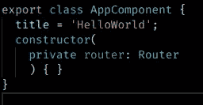
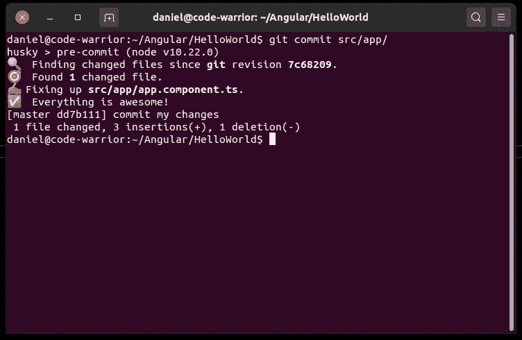
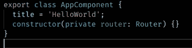

# (Angular)使用 ts lint+beauty+Husky 全局实施编码样式

> 原文：<https://itnext.io/angular-globally-enforce-a-coding-style-using-tslint-prettier-husky-a6cf0dcc3edf?source=collection_archive---------0----------------------->

## 以下是如何自动化和实施全局编码样式，以便您和您的开发人员可以专注于重要的事情。

图为[钱德勒陈](https://unsplash.com/@yazi0413?utm_source=medium&utm_medium=referral)在 [Unsplash](https://unsplash.com?utm_source=medium&utm_medium=referral)

自动化是加速任何角度项目的关键。

那么，为什么不自动格式化我们的角度代码，并在全球范围内实施一种代码风格呢？以及使用 TSLint 在一些新手程序员出现并试图提交存储库中永远不允许的东西之前检查错误？

更不用说，一旦实施了全球编码风格，关于新代码应该如何格式化的夸夸其谈的争论或喋喋不休的电子邮件将会减少。

是的，我的朋友，这就是杰出的棱角开发者所做的。

我们将简单的部分自动化，专注于本质**而其他人花费数小时喋喋不休地表达他们固执己见的想法。

所以坐起来，开始舔你的排骨伙计！我们将自动化代码格式和基本角度最佳实践的简单部分，以便我们可以专注于重要的事情。

## 要求

我们需要确保安装了最新版本的 npm。否则，当我们开始安装工具时，很可能会抛出一些红色的尖叫猫头鹰错误。

若要更新，请运行以下命令。

`npm install npm@latest -g`

## 安装说明

我们将从安装所需的工具开始。在 Angular 项目的根目录中，键入以下命令

`npm i --save-dev husky prettier pretty-quick`

## 配置 Husky

第一步是配置 Husky，使其在每次进行新的提交时运行得更漂亮，并配置 TSLint。

在项目的根目录下，打开`package.json`文件，并将下面的配置添加到文件的底部。

角度项目的 Husky 配置示例

## 测试结果

让我们拿一个组件，让它看起来真的很丑。

难看的角码

我们将继续并尝试提交它…但是..砰！哈士奇接住了。

现在，如果我们检查文件，我们会看到漂亮踢了进来，并格式化代码。

## 结论

现在这是自动化的，没有必要再担心了。

去他妈的那些关于使用空格或制表符的无用的饮水机讨论！

让我们回到工作上来，把注意力集中在本质上。

如果你喜欢这篇文章，并且发现它很有用，请一定要点击它👏按钮，关注我，获取更多类似本文的精彩文章。

**关注我:** [GitHub](https://github.com/dkreider) ，[传媒](https://dkreider.medium.com/)，[个人博客](https://danielk.tech)

*最初发布于*[*https://danielk . tech*](http://danielk.tech/home/automate-angular-code-format)