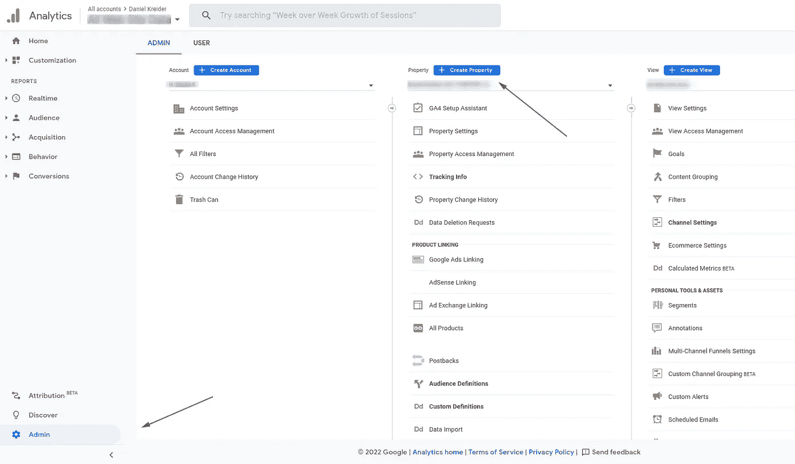
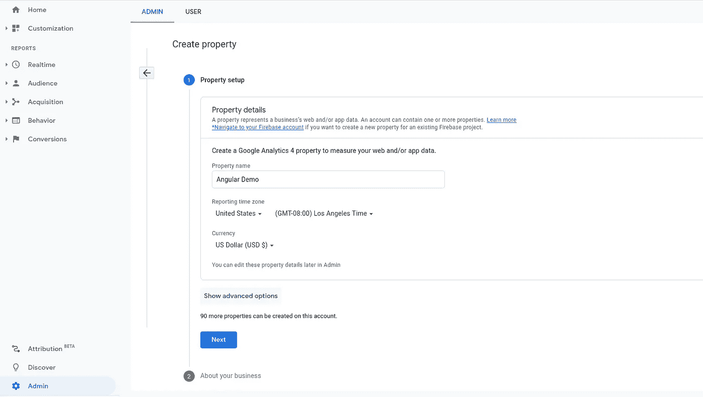
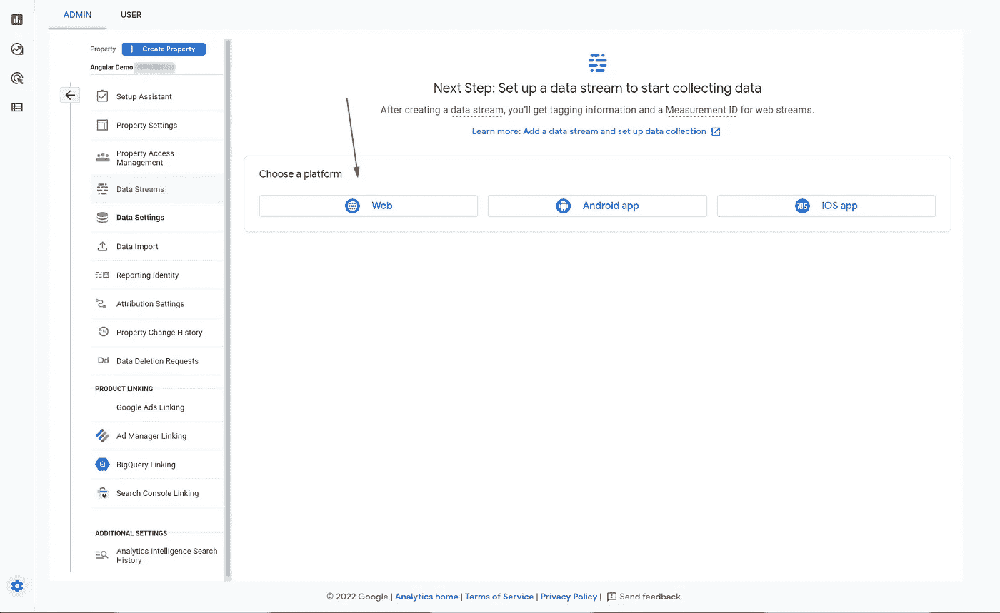
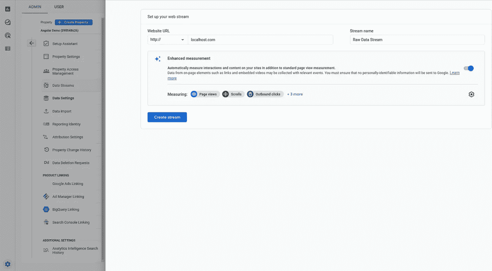
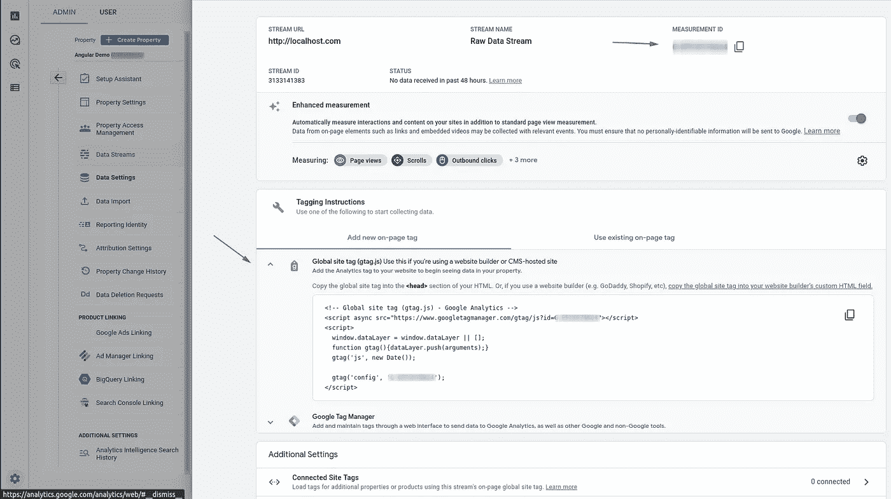
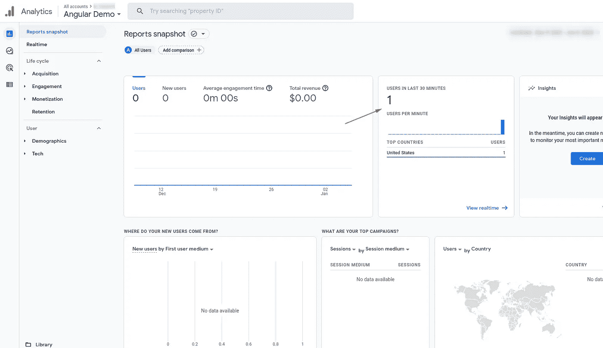
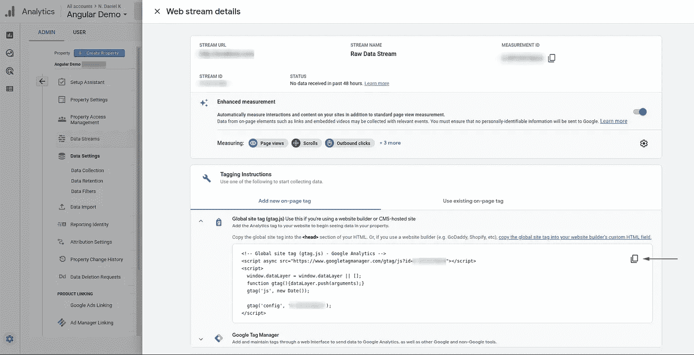

# Angular & Google Analytics —完整指南

> 原文：<https://itnext.io/angular-google-analytics-the-complete-guide-6518736096a0?source=collection_archive---------0----------------------->

## 还有谁想在他们的 Angular 应用程序中添加 Google Analytics？


艾伦·金在 [Unsplash](https://unsplash.com?utm_source=medium&utm_medium=referral) 上的照片

将谷歌分析添加到 Angular 应用程序很容易。

与静态网站相比，将它添加到 Angular SPA 并不那么容易，但如果你知道自己在做什么，它可以很快完成。

没必要像猪一样流汗。

或者烧断保险丝。


在这份完整的指南中，我将向你展示如何将谷歌分析整合到你的 Angular 应用程序中。

# 什么是谷歌分析？

谷歌分析是由谷歌提供的一项强大的免费分析服务。任何人都可以用它来跟踪和报告他们网站的流量。

截至 2019 年，谷歌分析已经成为网络上最受欢迎的网络分析服务。谷歌分析不仅仅局限于网站。他们还提供了一个 SDK，使得从 iOS 和 Android 平台上的移动应用程序中获取使用数据成为可能。

重要的是要知道谷歌分析可以被隐私导向的浏览器、浏览器扩展、广告拦截和其他防火墙拦截。近年来，一些公司已经放弃了谷歌分析，转而选择注重隐私的解决方案。

# 我应该将谷歌分析与 Angular 一起使用吗？

那么，你应该使用谷歌分析的一些原因是什么呢？

还有有什么优势吗？

谷歌分析无疑是最强大和最受欢迎的分析工具，可以免费使用。您可以监控各种指标，如页面浏览量、会话数、点击量、访问量和用户参与度。它可以让你很容易地看到用户是如何与你的网站或应用程序交互的，并做出更明智的营销和商业选择。

它最初是为静态网站创建的，而不是为用 Angular(或其他 web 库和框架)创建的单页面应用程序设计的。这使得将 Google Analytics 添加到 Angular 应用程序中变得有点棘手，但这是可行的，也不是很难。

如果你想发现用户是如何与 Angular 应用程序交互的，那么谷歌分析绝对是最便宜、最简单、最快捷的开始方式。

# 使用谷歌角度分析的缺点

使用谷歌分析的最大缺点之一是**隐私**。

在 2019 年 FastCompany 的一篇博客文章中，他们的一位作者建议我们[放弃谷歌分析](https://www.fastcompany.com/90300072/its-time-to-ditch-google-analytics)。

由于对谷歌分析的这些类型的担忧，像[似是而非的分析](https://plausible.io/)和[微观分析](https://microanalytics.io/)已经出现。

那么有没有一个时候，你不应该使用谷歌分析角度？

那是一个你必须决定的问题。但请记住，大多数关心隐私的用户已经安装了防火墙和浏览器扩展来阻止谷歌分析。

# 你如何使用谷歌分析角度？

当将 Google Analytics 整合到我们的 Angular 应用程序中时，我们有两种选择。

*   使用开源社区构建的第三方库。
*   创建我们自己的角度服务，与我们的谷歌分析帐户沟通。

你应该选择哪一个？

应该使用库还是构建自己的连接器？

显然，第一种选择是使用 Angular 的 Google Analytics 最简单快捷的方式。但是它可能不提供我们需要的定制和跟踪。在这种情况下，我们需要创建自己的服务，与谷歌分析服务通信。

# 第一步:谷歌分析设置

第一步是进入[谷歌分析](https://analytics.google.com/)主页，创建你的账户。

如果您已经有一个帐户，那么您可以登录。

接下来，我们必须创建一个新的属性。



为您的新属性命名，并正确配置其他选项。



回答业务信息问题，然后单击创建。


然后选择你的平台。在这种情况下，它将是`Web`。



现在，您需要指定您的网站的 URL 以及新数据流的名称(来自您的 Angular 应用程序到 Google Analytics 的数据)。



这会将您带到一个显示新的 web 流详细信息的页面。`MEASUREMENT ID`很重要，我们下一步需要它。



雅达！你现在可以开始了

# 以下是如何将 Google Analytics 添加到你的 Angular 应用程序中(简单的方法)

第一步是安装 ngx-google-analytics 包。

```
npm install --save ngx-google-analytics
```

一旦安装完毕，你需要像这样把它导入到你的`app.module.ts`文件中。

```
import { NgModule } from '@angular/core';
import { BrowserModule } from '@angular/platform-browser';
import { NgxGoogleAnalyticsModule } from 'ngx-google-analytics';

import { AppRoutingModule } from './app-routing.module';
import { AppComponent } from './app.component';

@NgModule({
  declarations: [
    AppComponent,
    NavBarComponent
  ],
  imports: [
    BrowserModule,
    AppRoutingModule,
    NgxGoogleAnalyticsModule.forRoot('MEASUREMENT-ID')
  ],
  providers: [],
  bootstrap: [AppComponent]
})
export class AppModule { }
```

运行 Angular 应用程序，您应该会看到一个新用户出现在 Google Analytics 实时报告中。



但是有一个问题。🤨

在当前配置下，Angular 的 Google Analytics 包是**而不是**向分析服务发送各种页面视图。这意味着当用户浏览你的 Angular 应用程序时，你看不到他们浏览的是什么页面。

要解决这个问题，我们所要做的就是导入`NgxGoogleAnalyticsRouterModule`模块。像这样。

```
import { HttpClientModule } from '@angular/common/http';
import { NgModule } from '@angular/core';
import { BrowserModule } from '@angular/platform-browser';
import { NgxGoogleAnalyticsModule, NgxGoogleAnalyticsRouterModule } from 'ngx-google-analytics';

import { AppRoutingModule } from './app-routing.module';
import { AppComponent } from './app.component';
import { NavBarComponent } from './core/nav-bar/nav-bar.component';

@NgModule({
  declarations: [
    AppComponent,
    NavBarComponent
  ],
  imports: [
    BrowserModule,
    AppRoutingModule,
    HttpClientModule,
    NgxGoogleAnalyticsModule.forRoot('MEASUREMENT-ID'),
    NgxGoogleAnalyticsRouterModule
  ],
  providers: [],
  bootstrap: [AppComponent]
})
export class AppModule { }
```

这就是如何将谷歌分析添加到你的 Angular 应用程序**的简单方法**。

如果你有兴趣了解更多关于这个包及其所有选项的信息，你可以在这里阅读文档。

但是困难的方法呢？

# 如何将谷歌分析添加到你的 Angular 应用程序中(困难的方式)

第一步是进入谷歌分析属性的设置，找到`Global site tag`。



您想要将全局站点标签复制到您的`index.html`文件的`head`中。

它看起来应该有点像这样。

```
<!doctype html>
<html lang="en">
<head>
  <meta charset="utf-8">
  <title>Angular Application</title>
  <base href="/">
  <meta name="viewport" content="width=device-width, initial-scale=1">
  <link rel="icon" type="image/x-icon" href="favicon.ico">
  <!-- Global site tag (gtag.js) - Google Analytics -->
  <script async src="https://www.googletagmanager.com/gtag/js?id=MEASUREMENT-ID"></script>
  <script>
    window.dataLayer = window.dataLayer || [];
    function gtag(){dataLayer.push(arguments);}
    gtag('js', new Date());

    gtag('config', 'MEASUREMENT-ID');
  </script>
</head>
<body>
  <app-root></app-root>
</body>
</html>
```

这是一个好的开始，但是又有一个问题。我们还没有完全完成，因为当我们路由到我们的 SPA 中的一个页面时，Google Analytics 没有得到通知。

为了解决这个问题，我们将订阅`app.component.ts`文件中的角度路由器，并将新路线发送给谷歌分析。

```
import { Component } from '@angular/core';
import { NavigationEnd, Router } from '@angular/router';

declare const gtag: Function;

@Component({
  selector: 'app-root',
  templateUrl: './app.component.html',
  styleUrls: ['./app.component.css']
})
export class AppComponent {
  constructor(public router: Router) {
    this.router.events.subscribe((event) => {
      if (event instanceof NavigationEnd) {
        gtag('config', 'MEASUREMENT-ID', { 'page_path': event.urlAfterRedirects });
      }      
    })
  }
}
```

呜！我们已经安装了谷歌分析，现在正在发送网页浏览量到谷歌分析服务器。

# 是时候进行一些分析了

那么你如何看待在你的 Angular 应用中使用 Google Analytics？

值得吗？

安装并运行它很难吗？

请用锤子敲打👏按钮，并在下面的评论中告诉我。

**现在，我得去谷歌分析，分析谁在我的博客上转来转去。**


**关注我:** [GitHub](https://github.com/dkreider) ，[媒体](https://dkreider.medium.com/)，[个人博客](https://danielk.tech)

*原载于*[*https://danielk . tech*](https://danielk.tech/home/angular-and-google-analytics)*。*