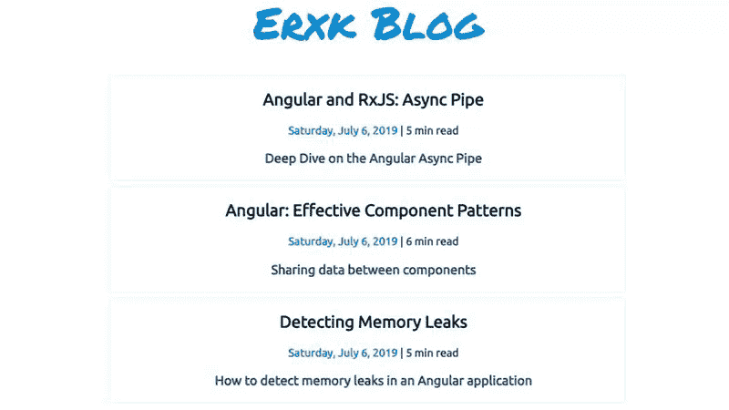
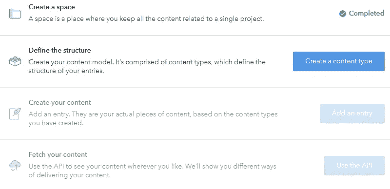
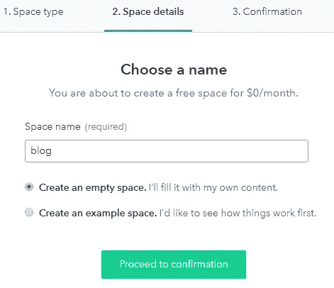
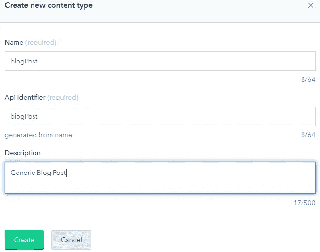
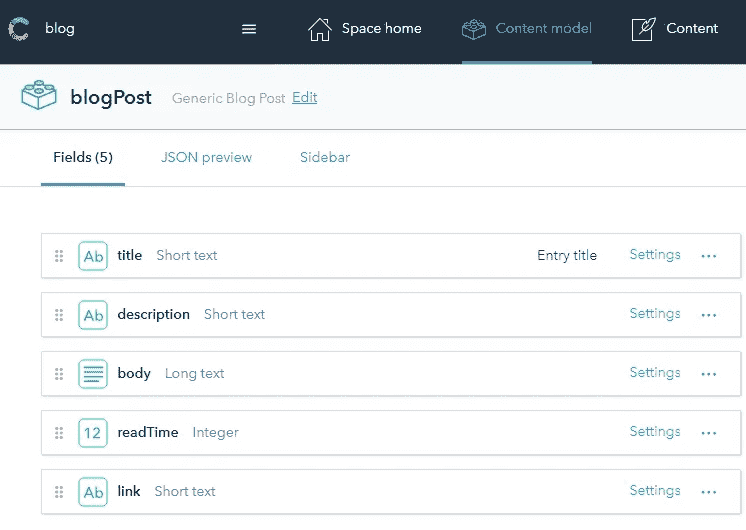
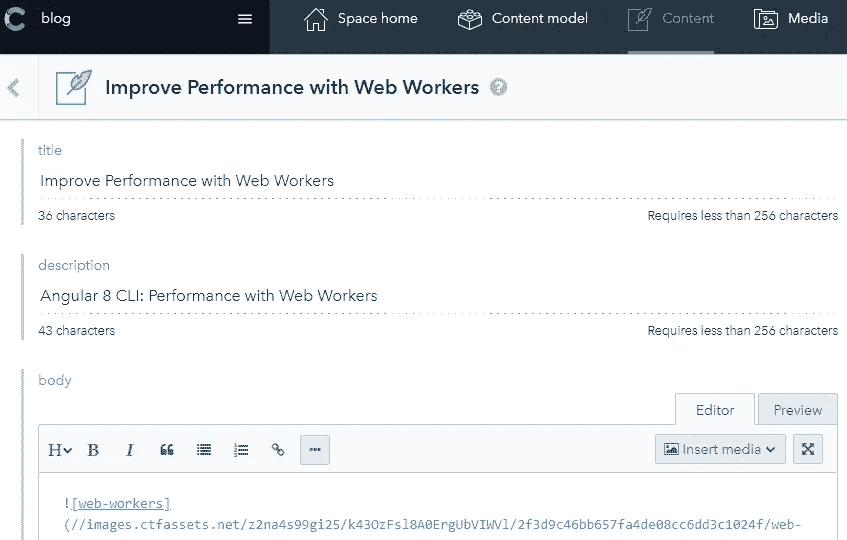
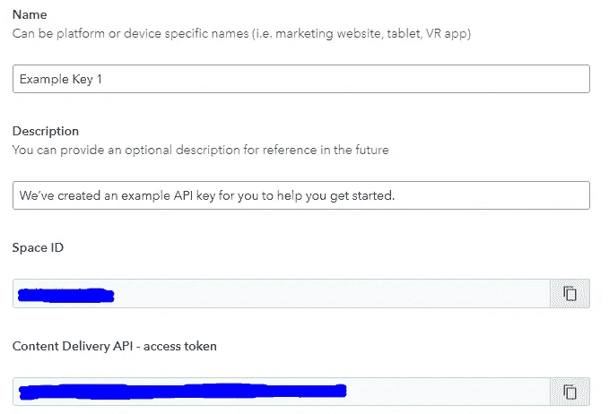
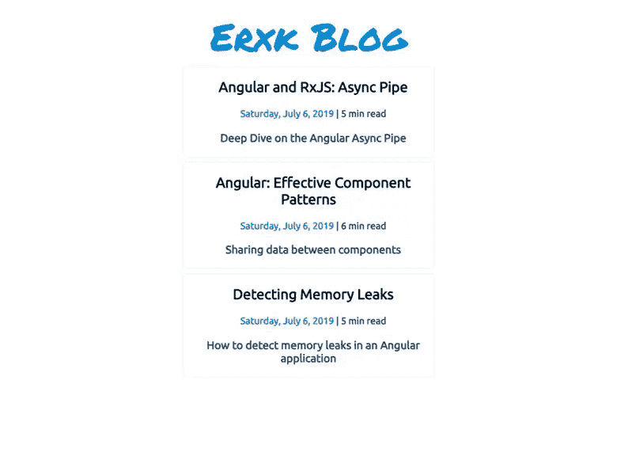

# 角状和无头 CMS

> 原文：<https://itnext.io/angular-headless-cms-6a8c7c77af54?source=collection_archive---------0----------------------->

## 建立一个有角度和内容丰富的博客

我用 Angular 和一个 headless CMS 构建了一个博客应用程序。Contentful 为开发人员和非开发人员提供了管理 web 应用程序内容的能力。我使用 Contentful 来管理我网站上的内容。——我不是 Contentful 赞助的，任何无头 CMS 都可以替代。参见备选方案[1]

[现场演示🌌](http://blog-demo-5c8d8.web.app)

[下载源代码🚀](https://github.com/Everduin94/angular-headless-cms)

应用概述

# 摘要

*   什么是无头 CMS
*   令人满意的基础知识
*   角度:访问和显示内容
*   主办；主持

# 什么是无头 CMS

当我学习构建 web 应用程序时，我听说了内容管理系统(CMS)，如 Wordpress 或 Drupal。我心想，如果一个开发人员已经知道如何建立一个网站，为什么还要用这个呢？当时，我不理解需求或用例。

后来，当我准备创建自己的副项目并将其交付给非开发人员时，我暂停了。

> 不是**开发人员的人如何更新我的网络应用程序的内容？**

我已经花了大量的时间来开发构建前端应用程序的技能。我现在需要学习像 WordPress 这样的东西来构建应用程序吗？

> **无头 CMS 已进入聊天。**

像 Contentful 一样，Headless CMS 本质上是 web 应用程序，它从开发人员和非开发人员那里抽象出数据库/后端。

无头 CMS 不**而**提供前端。—它们确实为开发人员提供了从后端获取内容的 API，并为非开发人员提供了向后端输入内容的用户界面。

我们将构建一个 Angular 应用程序来显示数据，并使用 Contentful 来创建/管理这些数据。

# 令人满意的基础知识

我们将涵盖内容丰富的基础知识。—有关全面介绍，请参见此处的[【2】](https://www.contentful.com/developers/docs/tutorials/)。

令人满意的概述

例如，让我们在**五个步骤**中建立一个具有单一内容类型的新空间。

## 1.创建一个空间

入门就像注册一样简单。—一旦注册，我们就可以创建自己的空间。打个比方，我们可以把一个空间想象成我们自己的个人数据库。

左上角菜单:创建空间

## 2.创建内容类型

我们将向我们的空间添加一个内容类型。我们可以把内容类型想象成数据库中的表定义。—内容类型不是实际的内容，只是设计。

创建内容类型

## 3.创建字段

现在，我们将向内容类型添加字段。将字段想象成数据库表中的列。—在我们的示例中，我们正在创建一篇博客文章，它将包含诸如标题、描述、正文等字段

向内容类型添加字段

## 4.创建内容

我们添加的每一条内容都类似于数据库中的一个新行。我们将填写前面在 blogPost 内容类型中定义的每个字段。

创建新内容

## 5.访问 API

在下一节中，我们将使用我们的空间 ID 和内容交付访问令牌来检索我们的内容丰富的数据，并将其显示在我们的应用程序中。

空间 ID 和内容交付访问令牌

# 角度:访问和显示内容

为了开始使用 Contentful API，我们将下面的对象添加到我们的`environment.ts`文件中。我们输入内容丰富的基础知识的**步骤 5** 的信息。

环境. ts

## 1.显示内容类型的所有条目

使用`cdaClient.getEntries(content_type)`，我们检索包含特定内容类型的所有内容的承诺。解析的数据是一组博客文章。每个条目有两个属性，`fields`和`sys`。

`Sys`包含创建日期和 ID 等信息。`Fields`是我们在 Contentful Basics 的步骤 3 中定义的字段。

contentful.service.ts — 1.1

利用角度结构指令`*ngFor`，我们可以动态地将所有博客文章添加到 DOM 中。—当我们向 Contentful 添加新的博客文章时，我们的文章将由我们的 Contentful 服务自动添加。

使用 Angular 模板语法，我们可以构建列表项，显示来自我们的内容丰富的服务的信息，如 createdAt、ID、title、description 等

main.component.html—1.2

## 2.显示内容类型的特定条目

使用`cdaClient.getEntry(id)`，我们可以从内容丰富的数据中查询特定的条目。解析后的数据是一篇带有`sys`和`fields`属性的博客文章。

contentful.service.ts — 2.1

当用户点击第一部分中的一个容器时，路由器导航到一个动态路由`/posts/:id`。在代码片段 1.2 中，我们通过 routerLink 将 ID 作为参数传递。—我们可以从 Angular 的 ActivatedRoute `paramMap`中检索 ID。

post.component.ts — 2.2

app-routing.module.ts — 2.3

Contentful 为所有文本字段提供了一个 Markdown 编辑器。我们将通过将 Markdown 转换为 HTML 并在 div 上设置内部 HTML 来利用这一点。[【4】](https://fireship.io/)

明智地使用 innerHTML，如果我们不能完全控制输入到 innerHTML 中的内容，我们需要净化输入以[防止 xss 攻击【5】](https://angular.io/api/platform-browser/DomSanitizer)。

post.component.ts — 2.4

使用 Angular 的结构指令`*ngIf`，我们可以选择显示一个字段，如果它存在的话。在我们的例子中，我们将显示一个到原始出版物的链接(如果有的话)。

## 3.添加新的内容丰富的条目

在发布一个新的内容丰富的条目后，我们的应用程序会在刷新时立即更新最新的内容。—我们的 Angular 项目不需要任何更改。

最终产品

# 主办；主持

现场演示由 Firebase 主持。关于使用 Firebase 托管项目的指导，请参见[此处【6】](https://www.youtube.com/watch?v=aICeVhu2mAE)。对于托管的替代形式，请参见此处[7]。

> 我不隶属于 Firebase 或任何替代方案，也不受其赞助。

> ☁️ [Flotes](https://flotes.app) —尝试演示，不需要登录。或者免费报名。Flotes 是我记笔记和高效学习的方式，即使在我很忙的时候。

[flots](https://flotes.app)

# 资源和参考

[1] [理智](https://www.sanity.io/) | [火焰链接](https://flamelink.io/?gclid=CjwKCAjwsIbpBRBNEiwAZF8-z2vWGi3LO1o6EqAg8Mh9njo35Y5F5l464KcCz7yK0-hPjtg9GuLcKxoC7jgQAvD_BwE) | [无头文字出版社](https://www.sitepoint.com/wordpress-headless-cms/)

[2] [心满意足——教程](https://www.contentful.com/developers/docs/tutorials/)

[3] [结构指令](https://angular.io/guide/structural-directives)

[4]在 [fireship](https://fireship.io/) 上学习了 Markdown-to-HTML 技术

[5] [DOM 消毒剂](https://angular.io/api/platform-browser/DomSanitizer)

[6] [主机带火基](https://www.youtube.com/watch?v=aICeVhu2mAE)

[7][Netlify](https://www.netlify.com/)|[AWS](https://aws.amazon.com/)|[数字海洋](https://www.digitalocean.com/)