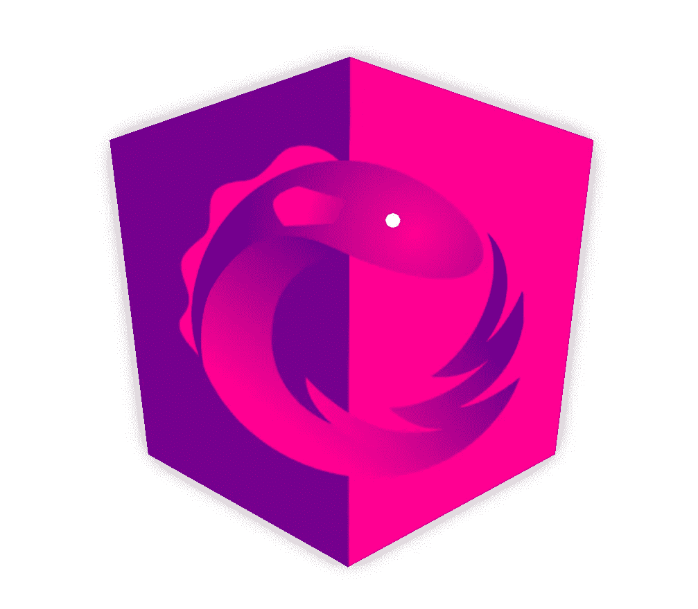

# 棱角分明。如何使用 NgRx 在应用程序中引入进度条？

> 原文：<https://itnext.io/angular-how-to-introduce-progress-bars-in-your-application-using-ngrx-abc9bf080c70?source=collection_archive---------0----------------------->


使用 NgRx 的进度条



用进度条或旋转器演示等待过程

几天前，我需要在我的应用程序中添加进度条支持。这个解决方案最重要的是保证可用性和灵活性。

# 关于

现代应用程序定期处理异步操作，无论是 API 请求还是计时器事件。在大多数情况下，我们希望看到有一个我们正在等待的进程，进度条或*微调器*是展示这一点的好方法。

当我查看现有的解决方案时，我发现——无论该解决方案是否使用 NgRx 它在应用程序中只支持一个进度条，但我希望支持多个进度条。

我们以开篇文章为例来考虑这个。当加载图像时，我们希望看到微调器，而不是没有加载的图像。我们需要将每个异步进程与其自己的进度条相关联。例如，如果我们开始为 user1 和 admin 加载两个图标，并尝试同时登录，我们应该会看到三个进度条:

1.  User1 进度条。
2.  管理进度条。
3.  登录进度条。

让我们开始实现吧。

# 先决条件:

1.  [节点](https://nodejs.org/) v10+
2.  [国家预防机制](https://www.npmjs.com/)
3.  [棱角分明](https://angular.io/) 6+，但我会用 7.2

# 准备一个项目

1.  使用`ng-cli`生成新项目:

```
ng new progresses-sandbox — style=scss
```

没必要，但我更喜欢用 [Sass](https://sass-lang.com/) 。

2.添加 NgRx 支持。

我们需要一个存储模块和一个效果模块，因为我们将处理副作用。多亏了`angular-cli`,我们可以方便地添加新功能。

```
ng add @ngrx/storeng add @ngrx/effectsng add @ngrx/store-devtools // Optional
```

看起来我们准备好出发了。

# 开始实施:

1.  清理现有的 NgRx 代码:

*   在`app.module`更改模块导入

```
to StoreModule.*forRoot*({})to EffectsModule.*forRoot*([])
```

*   移除`app.effects`和`reducers`文件夹

2.添加一个进度条模块，我们在其中实现我们的进度条基础设施。

```
ng g m progress
```

3.NgRx 准备。

*   在`app/progress`中创建一个名为`store`的文件夹
*   创建 5 个文件:

```
progress.actions.ts
progress.effects.ts
progress.reducer.ts
progress.selectors.ts
progress.state.ts
```

## 实现进度条存储模型

我们需要跟踪应用程序中的每个进度条，这就是为什么我们应该记住每个进度条的状态(无论我们是否应该显示它)。

最适合这个目的的结构是一个简单的对象，其中一个键是`id`，而`value`是一个表示当前状态的`boolean`值。

向`progress.state.ts`添加新接口:

```
export interface ProgressState {
  progresses: { [id: string]: boolean };}
```

## 实现进度条操作

为了允许进度条“显示”或“隐藏”，我们需要添加两个动作:`Show`和`Hide`。

我将省略所有导入，但您可以在 [GitHub repo](https://github.com/Stioneq/progresses-sandbox) 上找到整个应用程序。

让我们从类型开始:

```
export enum ProgressActionTypes {
  *SHOW* = '[Progress] Show',
  *HIDE* = '[Progress] Hide'
}
```

添加新动作:

值得注意的是，我们有`id`作为构造函数参数。这是因为我们需要指出哪个进度条需要更新。

## 实施进度条缩减器

这很简单，但是别忘了我们的默认状态只是一个空对象。我们之后会填写它。

## 选择器

首先，创建一个从应用程序状态中提取`progressState`的函数。

```
const selectProgressState = (state: AppState) => state.progressState;
```

让我们创建一个选择器。我们使用`props`来检索给定`progressId`的`state`。

```
export const showProgress = () => {
  return createSelector(selectProgressState, (state, props) => state.progresses[props.progressId]);
};
```

## 效果

效果在这里是最重要的，因为它们是我们如何调度行动的方法。假设我们有不同的动作，但是只有其中的一部分是显示和隐藏进度条的原因。

让我们创建一些模拟动作。

创建**app . actions . ts**

我不会列出所有的构造函数参数，因为我只会将这些动作用于测试目的。

回到效果。

让我们引入一个`object`来存储所有的进度条触发器。

这个对象中的键将是`progressId`，值将是`object`。它包括什么可以触发显示，什么可以触发进度条的隐藏。

结果是这样的:

您可以看到，我们有一个进度条`login_progress` ，它只能在登录时显示，并且只能在登录成功或失败后隐藏。

这种结构可以方便用户存储和跟踪每一个进度条，但是使用起来效果并不好。

我们需要通过转换两个集合来准备在效果中使用它。`SHOW_ACTIONS`和`HIDE_ACTIONS`键是一个动作，值是一个进度条 id。

它将更适合用于动作链的类型的**可允许操作符。**

让我们将`PROGRESS_ACTIONS`转换成这两个对象:

我们就要完成我们的特效了。但是，我们已经忘记了最重要的事情——效果本身。

最后，对于 NgRx 基础设施，我们需要添加`progressStore`作为商店特性。

```
StoreModule.*forFeature*('progressState', progressReducer),
EffectsModule.*forFeature*([ProgressEffects])
```

并在`app.module`导入中添加`progressModule`。

# 首次使用

**待办事项:**

创建一个示例按钮，当点击它时，应该有加载文本。五秒钟后，按钮应该返回。

**如何:**

修改`app.component.html`

```
<input type='button' **ngIf*="!(loading$ | async); else loading" value="Start"/><ng-template #loading>Loading...</ng-template>
```

这里有一个按钮，显示是否正在加载。否则，将显示加载文本。

这里我们有一个`loading$`参数，它不存在于组件本身中。

让`init`把它放在那里:

我们添加了`login_progress` 作为`progressActions`的关键。当我们分派登录动作时，我们应该看到带有`login_progress` id 的进度条。让我们检查一下。

修改模板以添加点击处理程序:

```
<input type='button' (click)="onClick()" **ngIf*="!(loading$ | async); else loading" value="Start"/>
```

实现 onClick 方法:

```
onClick() {
  this.store.dispatch(new LoginAction());
}
```

现在，当我们点击按钮时，我们看到加载文本，但按钮不返回。原因是我们没有调度隐藏进度条的动作。上面，我们定义了两个应该隐藏进度条的动作:[ `LoginSuccessAction`和`LoginFailedAction`

让我们在五秒钟后添加这个动作的调度。

```
onClick() {
  this.store.dispatch(new LoginAction());
  setTimeout(() => this.store.dispatch(new LoginSuccessAction()), 5000);
}
```

看起来一切正常。

但是我仍然怀疑这种方法在处理进度条时的便利性。每次我需要创建一个模板，并在`state`中选择进度条状态。这对用户来说不太方便。我们需要改进我们的解决方案。

# 引入结构指令

为了封装与进度条存储的所有交互，我们将添加一个结构化指令。

为什么应该是结构性的？因为我们不仅想隐藏元素，还想用进度条/微调器替换元素。

在进度条模块中创建一个指令。

```
ng g d directives/progress
```

我们将使用不带前缀的自定义选择器(这违反了谷歌风格指南)。

这里我们为给定的`progressId`订阅`showProgress`，然后用来自`config.replaceWith.`的模板替换我们的模板

我们将`config`定义为名为`progressAware`的输入。这是将值直接传递给结构指令的方法。

让我们添加一个配置接口:

```
import {TemplateRef} from '@angular/core';export interface ProgressConfig {
  progressId: string;
  replaceWith: TemplateRef<any>;
}
```

为`config`添加类型:

```
@Input('progressAware') config: ProgressConfig;
```

请不要忘记取消订阅组件/指令销毁上的所有观察项目。

为此我通常使用 [takeUntil](https://www.learnrxjs.io/operators/filtering/takeuntil.html) (感谢 Ben Lesh)。

添加退订`subject`:

```
unsubscribe$ = new Subject();
```

执行`onDestroy`:

```
ngOnDestroy(): void {
  this.unsubscribe$.next();
  this.unsubscribe$.complete();
}
```

修改订阅:

```
this.store.pipe(select(showProgress() as any, {progressId: this.config.progressId}), takeUntil(this.unsubscribe$))
```

不要忘记在进度模块中添加对`exports`的指令:

```
...
  exports: [ProgressDirective]
})
```

# 第二次使用

**待办事项**:

在我们的第一个例子中引入结构化指令，并去掉存储在 app 组件中的使用进度

**如何:**

1.  清理`app.component`里的`onInit`。
2.  修改`app.component`模板:

```
<input type='button' (click)="onClick()" **progressAware*="{progressId: 'login_progress', replaceWith: loading}"
       value="Start"/><ng-template #loading>Loading...</ng-template>
```

这里我们用`progressAware`结构指令代替`ngIf`。我们通过进度条的`id`，等待加载的时候应该用哪个模板替换它。

结果是一样的，但是代码看起来稍微好一点，我们全新的指令很容易使用。

然而，当我开始使用这种方法时，我面临另一个用例。我需要添加一个微调到现有的按钮；我不想替换它。例如，我有一个登录按钮，当我按下它时，我希望在这个按钮的顶部有一个旋转器*，而不是这个按钮的*而不是*。*


按钮顶部的微调按钮

我们不仅要支持替换，还要支持隐藏进度条。

# 添加隐藏行为

我们将修改我们的结构指令。

1.  让我们修改`ProgressConfig`中的配置并添加`replace` 参数。

```
export interface ProgressConfig {
  progressId: string;
  replaceWith?: TemplateRef<any>;
  replace?: boolean;
}
```

此参数指示我们是仅显示/隐藏进度，还是用进度条替换现有组件。

2.重写订阅处理。

# 第三次使用

**要做的事情**:

添加第二个“加载”，点击按钮后会出现，五秒后消失。

**如何:**

让我们修改我们的`app.component`模板。

我们添加`replace` *、* `true`用于输入，因为只有当`value`为`true`时，我们才会用进度条替换它。

我们还添加了新的装载文本，除了`progressId`之外没有任何参数，因为它是强制性的。

现在，当你点击按钮，你会看到两个加载信息。五秒钟后，您将只看到按钮。

# 奖金:

**要做的事情**:

使用进度微调器创建一个登录按钮。只有当我们按下这个按钮时，这个进度微调器才会出现，而这个按钮将被禁用。

如图:


按钮顶部的微调按钮

**如何**:

1.  生成一个新组件。

```
ng g c login-btn
```

2.修改`app.component`样式。

3.为登录按钮添加样式。

4.将按钮添加到我们的组件中。

```
<input (click)="onClick()" type='button' class="login" value="Login"/>
```

5.在按钮上添加进度条。

为了快速起见，我将使用 SVG 实现，并将它添加到`login-btn`模板中。

```
<svg

  viewBox="0 0 100 100" preserveAspectRatio="xMidYMid" class="progress img lds-eclipse" style="background: none;">
  <path stroke="none" d="M10 50A40 40 0 0 0 90 50A40 45 0 0 1 10 50" fill="#5eccb2"
        transform="rotate(354 49.9999 52.4999)">
    <animateTransform attributeName="transform" type="rotate" calcMode="linear" values="0 50 52.5;360 50 52.5"
                      keyTimes="0;1" dur="1s" begin="0s" repeatCount="indefinite"></animateTransform>
  </path>
</svg>
```

6.下一步是引入我们的`progressAware`指令。

此时此刻，你应该对此感到满意。

```
**progressAware*="{progressId: 'login_progress'}"
```

7.为按钮添加 click 处理程序

```
onClick() {
  this.store.dispatch(new LoginAction());
  setTimeout(() => this.store.dispatch(new LoginSuccessAction()), 5000);
}
```

现在，除了禁用按钮和隐藏文本之外，一切正常。

当然，我们可以在`onClick`事件中手动添加一些类，但是很难跟踪过程结束的时刻。

我们将通过引入生命周期挂钩来稍微修改我们的结构指令:`onShow`和`onHide`

8.修改结构指令。

向 ProgressConfig 接口添加新字段

```
onShow?: () => void;
  onHide?: () => void;
```

更新订阅处理

```
this.store.pipe(select(showProgress() as any, {progressId:   this.config.progressId}), takeUntil(this.unsubscribe$)).subscribe(show => {if (show) {
    this.config.onShow && this.config.onShow();
  } else {
    this.config.onHide && this.config.onHide();
  }
.
```

9.通过添加 onShow 和 onHide 事件的处理来更新 login-btn 组件:

添加一个新属性来绑定输入类，并添加两个方法来处理挂钩

```
submitting = false;...onProgressShow() {this.submitting = true;
}onProgressHide() {
  this.submitting = false;
}
```

更新模板:

```
<input (click)="onClick()" [class.submitting]="submitting" type='button' class="login" value="Login"/><svg **progressAware*="{onShow: onProgressShow.bind(this),onHide: onProgressHide.bind(this), progressId: 'login_progress'}"
...
```

更新样式以支持新的提交类:

```
&.submitting {
  color: #00000000;
  opacity: 0.1;
  pointer-events: none;
}
```


结果

# 最后

感谢您阅读这篇文章。我希望它是有用的。不要犹豫，提出问题，留下评论。