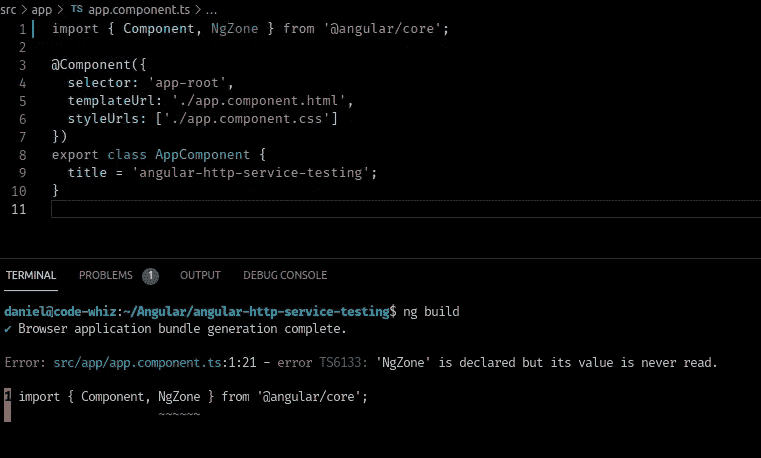

# 角度-如何移除和避免未使用的导入

> 原文：<https://itnext.io/angular-how-to-remove-and-avoid-unused-imports-5e25844a7b5a?source=collection_archive---------1----------------------->

## 还有谁想避免和摆脱那些您一直忘记的未使用的 Typescript 导入？🤔

角度应用程序膨胀的一个常见原因是不必要的导入。

随着应用程序的增长，我们开发人员往往会忽略所有的依赖关系。我们忘记检查我们的进口，以确保我们没有进口我们不使用的东西。

那么我们如何避免这种情况呢？

> 我们如何确保清理掉所有不需要和未使用的导入？

嗯…

**Visual Code 有一个方便的键盘快捷键** `**Alt + Shift + O**` **，可以用来自动清理文件。**

但是，难道没有更好的方法来执行吗？

[](https://school.danielk.tech/course/unleash-your-angular-testing-skills?utm_source=medium&utm_medium=banner&utm_campaign=unleash_testing_skills)

# 如果有未使用的导入，如何出错

如果我们有不使用的导入，我们可以使用一个名为`noUnusedLocals`的选项来抛出一个错误。

打开 Angular 应用程序根目录下的`tsconfig.app.json`文件，并将其添加到*compile options*部分，如下所示。

```
/* To learn more about this file see: https://angular.io/config/tsconfig. */
{
  "extends": "./tsconfig.json",
  "compilerOptions": {
    "outDir": "./out-tsc/app",
    "types": [],
    "noUnusedLocals": true
  },
  "files": [
    "src/main.ts",
    "src/polyfills.ts"
  ],
  "include": [
    "src/**/*.d.ts"
  ]
}
```

现在，当我试图用一个未使用的导入构建我的应用程序时，我会得到一个错误。



酷吗？😎

是啊。酷！

# 结论

我的朋友，这就是如何确保你永远不会运送一个臃肿的有棱角的项目与未使用的进口。

这使我们能够强迫一个更干净的开发者体验以及更好的代码库。

# 下一步是什么？

如果您喜欢这篇文章，并认为它很有用，请击碎👏 👏 👏按钮，关注我，获取更多类似本文的精彩文章。

**关注我:** [GitHub](https://github.com/dkreider) ，[媒体](https://dkreider.medium.com/)，[个人博客](https://danielk.tech)


如果你是一个跳到最后的人(像我一样)，那么这篇文章将向你展示如何为你的 Angular 应用程序删除所有未使用的导入，并保持它精简、干净和健康。

*原载于*[*https://danielk . tech*](https://danielk.tech/home/angular-how-to-remove-un-used-imports)*。*