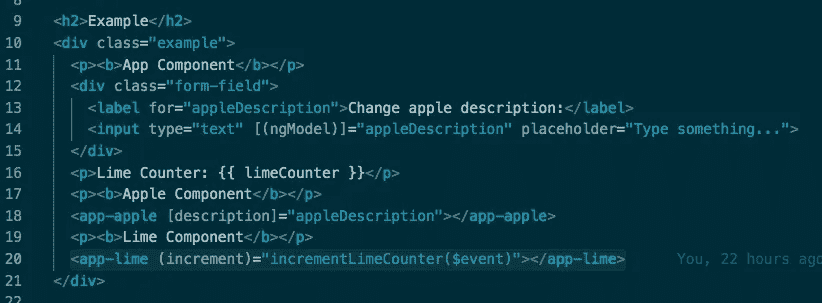

# 角度-输入和输出

> 原文：<https://itnext.io/angular-input-output-f0418ab4cc91?source=collection_archive---------1----------------------->

Angular 经过多年的发展，已经成为一个企业级的软件工具。我曾经参与过几个包含大量文件和组件的项目，这很麻烦。为了更好地处理这种情况，我们可以重用组件以保持我们的逻辑最少，并且通常遵循良好的实践。



# **输入**

```
// *app.component.html*<app-apple></app-apple>
```

`<app-apple>`是带有选择器`'app-apple'`的组件。

```
*// apple.component.ts*...@Component({
  selector: 'app-apple',
  templateUrl: './apple.component.html',
  styleUrls: ['./apple.component.css']
})...
```

那么，如果 apples 组件对于每个实例几乎都是相同的，但是我们需要它为每个实例显示不同的描述，那该怎么办呢？我们用`Input`。

```
// *app.component.html*<app-apple [description]="appleDescription"></app-apple>
```

`appleDescription`可以是*app.component.html*内的任何类属性。

```
// *apple.component.ts*import { Component, OnInit, Input } from '@angular/core';...export **class** AppleComponent **implements** OnInit {
   @Input() description: string;...
```

现在，`description`由父组件传递。在这种情况下，它是*app.component.html*。任何值都可以传递到`[description]`中，而`description`可以在*apple.component.html*或 *apple.component.ts* 中的任何地方使用，就好像它是遵循正常变化检测的常规类属性一样。

一个警告是`description`或者任何`Input`属性在*中没有准备好。ts* 档直到`ngOnInit`之后。它还没有准备好，在构造函数中为空。

```
// *apple.component.html*{{ description || 'Nothing has been typed yet...' }}
```

# 输出

`Output`是`Input`的反义词。父组件将接收值，而不是子组件接收值。

```
// *app.component.html*<app-lime (increment)="incrementLimeCounter($event)"></app-lime>
```

`incrementLimeCounter($event)`是一些类函数。

```
// *app.component.ts*...incrementLimeCounter(amount) {
  this.limeCounter += amount;
}...
```

我们说应该有一个定义在*lime.component.html*内部的`Output`叫做`increment`。

```
// *lime.component.ts*import { Component, OnInit, Output, EventEmitter } from '@angular/core';...export **class** LimeComponent **implements** OnInit {
   @Output() increment: EventEmitter<number> = new EventEmitter();...clickMe() {
  this.increment.emit(1);
}...
```

`Output`属于`EventEmitter`类型，每个`EventEmitter`都有一个类型，就像`Inputs`也有一个类型一样。在这种情况下，它的类型是`number`。现在，每当调用`clickMe()`时，`increment`将向父组件发出一个值为 1 的事件。发出的值可以是任何值，并且在实际实现中很可能是动态的。

# 摘要

`Input`用于将值向下传递给子组件，而`Output`用于将值向上传递给父组件。

看看我在 Github 上的例子:[https://github.com/orange-bees/angular-concepts-tutorials](https://github.com/orange-bees/angular-concepts-tutorials)。

# 关于我

我在南卡罗来纳州格林维尔的软件工程咨询公司 [Orange Bees](https://orangebees.com/) 担任首席工程师。我写得棱角分明。NET 应用，在 Azure 架构项目(Azure Developer Associate 认证)，涉猎 ElasticSearch 和 node . js
你可以在 [LinkedIn](https://www.linkedin.com/in/james-l-gross/) 上找我。