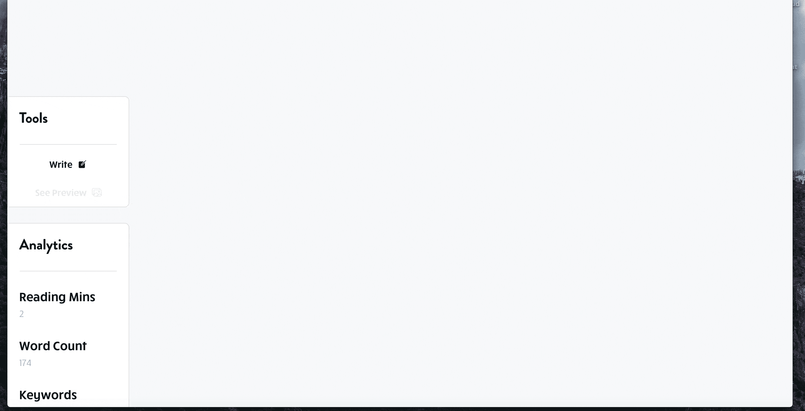
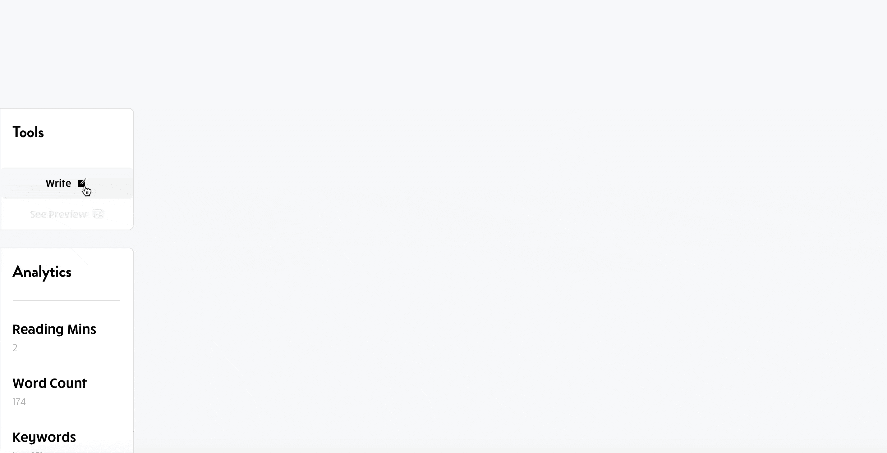

# 使用 Stackedit.js 进行角度降价

> 原文：<https://itnext.io/angular-markdown-with-stackedit-js-a57a93555016?source=collection_archive---------0----------------------->

## 角度指令

## 如何使用 Stackedit.js 创建一个角度指令来编写 markdown 并将其解析为 HTML



Web 应用程序中的堆栈编辑编辑器

# 为什么使用 Stackedit？

Stackedit 是一个流行的并且**被广泛信任的浏览器内降价编辑器**。它是一个基于 PageDown 的开源全功能编辑器，page down 是 Stack Overflow 使用的所见即所得风格的 Markdown 库。

因为它是一个渐进式 Web 应用程序(PWA ),您可以下载并将其用作桌面应用程序。

**以下是它的主要特点…**

## 所见即所得控件

所见即所得控件以一些格式按钮和快捷方式的形式出现。这要感谢 PageDown。

## 带滚动同步的实时预览

StackEdit 的滚动同步功能可以精确地绑定编辑器面板和预览面板的滚动条。这有助于您在写作时关注输出。

## 丰富的降价编辑器

StackEdit 的 Markdown 语法高亮是独一无二的。该编辑器提供了文本格式，有助于您将降价的最终结果可视化。

用 Stackedit 编写 markdown 很容易。

[](https://stackedit.io/) [## 浏览器内置的降价编辑器

### 借助 StackEdit，由于同步机制，您可以共享协作工作区。如果两个合作者…

stackedit.io](https://stackedit.io/) 

## 它也是一个 JavaScript 库🚀

幸运的是，它是一个 JavaScript 库，因此我们可以将编辑器嵌入到我们的应用程序中。这对博客和其他内容丰富的网站来说非常好。

> 不幸的是，没有 TypeScript 类型来伴随 stackedit。但是它是一个相对简单的 API，所以您总是可以创建声明文件(。d)你自己。

你可以在下面找到 GitHub 库。

[](https://github.com/benweet/stackedit) [## benweet/stackedit

### 基于 PageDown 的全功能开源 Markdown 编辑器，Stack Overflow 使用的 Markdown 库和其他…

github.com](https://github.com/benweet/stackedit) 

# 包括 Angular 中的 Stackedit.js

[](https://www.npmjs.com/package/stackedit-js) [## stackedit-js

### 将 StackEdit 添加到任何网站# watch and build for dev 将 StackEdit 绑定到一个文本区域:完整的文档可以在…

www.npmjs.com](https://www.npmjs.com/package/stackedit-js) 

## a)通过 npm 安装

```
**$** npm install stackedit-js
```

## b)包括在 index.html

# 创建 Stackedit 指令(NgxStackedit)

## 声明并初始化 Stackedit

stackedit.js 包让我们可以访问`Stackedit`类，我们将在文件的顶部用`const`来声明这个类。

我们用`new Stackedit()`初始化`Stackedit`实例，并用`stackedit`将其存储在本地。

在指令中声明 Stackedit 类

## Stackedit 类

`Stackedit`物体会发出以下事件:

*   `fileChange`每当文件及其内容发生变化时
*   一旦 iframe 关闭。

**我们将使用以下方法:**

*   `openFile`(打开 stackedit 编辑器)
*   `on`(监听事件)
*   `close`(倾听编辑们的亲密事件)

我将向你展示如何用一条指令编辑或**转换**markdown。这是 stackedit 指令的两种基本模式。

> 为了更清楚地演示，我将首先单独遍历与每个模式相关的代码。

最后，这两种模式将结合起来形成我们完整的 Stackedit 指令。

让我们从**编辑模式开始…**

# 1)编辑模式

## 声明输入以处理打开编辑器

使用 Stackedit 指令，我们希望对 markdown 和结果 HTML 进行修改。

所以我们用`markdownContent`和`markdownContentChange`来声明降价的输入和输出。

我们只需要 HTML `markdownHTMLChange`的输出，因为我们不像 markdown 那样将 HTML 输入解析器。

编辑模式的输入

我们还将使用一个局部变量`isOpen`来跟踪编辑器是否打开。

## 打开编辑器

使用`openEdit`输入的方式是在父组件中保存一个 BehaviorSubject，并将可观察对象传递给该输入。

```
open = new BehaviourSubject(false);
open$ = this.open.asObservable(); // pass this as the input like
```

然后，在父模板中，您将为指令的输入提供`open$`。

```
<div ngxStackedit [openEditor]="open$ | async" (close)="open.next(false)">
```

要打开编辑器，您应该在单击按钮时调用`open.next(true)`，并从指令的关闭输出中调用`open.next(false)`。

```
<button (click)="open.next(true)">Edit</button>
```

## 我们的编辑逻辑

现在我们需要添加实际打开 markdown 编辑器的逻辑。

这将由`openEditor`功能负责。

打开 Stackedit 编辑器

要打开编辑器，您必须调用带有选项参数的`openFile`函数。我们在这里传递的选项是…

*   `name`*可选*
*   `content`对象，包含`text`(markdown 文本)，以及`properties`对象，包含`extensions`，您可以在其中配置 markdown 解析器。

> 我们使用 Github 风格的 markdown ( `gfm`)。还提供其他降价规格，如 Markdown Extra、GFM 和 CommonMark。

 [## GitHub 风味降价规格

### 版本 0.29-gfm (2019-04-06) GitHub 风味的 Markdown，通常简称为 gfm，是 Markdown 的方言，即…

github.github.com](https://github.github.com/gfm/) 

除了`close`事件之外，我们还想监听`fileChange`事件，发出我们更改后的 markdown 和 HTML。

我们的指令目前还未完成一半。

接下来，我们将编写功能，这样我们就可以把它作为一个 markdown 转换工具/解析器来使用。

# 2)转换模式

使用 stackedit.js 将 markdown 转换成 HTML 要容易得多。

你只需要在**静音模式下呼叫`openFile`。**

这告诉 stackedit 您想要进行 markdown 到 HTML 的一次性转换。

> 在静默模式下，`fileChange`事件只调用**一次**。

我们的减价转换将由我们的函数`renderHTML()`处理。

我们还声明了一个名为`renderMarkdown`的新输入，它将把 markdown 输入到要转换的`renderHTML`函数中。

使用 Stackedit 解析降价

这里使用了我们的`elementRef`构造函数参数，通过`innerHTML`将 HTML 呈现为主机的子节点。

因此，当使用`ngxStackedit`作为解析器/转换器时，您希望将其绑定到将托管 HTML 的元素。

# NgxStackedit 指令

这是两种模式下的完整的`ngxStackedit`指令。

## 编辑方式

要使用**编辑**模式，您需要提供以下值:

*   `markdownContent`
*   `openEdit`

听听:

*   `markdownContentChange`
*   `markdownHTMLChange`

## 转换模式

要使用**转换**模式，您只需提供一个值给:

*   `renderMarkdown`

并确保将指令放在要呈现 HTML 的容器上。

NgxStackedit 指令—完整的代码

# 结果呢🎉



## 感谢阅读！有任何问题，请在评论中告诉我。