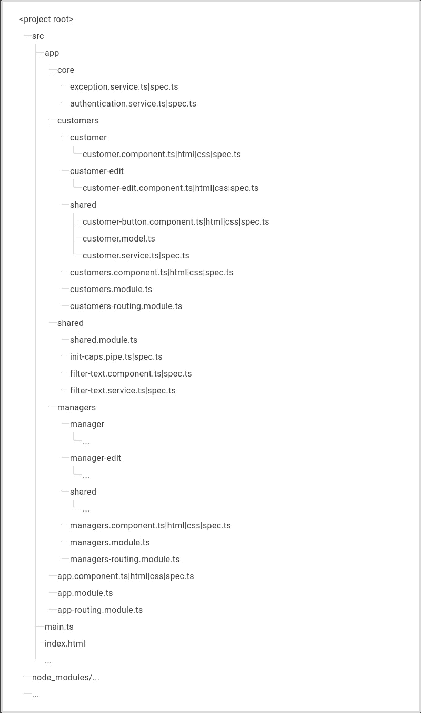

# 角度项目结构最佳实践(谨慎阅读)

> 原文：<https://itnext.io/angular-project-structure-best-practices-read-with-caution-bcd00bc4c9ac?source=collection_archive---------0----------------------->

## 你应该如何构建你的角度应用？避免意大利面混乱的最佳做法是什么？

艾伦·泰勒在 [Unsplash](https://unsplash.com?utm_source=medium&utm_medium=referral) 上的照片

> *写一个计算机能理解的程序并不需要很多技巧。技巧就是写出其他开发者能看懂的软件。*

最佳实践是时髦的。

它们被散布在互联网上各种各样的博客和媒体上。

一些最佳实践是显而易见的。忽视他们会产生一个白痴。

而其他人会把你的大脑拧成结，让你想跳进一个布满荆棘的蜘蛛坑。

当你使用框架而不是编程语言时，更是如此。Angular 也不例外。

你有角度应用性能的最佳实践。

[测试角度应用的最佳实践](https://danielk.tech/home/angular-testing-how-to-get-started)。TDD 有人吗？😉

Angular 应用程序中安全性、身份验证和授权的最佳实践。

状态管理的最佳实践。

然后是所有的用户界面的东西，像有棱角的形式，有棱角的材料，处理可观的最佳实践等等。

但是当涉及到 Angular 项目的结构时，最佳实践是什么呢？

项目布局、文件夹结构和文件命名的最佳实践是什么？

你应该把你所有的组件放在一个组件的文件夹里吗？或者服务文件夹中的服务？或者样式文件夹中的样式？

这就引出了我的第一点…

# 最佳实践不是灵丹妙药。

当涉及到构建你的角度项目时，没有通用的标准。

没有适合所有场景的神奇的最佳实践。

每一个设计决策都有它自己的好处和缺点。作为 Angular 开发人员，您的工作是决定什么样的项目结构最适合您。

互联网上散布着各种构建 Angular 项目的最佳实践。然而你不应该轻信任何人的建议——你现在正在读的也不例外。

你需要做的是研究对其他人有效的各种方法，而不是寄希望于每一个能带来闪亮的最佳实践的肥缺。你需要发现好处和坏处。你需要看看他们拥有的资源和你拥有的资源，然后**做出明智的决定**你应该在你的 Angular 项目中使用什么类型的项目结构。

这里有几个变量，在决定在 Angular 的项目结构中应用什么样的最佳实践时，应该考虑这些变量。

*   致力于这个角度应用的团队的规模。这是一个人的项目还是 100 人的项目？
*   角度应用的潜在规模。这将是一个小项目还是大项目？
*   预算。你想又快又便宜吗？还是又慢又好？

既然我已经动摇了你对最佳实践的信心，那么**有哪些值得考虑的最佳实践**？

当涉及到 Angular 项目的结构时，你应该注意哪些最佳实践？

# 安格尔升力原理👂 👂 👂

以防你没有意识到 Angular docs 在谈论如何组织你的 Angular 项目时提到了[LIFT 的缩写](https://angular.io/guide/styleguide#lift)。

# 1.确定…的位置，发现…的位置

“定位”规则规定，您必须以能够快速定位代码的方式构建您的 Angular 应用程序。你必须能够有效地找到你要找的代码。

需要明确的是，这并不意味着我们命名我们的文件，以便可以很容易地通过快速搜索找到它们。谁会记得所有的文件名呢？

相反，您的 Angular 项目需要以这样一种方式进行组织，以便一眼就能看到相关文件在哪里。

# 2.识别

以这样一种方式命名项目中的文件，以便您立即知道文件中的内容以及该文件的作用。

# 3.平的

这意味着你应该尽可能地保持一个扁平的文件夹结构。

# 4.尽量保持干燥

干？

是啊。这意味着“不要重复自己”。

但是你如何努力保持干燥呢？

嗯，这意味着你永远不会重复自己**，直到**你牺牲可读性来遵守枯燥的规则。在这种情况下，升力原理认为你应该打破干燥规则，我的豌豆脑也同意。

但是……这已经是够吓人的理论了。

Angular 中干净的项目结构实际上会是什么样子？

# 角度项目结构最佳实践(第一次尝试)

如果你的 Angular 项目是中小型的，那么我建议你考虑这个最佳实践。

这是它看起来的样子。

这个想法是，你把你的项目的所有部分，必须在不同的角度共享到一个共享文件夹。

然后是保存应用程序核心部分的`core`文件夹，这些核心部分将被导入到主模块- `app.module.ts`中。

然后将应用程序的其余部分分成特定于领域的模块。对于应用程序的客户部分，将有一个客户模块。管理器模块，用于应用程序的管理器部分，等等。

这种方法非常适合中小型项目。我认为它甚至可以很好地处理大型项目。

但是说到大型项目，我们可以尝试另一种方法。

# 角度项目结构最佳实践(第二次尝试)

使用 mono 存储库来拆分我们的大型项目怎么样？

解释 Angular 项目结构和单一回购的庞然大物超出了本文的范围。也许将来某个时候我会写一写。

但是现在，如果我上面展示的项目结构不适合你——它也不适合每个人——那么也许你应该把范围定在使用 mono 库上。 [NX 是帮助你管理像](https://nx.dev/)这样有角度的项目的最佳工具。

你认为构建你的角度应用最好的方法是什么？请在下面的评论中告诉我。

**如果你喜欢这篇文章，并发现它有用，请点击👏按钮，关注我，获取更多类似本文的精彩文章。**

**关注我:** [GitHub](https://github.com/dkreider) ，[中型](https://dkreider.medium.com/)，[个人博客](https://danielk.tech)

*最初发布于*[*https://danielk . tech*](https://danielk.tech/home/angular-project-structure-best-practices)*。*