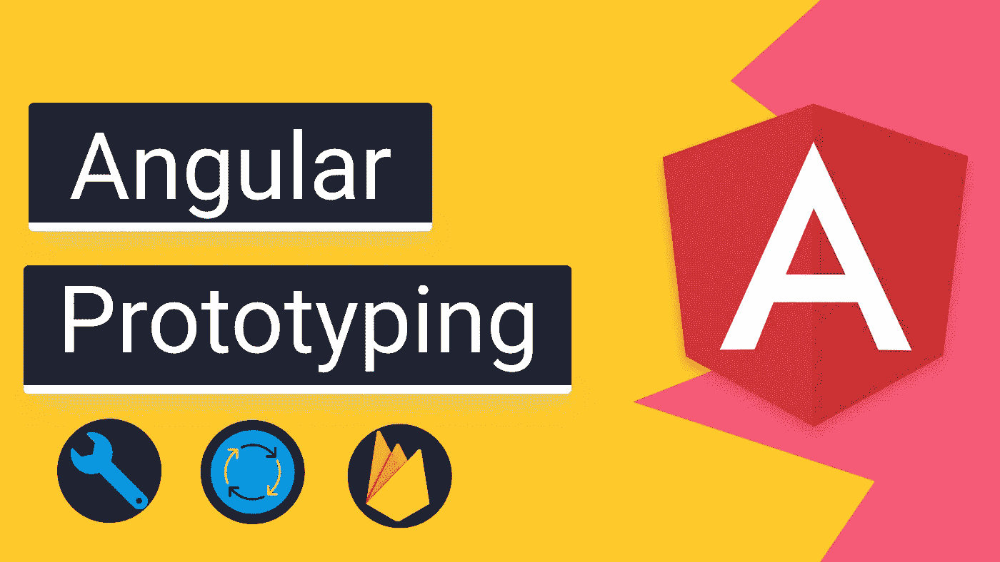
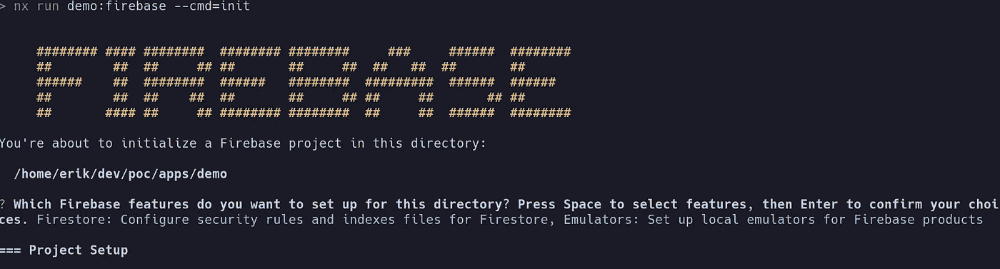
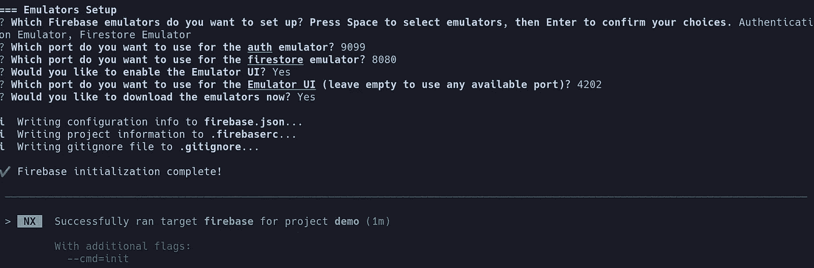
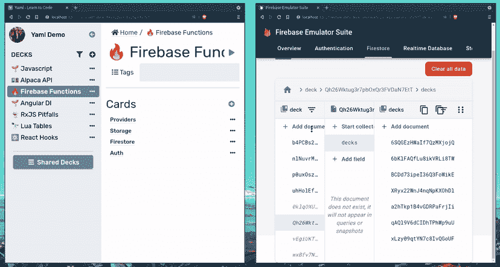
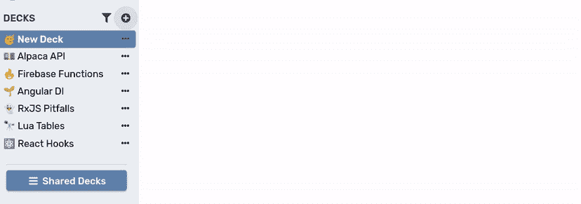
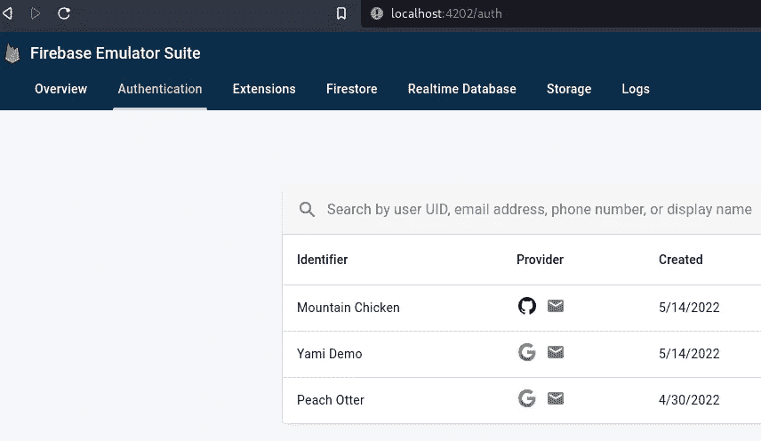

# 角度原型:带 Cypress 的 Firebase 仿真器

> 原文：<https://itnext.io/angular-prototyping-firebase-emulator-with-cypress-9ff6f5b3bf8a?source=collection_archive---------1----------------------->

## 使用 Firebase 仿真器和 Cypress 进行快速开发和测试的角度原型



# 关于我👋

我目前是一名软件工程师，在财富 100 强公司思科工作，和一些业内最好的 Angular 开发人员一起工作。我在业余时间积极从事由 Angular & Firebase 提供动力的兼职项目。

> 🔥 [**源代码**](https://github.com/Everduin94/poc)——或者，每个要点都有一个到其对应文件的链接

# 目标🗺️

*   🦠公司利用 Firestore 数据进行人工和 e2e(赛普拉斯)测试
*   🧬在 Firestore 中有效地创建了模拟数据，用于原型制作和测试
*   🧪编辑和删除不会影响实时数据或计入账单
*   🔭方便的存根 Firebase 请求
*   🔒在 Cypress 中使用仿真器进行身份验证

原型是指我们利用一些样本或模拟数据来快速测试一个想法。每当我开始一个新项目的时候，我做的第一件事就是设置架构来有效地建立原型。 —不要与 [JavaScript 原型](https://developer.mozilla.org/en-US/docs/Learn/JavaScript/Objects/Object_prototypes)混淆🙂

该设置将使我们能够使用认证和 Firestore 数据进行所有的手动和 e2e 测试。—这意味着**我们不必为 e2e 测试创建 json fixtures 或 cypress 拦截。**

💵此外，我们不会为在我们的真实环境中的读写操作付费；因为我们用的是模拟器。

这是一篇中级文章，如果你以前从未设置过 firebase 项目，我推荐这个视频 [**Firebase 快速入门**](https://fireship.io/lessons/firebase-quickstart/)**by**FireShip****

# ****装置🔧****

****以下内容仅在利用 **Firebase** 时有效。如果你正在使用 *HttpClient* 参见[角度原型:使用原型开发更快](/angular-develop-faster-with-prototyping-aafdf3376e6e)。****

****在使用 Angular 和 Firebase 模拟器时。我发现了许多陷阱。为了保持这篇文章的简洁，我在文章末尾添加了一些陷阱。如果你遇到任何问题，去那里寻求帮助。****

****如果**已经有了 Firebase &仿真器设置**，跳到**用法。******

## ****要求****

*   ****Node.js 或更高版本****
*   ****Java 版本 1.8 或更高版本****
*   ****Firebase CLI 8.14.0 或更高版本****

****如果你正在进行 Angular 开发，你可能已经安装了[*node . js*](https://nodejs.org/en/)。如果您还没有安装 openjdk ,请确保在您的机器上安装 open JDK[。](https://openjdk.java.net/install/)****

```
****npm install -g firebase-tools**-- Angular
**ng add @angular/fire
firebase init emulators**-- NX **npm install @angular/fire
ng add @nxtend/firebase
nx generate @nxtend/firebase:firebase-project --project NX-APP
nx run NX-APP:firebase --cmd=init****
```

*   ****安装 Firebase CLI(*Firebase-tools*)****
*   ****对于 Angular & Nx 项目，下面将安装@angular/fire，添加一个 firebase 配置，并设置模拟器。设置 Firebase &模拟器时，确保**选择 Firestore &认证**。****
*   ****对于 Angular 项目，通常只有一个项目，所以设置很简单。对于 Nx 项目，运行 *init* 将 Angular 项目绑定到 Firebase 项目。****

********

****初始化火灾基地****

********

****firebase 仿真器设置****

# ****配置⚙️****

****我使用标志`environment.production`来决定是否使用模拟器。在我的另一篇原型文章中，我为内存 API 使用了一个定制的标志/环境。****

****为了使这篇文章简明扼要，我已经创建了一篇单独的配套文章，以防你想知道 [**如何设置自定义环境**](https://erxk.medium.com/nx-setup-a-custom-environment-116342b7815b) 。****

> ****❗ **重要:**这些例子用@angular/fire **v7** 。****

## ****设置应用程序****

****在您的*app . module . ts*中添加配置。这有点长，但是我想确保导入是清楚的，并且你可以删除你不需要的东西。****

****[来源](https://github.com/Everduin94/poc/blob/main/apps/demo/src/app/app.module.ts#L39-L66)****

*   ****唯一需要的提供者是 *provideFirebaseApp，*你可以删除你不需要的或者改变持久选项、端口、主机等等…****
*   *****environment . firebase config*是您的标准 firebase 配置，只是保存到一个环境文件中。****
*   *****experimentalForceLongPolling*是在 Cypress 中使用的，因此我们只希望它在 dev 中启用。****

> ****💡使用 firestore &验证模拟器配置 **firebase 应用程序******

# ****用途——原型制作和测试🧪****

****下面是一个基本组件，用于验证我们的模拟器是否正常工作。它从一个名为`tickets`的集合中提取数据，并在结果中循环。****

****[来源](https://github.com/Everduin94/poc/blob/main/libs/fire/src/lib/fire-ticket/fire-ticket.component.ts)****

```
****firebase emulators:start****
```

*   ****导航到`localhost:4202`查看模拟器界面。您应该能够导航到并看到一个空的 Firestore 实例。如果您的应用程序尚未安装，您可以在此添加模拟数据。****
*   ****我们在应用程序中所做的更改应该反映在模拟器中，并在模拟器 UI 中可见****
*   ****带有 JSON 的几乎空白的屏幕并不令人兴奋。下面是 Firestore 模拟器的**生产实例。******

********

****仿真器示例****

****上面的例子使用来自模拟器的纯模拟数据****

*   ****💡我们可以快速地**生成和修改模拟数据，用于原型制作**想法、概念证明、新功能、测试错误****
*   ****💵我们的实时环境不收取读写费用****
*   ****🔥Firebase 被方便地模仿，使它更容易用真实数据测试。****

****保存任何更改(替换文件夹名称)[【示例结果】](https://github.com/Everduin94/poc/tree/main/apps/demo/poc-data)****

```
**-- Save Mock Data **firebase emulators:export FOLDER_NAME** -- Start Emulator with Mock Data **firebase emulators:start --import=FOLDER_NAME****
```

****现在，我们可以使用数据集作为基线**轻松地设置/拆除环境。让我们看看如何在 e2e 测试中利用这些数据。******

# ****警告:在玩笑中使用(单元测试)❌****

****我为此创建了一个概念证明，但我选择不将它添加到本文中。复杂性和缺点太多，不值得做(海事组织)。****

*   ****我们必须使用 node 作为 jest 环境。****
*   ****我们必须将我们的 firebase 配置添加到每个测试中****
*   ****Firebase 模拟器不像内存 API 那样重置每个测试。****
*   ****除了单元测试 firebase 规则之外，这类事情的文档/支持非常少****

# ****在柏树中使用(E2E 试验*)🌳****

****在这个策略之前，我会将数据集保存在开发环境中，我知道这些环境是不能改变的，否则我的测试可能会失败😱。这是一个非常脆弱的方法。将模拟器与 Cypress 一起使用可以显著改善这个过程****

```
**-- NX **nx run APP-e2e:e2e --watch**-- Angular
**ng serve
cypress open****
```

********

****柏树试验****

*   ****我在所有的 E2E 测试中都使用这个策略。****
*   ****它使用了 **0 json fixtures 和 0 cypress intercepts。******
*   ****注意，记住**仿真器仅在关机**时清除数据。在 CLI 中，这很好，因为我们总是从干净的状态运行。但是如果您在本地使用 cypress，您可能必须清除您的数据或者编写测试，以回到它们最初的状态。****

## ****在 Cypress 中设置 Auth****

****前面，我们提到使用`@angular/fire`导入很重要，这样提供者才能工作。在这种情况下，由于我们在 Angular (在 Cypress 代码中)的上下文之外**，我们需要使用`@firebase` imports。—在我们*的*命令中:******

****[来源](https://github.com/Everduin94/poc/blob/main/apps/demo-e2e/src/support/commands.ts)****

*   ****这些是我们可以在任何 Cypress 测试中重用和调用的命令****
*   ****当被调用时，**身份验证令牌被持久化到浏览器中，**我们在 *app.module* 中设置的原始身份验证提供者然后获取令牌。****
*   ****也就是说，我们所有的角度验证逻辑仍然有效。即使在 Cypress 命令中，auth 是用 *firebase/auth、*而不是 *@angular/fire/auth* 设置的****

****在运行下面的测试之前，请确保我们至少有一个用户。**如果我们没有用户**，我们可以在`localhost:4202`的模拟器 ui 中创建一个****

********

****是的，我的用户名为山鸡和水蜜桃****

****[来源](https://github.com/Everduin94/poc/blob/main/apps/demo-e2e/src/integration/app.spec.ts)****

*   ****为了认证地运行我们的项目，我们调用`cy.init`在 Cypress 中设置认证提供者。然后我们用模拟器用户的电子邮件/密码呼叫`cy.login`****
*   ****不要忘记运行`firebase emulators:export FOLDER_NAME`来保存您的用户。****

> ****⚡tldr——这个设置允许你在**运行 Cypress 测试**时用 **firebase 模拟器用户**登录****

# ******结论******

******以下是我遇到的陷阱。促使我首先写这篇文章的巨大动力是所有的陷阱。希望这篇文章能帮助你更快地解决这些问题。******

*******在这种情况下，e2e 被广泛使用。由于我们没有触及一个实时的后端，我称之为“功能性”测试。******

> ******☁️[flotes](https://flotes.app)——尝试演示，不需要登录。或者免费报名。Flotes 是我记笔记和高效学习的方式，即使在我很忙的时候。******

************

******[浮尸](https://flotes.app)******

# ******陷阱🪤******

## ******firebase 模拟器:启动挂起******

******`firebase emulators:start`挂起一分钟，然后关机。******

******为了解决这个问题，我必须确保我有一个兼容的 node.js 版本和 firebase 版本。我目前正在使用:******

```
******firebase:** 10.0.1
**npm:** 8.1.2
**node:** 16.13.1
**openjdk:** 11.0.15****
```

## ******firebase error:PERMISSION _ DENIED:没有匹配的 allow 语句******

******这源于你的火焰法则。当我初始化我的项目时，我没有意识到我的服务器端规则被复制到了我的本地项目中，这是我不想要的。[文件](https://firebase.google.com/docs/rules)******

## ******角度/火焰 v7******

******角火发布了新的模块化 SDK。这意味着你可以像普通的 Firebase SDK 一样使用 Angular Fire，并在其上添加一些 RxJS 便利操作符。******

```
******NullInjectorError: No provider for InjectionToken angularfire2.app.options******
```

******AngularFire v7 提供了新的模块化 SDK 和一个兼容层，可以像过去一样使用 AngularFire。两者不共享提供者。也就是说，你可能已经通过类似`provideFirestore`的东西设置/提供了你的 firebase 配置，然后试图使用`private afs: AngularFirestore`。在这种情况下，您需要**导入 *AngularFirestoreModule* 或将 *AngularFirestore* 替换为它的** [**v7 等价的**](https://github.com/angular/angularfire/blob/master/docs/version-7-upgrade.md#alternatives-to-v6-apis) **。********

```
****Module not found: Error: Can't resolve '@angular/core'****
```

****您可能在 angular 应用程序的上下文之外导入了 *@angular/fire/FOLDER* 。**你必须使用 *firebase/FOLDER* 导入 Angular** 之外的东西(例如，在 Cypress)****

```
****collectionChanges Doesn't Emit when Empty****
```

****像`collectionChanges`这样的方法可能是非常有益的，并在下游项目中使用，但(在国际海事组织看来)基本上是不可用的，因为存在像[这个](https://github.com/FirebaseExtended/rxfire/issues/55)和[这个(下游)](https://github.com/dappsnation/akita-ng-fire/issues/238)这样的问题****

****您也可以使用`[collectionData](https://github.com/angular/angularfire/blob/7d471662a10c92c4c340f70540c8a57c2bf71f01/README.md#example-use)`来获取所有排放。****

```
****When using collection(): Expected 0 type arguments but got 1****
```

****作为替代，你可以使用`collection(firestore, ‘tickets’) as CollectionReference<Tickets>;`。— [参见问题](https://github.com/angular/angularfire/issues/3081)****

```
****Cypress won't load firestore data****
```

****您需要启用*experimentalforcelonpolling。*****

```
**provideFirestore(() => {
  const firestore = initializeFirestore(getApp(), **{
    experimentalForceLongPolling: environment.production ? false : true,
  }**);
  return firestore;
}),**
```