# 角度重构示例

> 原文：<https://itnext.io/angular-refactoring-examples-1fc16c4e58ff?source=collection_archive---------0----------------------->

## 重构 Angular 应用程序的常见模式、技巧和诀窍

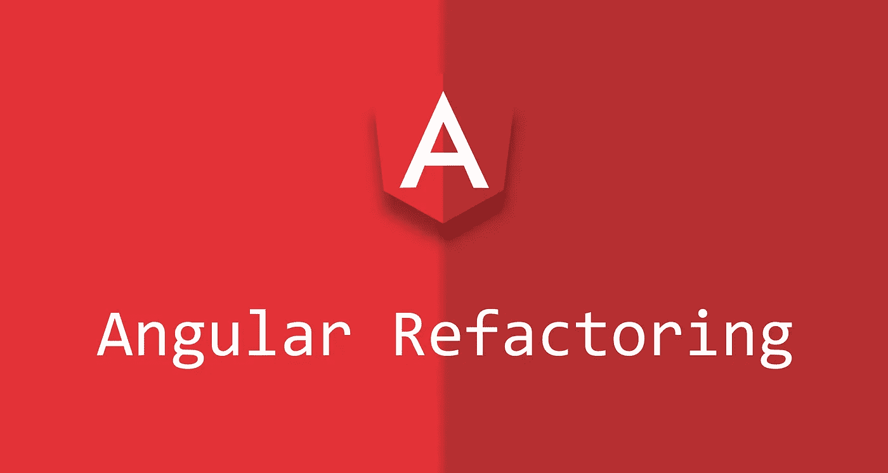

**源代码:** [StackBlitz **🚀**](https://stackblitz.com/edit/angular-refactoring-erxk?file=src/app/app.component.ts)

**文章目标:**了解我们在 Angular 应用程序中可以重构的常见模式

**文章主题(我们将学习什么)**

*   用`:host` / `HostBinding` / `HostListener`替换组件“包装器”
*   用更多的**声明性**技术取代`BehaviorSubject.getValue()`用法。
*   将做所有事情的组件替换到**容器** & **表示性**组件中

*重构*是一种技术，用于**改进现有代码的设计，同时保留其行为**。本文主要关注重构的具体例子，而不是如何从概念上进行重构。

> 代码设计可能是主观的，这些例子可能倾向于个人偏好。我们将改变设计，但不会改变基本功能。无论重构与否，这两种方法都应该是有效的。

相同的功能，不同的外观😀

# 替换组件包装元素

我们在 Angular 应用程序中可能看到的一种常见情况是将组件的所有元素包装在一个“包装器”元素中。

这里，我们主要关注重构模板中的外部`div`包装器。这个 div 完成了几件事情:使组件成为块级元素，添加鼠标监听器，以及动态设置边框颜色。

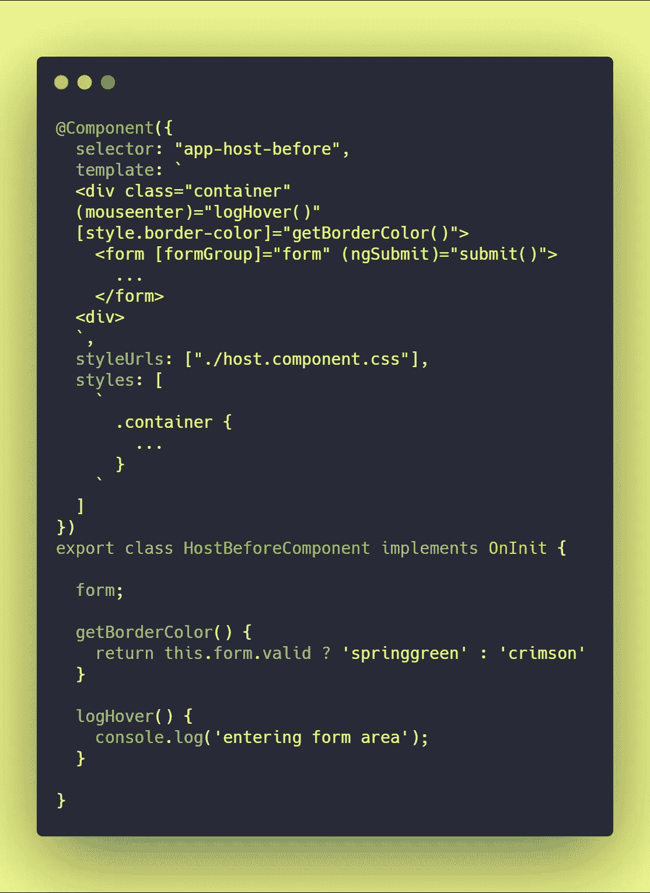

[来源](https://stackblitz.com/edit/angular-refactoring-erxk?file=src%2Fapp%2Fhost-refactor%2Fhost-before.component.ts)

在下面的代码片段中，我们已经完全移除了外部的`div`，进行了以下更改:

*   `div`已经被一个`:host` css 选择器所取代，它将声明`display: block`并完成`div.container`之前所做的事情
*   `(mouseenter)`事件绑定已经被替换为向其相应的函数添加`HostListener('mouseenter')`装饰器
*   `[style.border-color]`属性绑定已经被替换为将`HostBinding(style.border-color)`装饰器添加到其相应的函数中

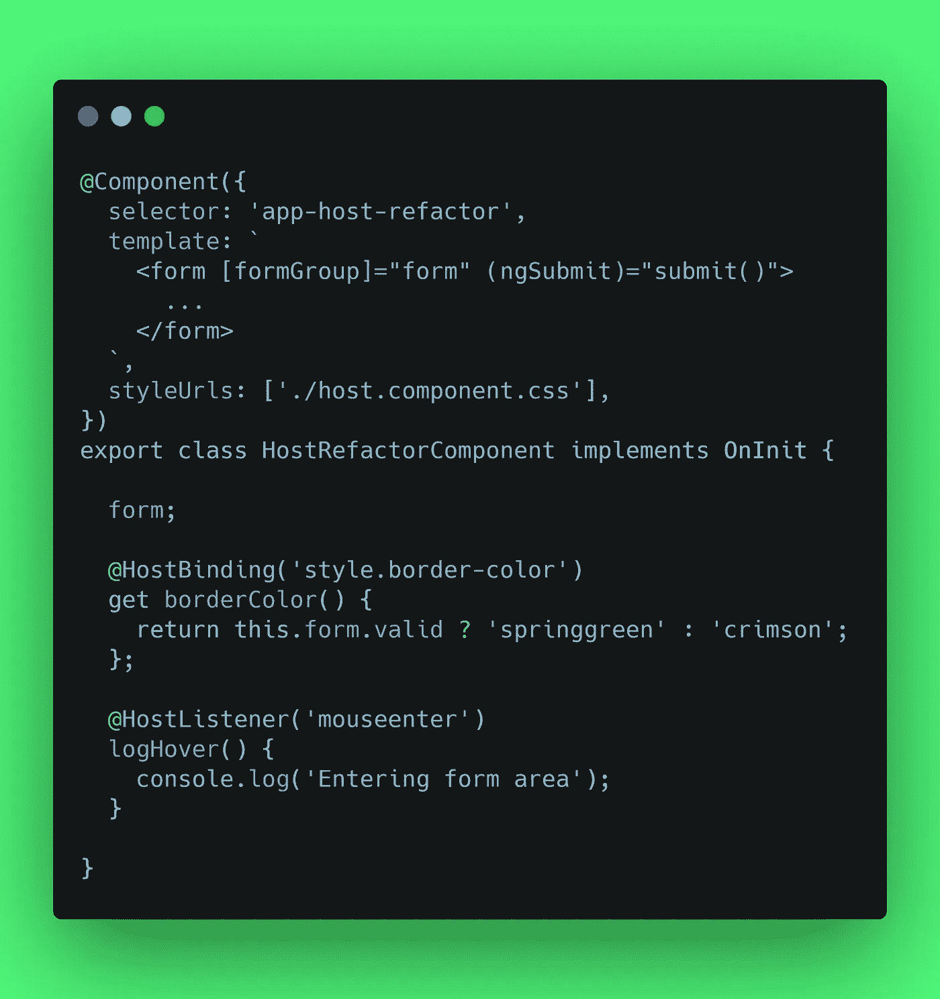

[信号源](https://stackblitz.com/edit/angular-refactoring-erxk?file=src%2Fapp%2Fhost-refactor%2Fhost-refactor.component.ts)

## **提示:表单元素&显示内容**

如果一个表单元素是你的组件(包装器)的第一个也是唯一的子元素。将 form 元素设置为`display: contents`，将表单的子元素视为宿主的子元素。[警告:实验性🧪](https://caniuse.com/#feat=css-display-contents)

# 正在删除 BehaviorSubject.getValue()的用法

Angular 利用并促进库 [RxJS](https://www.learnrxjs.io/) 的使用；它遵循[声明式](https://en.wikipedia.org/wiki/Declarative_programming)编程范例。

作为一个在使用 Angular 之前花了所有时间编写命令式 Java 代码的开发人员，当我不知道如何以声明式/RxJS 方式实现某件事情时，`BehaviorSubject.getValue()`是一个快速的答案。

这里有一些方法，我们可以学习声明性范例，替换`BehaviorSubject.getValue()`的用法。

## 扫描—将值保存和检索为可观察状态

> 当前页码示例📄

跟踪计数，就像分页器中的当前页码。当用户改变页面时，我们希望增加或减少计数。注意`currentPageNumber.getValue()`计算总和的用法。

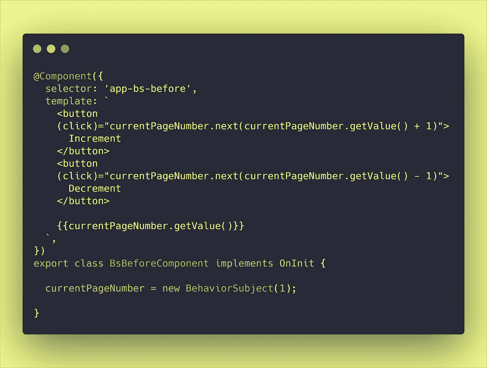

[来源](https://stackblitz.com/edit/angular-refactoring-erxk?file=src%2Fapp%2Fbs-refactor%2Fbs-before.component.ts)

我们可以使用[扫描操作符](http://reactivex.io/documentation/operators/scan.html)将当前页码保存为状态，然后在每次发射时递增或递减该状态，而不是每次都使用`.getValue()`来获取当前页码。

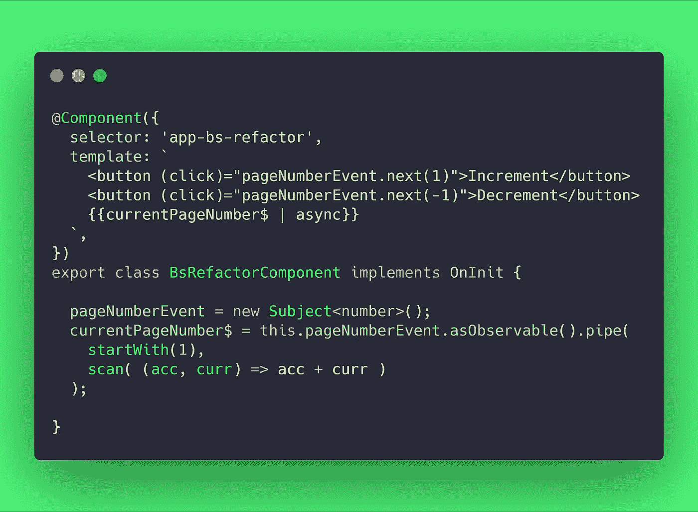

[来源](https://stackblitz.com/edit/angular-refactoring-erxk?file=src%2Fapp%2Fbs-refactor%2Fbs-refactor.component.ts)

在这个上下文中，`acc`，是我们的累计值。实际上，`acc`是前一次发射时扫描返回的值(或者是来自`getValue()`的值)。`curr`是当前排放/下一次排放()的值。

## withLatestFrom & combineLatests —在发射期间获取值

> 保存活跃用户数据示例️🤸‍♀️

有时我们在可观测的 A 的发射期间有副作用，我们需要来自可观测的 B 的最后发射/当前值来进行计算。

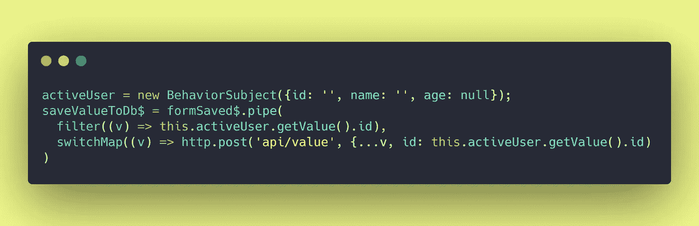

`withLatestFrom`将从我们的可观测值中获取最新值，并将其添加到下一个运算符中。注意`[v, u]`下面的`filter`和`switchMap`中的参数数组。—在这种情况下，来自`withLatestFrom`的`u`的值将是我们从`this.activeUser.getValue()`中检索到的值。

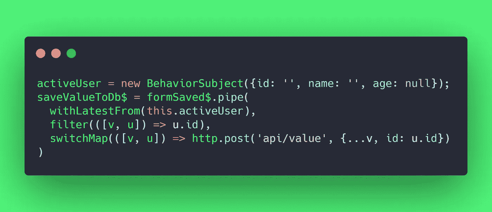

如果我们希望我们的可观察对象(`saveValueToDb$`)在我们的`activeUser`改变/发射时发射，我们应该使用`combineLatest`。否则使用`withLatestFrom`避免`activeUser`在`saveValueToDb$`可观察发射时产生影响。

> 注意，我们的源观测器`*saveValueToDb$*`不会发射，直到`*formSaved$*`和`*activeUser*`都发射了至少一次。

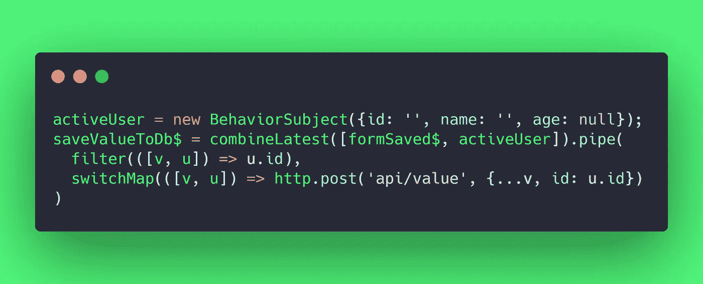

# 容器和表示组件📦

有时候，将一个组件分解成**容器组件(关注事物如何工作)**和**表示组件(关注事物看起来如何)**是有益的。—下面是一个在 Angular 应用程序中进行区分的示例:

我们的原始组件完成所有工作。它注入依赖关系，处理异步逻辑，定义列表中每一项的外观/格式，并定义事件的逻辑。

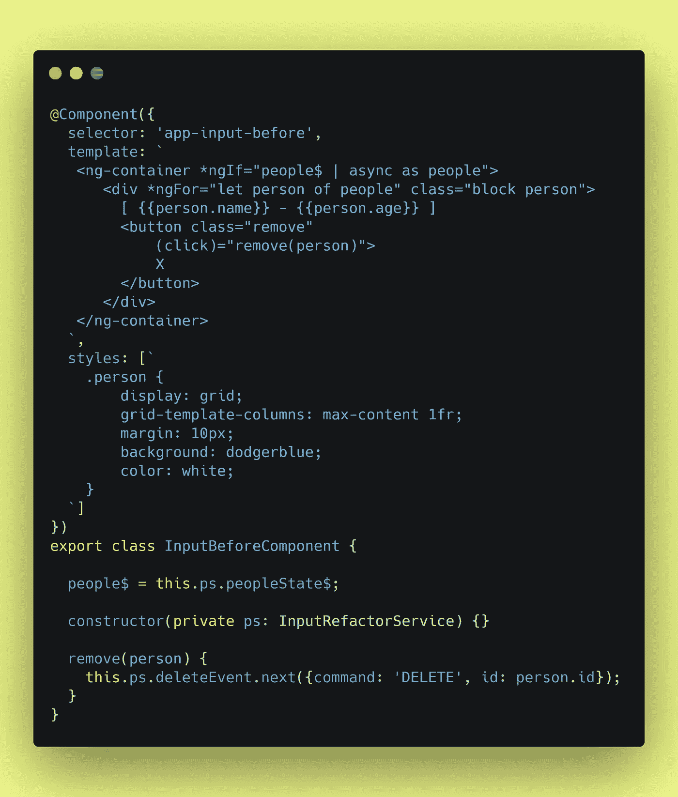

[来源](https://stackblitz.com/edit/angular-refactoring-erxk?file=src%2Fapp%2Finput-refactor%2Finput-before.component.ts)

我们的新容器组件将处理:注入依赖/数据源`constructor(private ps: InputRefactorService)`、异步逻辑`people$ | async`和事件逻辑`this.ps.deleteEvent.next(...)`。

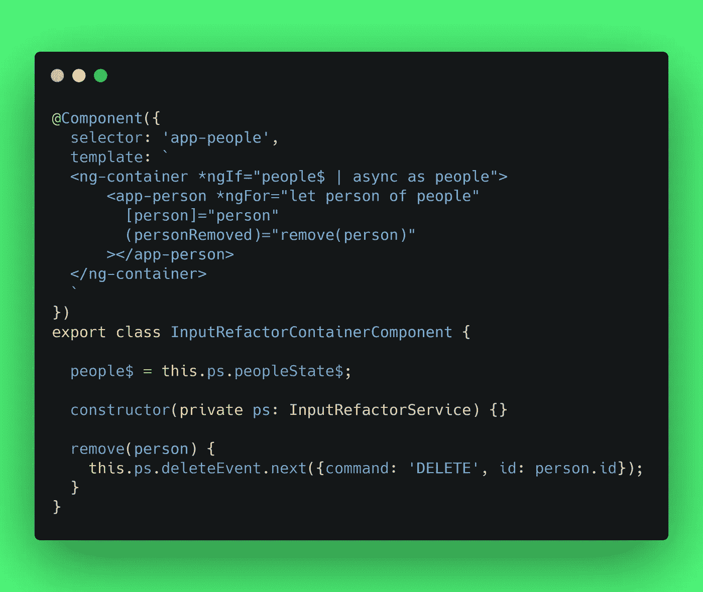

[来源](https://stackblitz.com/edit/angular-refactoring-erxk?file=src%2Fapp%2Finput-refactor%2Finput-refactor-container.component.ts)

我们的表示组件**接受来自容器**的数据作为输入，而**通过输出将逻辑委托给容器**。它不知道任何依赖关系，person 是异步/同步的，或者在 remove 上执行什么逻辑。

我觉得这个不必很严格。我们通常可以遵从对用例最有意义的东西。

作为一个额外的好处，像这样的表示组件使得自信地设置`ChangeDetectionStrategy.OnPush`变得更加容易。

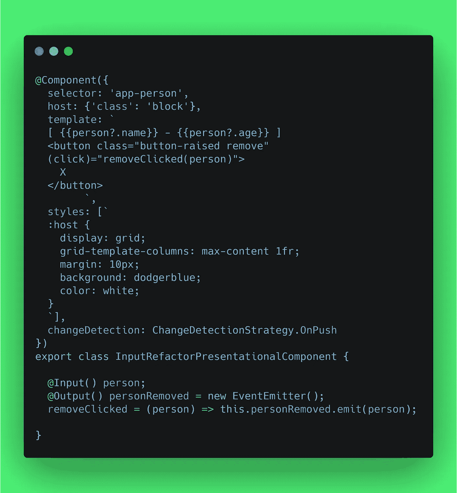

[来源](https://stackblitz.com/edit/angular-refactoring-erxk?file=src%2Fapp%2Finput-refactor%2Finput-refactor-presentational.component.ts)

# 参考

*   [行为主体 getValue Ben Lesh](https://stackoverflow.com/questions/37089977/how-to-get-current-value-of-rxjs-subject-or-observable/45227115#45227115)
*   [丹·阿布拉莫夫(React)的演示组件](https://medium.com/@dan_abramov/smart-and-dumb-components-7ca2f9a7c7d0)
*   [角度文件](https://angular.io/docs)

> ☁️[flotes](https://flotes.app)——尝试演示，无需登录。或者免费报名。Flotes 是我记笔记和高效学习的方式，即使在我很忙的时候。

[漂浮物](https://flotes.app)