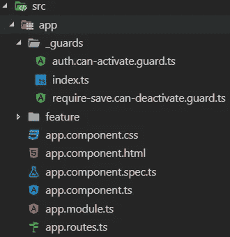
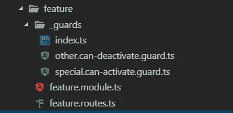
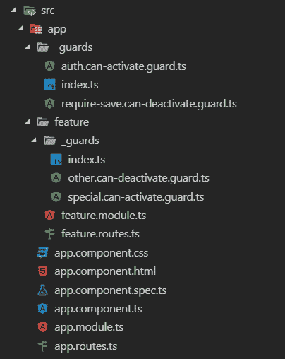

# 角度路由—企业应用的最佳实践

> 原文：<https://itnext.io/angular-routing-best-practices-for-enterprise-applications-da539e4a6d42?source=collection_archive---------3----------------------->

[](https://ultimatecourses.com/courses/angular/ref/wes.grimes/) [## ultimate Angular |专家指导的在线 Angular 和 TypeScript 培训课程

### 学习最新的 Angular，TypeScript，通过 NGRX 和超越。通过我们的在线课程，成为在线角度专家。

ultimatecourses.com](https://ultimatecourses.com/courses/angular/ref/wes.grimes/) 

# 在开始之前

本文并不打算成为 Angular 中布线的教程。如果您是 Angular 路由的新手，我强烈建议您查看以下资源之一:

*   [终极课程](https://bit.ly/2WubqhW)
*   [官方角度文件](https://angular.io/guide/router)

# 背景

下面是我在构建了几个企业角度应用程序后，在日常工作中开发的一个模式。虽然大多数在线教程在奠定基础方面做得很好，但我很难找到展示大型可伸缩应用程序的推荐约定和模式的文章。

使用这种模式，您应该对应用程序中所有与路由相关的问题有一个清晰简洁的组织。

# 先决条件

对于上下文，本文假设您正在使用以下版本的 Angular:

*   角度 v7.2.6

# 最佳实践#1 —创建顶级路由数组文件

> *官方* [*Angular docs 推荐*](https://angular.io/guide/router#refactor-the-routing-configuration-into-a-routing-module) *为您打造一款全面成熟的* `*app-routing.module.ts*` *顶级路由。我发现这额外的一层在大多数情况下是不必要的。*

让我们采用以下方法:

1.  在根目录`src/app`下创建一个名为`app.routes.ts`的新文件。这个文件将保存我们的顶级`Routes`数组。我们将在整篇文章的后面回来并填充它。现在，让我们用以下内容来搭建它:

> *热提示:这里只注册顶级路由，如果你计划实现特性模块，那么子路由将存在于各自的* `*feature.routes.ts*` *文件之下。我们希望尽可能保持这个顶级 routes 文件的整洁，并遵循组件树结构。*

```
import { Routes } from '@angular/router'; 
export const AppRoutes: Routes = [];
```

1.  在`app.module.ts`文件中注册`AppRoutes`。

*   从`app.routes.ts`导入`AppRoutes`
*   从`@angular/router`导入`RouterModule`
*   将`RouterModule.forRoot(AppRoutes)`添加到您的`imports`数组中

您更新后的`app.module.ts`将如下所示:

```
import { NgModule } from '@angular/core';
import { BrowserModule } from '@angular/platform-browser';
import { RouterModule } from '@angular/router';
import { AppComponent } from './app.component';
import { AppRoutes } from './app.routes';

@NgModule({
  declarations: [AppComponent],
  imports: [BrowserModule, RouterModule.forRoot(AppRoutes)],
  providers: [],
  bootstrap: [AppComponent]
})
export class AppModule {}
```

# 最佳实践# 2-创建要素级路径数组文件

以类似于我们构建`app.routes.ts`的方式，我们将创建一个`feature.routes.ts`来列出该功能模块的各个路线。我们希望我们的路线尽可能靠近源头。这将与干净的代码方法保持一致，并具有良好的关注点分离。

1.  创建一个名为`feature/feature.routes.ts`的新文件，其中`feature`与您的`feature.module.ts`前缀相匹配。这个文件将保存我们的特性级`Routes`数组。请记住，您将使用您的模块的实际名称替换`Feature`,让我们用以下内容来搭建它:

```
import { Routes } from '@angular/router';

export const FeatureRoutes: Routes = [];
```

2.在`feature/feature.module.ts`文件中注册`FeatureRoutes`。我们将利用`RouterModule.forChild`导入，以便这些路由自动注册到延迟加载。

*   从`feature.routes.ts`导入`FeatureRoutes`
*   从`@angular/router`导入`RouterModule`
*   将`RouterModule.forChild(FeatureRoutes)`添加到您的`imports`数组中

您更新后的`feature/feature.module.ts`将类似于下图:

```
import { CommonModule } from '@angular/common';
import { NgModule } from '@angular/core';
import { RouterModule } from '@angular/router';
import { FeatureRoutes } from './feature.routes';

@NgModule({
  declarations: [],
  imports: [CommonModule, RouterModule.forChild(FeatureRoutes)]
})
export class FeatureModule {}
```

带有子路线的`feature.routes.ts`文件示例如下:

```
import { Routes } from '@angular/router';
import { FeatureOneComponent } from './feature-one.component';
import { FeatureSpecificCanActivateGuard } from './_guards';

export const FeatureOneRoutes: Routes = [
  {
    path: '',
    component: FeatureOneComponent,
    canActivate: [FeatureSpecificCanActivateGuard]
  }
];
```

# 最佳实践# 3-将延迟加载的要素添加到顶级路径文件中

> *延迟加载的概念是将代码资产(javascript、样式)的加载推迟到用户真正需要使用资源的时候。这可以大大提高应用程序的感知加载时间，因为不必在第一次绘制时下载整个代码集。*
> 
> *Angular 为给定的路线提供了一个很好的方式来处理这个与* `*loadChildren*` *选项。更多信息可参见* [*官方角度文档*](https://angular.io/guide/router#lazy-loading-route-configuration) *。*

一旦创建了`app.routes.ts`和`*.routes.ts`文件，就需要注册任何想要延迟加载的特性模块。

## 每个功能模块…

更新`app.routes.ts`文件中的`AppRoutes`数组，以包含一个新的特征路线:

```
import { Routes } from '@angular/router';

export const AppRoutes: Routes = [
  {
    path: 'feature',
    loadChildren: './feature/feature.module#FeatureModule'
  }
];
```

通过将上述路由添加到数组中，当用户在浏览器中请求`/feature`时，Angular lazy 使用给定的路径加载模块，然后使用`RouterModule.forChild`导入自动注册`feature.routes.ts` `FeatureRoutes`数组中定义的任何路由。

对于每个额外的特性模块，您将向`AppRoutes`数组添加另一个项目。如果您有多个功能，它可能如下所示:

```
import { Routes } from '@angular/router';

export const AppRoutes: Routes = [
  {
    path: '',
    pathMatch: 'full',
    redirectTo: 'feature-one'
  },
  {
    path: 'feature-one',
    loadChildren: './feature-one/feature-one.module#FeatureOneModule'
  },
  {
    path: 'feature-two',
    loadChildren: './feature-two/feature-two.module#FeatureTwoModule'
  }
];
```

# 最佳实践#4 —保持路由器防护有序

这里有一些让你的路由器防护保持有序的小技巧。这些只是指导方针，但我发现它们非常有帮助。

## 给你的卫兵起个好名字

警卫应使用以下命名约定:

*   文件名:`name.function.guard.ts`
*   班级名称:`NameFunctionGuard`

每个部分被标识为:

*   这是你的守卫的名字。你在防范什么？
*   `function` -这是你的守卫将被附加的功能。角形支架`CanActivate`、`CanActivateChild`、`CanDeactivate`和`Resolve`。

一个附加到`CanActivate`函数的授权保护的例子命名如下:

*   文件名:`auth.can-activate.guard`
*   类别名称:`AuthCanActivateGuard`

## `_guards`文件夹下的组

> 注意文件夹上的下划线“_”前缀，这只是为了在编辑器中进行排序。我总是希望这些文件夹显示在顶部。我为`*_models*`和`*_services*`做同样的事情。

将所有顶级守卫组织在一个名为`src/app/_guards`的文件夹下。我见过应用程序在顶级目录中抛弃守卫，这很混乱，尤其是如果你最终有几个以上的守卫。

## 使用桶出口

> 使用桶导出是否被官方认为是“最佳实践”，甚至是否得到 Angular style guide 的支持，还没有定论。然而，我非常喜欢这种干净的组织。这种方法是作为建议提供的。

确保`src/app/_guards`有一个漂亮干净的`index.ts`桶出口。木桶导出是简单的`index.ts`文件，它们组合在一起，从一个目录中导出所有公共文件。一个例子如下:

```
export * from './auth.can-activate.guard';
export * from './require-save.can-deactivate.guard';
```

不带桶出口:

```
import { AuthCanActivateGuard } from 'src/app/_guards/auth.can-activate.guard';
import { RequireSaveCanDeactivateGuard } from 'src/app/_guards/require-save.can-deactivate.guard';
```

桶出口:

```
import { AuthCanActivateGuard, RequireSaveCanDeactivateGuard } from 'src/app/_guards';
```

带有`_guards`目录的示例应用程序如下所示:



## 组织特定功能的路径保护

如果你有在特定的`FeatureRoutes`阵列中只使用*的*守卫，那么将这些路线存储在你的特征文件夹下名为`_guards`的文件夹下。确保遵循上面定义的相同命名约定，以及桶导出。

*   在特征文件夹下名为`_guards`的文件夹下放置防护
*   确保为干净的导入创建一个桶导出`index.ts`

带有`_guards`的特征目录示例如下:



# 完成的应用程序结构

完整的应用程序结构应该如下所示:



# GitHub 资源库示例

我在 GitHub 上创建了一个演示库。随意派生、克隆和提交 PRs。

[](https://github.com/wesleygrimes/angular-routing-best-practices) [## Wesley Grimes/角度路由最佳实践

### 角度路由-企业应用的最佳实践-Wesley Grimes/角度路由-最佳实践

github.com](https://github.com/wesleygrimes/angular-routing-best-practices) 

# 结论

重要的是要记住，我已经在几个“真实世界”的应用程序中实现了这些最佳实践。虽然我发现这些最佳实践是有帮助的，并且是可维护的，但是我不认为它们是组织项目中路线的终极解决方案；我就是这么做的。我很好奇你们都是怎么想的？在使用 routing 构建企业级 Angular 应用程序时，请随时提供您所学到的任何建议、技巧或最佳实践，我将更新文章以反映这一点。

编码快乐！

*原载于 2019 年 2 月 24 日*[*wesleygrimes.com*](https://wesleygrimes.com/angular/2019/02/24/angular-routing-best-practices-for-enterprise-applications.html)*。*