# Angular & RxJS:检测内存泄漏

> 原文：<https://itnext.io/angular-rxjs-detecting-memory-leaks-bdd312a070a0?source=collection_archive---------1----------------------->

我已经使用 RxJS 构建了一个示例 Angular 应用程序来模拟各种内存泄漏。这些技术中的大多数都适用于任何使用 RxJS 的基于组件的框架。

[下载源代码🚀](https://github.com/Everduin94/memory-leaks-rxjs)

我们将涵盖:

1.  检测内存泄漏的策略
2.  取消订阅和垃圾收集
3.  解决基于订阅的内存泄漏的解决方案

# 检测内存泄漏的策略

在谷歌浏览器中使用谷歌浏览器开发工具🛠 (Ctrl+Shift+I)

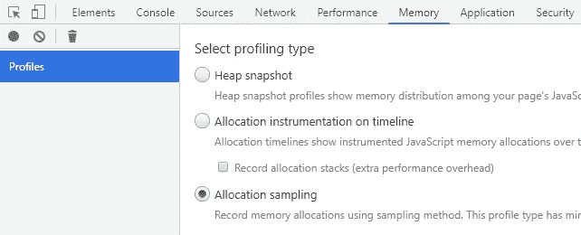

## **分配时间表📈**

分配时间表允许我们查看堆的最小大小是否随着时间的推移而增长。在创建或销毁任何组件之前，我们将从基线开始。

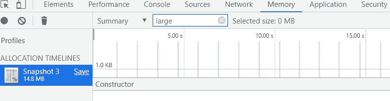

现在，当时间线运行时，我们将多次创建/销毁 LargeLeak 组件。注意，我在过滤器中输入了 large，因为我们正在寻找 LargeLeakComponent 的分配

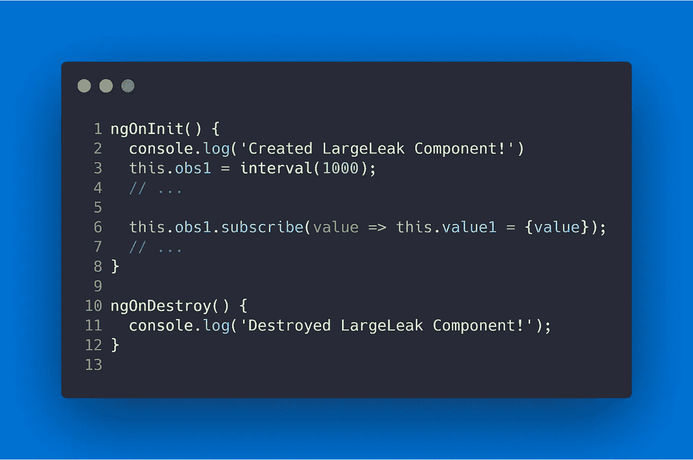

LargeLeakComponent.ts

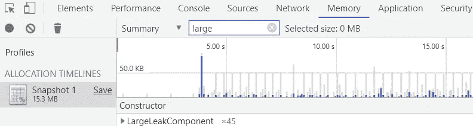

现在我们回到起点(销毁 LargeLeakComponent) →手动运行垃圾收集(左上角的🗑垃圾桶图标)→重新启动分配时间线(左上角的⚫圈图标)。我们可以看到我们的最小堆大小增加了，分配没有被释放。

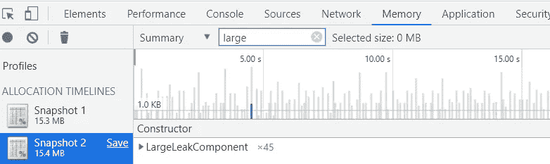

## **堆快照📸**

一旦我们确定了泄漏，堆快照就非常有用。不同于分配时间表🐌，当我们与应用程序交互时，堆快照不会导致延迟。最终，快照和分配时间表都可以用来检测泄漏。

在应用程序中做任何事情之前，我们将从堆快照开始。这将是我们的基线或起点。我们可以看到已经分配了 0 个 ServiceObservableLeak 组件。

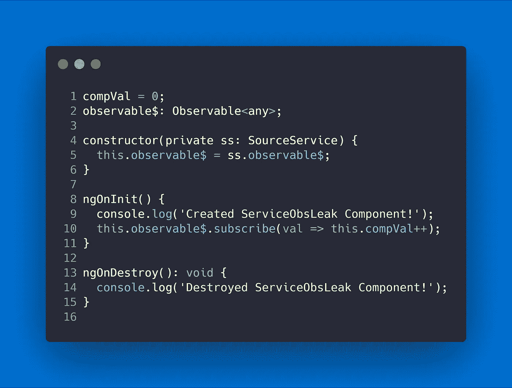

ServiceObservableLeak.ts

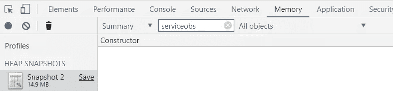

多次切换创建/销毁后→手动运行垃圾收集🗑→并拍摄另一个⚫.快照我们可以看到组件没有通过垃圾收集来释放。

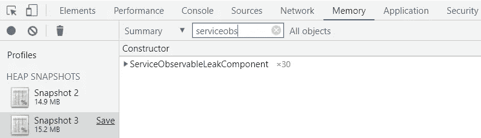

注意，只搜索组件并不总是查找内存泄漏的有效方法。如果我们假设存在内存泄漏，我们还应该检查内存中的订阅者数量。🔍使用快照比较(筛选器旁边的下拉菜单)，我们可以比较两个独立的快照。这表明我们已经分配了 30 个订户，删除了 0 个。在“取消订阅和垃圾收集”中有更多关于这方面的内容。

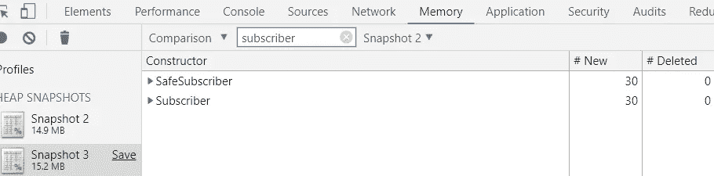

# **取消订阅和垃圾收集**

人们经常提到，订阅持有对组件的引用。因此，组件不能被释放，造成内存泄漏。不能释放任何一个相互引用的对象称为循环。[【1】](https://developer.mozilla.org/en-US/docs/Web/JavaScript/Memory_Management)

周期是“引用计数垃圾收集”算法的一个限制。现代浏览器使用“标记-清除”算法🎯。标记和清除算法将从根(全局对象)收集所有不可到达的对象。这解决了循环的局限性。

我们可以通过测试局部有限可观察值来验证垃圾收集器处理周期的想法。当我们切换本地有限组件→手动运行垃圾收集🗑→时，获取堆快照⚫.

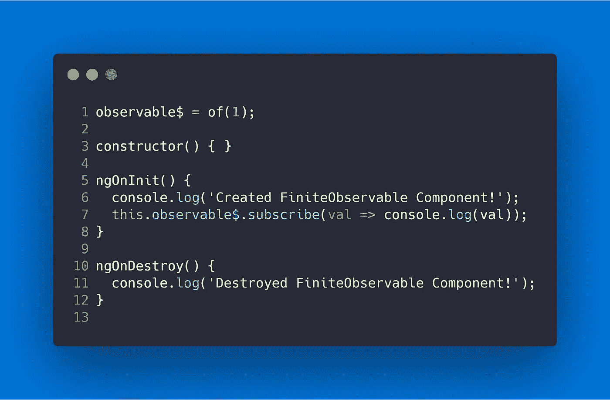

FiniteObservableComponent.ts

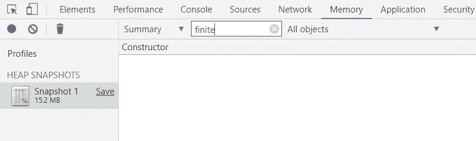

我们可以看到组件没有泄漏，即使我们没有使用订阅管理策略(比如取消订阅)。

> “所以我可以让垃圾收集来管理我的订阅？”

**号**

如果订阅/组件仍然有一些对根的引用，它将不会被垃圾收集。我们可以在前一个示例的 ServiceObservableLeak 组件中看到这一点。因为我们的 observable (observable$)是在服务(SourceService)中分配的，所以组件仍然有一个通过 observable 返回到根的引用。我们需要取消订阅组件(ServiceObservableLeakComponent)才能进行垃圾收集。

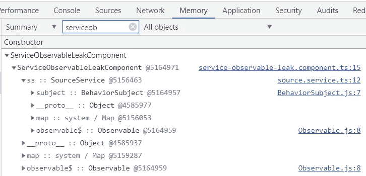

不管理订阅是一种不好的做法，应该避免。以 FromEvent 组件为例。该组件初始化一个本地可观察对象，该对象在 FromEventComponent 中监视按钮上的点击事件。

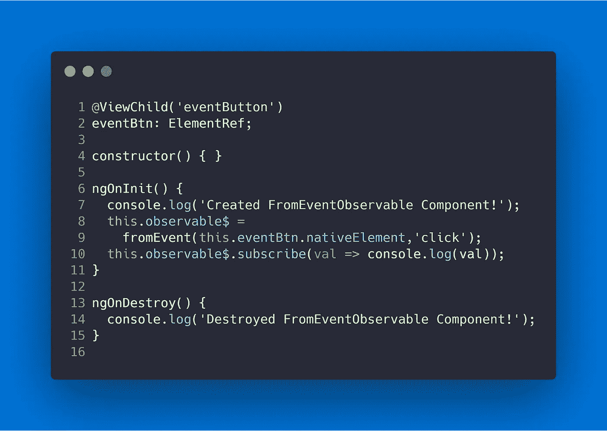

FromEventComponent.ts

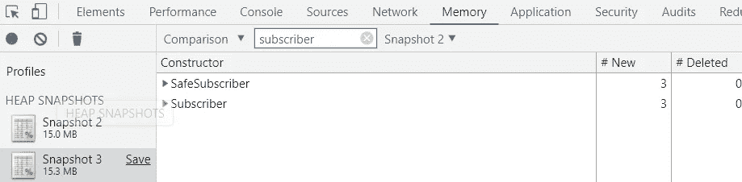

在这个例子中，组件被释放，但是订户没有被释放。更复杂的是，只有当点击事件至少被触发一次时，订阅者才会泄漏。这造成了很难跟踪的内存泄漏。—解决方案是始终管理您的订阅。

# **解决方案**

我计划在以后的文章中更详细地介绍这些方法。现在，这里是一个高层次的概述。🌎

## 取消订阅

取消订阅 ngOnDestroy 方法中的所有订阅是一种有效的策略。这类似于异步管道在组件级所做的事情。

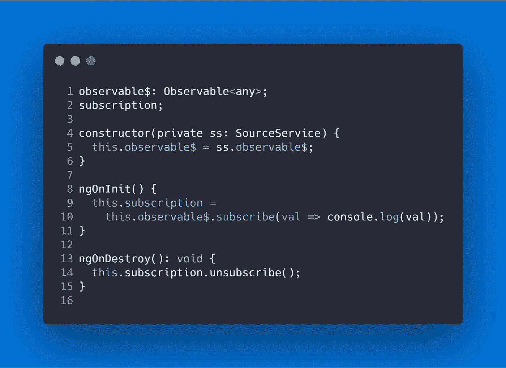

## 异步管道

将根据与之关联的 DOM 元素的生命周期来管理您的订阅。无论在哪里声明，异步管道都将进行新的订阅。使用“as”重复使用提供的值。

我已经写了关于异步管道以及如何使用它的详细内容[在这里【2】](https://medium.com/@erxk_verduin/angular-rxjs-async-pipe-deep-dive-2510b56f793a)

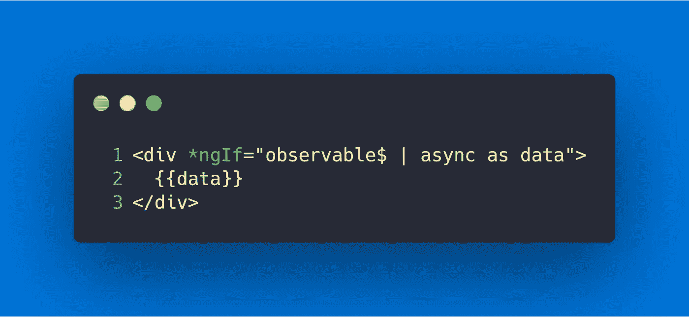

## 拿

take、takeUntil 和 takeWhile 都将根据满足的条件自动管理订阅。例如，takeUntil 将一个可观察对象作为参数，并维持一个订阅，直到该可观察对象发出一个值。

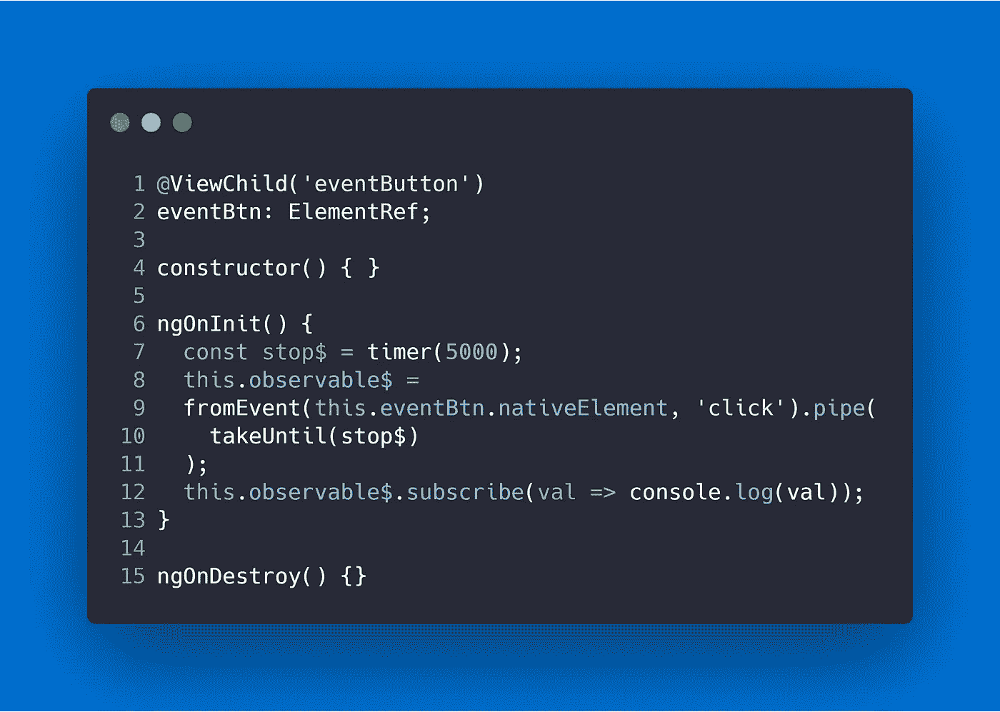

> ☁️[flotes](https://flotes.app)——尝试演示，不需要登录。或者免费报名。Flotes 是我记笔记和高效学习的方式，即使在我很忙的时候。

[flots](https://flotes.app)

# **资源/参考资料**

*   [1]:[https://developer . Mozilla . org/en-US/docs/Web/JavaScript/Memory _ Management](https://developer.mozilla.org/en-US/docs/Web/JavaScript/Memory_Management)
*   [2]:[https://medium . com/@ erxk _ verduin/angular-rxjs-async-pipe-deep-dive-2510 b 56 f 793 a](https://medium.com/@erxk_verduin/angular-rxjs-async-pipe-deep-dive-2510b56f793a)
*   语法高亮图像由 [https://carbon.now.sh](https://carbon.now.sh/) 生成