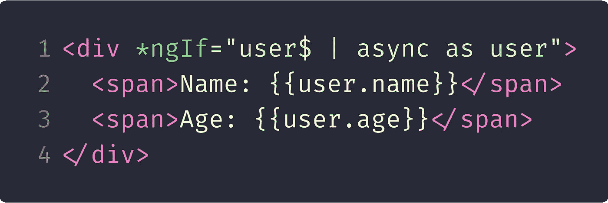

# 角度中的结构指令

> 原文：<https://itnext.io/angular-structural-directives-b54ea21b39a7?source=collection_archive---------4----------------------->

> [负责 HTML 布局。它们塑造或重新塑造 DOM 的*结构*，通常是通过添加、删除或操作元素。](https://angular.io/guide/structural-directives#what-are-structural-directives)

结构指令是 Angular 的一个关键部分，每个人都应该熟悉。它们负责通过添加、删除或更改元素来操作 DOM。即使你自己从来没有编写过结构化指令，你也可能经常在你的模板中使用 **ngIf* 和 **ngFor* 。星号(*)表示它是一个结构指令。如果你想在继续我们的例子之前阅读更多内容， [angular docs](https://angular.io/guide/structural-directives) 提供了一个很好的、详细的解释。

正如我们将在下面的例子中看到的，编写一个结构化的指令是非常容易的。其目的可以从简单的条件呈现(例如，基于用户角色)到在一个范围内迭代或模板内 let 变量声明。

# 基础

## 操纵 DOM

为了让一个指令能够操作 DOM，有必要提供一种不需要通过 DOM API 改变任何东西的方法。在 Angular 中，这是通过向指令注入一个视图容器引用和一个模板引用来实现的。

带有视图容器和模板引用的伪指令示例

## 查看容器参考

> 表示可以附加一个或多个视图的容器。

它基本上允许我们操作容器(外部元素包装)并附加在指令内部创建的模板。更多描述见其[文档](https://angular.io/api/core/ViewContainerRef)。

## 模板参考

> 表示可用于实例化嵌入式视图的嵌入式模板。

简单地说，这是我们已经把指令放在上面的一个元素。我们在指令中需要这个引用，因为我们几乎总是以某种方式使用模板，要么重复它( **ngFor* )，有条件地显示它( **ngIf* )，要么在悬停时附加另一个元素( *matTooltip* )。

## 价值输入

在大多数情况下，我们在指令中输入一些值，这样它就可以在内部使用。例如，要迭代的集合、要评估的条件或用于更具体目的的值。指令的摘要周期也与值的变化联系在一起，所以每次值发生变化时，指令都会被重新评估。

并不总是需要输入值；可以注入服务或状态存储，指令可以像组件一样访问这些值。

# 语境

每个指令都有自己的上下文。将上下文定义为每个指令的接口是一个很好的实践，因此我们公开什么值是可以理解的。然后这个上下文被用作*模板引用*的类型，并且当在*容器引用*上创建嵌入式视图时设置属性。

## 公开内部值

有两种可能的方法来公开内部值，以便我们可以在模板中使用它们:一种是在结构中命名变量，另一种是发出一个隐式值。

例如， **ngFor* 指令遍历列表(数组)，在其上下文对象中设置属性并公开当前项目。可以在指令修饰元素范围内的模板中使用公开的值。

在 **ngFor* 中，目前有 [*index* ，even， *odd* ， *first* ， *last*](https://github.com/angular/angular/blob/master/packages/common/src/directives/ng_for_of.ts#L30...L42) 上下文变量通过它们的名字导出，还有一个隐式变量表示当前项目，我们可以随意命名。在下面的例子中，是*英雄。*它应该被赋给上下文*$隐式*属性。

*ngFor 指令中公开的变量的用法

# **让指令**

如果您已经在模板中采用了异步管道的用法，那么您可能会偶然发现这样一个用例，您可以编写如下内容:

使用异步管道获取用户$数据流的当前值，并将其赋给用户变量

它允许您重用/共享您用" *as"* 语法创建的变量中的值。如果您不想多次使用异步管道，这真的很有用，因为它会在每次使用时创建一个订阅。

ngIf 指令有两个目的。一个是让我们为异步值创建变量，另一个是如果值为 [falsy ( *false，undefined* ， *null* ， *0* ，…)](https://developer.mozilla.org/en-US/docs/Glossary/Falsy) ，则隐藏/不呈现整个部分。

但是如果我们想要这个值，即使它是“假的”呢？我们可以利用字母指令。

允许输入模板变量的简单字母指令示例

Let 指令的上下文有两个属性(如其文档中所述)。然后，这两个属性以不同的语法用于用法示例的 HTML 模板中的模板变量声明。

有些人可能会说，我们应该在 **ngIf* 中用 else 语句处理这些情况，是的，对于大多数情况来说，这是一个完全有效的解决方案。好的用例是用某种定制消息处理 falsy 值。但是并不总是希望或者能够在模板中为 falsy 和 [truthy](https://developer.mozilla.org/en-US/docs/Glossary/Truthy) 值分离逻辑，所以使用这样的指令可以使模板更加简单和易读。

# 对于每个范围指令

模板中的迭代有时需要各种东西。其中之一是可以轻松显示给定数量的元素。一个很好的例子是表格分页或年份选择的数值下拉，可以像下面的例子一样很容易地使用它。

# 代码示例库

所有示例、用法和源代码都在下面的链接中。

 [## vmasek/ng-啤酒-指令

### ngBeer talk 的角度指令示例

github.com](https://github.com/vmasek/ng-beer-directives) 

我在维也纳会议上关于结构指示的讲话