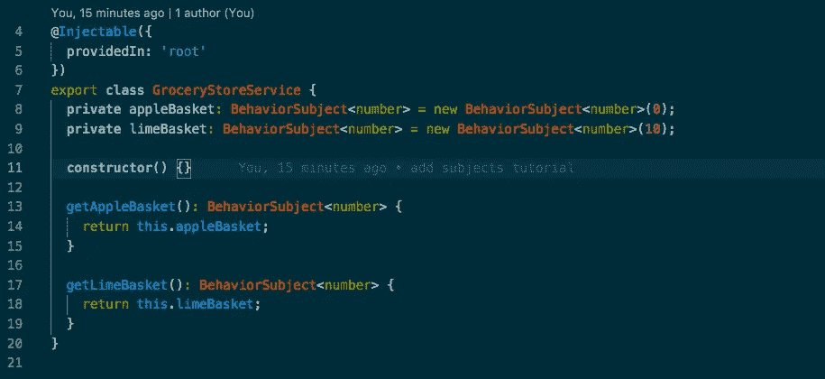

# 角度-主题

> 原文：<https://itnext.io/angular-subjects-8ed5bf7c4f00?source=collection_archive---------0----------------------->

我最近写了一个关于使用`Input` s 和`Output` s 在父组件和子组件之间来回传递数据的[故事](/angular-input-output-f0418ab4cc91)。如果我们有一个多对多的关系，而不是一对多或多对一的父子数据关系。在这种情况下，`Input` s 和`Output` s 不是最佳选择。相反，我们可以用`Subject` s

反应式编程语言 Rxjs 非常强大，有很好的类型脚本支持。Rxjs 的核心是使用 observables 让任何人在任何地方都能听到价值变化。`Observable`是监听数据变化的最基本的实现，但是我发现`BehaviorSubject`更容易使用，并且通常有更广泛的用例。`BehaviorSubject`和`Subject`的唯一区别是`BehaviorSubject`有一个初始值，当订阅时会发出。



# 行为主体

`BehaviorSubject`从`rxjs`库中导入，这是生成的角度项目中的标准。

```
// *grocery-store.service.ts*import { Injectable } from '@angular/core';
import { BehaviorSubject } from 'rxjs';@Injectable({
  providedIn: 'root'
})export **class** GroceryStoreService {
  **private** appleBasket: BehaviorSubject<number> = new BehaviorSubject<number>(0);
  **private** limeBasket: BehaviorSubject<number> = new BehaviorSubject<number>(10);
  **constructor**() {} getAppleBasket(): BehaviorSubject<number> {
    return this.appleBasket;
  } getLimeBasket(): BehaviorSubject<number> {
    return this.limeBasket;
  }
}
```

我们用创建一个新的`BehaviorSubject`

```
**private** limeBasket: BehaviorSubject<number> = new BehaviorSubject<number>(10);
```

它简单地说明了`limeBasket`的类型是 number，应该用`10`初始化。

`limeBasket`有两个主要方法，`subscribe`和`next`。`subscribe`每当有变化时，广播该值。`next`向`limeBasket`传递新值，从而触发`subscribe`进行广播。凡是订阅了`limeBasket`的，都将获得价值。

```
// app.component.ts...**constructor**(
  **private** groceryStoreService: GroceryStoreService
) { ... this.limesBasket$ = this.groceryStoreService.getLimeBasket(); ... this.limesBasket$.subscribe(value **=>** {
    this.lastEvent = `Limes basket now has ${value} limes(s)`;
  });
}...
```

为了向`BehaviorSubject`发送一个新值，我们称之为`next()`。

```
// *app.component.ts*...changeLimes() {
  this.limesBasket$.next(this.numberOfLimes);
}...
```

Angular 的一个很好的特性是，如果你的标记中只有**和**需要主题的值，你可以避免订阅`BehaviorSubject`。

```
// *lime.component.html*<div class="container">
  Number of limes: {{ limesBasket$ | async }}
</div>
```

这个`async`管道是 Angular 的开箱即用，基本上是说，“嘿，这是某种类型的可观测值，所以为我订阅，把值放在这里。”

# **注释**

*   确保将您的服务作为提供者包含在`app.module.ts`中。
*   在属性/变量`limeBasket$`的末尾添加一个`$`，是用于表示可观察类型的通用约定。

# 摘要

`BehaviorSubject`是在大量组件之间来回传递数据的好方法。两个主要方法是`subscribe`，用于监听新值，和`next`，用于设置新值。

看看我在 Github 上的例子:[https://github.com/orange-bees/angular-concepts-tutorials](https://github.com/orange-bees/angular-concepts-tutorials)。

# 关于我

我在南卡罗来纳州格林维尔的一家软件工程咨询公司 [Orange Bees](https://orangebees.com/) 担任首席工程师。我写得棱角分明。NET 应用，在 Azure 架构项目(Azure Developer Associate 认证)，涉猎 ElasticSearch 和 node . js
你可以在 [LinkedIn](https://www.linkedin.com/in/james-l-gross/) 上找我。