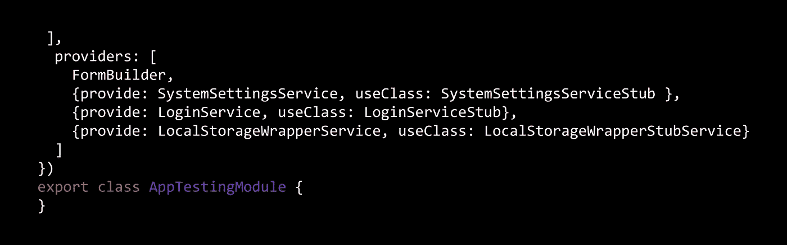

# 角度测试模块:包装模拟测试

> 原文：<https://itnext.io/angular-testing-module-wrap-mock-test-26dd8d590d35?source=collection_archive---------0----------------------->

我发现 Angular 的模块测试模式是最有效和可维护的，所以我将它应用到我负责的每个 Angular 项目中，

遵守以下概念真的让我的生活变得很简单:

1.  我没有直接使用 web apis，而是将其包装在服务中，并使用包装器:)
2.  我嘲笑每一项服务！(我的应用程序和我的服务、组件使用的外部 api)

3.我有一个 AppTestingModule，在其中我导入了所有的测试模块，以及被测试组件使用的实际模块，并且我提供了存根服务，而不是“真正的”服务。

**包裹**:

比方说，出于任何原因，您选择使用 localstorage 来保存 UI 元素位置(例如，当拖动小部件时)或 poc JWT 认证，用于 localStorage 的 Angular wrapper 服务:

**嘲弄:**

**测试:**

仅此而已:)