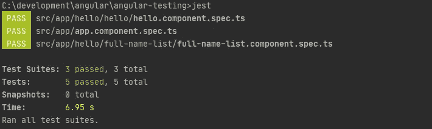

# 角度测试系列:如何顺利给角度项目添加 Jest？

> 原文：<https://itnext.io/angular-testing-series-how-to-add-jest-to-angular-project-smoothly-afffd77cc1cb?source=collection_archive---------0----------------------->

## 如何在 Angular 项目中加入 Jest，为什么要考虑？


照片由[国家癌症研究所](https://unsplash.com/@nci?utm_source=unsplash&utm_medium=referral&utm_content=creditCopyText)在 [Unsplash](https://unsplash.com/s/photos/testing?utm_source=unsplash&utm_medium=referral&utm_content=creditCopyText) 上拍摄

当我们有机会从一开始就参与一个有角度的项目时，我们可能会对许多架构方面产生影响。其中一个方面是选择合适的技术和测试工具。在过多的项目中，Angular 附带的标准工具被使用: [Karma](https://karma-runner.github.io/latest/index.html) 和 [Jasmine](https://jasmine.github.io/) 。

然而，重要的是要认识到，测试运行程序的选择并不仅限于因果报应。出于某些原因，对笑话感兴趣是值得的。

## Jest 给你的项目带来了哪些可能的好处？📘

*   更快的体验和开箱即用的并行测试
*   Jest CLI 提供的支持工作效率的各种功能
*   简单的伪装、侦察和嘲弄
*   内置断言和代码覆盖率
*   类型脚本支持

…老实说，你可以在[文档](https://jestjs.io/docs/en/getting-started)中读到更多的功能。现在，让我们把重点放在实际的方面和目的上，这是给你的角度项目添加笑话。

## 安装所有必需的依赖项🌱

如果您选择`npm`作为项目中的包管理器

```
npm install jest jest-preset-angular @types/jest --save-dev
```

或者`yarn`是否是你在项目中的选择

```
yarn add jest jest-preset-angular @types/jest --dev
```

## 创建基本配置🚧

让我们在你的项目目录下创建`jest.config.js`文件

或者，您可以在`package.json`中提供上述配置。

```
{
  "jest": {
    "preset": "jest-preset-angular",
    "roots": ["<rootDir>/src/"],
    ....
 }
}
```

但是我不喜欢给`package.json`增加所有的配置。这不是一个可扩展的解决方案，随着向项目中添加其他功能，它可能会变成一种混乱的方式。

然后，找到`<root-dir>/src/test.ts`文件，并用下面的代码完全替换它的内容

在第一(1)行，我们导入适当的“jest-preset-angular”库。其余的需要能够使用 Jest 附带的 [JSDOM](https://github.com/jsdom/jsdom) 。

最后一件事，你需要做的是修改小`tsconfig.spec.json`文件

第(6)行是避免以下警告所必需的

```
If you have issues related to imports, you should consider setting `esModuleInterop` to `true` in your TypeScript configuration file (usually `tsconfig.json`).
```

Jest 运行时中的元数据反射需要第(7)行

> [如果你想了解新的伟大的角度和前端的东西，请在 Twitter 上关注我](https://twitter.com/marcin_milewicz)!😄

## 用 Jest runner 运行测试🚗

只需输入命令行`jest`，如果一切都设置正确，Jest 执行测试套装并准备报告



而且，覆盖率作为内置功能是在`./coverage`目录下生成的


当您在浏览器中打开`index.html`文件时，您会看到关于项目代码覆盖率的基本报告


## 移除 Karma runner🍂

最后，同样重要的是，在引入改进之后，保持项目的整洁。如果 Jest 成为我们 Angular 项目的主要测试者，就不再需要 Karma 了。我们可以用一种简单的方式做到这一点

```
npm uninstall karma karma-chrome-launcher karma-coverage-istanbul-reporter karma-jasmine karma-jasmine-html-reporter
```

或者`yarn`是否是你在项目中的选择

```
yarn remove karma karma-chrome-launcher karma-coverage-istanbul-reporter karma-jasmine karma-jasmine-html-reporter
```

默认情况下，Angular 使用 Karma 通过在`angular.json`文件的`architect`部分配置适当的`builder`来执行测试。现在，它可以被删除，因为不再使用。

```
"test": {
  "builder": "@angular-devkit/build-angular:karma",
  "options": {
    "main": "src/test.ts",
    "polyfills": "src/polyfills.ts",
    "tsConfig": "tsconfig.spec.json",
    "karmaConfig": "karma.conf.js",
    "assets": [
      "src/favicon.ico",
      "src/assets"
    ],
    "styles": [
      "src/styles.scss"
    ],
    "scripts": []
  }
}, // REMOVE ALL "test" section
```

请记住，如果您之前使用了`ng test`命令来运行您的测试，那么这个命令将不再可用。现在，您的测试将由`jest`命令启动。

最后一步是`karma.conf.js`文件删除

## 例子📕

我已经将上述所有步骤包含在一个专门准备的存储库中。请随意检查并尝试 Jest 如何与 Angular 集成。

[](https://github.com/marcinmilewicz/angular-testing/tree/1-Add-Jest) [## marcinmilewicz/角度测试

### 此时您不能执行该操作。您已使用另一个标签页或窗口登录。您已在另一个选项卡中注销，或者…

github.com](https://github.com/marcinmilewicz/angular-testing/tree/1-Add-Jest) 

> [如果你想了解新的伟大的角度和前端的东西，请在 Twitter 上关注我](https://twitter.com/marcin_milewicz)！😄

# 角度测试系列

> 本文是角度测试系列的一部分，该系列收集了在角度框架中进行测试的有用技巧。这是该系列的第一篇就职文章，所以我将非常感谢您的反馈。不要犹豫，留下你喜欢或不喜欢的评论。
> 
> 如果您能告诉我您对角度测试的惊愕是什么，我将不胜感激，并且我将很乐意准备一个实用的解决方案来帮助您。