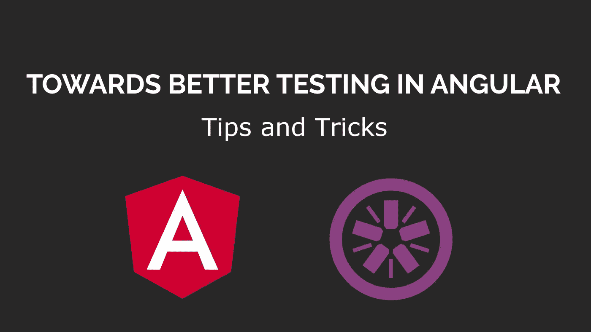
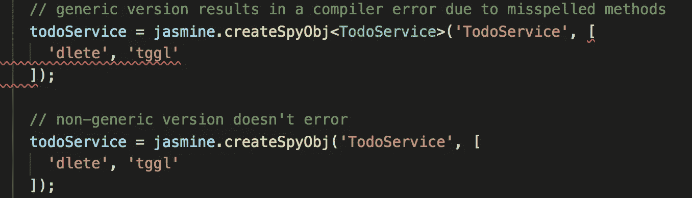
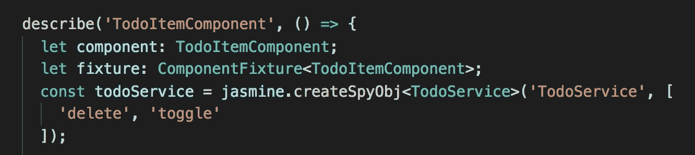
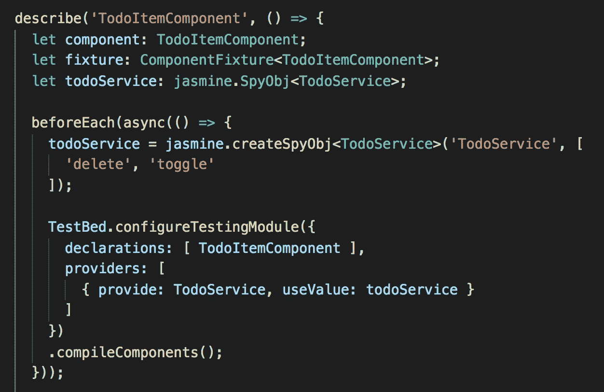
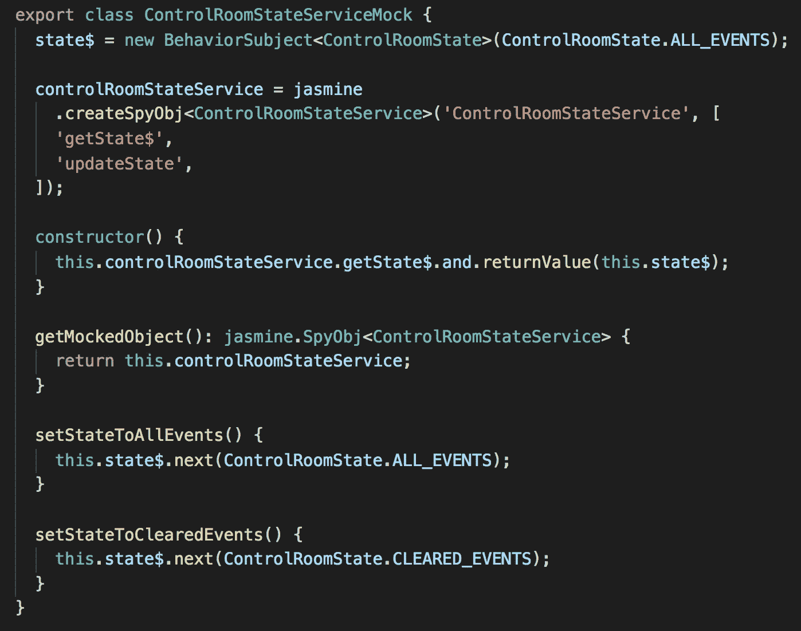
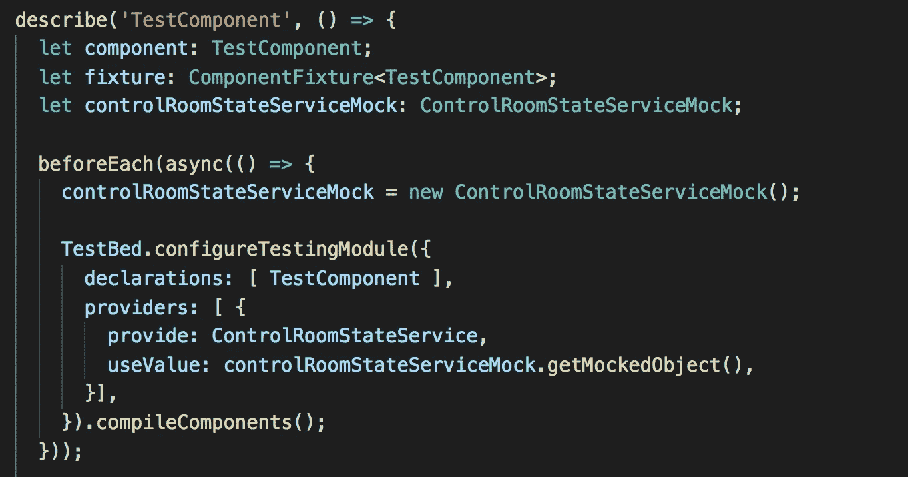
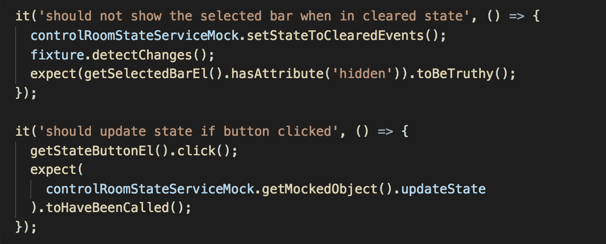
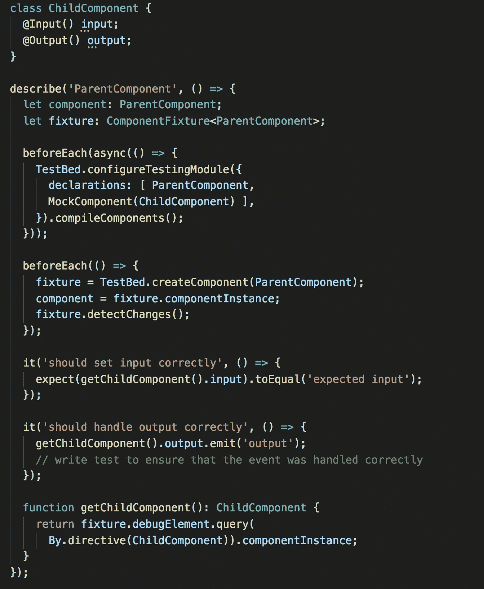

# 角度测试技巧和窍门

> 原文：<https://itnext.io/angular-testing-tips-and-tricks-6c1e21a7cf65?source=collection_archive---------1----------------------->

## 帮助您充分利用测试的提示和技巧



在本文中，我将探索一些我每天在用 Angular 编写单元测试时使用的简单技巧和窍门。实施这些提示将帮助您:

*   编写对变更和重构更健壮的测试
*   简化编写测试的过程
*   让测试更有用，确保测试不会在不应该通过的时候通过
*   让运行测试更高效

## **提示 1。使用 jasmine . createspyobj<T>**

使用通用版本的`jasmine.createSpyObj`。这确保了间谍的类型安全，允许编译器验证被模仿的方法确实存在。让我们假设我们意外地创建了如下间谍(将`delete`拼错为`dlete`):



对于泛型调用，编译器将抛出以下错误:`error TS2345: Argument of type ‘(“dlete” | “tggl”)[]’ is not assignable to parameter of type ...`

如果我们使用非通用版本(`jasmine.createSpyObj(‘TodoService’, [‘dlete’, ‘tggl’]);`)，编译器就不会抛出错误。享受花 15 分钟思考为什么你的测试总是失败(这是我的经验之谈😥).

## **提示 2。在 beforeEach 区块中创建你的间谍**

你可能想保存一行并在声明它时初始化 spy:



在 describe 块中初始化 todoService 意味着相同的实例将在所有测试中使用

不要这样。这将在测试之间保持相同的间谍，导致测试在不应该通过的时候通过，并随机失败(取决于执行顺序)。

作为一个例子，让我们假设你有一个测试检查`delete`是否被调用，然后下一个测试期望它没有被调用:

```
it('should call delete', () => { 
  // do some stuff
  expect(todoService.delete).toHaveBeenCalled();
});it('should not call delete', () => { 
  // do other stuff
  expect(todoService.delete).not.toHaveBeenCalled();
});
```

第二次测试将会失败，因为在第一次测试中已经调用了`delete`。在 beforeEach 块中创建 spy 将确保每个测试接收到一个新的实例:



在 describe 块中声明 todoService，但在 beforeEach 中初始化它，以确保每个测试都有一个新的实例

## 技巧三。对共享服务使用模拟服务

如果一个服务在多个地方被使用，将它提取到自己的模拟类中。您可以定义一次，只在需要的地方注入模拟版本，而不是在每个使用服务的地方都创建一个 spy。这是我们采取的方法:



在这里，我们为我们的服务之一创建了一个模拟。由于这个服务通过`getState$`提供了一个可观察对象，我们在这个类中实例化了这个可观察对象。我们还创建了一些助手方法来改变控制室的状态。这确保了如果`ControlRoomStateService`的实现发生变化，我们只需要在一个地方改变它。

下面是我们如何设置组件测试来使用这个模拟服务:



并使用模拟服务来简化我们的测试:



## **提示 4。将元素查询代码提取到函数中。**

通过将查询代码提取到它们自己的函数中，使得以后重构测试更加容易。举一个例子，如下:

```
it('should show error', () => {
  // setup error state
  expect(fixture.nativeElement.querySelector('.error')).toBeFalsy();
});it('should not show error', () => {
  // setup good state
 expect(fixture.nativeElement.querySelector('.error')).toBeTruthy();
});
```

例如，如果我们后来将类从`error`改为`invalid-title`，只有第二个测试会失败。开发人员可能会进行以下更改:

```
it('should show error', () => {
  // setup error state
  expect(fixture.nativeElement.querySelector('.error')).toBeFalsy();
});it('should not show error', () => {
  // setup good state
  expect(fixture.nativeElement.querySelector('**.invalid-title**')).toBeTruthy();
});
```

这两个测试现在都通过了，但是第一个测试现在没有用了——我们永远不会显示`error`类(然而，有可能`invalid-title`会一直显示，因为我们没有测试来检查它)。请考虑以下实现:

```
it('should show error', () => {
  // setup error state
  expect(getErrorEl()).toBeFalsy();
});it('should not show error', () => {
  // setup good state
 expect(getErrorEl()).toBeTruthy();
});function getErrorEl(): HTMLElement {
 return fixture.nativeElement.querySelector('.error');
}
```

这一次，修复第二个单元测试将确保第一个单元测试也被更新。

## 技巧五。使用 NgMocks 轻松地与子组件交互

[*要深入了解测试子组件，请参阅本文。*](https://medium.com/@abdul_74410/towards-better-testing-in-angular-part-1-mocking-child-components-b51e1fd571da)

[NgMocks](https://github.com/ike18t/ng-mocks) 让测试子组件变得超级简单。不使用`NO_ERRORS_SCHEMA`或`CUSTOM_ERRORS_SCHEMA`，我们可以简单地用`MockComponent`声明一个组件。这个:

*   确保组件输入和输出的类型安全
*   允许我们验证输入设置是否正确
*   帮助测试我们的被测组件是否正确响应子组件的输出事件。



## 提示 6。将测试集中在您正在测试的组件/服务上

随着应用程序的增长，每次进行更改时运行所有的单元测试将会非常慢。当测试一个组件或服务时，您可以通过将`describe`更改为`fdescribe`，在特定的`describe`块中运行测试。类似地，要运行单个单元测试，将`it(...)`改为`fit(...)`。只要确保在将代码提交给 master 之前将它们还原就行了！

## 技巧 7。禁用 sourceMaps 以加快单元测试

当您的应用程序仍然很小的时候，这不是问题，但是随着它的增长，源映射会大大降低测试运行的速度。当我在开发时，我总是在禁用源地图的情况下运行:

```
ng test --sourceMap=false
```

在我们的应用程序中，有大约 1200 个测试，在禁用源代码映射的情况下，关注单个组件来运行 15 个测试大约需要 4 秒钟。启用源地图后，需要 24 秒的时间😱。这是生产率的巨大差异。

当然，您可能希望启用源映射是有原因的(通过浏览器调试测试)。实际上，只要测试被适当地隔离，我很少通过浏览器进行调试。在极少数情况下，我只是启用源地图，直到解决问题，然后关闭它继续测试和开发。

*对这篇文章有什么问题或反馈，或者你希望我接下来写什么？请在下面给我留言或在 twitter 上联系我，*[*@ Abdul _ Rafe hi*](https://twitter.com/abdul_rafehi)